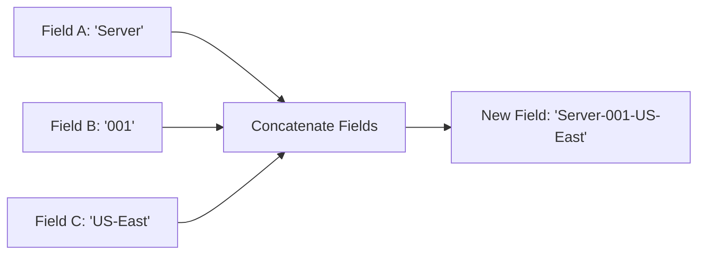

# Concatenate Fields

## Introduction

The **Concatenate Fields** transformation in Grafana allows you to combine values from multiple fields into a single field. This is particularly useful when you need to merge related data points or create custom labels from multiple data sources. By concatenating fields, you can simplify complex datasets and create more meaningful visualizations.

## What You'll Learn

- Understanding the Concatenate Fields transformation
- When and why to use field concatenation
- How to implement the transformation in Grafana
- Real-world application examples

## Understanding Concatenate Fields Transformation

The Concatenate Fields transformation takes values from multiple fields and combines them into a single new field. You can customize how these fields are joined together by specifying a delimiter (a character or string that separates the values).



## When to Use Concatenate Fields

Consider using this transformation when you need to:

- Create custom labels from multiple fields
- Combine related data points for better visualization
- Generate unique identifiers from multiple attributes
- Simplify complex multi-dimensional data
- Create more meaningful display values

## How to Implement the Concatenation

### Basic Configuration

To apply the Concatenate Fields transformation to your data:

1. Edit your panel visualization
2. Go to the **Transform** tab
3. Click **+ Add transformation**
4. Select **Concatenate fields**
5. Choose the fields you want to concatenate
6. Specify a delimiter (default is a space)
7. Choose a name for your new field

### Example Configuration

Here's how a basic configuration might look:

```javascript
// Example configuration
{
  "id": "concatenate",
  "options": {
    "fields": ["hostname", "service", "status"],
    "delimiter": "-",
    "targetFieldName": "Service Identifier"
  }
}
```

## Input and Output Examples

Let's look at how data changes when we apply the Concatenate Fields transformation:

### Input Data

| Time                | hostname  | service | status   | value |
|---------------------|-----------|---------|----------|-------|
| 2023-09-15 10:00:00 | server-01 | mysql   | running  | 97.5  |
| 2023-09-15 10:00:00 | server-02 | nginx   | running  | 99.2  |
| 2023-09-15 10:00:00 | server-03 | redis   | degraded | 85.7  |

### Transformation Applied

When we concatenate the `hostname`, `service`, and `status` fields with a hyphen (`-`) delimiter:

### Output Data

| Time                | hostname  | service | status   | value | Service Identifier          |
|---------------------|-----------|---------|----------|-------|----------------------------|
| 2023-09-15 10:00:00 | server-01 | mysql   | running  | 97.5  | server-01-mysql-running    |
| 2023-09-15 10:00:00 | server-02 | nginx   | running  | 99.2  | server-02-nginx-running    |
| 2023-09-15 10:00:00 | server-03 | redis   | degraded | 85.7  | server-03-redis-degraded   |

## Step-by-Step Implementation Guide

### 1. Access the Transformation Tab

First, open your Grafana dashboard and edit the panel where you want to apply the transformation:

1. Click on the panel title and select **Edit**
2. Navigate to the **Transform** tab in the panel editor

### 2. Add the Concatenate Fields Transformation

1. Click on the **+ Add transformation** button
2. From the dropdown menu, select **Concatenate fields**

### 3. Configure the Transformation

1. Select the fields you want to concatenate using the checkboxes
2. Specify a delimiter in the **Delimiter** field
   - Common delimiters include spaces, hyphens (`-`), underscores (`_`), or commas (`,`)
3. Enter a name for the new field in the **Target field name** input
4. Preview the results in the data table below

### 4. Fine-tune Your Visualization

After applying the transformation, you can:

- Use the new concatenated field in your visualizations
- Sort or filter based on the concatenated field
- Apply additional transformations as needed

## Practical Examples

### Example 1: Creating Custom Labels for Time Series

When monitoring multiple servers across different regions, you might want to create custom labels that include both the server name and its location:

```javascript
// Configuration
{
  "id": "concatenate",
  "options": {
    "fields": ["server_name", "region"],
    "delimiter": " - ",
    "targetFieldName": "Server Location"
  }
}
```

This transformation turns data like:

| Time                | server_name | region  | cpu_usage |
|---------------------|-------------|---------|-----------|
| 2023-09-15 10:00:00 | db-server   | us-east | 72.5      |
| 2023-09-15 10:00:00 | web-server  | eu-west | 68.3      |

Into:

| Time                | server_name | region  | cpu_usage | Server Location       |
|---------------------|-------------|---------|-----------|----------------------|
| 2023-09-15 10:00:00 | db-server   | us-east | 72.5      | db-server - us-east  |
| 2023-09-15 10:00:00 | web-server  | eu-west | 68.3      | web-server - eu-west |

This makes your time series legend more informative at a glance.

### Example 2: Creating Unique Identifiers for Alerts

When setting up alerts, you might want to create unique identifiers by combining multiple attributes:

```javascript
// Configuration
{
  "id": "concatenate",
  "options": {
    "fields": ["app", "instance", "severity"],
    "delimiter": "_",
    "targetFieldName": "alert_id"
  }
}
```

This transformation converts:

| Time                | app     | instance | severity | message                  |
|---------------------|---------|----------|----------|--------------------------|
| 2023-09-15 10:00:00 | payment | pod-123  | critical | Database connection lost |
| 2023-09-15 10:00:00 | auth    | pod-456  | warning  | High latency detected    |

Into:

| Time                | app     | instance | severity | message                  | alert_id                |
|---------------------|---------|----------|----------|--------------------------|-------------------------|
| 2023-09-15 10:00:00 | payment | pod-123  | critical | Database connection lost | payment_pod-123_critical |
| 2023-09-15 10:00:00 | auth    | pod-456  | warning  | High latency detected    | auth_pod-456_warning    |

### Example 3: Combining Address Components

When visualizing location data, you might want to combine address components:

```javascript
// Configuration
{
  "id": "concatenate",
  "options": {
    "fields": ["street", "city", "state", "zip"],
    "delimiter": ", ",
    "targetFieldName": "full_address"
  }
}
```

This transformation changes:

| location_id | street          | city        | state | zip    | sensor_reading |
|-------------|-----------------|-------------|-------|--------|---------------|
| 001         | 123 Main St     | Springfield | IL    | 62701  | 22.5          |
| 002         | 456 Market Ave  | Centerville | OH    | 45459  | 24.1          |

Into:

| location_id | street          | city        | state | zip    | sensor_reading | full_address                        |
|-------------|-----------------|-------------|-------|--------|---------------|-------------------------------------|
| 001         | 123 Main St     | Springfield | IL    | 62701  | 22.5          | 123 Main St, Springfield, IL, 62701 |
| 002         | 456 Market Ave  | Centerville | OH    | 45459  | 24.1          | 456 Market Ave, Centerville, OH, 45459 |

## Common Use Cases

1. **Dashboard Labels**: Create more descriptive labels for time series data
2. **Alert Management**: Generate unique identifiers for alerting systems
3. **Log Analysis**: Combine log fields to create more meaningful search patterns
4. **Resource Monitoring**: Create descriptive resource identifiers by combining metadata
5. **Geographic Data**: Combine location components for better map visualizations

## Tips and Best Practices

- **Choose Meaningful Delimiters**: Select delimiters that make the concatenated values easy to read
- **Order Matters**: Arrange your fields in a logical order that makes sense for your data
- **Field Selection**: Only concatenate fields that are logically related
- **Field Names**: Give your concatenated field a descriptive name that indicates its purpose
- **Consider Using with Other Transformations**: Concatenate Fields works well in combination with other transformations like "Add field from calculation" or "Group By"

## Limitations

- The Concatenate Fields transformation only works with string values or values that can be automatically converted to strings
- Fields with null values will appear as empty strings in the concatenated result
- The transformation operates on all rows, which may not be desirable for very large datasets

## Summary

The Concatenate Fields transformation is a powerful tool in Grafana that allows you to combine multiple fields into a single field using a specified delimiter. This transformation is particularly useful for creating custom labels, unique identifiers, and simplified representations of complex data.

By following the steps outlined in this guide, you can effectively implement the Concatenate Fields transformation to enhance your Grafana visualizations and make your dashboards more informative and user-friendly.

## Additional Resources

- [Grafana Transformations Documentation](https://grafana.com/docs/grafana/latest/panels/transformations/)
- [Data Visualization Best Practices](https://grafana.com/docs/grafana/latest/best-practices/)

## Exercises

1. **Basic Concatenation**: Create a visualization that concatenates server name and application name fields with a hyphen delimiter.
2. **Custom Labels**: Build a time series visualization that uses concatenated fields as custom labels in the legend.
3. **Combined Filters**: Create a dashboard variable that uses concatenated fields to provide more descriptive filter options.
4. **Multi-transformation Pipeline**: Combine the Concatenate Fields transformation with other transformations like "Add field from calculation" to create a visualization that shows both concatenated fields and calculated metrics.