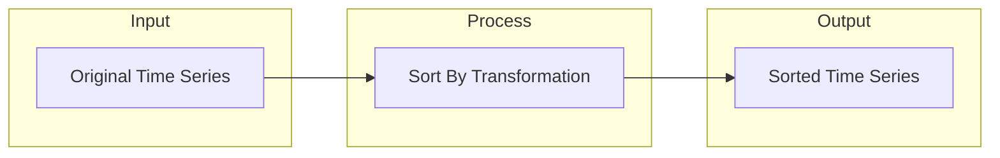

# Sort By Transformation

## Introduction

The Sort By transformation is a powerful feature in Grafana that allows you to reorder your data based on specific criteria. Whether you need to display your highest values first, organize time series chronologically, or sort alphabetically by a specific field, the Sort By transformation makes it simple to present your data in a meaningful order.

This transformation is particularly useful when you want to:
- Highlight the highest or lowest values in your dataset
- Create ordered lists or rankings
- Improve the readability of tables and visualizations
- Focus attention on the most important metrics

## Understanding the Sort By Transformation

The Sort By transformation works by reordering all rows in your dataset according to values in a specified column. You can sort in either ascending (A to Z, lowest to highest) or descending (Z to A, highest to lowest) order.

### Key Concepts

- **Sort Field**: The column that contains the values to sort by
- **Sort Order**: Either ascending or descending
- **Sort Type**: How to interpret the values (numeric, alphabetic, etc.)

## How to Apply the Sort By Transformation

Adding a Sort By transformation to your panel is straightforward:

1. Navigate to your dashboard and edit the panel you want to modify
2. Click on the "Transform" tab in the panel editor
3. Click the "Add transformation" button
4. Select "Sort by" from the dropdown menu
5. Choose the field to sort by and the desired sort order

## Basic Examples

Let's look at some examples to understand how the Sort By transformation works.

### Example 1: Sorting a Table of Server Metrics

Imagine you have a table displaying CPU usage across multiple servers:

```
| Server    | CPU Usage (%) |
|-----------|---------------|
| server-03 | 45            |
| server-01 | 72            |
| server-04 | 28            |
| server-02 | 91            |
```

By applying a Sort By transformation with:
- Sort field: "CPU Usage (%)"
- Sort order: Descending

The result would be:

```
| Server    | CPU Usage (%) |
|-----------|---------------|
| server-02 | 91            |
| server-01 | 72            |
| server-03 | 45            |
| server-04 | 28            |
```

### Example 2: Sorting Time Series Data

When working with time series data, sorting can help identify trends:



## Advanced Configuration Options

### Multiple Sort Criteria

In some cases, you may want to sort by multiple fields. For example, you might want to sort first by department and then by cost within each department.

To implement multiple sorting criteria in Grafana:

1. Add a Sort By transformation for your primary sort field
2. Add another Sort By transformation for your secondary sort field

Grafana will apply these transformations in sequence, resulting in data sorted by both criteria.

### Sorting Null Values

When your dataset contains null values, the Sort By transformation handles them in a specific way:
- In ascending order, null values appear first
- In descending order, null values appear last

## Practical Use Cases

### Use Case 1: Top N Dashboard

A common dashboard pattern is the "Top N" view, which shows only the most important metrics:

```javascript
// Example configuration for a Top N dashboard
// First, sort the data
{
  "id": "sortBy",
  "options": {
    "sort": [
      {
        "field": "Value",
        "order": "desc"
      }
    ]
  }
},
// Then, limit the results
{
  "id": "limit",
  "options": {
    "limitField": 5
  }
}
```

This combination of transformations first sorts your data by value in descending order, then limits the output to only the top 5 rows.

### Use Case 2: Service Health Overview

When monitoring the health of multiple services, sorting can help quickly identify which services need attention:

1. Collect health metrics for all services
2. Apply a Sort By transformation to sort by status (sorting error states first)
3. Optionally add color coding to highlight problematic services

## Common Pitfalls and Solutions

### Pitfall: Incorrect Sort Type

Issue: Numbers stored as strings may not sort as expected.

Solution: Ensure your data types are correct. You might need to add a "Convert field type" transformation before sorting.

### Pitfall: Performance Impact

Issue: Sorting large datasets can impact performance.

Solution: Consider filtering or aggregating your data before applying a Sort By transformation.

## Integration with Other Transformations

The Sort By transformation works well in combination with other Grafana transformations:

- Use with **Limit** to create Top N or Bottom N views
- Combine with **Filter by value** to sort only relevant data points
- Apply after **Group By** to sort aggregated results

## Summary

The Sort By transformation is an essential tool for organizing and prioritizing your data in Grafana dashboards. By understanding how to configure and use this transformation effectively, you can create more meaningful visualizations that highlight the most important aspects of your data.

Key takeaways:
- Sort By allows you to reorder data based on values in any column
- You can sort in ascending or descending order
- Combine with other transformations for more advanced data processing
- Proper sorting improves dashboard readability and focuses attention on important metrics

## Exercises

To reinforce your understanding of the Sort By transformation, try these exercises:

1. Create a dashboard panel showing server CPU usage, and sort it to display the servers with the highest usage at the top.

2. Build a visualization of response times across different API endpoints, sorted from slowest to fastest.

3. Combine Sort By with Group By to show average metrics by department, sorted by department name alphabetically.

## Additional Resources

- [Grafana Transformations Documentation](https://grafana.com/docs/grafana/latest/panels/transformations/)
- [Working with Data in Grafana](https://grafana.com/docs/grafana/latest/panels/working-with-panels/work-with-data/)
- [Dashboard Best Practices](https://grafana.com/docs/grafana/latest/best-practices/dashboard-management-best-practices/)