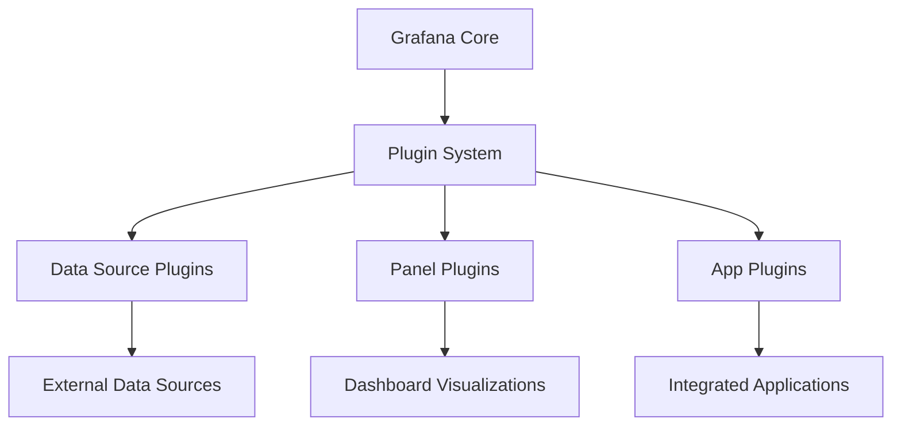

# Plugin Overview

## Introduction

Grafana is a powerful open-source analytics and visualization platform that allows you to query, visualize, and alert on metrics from various data sources. While Grafana comes with many built-in features, plugins extend its functionality by adding new capabilities. Think of plugins as modular components that enhance Grafana's core features without modifying the main codebase.

In this guide, we'll explore what Grafana plugins are, the different types available, how to install and manage them, and how they can help you create more powerful dashboards and visualizations.

## What are Grafana Plugins?

Grafana plugins are extensions that add new functionality to your Grafana instance. They're designed to work seamlessly with the core platform while providing specialized features for specific use cases. Plugins allow Grafana to be highly customizable and adaptable to various monitoring and visualization needs.

## Types of Grafana Plugins

Grafana supports three main types of plugins:

### 1. Data Source Plugins

Data source plugins connect Grafana to specific data sources, allowing you to query and visualize data from various backends.

**Examples include:**
- Prometheus
- InfluxDB
- MySQL
- PostgreSQL
- Elasticsearch
- AWS CloudWatch

### 2. Panel Plugins

Panel plugins provide new visualization types for your dashboards. They determine how your data is displayed.

**Examples include:**
- Bar charts
- Pie charts
- Heatmaps
- Gauges
- Tables
- Specialized visualizations like world maps or status panels

### 3. App Plugins

App plugins are the most comprehensive type. They typically bundle data sources and panels together with custom pages to create a cohesive application experience within Grafana.

**Examples include:**
- Zabbix App
- Kubernetes App
- AWS CloudWatch App

## Plugin Architecture



## Installing Plugins

Grafana offers multiple ways to install plugins:

### Using the Grafana CLI

The Grafana Command Line Interface (CLI) is the simplest way to install plugins.

```bash
grafana-cli plugins install <plugin-id>
```

For example, to install the Pie Chart panel:

```bash
grafana-cli plugins install grafana-piechart-panel
```

After installation, restart your Grafana server:

```bash
sudo systemctl restart grafana-server
```

### Via the Grafana UI

For Grafana versions 7.0 and newer:

1. Navigate to Configuration → Plugins
2. Click "Browse Grafana.com" button
3. Find the plugin you want and click "Install"
4. Restart Grafana when prompted

### Manual Installation

For plugins not available in the catalog or in air-gapped environments:

1. Download the plugin from GitHub or the developer's website
2. Extract the files to your Grafana plugins directory (typically `/var/lib/grafana/plugins`)
3. Restart Grafana

```bash
# Example for manual installation
mkdir -p /var/lib/grafana/plugins/custom-plugin
unzip custom-plugin.zip -d /var/lib/grafana/plugins/custom-plugin
sudo systemctl restart grafana-server
```

## Using Plugins

### Data Source Plugins

Once installed, data source plugins can be configured from the Grafana UI:

1. Go to Configuration → Data Sources
2. Click "Add data source"
3. Select your newly installed data source
4. Configure connection details

Example configuration for a Prometheus data source:

```json
{
  "name": "My Prometheus",
  "type": "prometheus",
  "url": "http://prometheus:9090",
  "access": "proxy",
  "basicAuth": false
}
```

### Panel Plugins

To use a panel plugin:

1. Create or edit a dashboard
2. Add a new panel
3. In the visualization options, select your installed panel type
4. Configure the panel settings accordingly

## Practical Examples

### Example 1: Monitoring System Resources with Prometheus and Bar Gauge

Let's create a dashboard to monitor CPU usage using Prometheus as the data source and Bar Gauge as the visualization.

1. Install the Prometheus data source (if not already installed)
2. Configure your Prometheus data source with your server details
3. Create a new dashboard
4. Add a new panel
5. Select Bar Gauge as the visualization
6. Use this Prometheus query to get CPU usage:

```
100 - (avg by (instance) (irate(node_cpu_seconds_total{mode="idle"}[5m])) * 100)
```

This will create a gauge showing the CPU usage percentage across your systems.

### Example 2: Building a Geospatial Dashboard with Worldmap Panel

For organizations with global infrastructure:

1. Install the Worldmap Panel plugin
2. Add a new panel to your dashboard
3. Select the Worldmap Panel visualization
4. Configure it with location data from your data source
5. Use this SQL query if you're using a SQL database:

```sql
SELECT
  location_name as name,
  latitude as latitude,
  longitude as longitude,
  status_value as value
FROM
  server_locations
```

The map will show your server locations with color-coding based on their status.

## Best Practices for Using Plugins

1. **Always check compatibility**: Ensure plugins are compatible with your Grafana version
2. **Review security implications**: Understand what data access the plugin requires
3. **Keep plugins updated**: Regularly update plugins for security patches and new features
4. **Understand performance impact**: Some plugins may affect dashboard loading times
5. **Test in a non-production environment first**: Verify plugin behavior before adding to critical dashboards

## Troubleshooting Common Plugin Issues

### Plugin Not Loading

If a plugin isn't loading properly:

1. Check Grafana server logs:
```bash
sudo journalctl -u grafana-server -f
```

2. Verify permissions on the plugin directory:
```bash
sudo chown -R grafana:grafana /var/lib/grafana/plugins
```

3. Ensure signature verification settings are configured properly in `grafana.ini`:
```ini
[plugins]
allow_loading_unsigned_plugins = org.mydomain.myplugin
```

### Plugin Compatibility Issues

If you encounter version compatibility issues:

1. Check the plugin's documentation for supported Grafana versions
2. Try downgrading the plugin to a version compatible with your Grafana instance
3. Update your Grafana installation if necessary

## Building Your Own Plugins

As you become more comfortable with Grafana, you might want to develop your own plugins. Grafana provides a robust set of developer tools and documentation for creating custom plugins.

Basic steps for plugin development include:

1. Set up your development environment
2. Use the Grafana plugin template as a starting point
3. Develop your plugin using React and the Grafana UI components
4. Test your plugin thoroughly
5. Publish your plugin to the Grafana catalog (optional)

For detailed instructions, refer to the official Grafana plugin development documentation.

## Summary

Grafana plugins are powerful extensions that enhance Grafana's core functionality. By understanding the different types of plugins, how to install and configure them, and how to use them effectively, you can create more powerful, tailored dashboards that provide deeper insights into your data.

Whether you're connecting to new data sources, creating specialized visualizations, or building integrated applications within Grafana, plugins are essential tools for getting the most out of your Grafana deployment.

## Additional Resources

- [Grafana Plugins Catalog](https://grafana.com/grafana/plugins/)
- [Grafana Documentation](https://grafana.com/docs/)
- [Grafana Community Forums](https://community.grafana.com/)
- [Grafana Plugin Development Guide](https://grafana.com/docs/grafana/latest/developers/plugins/)

## Exercises

1. Install and configure the Pie Chart panel plugin, then create a dashboard showing the distribution of request types to your application.
2. Compare the visualization capabilities of the default Graph panel with the specialized Time Series panel. What additional features does the Time Series panel provide?
3. Install a data source plugin for a database you use, and create a dashboard that visualizes key metrics from your database.
4. Explore the Grafana plugin catalog and identify three plugins that might be useful for your specific monitoring needs.
5. If you have multiple environments (development, staging, production), create a dashboard that uses the Worldmap panel to show the status of each environment.