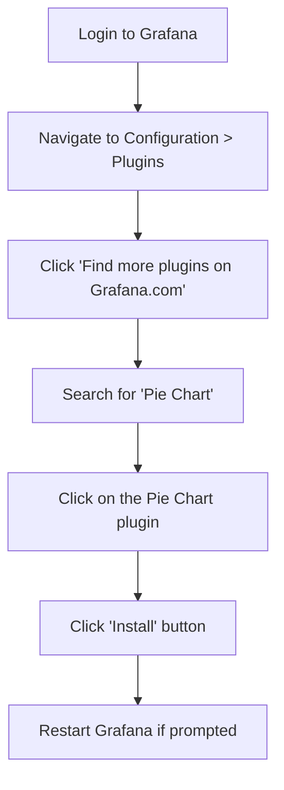

# Installing Plugins

## Introduction

Plugins are extensions that provide additional functionality to your Grafana installation. They allow you to connect to different data sources, create new visualization types, enhance the UI, and add new functionality without modifying the core Grafana code.

In this guide, you'll learn how to:
- Understand the different types of Grafana plugins
- Install plugins using various methods
- Manage installed plugins
- Troubleshoot common installation issues

## Types of Grafana Plugins

Before diving into installation, let's understand the three main types of plugins available:

1. **Data Source Plugins**: Connect Grafana to different data sources like Prometheus, Elasticsearch, or custom APIs.
2. **Panel Plugins**: Add new visualization types to display your data.
3. **App Plugins**: Bundle data sources and panels to create integrated experiences.

## Prerequisites

Before installing plugins, ensure you have:

- A working Grafana installation (version 7.0 or later recommended)
- Admin-level access to your Grafana instance
- Access to the server where Grafana is installed (for manual installations)

## Installation Methods

There are several ways to install Grafana plugins. We'll cover each method with practical examples.

### Method 1: Using the Grafana UI

This is the simplest method for beginners and works well for managed installations.

#### Steps:

1. Log in to your Grafana instance with admin privileges.
2. Navigate to Configuration (gear icon) > Plugins.
3. Click on the "Find more plugins on Grafana.com" button.
4. Browse or search for the plugin you want to install.
5. Click on the plugin to view its details.
6. Click the "Install" button.

For example, to install the "Pie Chart" panel plugin:



### Method 2: Using the Grafana CLI

The Grafana Command Line Interface (CLI) offers a powerful way to manage plugins from the terminal.

#### Steps:

1. SSH into your Grafana server.
2. Use the `grafana-cli` command to install plugins.

**Syntax:**

```bash
grafana-cli plugins install <plugin-id>
```

**Example:**
To install the popular JSON API data source plugin:

```bash
grafana-cli plugins install marcusolsson-json-datasource
```

After installation, restart your Grafana server:

```bash
# For systemd-based systems
sudo systemctl restart grafana-server

# For init.d-based systems
sudo service grafana-server restart
```

### Method 3: Manual Installation

For plugins not available in the official catalog or for offline installations, you can install plugins manually.

#### Steps:

1. Download the plugin from GitHub or the plugin's website.
2. Extract the plugin files.
3. Move the extracted folder to Grafana's plugin directory.
4. Restart Grafana.

**Example:**
Let's install a plugin manually:

```bash
# Create a temporary directory for download
mkdir -p /tmp/grafana-plugins
cd /tmp/grafana-plugins

# Download the plugin (example using curl)
curl -L https://github.com/grafana/clock-panel/archive/refs/tags/v2.1.0.zip -o clock-panel.zip

# Extract the plugin
unzip clock-panel.zip

# Move to the Grafana plugins directory (path may vary based on installation)
mv clock-panel-2.1.0 /var/lib/grafana/plugins/clock-panel

# Set correct permissions
chown -R grafana:grafana /var/lib/grafana/plugins/clock-panel

# Restart Grafana
systemctl restart grafana-server
```

### Method 4: Using Docker

If you're running Grafana in Docker, you can install plugins during container creation.

#### Option 1: Using environment variables

```bash
docker run -d \
  -p 3000:3000 \
  --name=grafana \
  -e "GF_INSTALL_PLUGINS=grafana-clock-panel,grafana-simple-json-datasource" \
  grafana/grafana
```

#### Option 2: Building a custom Docker image

Create a `Dockerfile`:

```dockerfile
FROM grafana/grafana:latest

# Install plugins
RUN grafana-cli plugins install grafana-clock-panel && \
    grafana-cli plugins install grafana-simple-json-datasource
```

Build and run your custom image:

```bash
docker build -t custom-grafana .
docker run -d -p 3000:3000 --name=grafana custom-grafana
```

## Managing Installed Plugins

### Listing Installed Plugins

#### Via UI:
Navigate to Configuration > Plugins to see all installed plugins.

#### Via CLI:
```bash
grafana-cli plugins ls
```

### Updating Plugins

#### Via UI:
1. Go to Configuration > Plugins
2. Look for plugins with an "Update" button and click it

#### Via CLI:
```bash
grafana-cli plugins update-all
```

Or update a specific plugin:

```bash
grafana-cli plugins update <plugin-id>
```

### Removing Plugins

#### Via UI:
1. Go to Configuration > Plugins
2. Find the plugin you want to remove
3. Click on it to view details
4. Click the "Uninstall" button

#### Via CLI:
```bash
grafana-cli plugins uninstall <plugin-id>
```

## Plugin Configuration

After installation, many plugins require configuration:

1. For **data source plugins**, navigate to Configuration > Data Sources > Add data source, and select your newly installed data source.
2. For **panel plugins**, they'll appear in the visualization options when creating or editing dashboards.
3. For **app plugins**, go to Configuration > Plugins, find your app plugin, and click the "Enable" button.

## Practical Example: Installing and Using the Pie Chart Plugin

Let's walk through a complete example of installing and using the Pie Chart plugin:

### Step 1: Install the plugin

```bash
grafana-cli plugins install grafana-piechart-panel
```

### Step 2: Restart Grafana

```bash
sudo systemctl restart grafana-server
```

### Step 3: Create a new dashboard
1. Log in to Grafana
2. Click "+ Create" > Dashboard
3. Click "Add new panel"

### Step 4: Configure the panel
1. In the visualization dropdown, select "Pie Chart"
2. Configure your data source and query
3. Example query for Prometheus:

```
sum(node_cpu_seconds_total{mode!="idle"}) by (mode)
```

4. Adjust the pie chart settings in the right panel:
   - Set display options (legend, labels, tooltips)
   - Configure pie chart type (donut or standard)
   - Adjust colors and other visual properties

### Step 5: Save your dashboard
Click the Save icon in the top-right corner and give your dashboard a name.

## Troubleshooting Plugin Installation

### Common Issues and Solutions

#### Plugin Not Appearing After Installation

**Possible causes:**
- Grafana wasn't restarted
- Permission issues
- Plugin compatibility issues

**Solutions:**
1. Restart Grafana:
```bash
sudo systemctl restart grafana-server
```

2. Check permissions:
```bash
# Ensure plugin directory is owned by the grafana user
sudo chown -R grafana:grafana /var/lib/grafana/plugins/
```

3. Check Grafana logs:
```bash
sudo journalctl -u grafana-server -f
```

#### Plugin Installation Failing

**Possible causes:**
- Network connectivity issues
- Plugin repository issues
- Incompatible Grafana version

**Solutions:**
1. Verify network connectivity:
```bash
ping grafana.com
```

2. Specify version when installing:
```bash
grafana-cli plugins install <plugin-id> <version>
```

3. Try manual installation as described earlier.

#### "Plugin Already Installed" Error

**Solution:**
Force reinstall the plugin:

```bash
grafana-cli plugins reinstall <plugin-id>
```

## Best Practices for Plugin Management

1. **Keep plugins updated** to benefit from bug fixes and security patches
2. **Remove unused plugins** to maintain performance and reduce security risks
3. **Check plugin compatibility** before upgrading Grafana
4. **Back up your Grafana configuration** before installing major plugin updates
5. **Use official or well-maintained plugins** from trusted developers

## Summary

In this guide, you've learned:
- Different types of Grafana plugins and their uses
- Multiple methods to install plugins
- How to manage, update, and remove plugins
- Troubleshooting common installation issues
- Best practices for plugin management

With this knowledge, you can extend your Grafana installation with custom visualizations, data sources, and applications to meet your specific monitoring and visualization needs.

## Additional Resources

- [Official Grafana Plugin Documentation](https://grafana.com/docs/grafana/latest/plugins/)
- [Grafana Plugin Catalog](https://grafana.com/grafana/plugins/)
- [Grafana Community Forums](https://community.grafana.com/)

## Exercises

1. Install the WorldMap Panel plugin and create a dashboard showing geographical data.
2. Compare performance between two visualization plugins for the same dataset.
3. Set up a custom JSON API data source and connect it to your own API.
4. Create a Docker Compose file that runs Grafana with three pre-installed plugins of your choice.
5. Install a plugin using each of the four methods discussed in this guide and note the differences in the process.