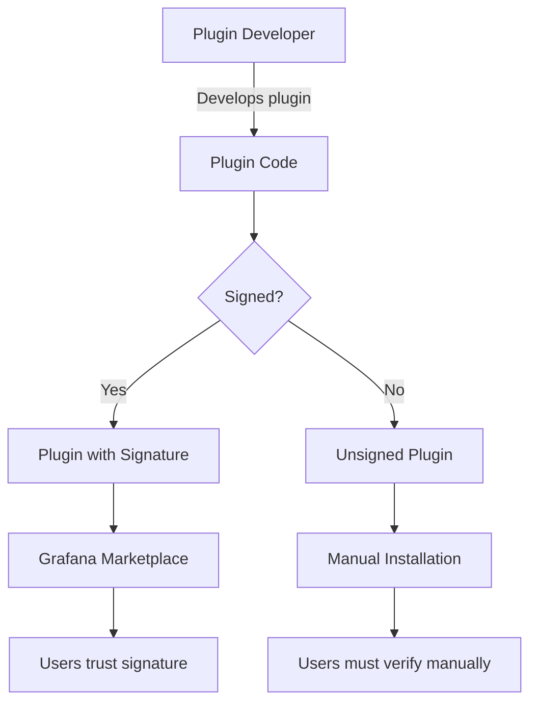

# Plugin Security

## Introduction

Plugin security is a critical aspect of the Grafana ecosystem. As Grafana becomes more widely adopted for monitoring and visualization needs, the plugins that extend its functionality must be designed with security in mind. This guide explores the security considerations for both plugin developers and users, helping you understand how to create and use plugins safely in your Grafana environment.

Security in the plugin context refers to protecting your Grafana instance, its data, and your infrastructure from potential vulnerabilities that might be introduced through third-party or custom plugins.

## Why Plugin Security Matters

Plugins extend Grafana's functionality, but they also introduce potential security risks:

1. Plugins run with certain permissions within your Grafana instance
2. They may access sensitive data sources and information
3. Malicious or vulnerable plugins could compromise your entire monitoring infrastructure
4. They can introduce client-side vulnerabilities affecting users of your dashboards

## Grafana Plugin Signature Verification

Grafana uses a signature verification system to validate plugins and ensure they come from trusted sources.

### Understanding Plugin Signatures



Grafana categorizes plugins based on their signature status:

1. **Core Plugins**: Included with Grafana, maintained by Grafana Labs, always signed
2. **Commercial Plugins**: Premium offerings from Grafana Labs, always signed
3. **Community Plugins**: 
   - **Signed**: Verified by Grafana Labs for security and quality
   - **Unsigned**: Not verified, may pose security risks

### Checking Plugin Signatures

You can verify if your installed plugins are properly signed using the Grafana CLI:

```bash
grafana-cli plugins list-installed
```

The output will show signature status:

```
installed plugins:
grafana-clock-panel @ 1.3.1 (signed)
grafana-simple-json-datasource @ 1.4.2 (unsigned)
```

## Configuring Plugin Security Settings

Grafana allows administrators to control plugin security through configuration settings.

### Plugin Loading Rules

In your Grafana configuration file (`grafana.ini`), you can set rules for loading plugins:

```ini
[plugins]
# Allow loading unsigned plugins
allow_loading_unsigned_plugins = my-custom-plugin,another-plugin

# Enforce plugin signing
# Options: strict, warning, unsigned
app_tls_skip_verify_insecure = strict
```

The different security modes are:

- **strict**: Only load signed plugins (recommended for production)
- **warning**: Load unsigned plugins but display warnings
- **unsigned**: Load all plugins without verification (not recommended)

## Developing Secure Plugins

If you're developing plugins for Grafana, follow these security best practices:

### 1. Input Validation

Always validate user input to prevent injection attacks:

```typescript
// Bad practice - vulnerable to injection
function processUserInput(userInput: string) {
  const query = `SELECT * FROM metrics WHERE name = ${userInput}`;
  return executeQuery(query);
}

// Good practice - using parameterized queries
function processUserInput(userInput: string) {
  const query = `SELECT * FROM metrics WHERE name = ?`;
  return executeQuery(query, [userInput]);
}
```

### 2. Secure Authentication

When your plugin connects to external services:

```typescript
// Store secrets securely using Grafana's secure JSON data
export class MyDataSource extends DataSourceApi {
  constructor(instanceSettings) {
    super(instanceSettings);
    
    // Access securely stored API key
    this.apiKey = instanceSettings.secureJsonData?.apiKey || '';
  }
  
  // When testing, mask sensitive data in responses
  async testDatasource() {
    // Implementation...
    return {
      status: 'success',
      message: 'Data source is working',
      // Don't include sensitive data in response
    };
  }
}
```

### 3. Minimize Dependencies

Each dependency introduces potential vulnerabilities. Regularly audit your dependencies:

```bash
# Check for vulnerabilities in dependencies
npm audit

# Update dependencies to secure versions
npm update
```

### 4. Use Content Security Policy (CSP)

Grafana implements CSP to protect against XSS attacks. Your plugin should comply with these policies:

```typescript
// Avoid inline scripts and styles
// Bad:
element.innerHTML = `<div onclick="alert('clicked')">Click me</div>`;

// Good:
const div = document.createElement('div');
div.textContent = 'Click me';
div.addEventListener('click', () => alert('clicked'));
element.appendChild(div);
```

### 5. Sign Your Plugin

To distribute your plugin through the Grafana Marketplace, you'll need to sign it:

```bash
# Generate a private key (if you don't have one)
openssl genrsa -out private.key 4096

# Create a plugin signature
npx @grafana/toolkit plugin:sign --rootUrls https://your-grafana-instance.com/
```

## Best Practices for Plugin Users

If you're installing and using plugins in your Grafana environment:

### 1. Verify Sources

Only install plugins from trusted sources:
- Grafana Marketplace
- Official GitHub repositories
- Verified vendors

### 2. Review Permissions

Understand what permissions plugins require and why:

```ini
# In grafana.ini, restrict plugin permissions
[plugins]
# Allow a specific plugin to access specific API endpoints
allow_api_url = my-plugin:https://api.example.com
```

### 3. Keep Plugins Updated

Regularly update plugins to get security patches:

```bash
# Update a specific plugin
grafana-cli plugins update plugin-id

# Update all plugins
grafana-cli plugins update-all
```

### 4. Implement Network Isolation

Use network policies to restrict where plugins can connect:

```yaml
# Kubernetes network policy example
apiVersion: networking.k8s.io/v1
kind: NetworkPolicy
metadata:
  name: grafana-plugin-policy
spec:
  podSelector:
    matchLabels:
      app: grafana
  policyTypes:
  - Egress
  egress:
  - to:
    - ipBlock:
        cidr: 10.0.0.0/24  # Allow only specific network range
    ports:
    - protocol: TCP
      port: 443
```

## Real-World Example: Securing a Custom Data Source Plugin

Let's walk through securing a custom data source plugin that connects to an internal API:

### 1. Define Secure Configuration

```typescript
// plugin.json
{
  "id": "acme-secure-datasource",
  "name": "Secure Data Source",
  "type": "datasource",
  "info": {
    "description": "Secure connection to internal APIs",
    "version": "1.0.0",
    "author": {
      "name": "ACME Corp"
    }
  },
  "routes": [
    {
      "path": "api",
      "url": "{{ .JsonData.apiUrl }}",
      "headers": [
        {
          "name": "Authorization",
          "content": "Bearer {{ .SecureJsonData.apiKey }}"
        }
      ]
    }
  ]
}
```

### 2. Implement Secure Data Handling

```typescript
import { DataSourceApi } from '@grafana/data';

export class SecureDataSource extends DataSourceApi {
  url?: string;
  
  constructor(instanceSettings) {
    super(instanceSettings);
    this.url = instanceSettings.jsonData.apiUrl;
  }
  
  async query(options) {
    // Implement query with proper error handling
    try {
      const response = await this.backendSrv.datasourceRequest({
        url: this.url + '/query',
        method: 'POST',
        data: this.buildQueryParameters(options),
      });
      
      return this.parseResponse(response);
    } catch (error) {
      // Log error without exposing sensitive details
      console.error('Query failed');
      throw new Error('Failed to query data source');
    }
  }
  
  // Securely store credentials using Grafana's secure JSON data
  async testDatasource() {
    try {
      const response = await this.backendSrv.datasourceRequest({
        url: this.url + '/health',
        method: 'GET',
      });
      
      if (response.status === 200) {
        return {
          status: 'success',
          message: 'Data source is working',
        };
      } else {
        return {
          status: 'error',
          message: `Data source returned status ${response.status}`,
        };
      }
    } catch (error) {
      return {
        status: 'error',
        message: 'Could not connect to the data source',
      };
    }
  }
}
```

### 3. Configure the Plugin in Grafana

```ini
# grafana.ini
[plugins]
# If necessary, allow loading this specific plugin
allow_loading_unsigned_plugins = acme-secure-datasource

# Set strict mode for other plugins
app_tls_skip_verify_insecure = strict

# Restrict outgoing connections
allow_api_url = acme-secure-datasource:https://internal-api.example.com
```

## Common Security Vulnerabilities in Plugins

Be aware of these common security issues when working with plugins:

1. **Cross-Site Scripting (XSS)**: Occurs when untrusted data is included in a web page
2. **Insecure Dependencies**: Using outdated libraries with known vulnerabilities
3. **Sensitive Data Exposure**: Accidentally logging or exposing API keys or credentials
4. **Insufficient Authorization**: Not properly checking permissions before accessing resources
5. **Insecure Communication**: Using unencrypted connections to backend services

## Summary

Plugin security is a shared responsibility between plugin developers and Grafana administrators. By understanding the security model, implementing best practices, and regularly updating and auditing your plugins, you can safely extend Grafana's functionality without compromising your monitoring infrastructure.

Key takeaways:
- Use signed plugins whenever possible
- Configure appropriate security settings in your Grafana instance
- Follow security best practices when developing plugins
- Regularly update and audit your plugins
- Understand the permissions and access requirements of each plugin

## Additional Resources

- [Grafana Plugin Development Documentation](https://grafana.com/docs/grafana/latest/developers/plugins/)
- [OWASP Top Ten Web Application Security Risks](https://owasp.org/www-project-top-ten/)
- [Node.js Security Best Practices](https://nodejs.org/en/docs/guides/security/)

## Exercises

1. Audit a Grafana instance to identify unsigned plugins and evaluate their security risks
2. Configure different plugin security modes in a test environment and observe the effects
3. Review a plugin's source code for common security vulnerabilities
4. Implement secure authentication for a custom data source plugin
5. Create a security policy document for plugin usage in your organization