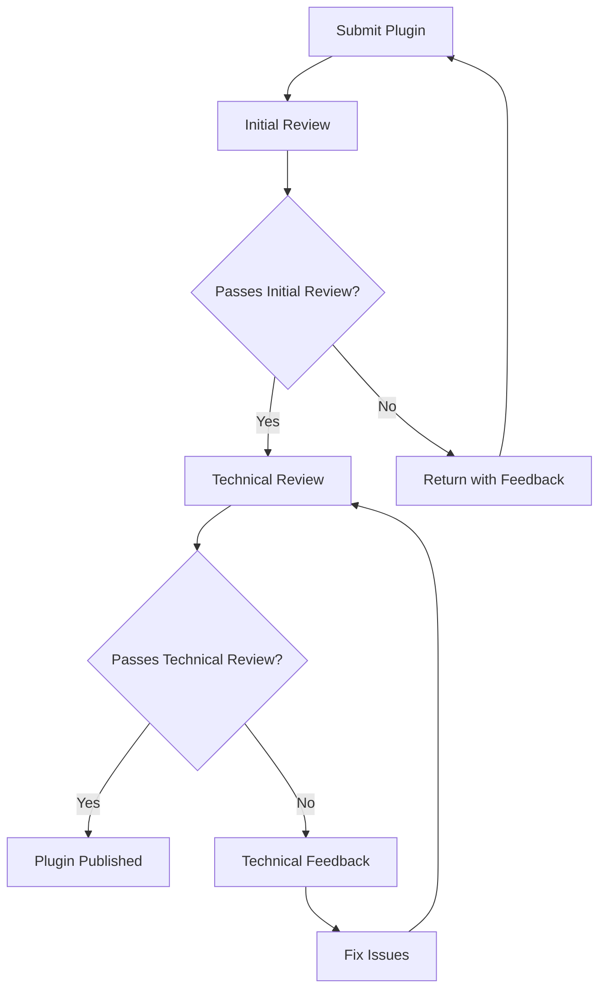

# Plugin Publishing

## Introduction

After developing your Grafana plugin, the next step is to share it with the community by publishing it to the Grafana Plugin Catalog. This process involves preparing your plugin, signing it, and submitting it for review. In this guide, we'll walk through the complete plugin publishing workflow to help you successfully distribute your plugin to Grafana users worldwide.

## Prerequisites

Before you begin the publishing process, ensure you have:

- A completed and tested Grafana plugin
- A GitHub repository hosting your plugin code
- Node.js and npm installed on your development machine
- A Grafana Cloud account (for plugin signing)

## Preparing Your Plugin for Publication

### Step 1: Configure Your Plugin Metadata

Every Grafana plugin requires proper metadata in the `plugin.json` file. This information will be displayed in the Grafana Plugin Catalog and helps users understand what your plugin does.

```json
{
  "id": "your-username-plugin-name",
  "name": "Your Plugin Name",
  "type": "panel",
  "info": {
    "description": "A clear description of what your plugin does",
    "author": {
      "name": "Your Name",
      "url": "https://your-website.com"
    },
    "keywords": ["grafana", "panel", "plugin-type"],
    "logos": {
      "small": "img/logo.svg",
      "large": "img/logo.svg"
    },
    "links": [
      {"name": "GitHub", "url": "https://github.com/yourusername/your-plugin-repo"},
      {"name": "Documentation", "url": "https://github.com/yourusername/your-plugin-repo/blob/main/README.md"}
    ],
    "screenshots": [
      {"name": "Main View", "path": "img/screenshot.png"}
    ],
    "version": "1.0.0",
    "updated": "2025-03-27"
  },
  "dependencies": {
    "grafanaDependency": ">=9.0.0",
    "plugins": []
  }
}
```

### Step 2: Version Your Plugin

Grafana follows semantic versioning (semver) for plugins. When updating your plugin, increment the version number in both `plugin.json` and `package.json`:

- **Major version (1.0.0)**: Breaking changes
- **Minor version (0.1.0)**: New features, no breaking changes
- **Patch version (0.0.1)**: Bug fixes and minor updates

### Step 3: Create a CHANGELOG.md

Maintaining a changelog helps users understand what's changed between versions:

```markdown
# Changelog

## 1.0.0 (2025-03-27)

### Features
- Initial release
- Added support for feature X
- Added visualization Y

### Bug Fixes
- Fixed calculation error in Z
```

### Step 4: Document Your Plugin

Create a comprehensive README.md file with:

- Clear description of your plugin
- Installation instructions
- Configuration options
- Usage examples
- Screenshots
- Troubleshooting guidance

## Building and Testing Your Plugin

Before publishing, ensure your plugin builds correctly and passes all tests:

```bash
# Install dependencies
npm install

# Build the plugin
npm run build

# Run tests
npm run test
```

You should also test your plugin locally in Grafana to ensure it works as expected:

```bash
# Create a local plugin package
npm run build

# Copy the dist folder to your Grafana plugins directory
cp -r dist /var/lib/grafana/plugins/your-plugin-id
```

## Signing Your Plugin

Starting with Grafana 8.0, all plugins in the official catalog must be signed. Signing verifies the plugin's authenticity and ensures it hasn't been tampered with.

### Step 1: Create a Grafana Cloud API Key

1. Log in to [Grafana Cloud](https://grafana.com)
2. Navigate to **My Account** → **API Keys**
3. Create a new API key with the `Plugin Publisher` role
4. Copy and save the API key securely

### Step 2: Sign Your Plugin

Use the Grafana Plugin Tools to sign your plugin:

```bash
npm install -g @grafana/plugin-tools

grafana-plugin-tools sign --rootUrls https://your-plugin-url.com
```

This will:
1. Create a private key if one doesn't exist
2. Sign your plugin with the private key
3. Generate a signature file (`MANIFEST.txt`) in your dist directory

## Publishing to the Grafana Plugin Catalog

### Step 1: Create a GitHub Release

1. Push your changes to GitHub
2. Create a new tag matching your version number:

```bash
git tag v1.0.0
git push origin v1.0.0
```

3. Create a new release on GitHub using this tag
4. Include your changelog information in the release notes
5. Attach your build assets (optional but recommended)

### Step 2: Submit Your Plugin

1. Go to the [Grafana Plugin Submission](https://grafana.com/plugins/submit/) page
2. Fill out the submission form with your plugin details
3. Provide the GitHub repository URL
4. Submit your plugin for review

The Grafana team will review your plugin for:
- Code quality and security
- Documentation completeness
- Adherence to Grafana's plugin guidelines
- Proper signing

## Plugin Review Process



The review process typically takes 1-2 weeks. The Grafana team may provide feedback or request changes before approval.

## Updating Your Published Plugin

When you want to update your plugin:

1. Make your changes
2. Update the version number in both `plugin.json` and `package.json`
3. Update your CHANGELOG.md
4. Build, test, and sign the new version
5. Create a new GitHub release
6. The Grafana Plugin Catalog will automatically detect the new version

## Private Plugin Distribution

If you don't want to publish your plugin publicly, you can distribute it privately:

1. Sign your plugin as described above
2. Share the built and signed plugin with your users
3. Users can install it manually by extracting it to their Grafana plugins directory
4. Configure Grafana to allow loading unsigned plugins if needed (not recommended for production)

## Common Publishing Issues and Troubleshooting

### Plugin Not Appearing in Catalog

- Ensure your plugin has been approved by the Grafana team
- Check that your GitHub release is properly tagged
- Verify that your plugin.json contains all required fields

### Signing Errors

If you encounter issues with plugin signing:

```bash
# Verify your API key has the correct permissions
grafana-plugin-tools verify-api-key

# Check for errors in your plugin structure
grafana-plugin-tools validate
```

### Version Conflicts

If your new version isn't updating:

- Ensure you've incremented the version in both plugin.json and package.json
- Clear your browser cache and Grafana plugin cache
- Restart your Grafana server

## Best Practices for Plugin Publishing

- **Test thoroughly** before publishing
- **Provide clear documentation** for users
- **Be responsive** to user feedback and issues
- **Maintain compatibility** with Grafana versions
- **Keep dependencies updated** for security
- **Write meaningful release notes** to help users understand changes

## Summary

Publishing your Grafana plugin allows you to share your work with the community and extend Grafana's functionality. This process involves preparing your plugin metadata, building and testing your code, signing the plugin, and submitting it to the Grafana Plugin Catalog for review.

By following these guidelines, you'll increase the chances of your plugin being approved quickly and provide a better experience for your users.

## Additional Resources

- [Official Grafana Plugin Development Documentation](https://grafana.com/docs/grafana/latest/developers/plugins/)
- [Grafana Plugin Tools GitHub Repository](https://github.com/grafana/plugin-tools)
- [Grafana Plugin Examples](https://github.com/grafana/grafana-plugin-examples)

## Exercises

1. Configure the metadata for a sample plugin you've created.
2. Create a comprehensive CHANGELOG.md for your plugin.
3. Build and sign a test plugin using the Grafana Plugin Tools.
4. Practice creating a GitHub release for your plugin.
5. Review an existing plugin in the catalog and identify what makes its documentation effective.