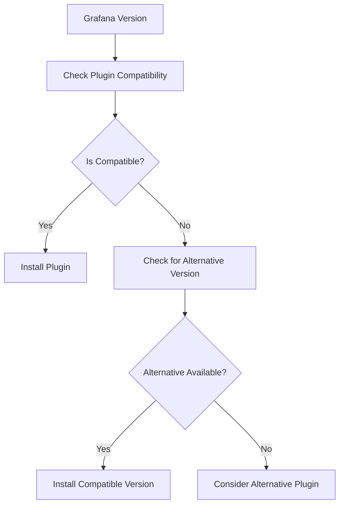

# Plugin Troubleshooting

## Introduction

Grafana's plugin ecosystem provides powerful extensions to its core functionality, allowing you to connect to various data sources, create custom visualizations, and extend the platform in numerous ways. However, as with any plugin system, you may occasionally encounter issues when installing, configuring, or using plugins. This guide will walk you through common troubleshooting approaches for Grafana plugins, helping you identify, diagnose, and resolve these issues efficiently.

## Common Plugin Issues

### 1. Plugin Installation Failures

One of the most common issues is when plugins fail to install properly. Let's explore the potential causes and solutions.

#### Symptoms
- Plugin doesn't appear in the Grafana UI after installation
- Installation commands return errors
- Error messages in Grafana logs related to plugin loading

#### Troubleshooting Steps

**Check Grafana Server Logs**

The first step in diagnosing any plugin issue is to check the Grafana server logs:

```bash
# For Linux systems with systemd
sudo journalctl -u grafana-server

# For Docker installations
docker logs grafana-container-name

# Check the grafana log file directly
cat /var/log/grafana/grafana.log
```

Look for error messages that contain the plugin name or occur around the time you installed the plugin.

**Verify Plugin Compatibility**

Ensure the plugin is compatible with your Grafana version:

```bash
# Check your Grafana version
grafana-cli --version

# Or in Grafana UI, navigate to:
# Help (?) > About Grafana
```

Compare your version with the plugin's compatibility information in the [Grafana Plugins Catalog](https://grafana.com/grafana/plugins/).

**Check Plugin Signature Verification**

Grafana requires plugins to be signed. If you're using unsigned plugins, you need to configure Grafana to allow them:

```ini
# In grafana.ini
[plugins]
allow_loading_unsigned_plugins = plugin1,plugin2

# Or using environment variables
GF_PLUGINS_ALLOW_LOADING_UNSIGNED_PLUGINS=plugin1,plugin2
```

**Manually Install the Plugin**

If the Grafana CLI installation fails, try installing manually:

```bash
# Download the plugin
wget https://github.com/grafana/plugin-name/releases/download/v1.0.0/plugin-name-1.0.0.zip

# Extract to plugins directory
unzip plugin-name-1.0.0.zip -d /var/lib/grafana/plugins

# Restart Grafana
systemctl restart grafana-server
```

### 2. Plugin Loading Issues

Sometimes plugins install correctly but fail to load properly.

#### Symptoms
- Plugin appears in the UI but with warning icons
- Features of the plugin don't work as expected
- Error messages when attempting to use the plugin

#### Troubleshooting Steps

**Check Plugin Dependencies**

Some plugins require additional components:

```bash
# For Node.js dependencies
cd /var/lib/grafana/plugins/your-plugin
npm install

# For Go plugins, ensure required libraries are installed
apt-get install required-library  # Debian/Ubuntu
yum install required-library      # CentOS/RHEL
```

**Review Plugin Permissions**

Ensure the plugin files have the correct permissions:

```bash
# Set owner to grafana user
chown -R grafana:grafana /var/lib/grafana/plugins/your-plugin

# Set correct permissions
chmod -R 755 /var/lib/grafana/plugins/your-plugin
```

**Clear Browser Cache**

Sometimes browser caching can cause issues with plugin loading:
1. Open your browser's developer tools (F12)
2. Navigate to the Application/Storage tab
3. Clear site data and cache
4. Reload Grafana

### 3. Data Source Plugin Issues

Data source plugins can have specific connectivity problems.

#### Symptoms
- "Test Connection" fails
- Queries return no data or errors
- Error messages in query editor

#### Troubleshooting Steps

**Check Network Connectivity**

Ensure Grafana can reach the data source:

```bash
# From Grafana server, test connectivity
ping data-source-host
telnet data-source-host port
curl -v http://data-source-host:port/path

# Check if a proxy is required
traceroute data-source-host
```

**Verify Credentials**

Double-check your authentication details:
1. Username and password
2. API keys
3. Certificate paths and validity
4. Token expiration

**Review Query Syntax**

Ensure your queries follow the correct syntax for the specific data source. Common mistakes include:
- Missing quotes around string values
- Incorrect time range formatting
- Using incompatible functions

**Enable Debug Logging**

Increase logging verbosity to get more detailed error information:

```ini
# In grafana.ini
[log]
level = debug

# Or for a specific plugin
filters = plugin.id:debug
```

## Debugging Visualization Plugins

Panel and visualization plugins have their own set of common issues.

### Common Visualization Plugin Issues

#### Rendering Problems
- Visualization doesn't appear
- Visual glitches or incorrect rendering
- Performance issues with large datasets

#### Troubleshooting Steps

**Inspect Browser Console**

Most visualization issues can be diagnosed through browser dev tools:
1. Open developer tools (F12)
2. Navigate to the Console tab
3. Look for JavaScript errors
4. Check Network tab for failed requests

**Check Data Formatting**

Visualization plugins expect data in specific formats:

```javascript
// Example of checking data format in browser console
// Navigate to a dashboard with your visualization
// Open browser console and run:
console.log(angular.element('panel-selector').scope().ctrl.data);
```

Review the plugin documentation for expected data formats.

**Test with Sample Data**

Isolate whether the issue is with the data source or visualization:
1. Configure the panel to use a static test data source
2. Create a simple CSV or JSON file with sample data
3. Compare behavior with different data sets

## Debugging App Plugins

App plugins are the most complex type as they often combine multiple capabilities.

### Common App Plugin Issues

#### Configuration Problems
- Settings pages don't load
- Features partially working
- Integration with other parts of Grafana fails

#### Troubleshooting Steps

**Review Required Settings**

App plugins often have dependencies on other configurations:
1. Check for required data sources
2. Verify service accounts and permissions
3. Ensure any external services are properly configured

**Check for Plugin Conflicts**

Sometimes plugins can conflict with each other:

```bash
# List all installed plugins
grafana-cli plugins list-installed

# Try temporarily disabling other plugins
mv /var/lib/grafana/plugins/potentially-conflicting-plugin /var/lib/grafana/plugins/potentially-conflicting-plugin.disabled
systemctl restart grafana-server
```

## Using Developer Tools for Plugin Debugging

For more advanced troubleshooting, developer tools can be invaluable.

### Plugin Developer Mode

Enable plugin development mode to get additional debugging information:

```ini
# In grafana.ini
[plugins]
development_mode = true
```

### Using Browser Developer Tools

Modern browsers provide powerful debugging capabilities:

**Performance Profiling**
1. Open Chrome DevTools
2. Go to the Performance tab
3. Record while interacting with the plugin
4. Analyze render times and JavaScript execution

**Network Analysis**
1. Open the Network tab in DevTools
2. Filter requests by XHR or by plugin name
3. Check response times and error codes

## Step-by-Step Troubleshooting Walkthrough

Let's walk through a practical example of troubleshooting a common plugin issue.

### Scenario: Cloudwatch Data Source Plugin Not Working

#### Step 1: Identify the Symptoms
- Plugin installs successfully
- Test connection fails with "Access denied" error
- No metrics appear in query editor

#### Step 2: Check Grafana Logs

```bash
sudo journalctl -u grafana-server | grep -i cloudwatch
```

We find: `Error: AccessDenied: User is not authorized to perform cloudwatch:ListMetrics`

#### Step 3: Verify AWS Credentials

The issue appears to be permissions-related. We need to check:

1. AWS IAM policy
2. AWS credentials configuration

#### Step 4: Fix the IAM Policy

Create or update the IAM policy attached to your user/role:

```json
{
  "Version": "2012-10-17",
  "Statement": [
    {
      "Effect": "Allow",
      "Action": [
        "cloudwatch:ListMetrics",
        "cloudwatch:GetMetricStatistics",
        "cloudwatch:GetMetricData"
      ],
      "Resource": "*"
    }
  ]
}
```

#### Step 5: Update Credentials in Grafana

1. Navigate to Configuration > Data Sources > CloudWatch
2. Update authentication details
3. Save and test again

#### Step 6: Verify Solution
- Test connection succeeds
- Metrics appear in the query editor
- Dashboard panels display data correctly

## Common Plugin Error Messages and Solutions

Here's a reference table of common plugin error messages and their solutions:

| Error Message | Likely Cause | Solution |
|---------------|--------------|----------|
| `Plugin not found` | Installation incomplete or path incorrect | Verify plugin directory and reinstall |
| `Unsigned plugin` | Plugin signature verification failed | Add to `allow_loading_unsigned_plugins` list |
| `CSRF check failed` | Security setting preventing request | Check `cookie_samesite` setting in grafana.ini |
| `Network Error` | Connectivity issue with data source | Check firewall rules and network setup |
| `Authentication failed` | Incorrect credentials | Verify username, password, tokens, and permissions |
| `Plugin is disabled` | Plugin explicitly disabled | Check plugins.json and enabled_plugins setting |

## Plugin Compatibility Matrix

Understanding version compatibility can help avoid many issues:



## Monitoring Plugin Health

Set up monitoring for your plugins to proactively detect issues:

1. Configure Grafana alerting to monitor plugin endpoints
2. Set up log analysis for plugin-related errors
3. Create a health dashboard for critical plugins

Example query for monitoring plugin errors:

```sql
-- For SQL-based log storage
SELECT 
  timestamp,
  error_message,
  count(*) as error_count
FROM grafana_logs
WHERE log_level = 'error' 
  AND message LIKE '%plugin%'
GROUP BY timestamp, error_message
ORDER BY timestamp DESC
```

## Summary

Troubleshooting Grafana plugins involves a systematic approach:

1. **Identify** the symptoms and affected components
2. **Check logs** for detailed error messages
3. **Verify compatibility** between Grafana and plugin versions
4. **Test connectivity** for data source plugins
5. **Inspect browser console** for frontend issues
6. **Review configurations** for correct setup
7. **Update or reinstall** plugins when necessary

By following these troubleshooting steps, you can efficiently diagnose and resolve most Grafana plugin issues, ensuring a smooth experience with your dashboards and visualizations.

## Additional Resources

- [Official Grafana Plugin Troubleshooting Guide](https://grafana.com/docs/grafana/latest/plugins/troubleshooting/)
- [Grafana Community Forums](https://community.grafana.com/)
- [Plugin Development Documentation](https://grafana.com/docs/grafana/latest/developers/plugins/)

## Exercises

1. Install a data source plugin and deliberately use incorrect credentials. Practice using the logs to identify the issue.
2. Create a dashboard with a visualization plugin and experiment with different data formats to see how it affects rendering.
3. Set up a test environment with multiple Grafana versions to test plugin compatibility across versions.
4. Practice using browser developer tools to debug visualization rendering issues.
5. Create a plugin health monitoring dashboard using Grafana's own logs as a data source.