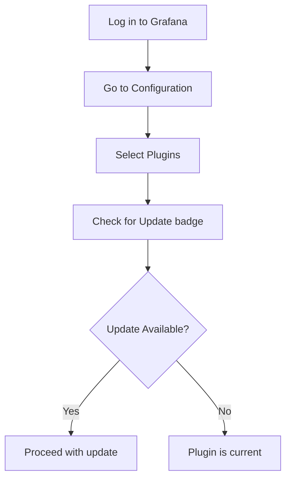

# Plugin Updates

## Introduction

Plugins extend Grafana's functionality, but like any software component, they need regular updates to benefit from new features, bug fixes, and security patches. This guide explains the plugin update process in Grafana, helping you maintain a secure and feature-rich monitoring environment.

## Why Update Plugins?

Keeping your plugins updated offers several benefits:

- **Security improvements**: Updates often patch vulnerabilities
- **Bug fixes**: Resolving issues that might affect your dashboards
- **New features**: Access to the latest capabilities
- **Compatibility**: Ensuring your plugins work with newer Grafana versions

## Checking for Plugin Updates

### Using the Grafana UI

The simplest way to check for updates is through the Grafana web interface:

1. Log in to your Grafana instance
2. Navigate to **Configuration** → **Plugins**
3. Look for plugins with an "Update available" badge



### Using the CLI

For Grafana instances managed through the command line, you can use the Grafana CLI:

```bash
# List installed plugins with available updates
grafana-cli plugins list-installed
```

Example output:

```
id: grafana-clock-panel, version: 1.0.3, installed: true, has update: true (1.3.0)
id: grafana-worldmap-panel, version: 0.3.2, installed: true, has update: false
```

## Updating Plugins

### Method 1: Through the Grafana UI

1. Navigate to **Configuration** → **Plugins**
2. Find the plugin with an update available
3. Click on the plugin to view its details
4. Click the **Update** button
5. Restart Grafana if prompted

### Method 2: Using the Grafana CLI

To update a specific plugin:

```bash
grafana-cli plugins update [plugin-id]
```

For example:

```bash
grafana-cli plugins update grafana-clock-panel
```

To update all plugins at once:

```bash
grafana-cli plugins update-all
```

### Method 3: In Docker Environments

If running Grafana in Docker, you'll need to update the container image and reinstall the plugins:

```bash
# Example Docker run command with plugin installation
docker run -d -p 3000:3000 --name=grafana \
  -e "GF_INSTALL_PLUGINS=grafana-clock-panel,grafana-worldmap-panel" \
  grafana/grafana:latest
```

## Plugin Update Best Practices

### 1. Test Updates in Development First

Always test plugin updates in a non-production environment:

```bash
# Create a test environment using Docker
docker run -d -p 3001:3000 --name=grafana-test \
  -e "GF_INSTALL_PLUGINS=plugin-id" \
  grafana/grafana:latest
```

### 2. Check Compatibility

Before updating, verify compatibility between:
- Plugin version and your Grafana version
- Plugin version and other plugins you're using

This information is typically available in the plugin's documentation.

### 3. Back Up Your Grafana Configuration

Always back up your Grafana configuration before updating plugins:

```bash
# Back up Grafana configuration
cp /etc/grafana/grafana.ini /etc/grafana/grafana.ini.backup

# For Docker installations
docker cp grafana:/etc/grafana/grafana.ini ./grafana.ini.backup
```

### 4. Schedule Regular Updates

Create a maintenance schedule to regularly check for and apply updates:

```bash
# Example cron job to check for plugin updates (writes to a log file)
0 0 * * 0 /usr/local/bin/grafana-cli plugins list-installed | grep "has update: true" >> /var/log/grafana/plugin_updates.log
```

## Troubleshooting Plugin Updates

### Common Issues and Solutions

#### Plugin Won't Update

If a plugin fails to update through the UI:

```bash
# Try using the CLI with verbose logging
grafana-cli --verbose plugins update [plugin-id]
```

#### Plugin Compatibility Problems

If a plugin stops working after an update:

1. Check the plugin's GitHub issues page for known problems
2. Try rolling back to the previous version:

```bash
# Uninstall the current version
grafana-cli plugins uninstall [plugin-id]

# Install the specific previous version
grafana-cli plugins install [plugin-id] [version]
```

#### Permission Issues

If you encounter permission errors during updates:

```bash
# For Linux/macOS systems, check directory permissions
sudo chown -R grafana:grafana /var/lib/grafana/plugins
```

## Real-World Example: Updating the Worldmap Panel

Let's walk through updating the popular Worldmap Panel plugin:

1. Check the current version:

```bash
grafana-cli plugins list-installed | grep worldmap
```

Output:
```
id: grafana-worldmap-panel, version: 0.3.2, installed: true, has update: true (0.4.0)
```

2. Perform the update:

```bash
grafana-cli plugins update grafana-worldmap-panel
```

3. Verify the update:

```bash
grafana-cli plugins list-installed | grep worldmap
```

Output:
```
id: grafana-worldmap-panel, version: 0.4.0, installed: true, has update: false
```

4. Restart Grafana:

```bash
# For systemd-based systems
sudo systemctl restart grafana-server

# For Docker
docker restart grafana
```

5. Check your dashboards that use the Worldmap Panel to ensure they're functioning correctly with the new version.

## Managing Plugin Updates in Enterprise Environments

For larger deployments, consider:

- **Using Grafana Provisioning**: Automate plugin management through YAML configuration files
- **Implementing a CI/CD pipeline**: Test and deploy plugin updates systematically
- **Setting up a proxy server**: For Grafana instances without direct internet access

Example provisioning configuration (`plugins.yaml`):

```yaml
apiVersion: 1

apps:
  - type: "grafana-worldmap-panel"
    version: "0.4.0"
    disabled: false
  - type: "grafana-clock-panel"
    version: "1.3.0"
    disabled: false
```

## Summary

Keeping Grafana plugins updated is a crucial maintenance task that ensures you benefit from the latest features while maintaining security. By following the methods and best practices outlined in this guide, you can manage plugin updates efficiently while minimizing risks.

Regular plugin maintenance should be part of your overall Grafana administration strategy, alongside version upgrades, dashboard backups, and user management.

## Additional Resources

- [Grafana CLI Documentation](https://grafana.com/docs/grafana/latest/administration/cli/)
- [Grafana Plugin Installation Guide](https://grafana.com/docs/grafana/latest/plugins/installation/)

## Practice Exercises

1. Check your Grafana instance for plugins that have updates available.
2. Create a test environment and practice updating a plugin.
3. Write a simple shell script that checks for plugin updates and notifies you via email.
4. Research the release notes of a plugin you use frequently to understand what changes are included in the latest version.