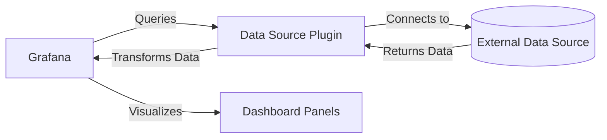

# Data Source Plugins

## Introduction

Data source plugins are one of the most important types of plugins in the Grafana ecosystem. They allow Grafana to connect to various data storage systems and query their data for visualization. While Grafana comes with several built-in data sources like Prometheus, Graphite, and MySQL, data source plugins enable you to extend Grafana's capabilities by connecting to custom or specialized data sources.

In this guide, we'll explore what data source plugins are, how they work, and how to create a basic data source plugin for Grafana. By the end, you'll have a solid understanding of how Grafana connects to different data sources and how you can extend this functionality.

## What are Data Source Plugins?

A data source plugin is a component that allows Grafana to:

1. Connect to a specific type of data storage system
2. Query data from that system
3. Transform the returned data into a format that Grafana can visualize

Data source plugins act as bridges between Grafana and your data, enabling seamless integration with virtually any data source that has an accessible API.



## Key Components of a Data Source Plugin

A typical data source plugin consists of several key components:

1. **Query Editor**: A custom UI that allows users to build queries specific to the data source
2. **Configuration Page**: Where users can specify connection details and options
3. **Data Source API Implementation**: Code that handles the communication with the external data source
4. **Response Parser**: Code that transforms the data from the source format to Grafana's format

## Creating a Simple Data Source Plugin

Let's walk through creating a basic data source plugin that connects to a REST API. This example will be simplified but demonstrates the core concepts.

### Step 1: Set Up Your Development Environment

First, you'll need to set up your development environment:

```bash
# Install the Grafana plugin development toolkit
npm install -g @grafana/toolkit

# Create a new data source plugin
npx @grafana/toolkit plugin:create my-data-source

# Navigate to the plugin directory
cd my-data-source

# Install dependencies
npm install
```

### Step 2: Define the Data Source Class

The main part of your plugin will be the data source class that implements the data source API:

```typescript
import {
  DataQueryRequest,
  DataQueryResponse,
  DataSourceApi,
  DataSourceInstanceSettings,
} from '@grafana/data';
import { getBackendSrv } from '@grafana/runtime';
import { MyDataSourceOptions, MyQuery } from './types';

export class MyDataSource extends DataSourceApi<MyQuery, MyDataSourceOptions> {
  url: string;

  constructor(instanceSettings: DataSourceInstanceSettings<MyDataSourceOptions>) {
    super(instanceSettings);
    this.url = instanceSettings.jsonData.apiUrl || '';
  }

  async query(options: DataQueryRequest<MyQuery>): Promise<DataQueryResponse> {
    const promises = options.targets.map(async (target) => {
      // Implement your data fetching logic here
      const response = await getBackendSrv().get(`${this.url}/data?query=${target.queryText}`);
      
      // Transform the response to Grafana's time series format
      return {
        refId: target.refId,
        fields: [
          { name: 'Time', values: response.times, type: 'time' },
          { name: 'Value', values: response.values, type: 'number' },
        ],
      };
    });

    return Promise.all(promises).then((data) => ({ data }));
  }

  async testDatasource(): Promise<any> {
    // Test if the data source connection works
    return getBackendSrv()
      .get(`${this.url}/health`)
      .then((response) => {
        if (response.status === 'ok') {
          return {
            status: 'success',
            message: 'Data source is working',
          };
        }
        return {
          status: 'error',
          message: 'Data source is not working',
        };
      })
      .catch((error) => {
        return {
          status: 'error',
          message: 'Error connecting to data source: ' + error.message,
        };
      });
  }
}
```

### Step 3: Create Type Definitions

Define TypeScript interfaces for your data source options and queries:

```typescript
export interface MyDataSourceOptions {
  apiUrl: string;
  apiKey?: string;
}

export interface MyQuery {
  refId: string;
  queryText: string;
  maxDataPoints?: number;
}
```

### Step 4: Implement the Query Editor

Create a query editor component to allow users to build queries:

```tsx
import React, { ChangeEvent } from 'react';
import { QueryEditorProps } from '@grafana/data';
import { InlineField, Input } from '@grafana/ui';
import { MyDataSource } from './datasource';
import { MyDataSourceOptions, MyQuery } from './types';

export function QueryEditor(
  props: QueryEditorProps<MyDataSource, MyQuery, MyDataSourceOptions>
) {
  const { query, onChange, onRunQuery } = props;

  const onQueryTextChange = (event: ChangeEvent<HTMLInputElement>) => {
    onChange({ ...query, queryText: event.target.value });
    // Execute the query after user stops typing
    onRunQuery();
  };

  return (
    <div className="gf-form">
      <InlineField label="Query" tooltip="Enter your query string">
        <Input
          onChange={onQueryTextChange}
          value={query.queryText || ''}
          placeholder="Enter query"
          width={30}
        />
      </InlineField>
    </div>
  );
}
```

### Step 5: Create the Configuration Editor

Implement a configuration editor for the data source connection settings:

```tsx
import React, { ChangeEvent } from 'react';
import { DataSourcePluginOptionsEditorProps } from '@grafana/data';
import { InlineField, Input, SecretInput } from '@grafana/ui';
import { MyDataSourceOptions } from './types';

export function ConfigEditor(
  props: DataSourcePluginOptionsEditorProps<MyDataSourceOptions>
) {
  const { options, onOptionsChange } = props;
  const { jsonData, secureJsonData } = options;

  const onApiUrlChange = (event: ChangeEvent<HTMLInputElement>) => {
    onOptionsChange({
      ...options,
      jsonData: {
        ...jsonData,
        apiUrl: event.target.value,
      },
    });
  };

  const onApiKeyChange = (event: ChangeEvent<HTMLInputElement>) => {
    onOptionsChange({
      ...options,
      secureJsonData: {
        apiKey: event.target.value,
      },
    });
  };

  return (
    <div className="gf-form-group">
      <InlineField label="API URL" tooltip="Enter the URL of your API">
        <Input
          onChange={onApiUrlChange}
          value={jsonData.apiUrl || ''}
          placeholder="https://api.example.com"
          width={40}
        />
      </InlineField>
      <InlineField label="API Key" tooltip="Enter your API key (if required)">
        <SecretInput
          isConfigured={(options.secureJsonFields && options.secureJsonFields.apiKey) || false}
          value={secureJsonData?.apiKey || ''}
          placeholder="Your API key"
          width={40}
          onReset={() => {
            onOptionsChange({
              ...options,
              secureJsonFields: {
                ...options.secureJsonFields,
                apiKey: false,
              },
            });
          }}
          onChange={onApiKeyChange}
        />
      </InlineField>
    </div>
  );
}
```

### Step 6: Register the Plugin Components

Finally, register all your plugin components in the module file:

```typescript
import { DataSourcePlugin } from '@grafana/data';
import { MyDataSource } from './datasource';
import { ConfigEditor } from './ConfigEditor';
import { QueryEditor } from './QueryEditor';
import { MyDataSourceOptions, MyQuery } from './types';

export const plugin = new DataSourcePlugin<MyDataSource, MyQuery, MyDataSourceOptions>(MyDataSource)
  .setConfigEditor(ConfigEditor)
  .setQueryEditor(QueryEditor);
```

## Real-World Example: Building a Weather API Data Source

Let's apply what we've learned to create a practical example - a data source plugin that connects to a weather API to display temperature data.

### Plugin Implementation

Here's how you might implement a basic weather API data source:

```typescript
import {
  DataQueryRequest,
  DataQueryResponse,
  DataSourceApi,
  DataSourceInstanceSettings,
  MutableDataFrame,
  FieldType,
} from '@grafana/data';
import { getBackendSrv } from '@grafana/runtime';
import { WeatherDataSourceOptions, WeatherQuery } from './types';

export class WeatherDataSource extends DataSourceApi<WeatherQuery, WeatherDataSourceOptions> {
  apiUrl: string;
  apiKey: string;

  constructor(instanceSettings: DataSourceInstanceSettings<WeatherDataSourceOptions>) {
    super(instanceSettings);
    this.apiUrl = 'https://api.weatherapi.com/v1';
    this.apiKey = instanceSettings.secureJsonData?.apiKey || '';
  }

  async query(options: DataQueryRequest<WeatherQuery>): Promise<DataQueryResponse> {
    // Get the time range from the request
    const { range } = options;
    const from = range!.from.valueOf();
    const to = range!.to.valueOf();

    const promises = options.targets.map(async (target) => {
      // Skip empty queries
      if (!target.location) {
        return new MutableDataFrame();
      }

      // Format query for historical weather data
      const response = await getBackendSrv().get(`${this.apiUrl}/history.json`, {
        key: this.apiKey,
        q: target.location,
        dt: range!.from.format('YYYY-MM-DD'),
        end_dt: range!.to.format('YYYY-MM-DD'),
      });

      // Create a data frame from the response
      const frame = new MutableDataFrame({
        refId: target.refId,
        fields: [
          { name: 'Time', type: FieldType.time },
          { name: 'Temperature', type: FieldType.number },
        ],
      });

      // Process the response data into the frame
      response.forecast.forecastday.forEach((day: any) => {
        day.hour.forEach((hour: any) => {
          frame.appendRow([
            new Date(hour.time).getTime(),
            hour.temp_c,
          ]);
        });
      });

      return frame;
    });

    return Promise.all(promises).then((data) => ({ data }));
  }

  async testDatasource(): Promise<any> {
    // Test the connection by making a simple request
    return getBackendSrv()
      .get(`${this.apiUrl}/current.json`, {
        key: this.apiKey,
        q: 'London',
      })
      .then(() => {
        return {
          status: 'success',
          message: 'Data source is working',
        };
      })
      .catch((error) => {
        return {
          status: 'error',
          message: 'Error connecting to the Weather API: ' + error.message,
        };
      });
  }
}
```

### Type Definitions for the Weather API

```typescript
export interface WeatherDataSourceOptions {
  apiKey?: string;
}

export interface WeatherQuery {
  refId: string;
  location: string;
  metric?: 'temperature' | 'humidity' | 'pressure';
}
```

### Weather Query Editor

```tsx
import React, { ChangeEvent } from 'react';
import { QueryEditorProps } from '@grafana/data';
import { InlineField, Input, Select } from '@grafana/ui';
import { WeatherDataSource } from './datasource';
import { WeatherDataSourceOptions, WeatherQuery } from './types';

export function QueryEditor(
  props: QueryEditorProps<WeatherDataSource, WeatherQuery, WeatherDataSourceOptions>
) {
  const { query, onChange, onRunQuery } = props;
  
  const metricOptions = [
    { label: 'Temperature', value: 'temperature' },
    { label: 'Humidity', value: 'humidity' },
    { label: 'Pressure', value: 'pressure' },
  ];

  const onLocationChange = (event: ChangeEvent<HTMLInputElement>) => {
    onChange({ ...query, location: event.target.value });
    onRunQuery();
  };

  const onMetricChange = (value: any) => {
    onChange({ ...query, metric: value.value });
    onRunQuery();
  };

  return (
    <div className="gf-form">
      <InlineField label="Location" tooltip="Enter city name or coordinates">
        <Input
          value={query.location || ''}
          onChange={onLocationChange}
          placeholder="London"
          width={20}
        />
      </InlineField>
      <InlineField label="Metric" tooltip="Select weather metric to display">
        <Select
          options={metricOptions}
          value={metricOptions.find(option => option.value === query.metric)}
          onChange={onMetricChange}
          defaultValue={metricOptions[0]}
          width={20}
        />
      </InlineField>
    </div>
  );
}
```

## Best Practices for Data Source Plugin Development

When developing your own data source plugins, keep these best practices in mind:

1. **Handle Errors Gracefully**: Implement proper error handling to provide useful feedback to users when something goes wrong.

2. **Optimize Query Performance**: Be mindful of the amount of data being fetched and transferred. Use techniques like pagination, filtering at the source, and caching when appropriate.

3. **Add Meaningful Metadata**: Include relevant metadata with your data frames, such as field units, display names, and value mappings.

4. **Support Template Variables**: Design your plugin to work well with Grafana's template variables for dynamic dashboards.

5. **Data Type Consistency**: Make sure the data types returned by your plugin match what Grafana expects (timestamps in milliseconds, numbers for metrics, etc.).

6. **Security Considerations**: 
   - Never expose sensitive credentials in URLs or logs
   - Use secure storage for API keys and passwords
   - Consider implementing authentication handling

7. **Documentation**: Provide clear documentation for your plugin, including setup instructions, query examples, and troubleshooting tips.

## Debugging Data Source Plugins

When developing a data source plugin, you may encounter issues. Here are some debugging strategies:

1. **Console Logging**: Add strategic `console.log()` statements to trace the flow of your code.

2. **Network Monitoring**: Use your browser's developer tools to inspect network requests.

3. **Testing Tools**: Use tools like Postman to test API endpoints directly.

4. **Grafana Query Inspector**: Use Grafana's built-in query inspector to see the raw data returned by your plugin.

```tsx
// Example of adding debug logging to your data source
async query(options: DataQueryRequest<MyQuery>): Promise<DataQueryResponse> {
  console.log('Query options:', options);
  
  // Your query implementation...
  
  console.log('Response data:', responseData);
  return { data: responseData };
}
```

## Publishing Your Data Source Plugin

Once you've developed and tested your data source plugin, you can share it with the community by publishing it to the Grafana Plugins Catalog:

1. **Create a GitHub Repository**: Host your plugin code on GitHub.

2. **Sign Your Plugin**: Use the Grafana plugin signing process to validate your plugin.

3. **Submit to Grafana**: Submit your plugin for review through the Grafana plugin submission process.

4. **Maintain and Update**: Regularly update your plugin to ensure compatibility with new Grafana versions.

## Summary

Data source plugins are powerful extensions that allow Grafana to connect to virtually any data source. By creating custom data source plugins, you can visualize data from specialized systems or proprietary databases alongside your other metrics.

In this guide, we've covered:
- What data source plugins are and how they work
- The key components of a data source plugin
- How to create a basic data source plugin
- A real-world example with a weather API
- Best practices for plugin development
- Debugging strategies
- How to publish your plugin

With this knowledge, you're ready to start creating your own data source plugins to extend Grafana's capabilities and integrate with any data source your organization uses.

## Additional Resources

Here are some resources to help you continue learning about Grafana data source plugin development:

- [Grafana Plugin Development Documentation](https://grafana.com/docs/grafana/latest/developers/plugins/)
- [Grafana Data Source API Reference](https://grafana.com/docs/grafana/latest/packages_api/data/datasource/)
- [Grafana Plugin Examples Repository](https://github.com/grafana/grafana-plugin-examples)
- [Grafana Plugin Development Community Forum](https://community.grafana.com/c/plugin-development/8)

## Exercises

To reinforce your learning, try these exercises:

1. **Exercise 1**: Modify the Weather API example to display additional metrics like wind speed or UV index.

2. **Exercise 2**: Create a simple mock data source that generates random time series data for testing purposes.

3. **Exercise 3**: Build a data source plugin that connects to a public API of your choice (e.g., stock prices, cryptocurrency rates, or social media statistics).

4. **Advanced Exercise**: Implement query caching in a data source plugin to improve performance for frequently accessed data.