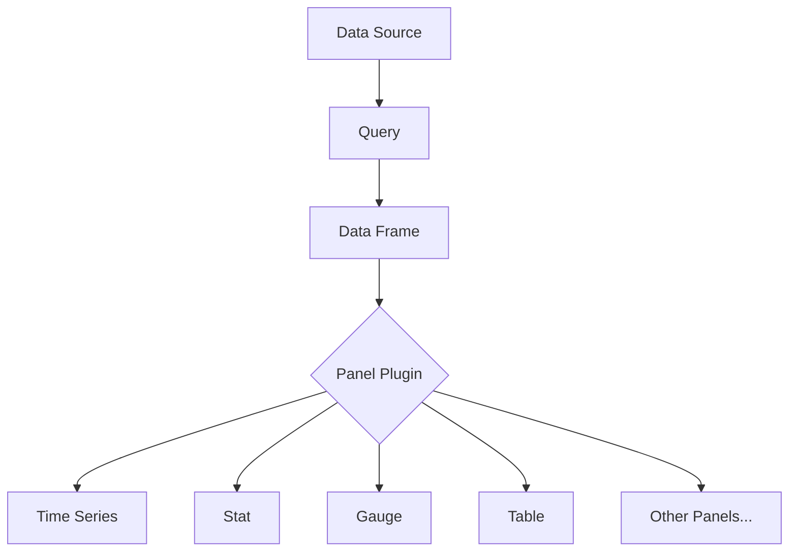

# Panel Plugins

## Introduction

Panel plugins are one of the core components of Grafana's visualization system. They determine how your data is displayed on dashboards and provide the visual representation that makes your metrics and logs meaningful. Whether you're viewing time series data as graphs, displaying single statistics, or creating custom visualizations, panel plugins are what make it possible.

In this guide, we'll explore what panel plugins are, how they work, how to use built-in panels, and even introduce you to creating your own custom panel plugins.

## What Are Panel Plugins?

Panel plugins are modular components that render visualizations in Grafana dashboards. Each panel plugin is designed to transform data returned from data sources into visual representations that help users analyze and understand their data.

<div className="info-box">
  <strong>Key Concept:</strong> Panels are the building blocks of Grafana dashboards, and panel plugins define what types of visualizations are available.
</div>

Grafana comes with many built-in panel plugins, but you can also install additional ones from the Grafana catalog or even create your own custom panels for specialized visualization needs.

## Core Panel Plugin Types

Grafana includes several built-in panel types to cover most common visualization needs:

- **Time Series Panel**: Displays time series data as lines, bars, or points
- **Stat Panel**: Shows a single statistic with optional sparkline
- **Gauge Panel**: Visualizes a value within a defined range
- **Bar Gauge Panel**: Shows values as horizontal or vertical bars
- **Table Panel**: Displays data in tabular format
- **Pie Chart Panel**: Shows data as a pie or donut chart
- **Heatmap Panel**: Visualizes data points as colors in a matrix
- **Logs Panel**: Specialized for displaying log data



## Anatomy of a Panel Plugin

A panel plugin consists of several key components:

1. **Data Processing Logic**: Code that processes and transforms the data for visualization
2. **Rendering Logic**: Code that draws the visualization using libraries like React, D3.js, or Canvas
3. **Options Editor**: Interface that allows users to configure the panel
4. **Default Configuration**: Sensible starting options for the panel

When a panel receives data from a query, it processes that data according to its configuration and renders the appropriate visualization.

## Using Panel Plugins

### Adding a Panel to a Dashboard

To add a panel to your dashboard:

1. Click the "Add panel" button on your dashboard
2. Select "Add new panel"
3. Choose a visualization type from the panel library
4. Configure your data source and query
5. Customize the panel options

Here's how you would configure a basic Time Series panel:

```javascript
// Example configuration for a Time Series panel
const panelConfig = {
  datasource: {
    type: 'prometheus',
    uid: 'PB01D5A5F7D62464C'
  },
  fieldConfig: {
    defaults: {
      color: {
        mode: 'palette-classic'
      },
      custom: {
        lineWidth: 2,
        fillOpacity: 20
      },
      unit: 'bytes'
    }
  },
  options: {
    legend: {
      displayMode: 'list',
      placement: 'bottom'
    },
    tooltip: {
      mode: 'single',
      sort: 'none'
    }
  }
};
```

### Customizing Panel Appearance

Each panel type provides different customization options, but common settings include:

- **Display options**: Control colors, thresholds, and visual styles
- **Field options**: Configure how specific fields are displayed
- **Thresholds**: Set color ranges based on value
- **Legend**: Configure how the legend appears
- **Tooltips**: Customize the hover tooltips

### Panel Interactions

Panels in Grafana are interactive. Depending on the panel type, you can:

- Zoom in on time ranges
- Hover for detailed information
- Click on elements to filter or drill down
- Resize panels in the dashboard
- Export panel data

## Real-World Examples

### Example 1: System Monitoring Dashboard

A server monitoring dashboard might use multiple panel types:

- Time Series panels for CPU, memory, and network traffic over time
- Stat panels for current uptime and load average
- Gauge panels for disk utilization
- Table panels for process lists

### Example 2: Business KPI Dashboard

A business KPI dashboard could include:

- Bar Gauge panels for sales targets
- Time Series panels for revenue trends
- Pie Charts for market segment analysis
- Stat panels for conversion rates

### Example 3: Custom Application Metrics

For a web application, you might create:

- Time Series panels for response times
- Heatmaps for user activity by hour/day
- Gauges for error rates
- Custom panels for specialized application metrics

## Installing Panel Plugins

You can extend Grafana's visualization capabilities by installing additional panel plugins:

1. Navigate to **Configuration > Plugins**
2. Click on the **Find more plugins on grafana.com** button
3. Search for the panel plugin you need
4. Click **Install**

For example, installing the popular "Clock Panel":

```bash
# If using Grafana CLI
grafana-cli plugins install grafana-clock-panel
```

## Developing a Simple Panel Plugin

Let's walk through creating a very basic custom panel plugin. This example shows the fundamental structure of a panel plugin.

### Basic Structure

A panel plugin typically follows this structure:

```
my-panel-plugin/
├── src/
│   ├── module.ts
│   ├── plugin.json
│   ├── SimplePanel.tsx
│   └── types.ts
├── package.json
└── README.md
```

### Plugin Definition

Here's a simplified example of a basic panel plugin:

```typescript
// module.ts
import { PanelPlugin } from '@grafana/data';
import { SimplePanel } from './SimplePanel';
import { SimplePanelOptions } from './types';

export const plugin = new PanelPlugin<SimplePanelOptions>(SimplePanel)
  .setPanelOptions(builder => {
    builder
      .addTextInput({
        path: 'text',
        name: 'Display Text',
        description: 'Text to display in the panel',
        defaultValue: 'Hello World',
      })
      .addColorPicker({
        path: 'color',
        name: 'Text Color',
        defaultValue: 'green',
      });
  });
```

### Panel Component

```typescript
// SimplePanel.tsx
import React from 'react';
import { PanelProps } from '@grafana/data';
import { SimplePanelOptions } from './types';

interface Props extends PanelProps<SimplePanelOptions> {}

export const SimplePanel: React.FC<Props> = ({ options, data, width, height }) => {
  const { text, color } = options;

  return (
    <div style={{ width, height, display: 'flex', alignItems: 'center', justifyContent: 'center' }}>
      <span style={{ color, fontSize: '24px' }}>{text}</span>
    </div>
  );
};
```

### Types Definition

```typescript
// types.ts
export interface SimplePanelOptions {
  text: string;
  color: string;
}
```

This example demonstrates the basic structure of a panel plugin. A real-world plugin would include more sophisticated data handling, visualization rendering, and configuration options.

## Advanced Panel Plugin Concepts

As you become more comfortable with Grafana panels, you might want to explore these advanced concepts:

### Data Transformations

Panels can transform the data they receive before visualization:

```typescript
// Example of data transformation in a panel
const transformData = (data: DataFrame[]): DataFrame[] => {
  return data.map(frame => {
    // Create a new field with calculated values
    const calculatedField = {
      name: 'calculated',
      type: FieldType.number,
      values: new ArrayVector(frame.fields[0].values.toArray().map(v => v * 2)),
    };
    
    return {
      ...frame,
      fields: [...frame.fields, calculatedField],
    };
  });
};
```

### Panel Context

Panels can access dashboard context for dynamic behavior:

```typescript
// Using panel context
const MyPanel: React.FC<Props> = ({ options, data, width, height, replaceVariables }) => {
  // Use dashboard variables
  const server = replaceVariables('$server');
  
  return (
    <div>
      Showing data for server: {server}
    </div>
  );
};
```

### Reactivity to Data Changes

Panels can react to data changes and refresh accordingly:

```typescript
// Reactive panel example
const MyPanel: React.FC<Props> = ({ options, data, width, height }) => {
  const [processedData, setProcessedData] = useState(null);
  
  useEffect(() => {
    // Process data when it changes
    if (data.series.length > 0) {
      setProcessedData(processData(data.series));
    }
  }, [data]);
  
  if (!processedData) {
    return <div>Loading or no data</div>;
  }
  
  return <MyVisualization data={processedData} />;
};
```

## Best Practices for Panel Plugins

Follow these guidelines when working with or developing panel plugins:

1. **Choose the right panel for your data**: Different visualization types work better for different data patterns
2. **Keep it simple**: Avoid cluttering panels with unnecessary information
3. **Use consistent colors**: Maintain a cohesive color scheme across your dashboard
4. **Set appropriate thresholds**: Configure thresholds to highlight important changes
5. **Consider performance**: Complex visualizations with large datasets can impact dashboard performance
6. **Test different screen sizes**: Ensure your panels look good on different devices
7. **Document custom panels**: If developing custom panels, provide clear documentation

## Common Challenges and Solutions

| Challenge | Solution |
|-----------|----------|
| Panel is blank or "No data" | Check your query, time range, and data source connection |
| Visualization looks wrong | Verify field mappings and visualization options |
| Poor performance | Reduce data points, simplify visualization, or optimize queries |
| Inconsistent appearance | Standardize units, scales, and color schemes |
| Need custom functionality | Extend existing panels or develop a custom panel plugin |

## Summary

Panel plugins are the visual building blocks of Grafana dashboards. They transform your data into meaningful visualizations that help you monitor, analyze, and understand your systems and business. 

In this guide, we've covered:
- What panel plugins are and how they work
- Core panel types available in Grafana
- How to use and customize panels
- Installing additional panel plugins
- The basics of developing your own panel plugins
- Advanced concepts and best practices

With this knowledge, you're ready to create effective dashboards that clearly communicate your data and insights.

## Additional Resources

- [Grafana Panel Documentation](https://grafana.com/docs/grafana/latest/panels-visualizations/)
- [Grafana Plugin Development Guide](https://grafana.com/docs/grafana/latest/developers/plugins/)
- [Grafana Plugin Repository](https://grafana.com/grafana/plugins/)

## Practice Exercises

1. Create a dashboard with at least three different panel types showing the same data in different ways. Compare which visualization works best for different aspects of the data.

2. Install a panel plugin from the Grafana catalog and integrate it into a dashboard.

3. Modify the simple panel plugin example to add another option, such as font size or background color.

4. Create a dashboard for monitoring a specific system (e.g., web server, database) using appropriate panel types for each metric.