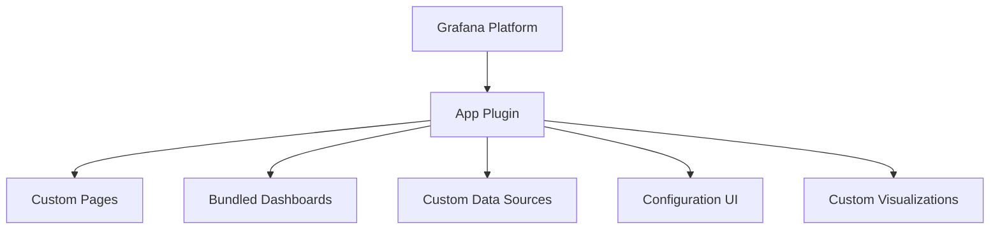

# App Plugins in Grafana

## Introduction

App plugins represent the most comprehensive type of plugin available in Grafana. Unlike panel or datasource plugins that serve specific functions, app plugins can bundle multiple capabilities together, creating rich, integrated experiences within the Grafana platform. They're essentially mini-applications that run within Grafana, allowing you to extend the platform far beyond its core capabilities.

In this tutorial, we'll explore what app plugins are, how they work, and guide you through creating your own basic app plugin. By the end, you'll understand how these powerful extensions can transform your Grafana instance into a customized monitoring and visualization solution.

## What Are App Plugins?

App plugins are comprehensive extensions that can include:

- Custom pages
- Multiple dashboards
- Custom data sources
- Custom panels
- Configuration pages

Unlike other plugin types that focus on a single aspect of functionality, app plugins combine multiple components to create a cohesive experience. They appear in Grafana's main navigation and often serve specific use cases or integrate with particular technologies.

<br />



## Key Characteristics of App Plugins

App plugins have several distinguishing features:

1. **Navigation Integration**: They appear in Grafana's main navigation menu
2. **Multi-component**: They can include dashboards, panels, and data sources
3. **Configuration Options**: They often have dedicated configuration pages
4. **Branding**: They can have custom logos, icons, and styling
5. **Extended Functionality**: They can implement custom backend services

## Popular App Plugin Examples

Before diving into creating your own app plugin, let's look at some popular examples:

- **Zabbix**: Integrates the Zabbix monitoring system into Grafana
- **Status Panel**: Provides a simple status overview panel with alerts
- **Infinity**: Allows visualization of data from various API endpoints, CSV files, and JSON
- **AWS CloudWatch**: Comprehensive AWS monitoring solution

## App Plugin Structure

A basic app plugin directory structure looks like this:

```
my-app-plugin/
├── src/
│   ├── module.ts                # Main plugin module
│   ��── plugin.json              # Plugin metadata
│   ├── components/              # React components
│   │   ├── AppConfig.tsx        # Configuration page
│   │   ├── MainPage.tsx         # Main plugin page
│   ├── dashboards/              # Bundled dashboards
│   │   ├── overview.json
│   │   ├── details.json
│   ├── img/                     # Images and icons
│   │   ├── logo.svg
└── package.json                 # Node.js package file
```

## Creating Your First App Plugin

Let's walk through creating a simple app plugin for Grafana. We'll build a "System Monitor" app that provides pre-configured dashboards for monitoring system metrics.

### Step 1: Set Up the Plugin Directory

First, create a directory structure for your plugin:

```bash
mkdir -p system-monitor-app/src/components
mkdir -p system-monitor-app/src/dashboards
mkdir -p system-monitor-app/src/img
cd system-monitor-app
```

### Step 2: Create package.json

Create a `package.json` file with the necessary dependencies:

```json
{
  "name": "system-monitor-app",
  "version": "1.0.0",
  "description": "System monitoring app for Grafana",
  "scripts": {
    "build": "grafana-toolkit plugin:build",
    "test": "grafana-toolkit plugin:test",
    "dev": "grafana-toolkit plugin:dev",
    "watch": "grafana-toolkit plugin:dev --watch"
  },
  "author": "Your Name",
  "license": "Apache-2.0",
  "devDependencies": {
    "@grafana/data": "latest",
    "@grafana/runtime": "latest",
    "@grafana/toolkit": "latest",
    "@grafana/ui": "latest"
  }
}
```

### Step 3: Define Plugin Metadata

Create a `src/plugin.json` file to define your plugin's metadata:

```json
{
  "type": "app",
  "name": "System Monitor",
  "id": "yourname-systemmonitor-app",
  "info": {
    "description": "Comprehensive system monitoring solution",
    "author": {
      "name": "Your Name"
    },
    "keywords": ["system", "monitoring", "cpu", "memory", "disk"],
    "logos": {
      "small": "img/logo.svg",
      "large": "img/logo.svg"
    },
    "screenshots": [],
    "version": "1.0.0",
    "updated": "2023-01-01"
  },
  "includes": [
    {
      "type": "page",
      "name": "Overview",
      "path": "/a/yourname-systemmonitor-app",
      "role": "Viewer",
      "addToNav": true,
      "defaultNav": true
    },
    {
      "type": "page",
      "name": "Configuration",
      "path": "/plugins/yourname-systemmonitor-app/?page=config",
      "role": "Admin",
      "addToNav": true
    },
    {
      "type": "dashboard",
      "name": "System Overview",
      "path": "dashboards/system_overview.json"
    },
    {
      "type": "dashboard",
      "name": "CPU Details",
      "path": "dashboards/cpu_details.json"
    }
  ],
  "dependencies": {
    "grafanaDependency": ">=8.0.0",
    "plugins": []
  }
}
```

### Step 4: Create the Main Module

Create a `src/module.ts` file that serves as the entry point for your plugin:

```typescript
import { AppPlugin } from '@grafana/data';
import { AppConfig } from './components/AppConfig';
import { MainPage } from './components/MainPage';

export const plugin = new AppPlugin()
  .setRootPage(MainPage)
  .addConfigPage({
    title: 'Configuration',
    body: AppConfig,
    id: 'config',
  });
```

### Step 5: Create React Components

Create a main page component at `src/components/MainPage.tsx`:

```tsx
import React, { useState, useEffect } from 'react';
import { LoadingPlaceholder, Button, LinkButton } from '@grafana/ui';
import { getBackendSrv } from '@grafana/runtime';

export const MainPage = () => {
  const [isLoading, setIsLoading] = useState(true);
  const [dashboards, setDashboards] = useState<any[]>([]);

  useEffect(() => {
    const fetchDashboards = async () => {
      try {
        // This fetches bundled dashboards for the plugin
        const result = await getBackendSrv().get('/api/plugins/yourname-systemmonitor-app/dashboards');
        setDashboards(result);
      } catch (error) {
        console.error('Failed to fetch dashboards', error);
      } finally {
        setIsLoading(false);
      }
    };

    fetchDashboards();
  }, []);

  if (isLoading) {
    return <LoadingPlaceholder text="Loading dashboards..." />;
  }

  return (
    <div>
      <h1>System Monitor</h1>
      <p>Welcome to the System Monitor app. Use the dashboards below to monitor your system metrics.</p>

      <h2>Available Dashboards</h2>
      {dashboards.length === 0 ? (
        <p>No dashboards found. Please make sure the plugin is configured correctly.</p>
      ) : (
        <div style={{ display: 'flex', flexWrap: 'wrap', gap: '16px' }}>
          {dashboards.map((dashboard) => (
            <div key={dashboard.uid} style={{ border: '1px solid #ddd', borderRadius: '4px', padding: '16px', width: '300px' }}>
              <h3>{dashboard.title}</h3>
              <p>{dashboard.description || 'No description available'}</p>
              <LinkButton href={`/d/${dashboard.uid}`} variant="primary">
                View Dashboard
              </LinkButton>
            </div>
          ))}
        </div>
      )}
    </div>
  );
};
```

Create a configuration component at `src/components/AppConfig.tsx`:

```tsx
import React, { useState, useEffect } from 'react';
import { Button, Field, Input, Switch, FieldSet, Alert } from '@grafana/ui';
import { getBackendSrv } from '@grafana/runtime';

export const AppConfig = () => {
  const [config, setConfig] = useState({
    dataCollection: true,
    collectionInterval: 60,
    alerting: true,
  });
  const [isSaving, setIsSaving] = useState(false);
  const [saveSuccess, setSaveSuccess] = useState(false);

  useEffect(() => {
    // In a real plugin, you would fetch existing configuration here
    // For this example, we're using default values
  }, []);

  const onSave = async () => {
    setIsSaving(true);
    try {
      // In a real plugin, you would save to Grafana's plugin settings API
      // Example: await getBackendSrv().post('/api/plugins/yourname-systemmonitor-app/settings', config);
      await new Promise((resolve) => setTimeout(resolve, 1000)); // Simulate API call
      setSaveSuccess(true);
      setTimeout(() => setSaveSuccess(false), 3000);
    } catch (error) {
      console.error('Failed to save settings', error);
    } finally {
      setIsSaving(false);
    }
  };

  return (
    <div>
      <h2>System Monitor Configuration</h2>

      {saveSuccess && <Alert title="Settings saved" severity="success" />}

      <FieldSet label="Data Collection Settings">
        <Field label="Enable Data Collection">
          <Switch
            value={config.dataCollection}
            onChange={() => setConfig({ ...config, dataCollection: !config.dataCollection })}
          />
        </Field>

        <Field label="Collection Interval (seconds)">
          <Input
            type="number"
            value={config.collectionInterval}
            onChange={(e) => setConfig({ ...config, collectionInterval: parseInt(e.currentTarget.value, 10) })}
            disabled={!config.dataCollection}
          />
        </Field>
      </FieldSet>

      <FieldSet label="Alert Settings">
        <Field label="Enable Alerting">
          <Switch
            value={config.alerting}
            onChange={() => setConfig({ ...config, alerting: !config.alerting })}
          />
        </Field>
      </FieldSet>

      <Button onClick={onSave} disabled={isSaving}>
        {isSaving ? 'Saving...' : 'Save Settings'}
      </Button>
    </div>
  );
};
```

### Step 6: Create Bundled Dashboards

Create a sample dashboard at `src/dashboards/system_overview.json`:

```json
{
  "annotations": {
    "list": []
  },
  "editable": true,
  "fiscalYearStartMonth": 0,
  "graphTooltip": 0,
  "id": null,
  "links": [],
  "liveNow": false,
  "panels": [
    {
      "datasource": {
        "type": "prometheus",
        "uid": "prometheus"
      },
      "fieldConfig": {
        "defaults": {
          "color": {
            "mode": "palette-classic"
          },
          "custom": {
            "axisCenteredZero": false,
            "axisColorMode": "text",
            "axisLabel": "",
            "axisPlacement": "auto",
            "barAlignment": 0,
            "drawStyle": "line",
            "fillOpacity": 10,
            "gradientMode": "none",
            "hideFrom": {
              "legend": false,
              "tooltip": false,
              "viz": false
            },
            "lineInterpolation": "linear",
            "lineWidth": 1,
            "pointSize": 5,
            "scaleDistribution": {
              "type": "linear"
            },
            "showPoints": "never",
            "spanNulls": false,
            "stacking": {
              "group": "A",
              "mode": "none"
            },
            "thresholdsStyle": {
              "mode": "off"
            }
          },
          "mappings": [],
          "thresholds": {
            "mode": "absolute",
            "steps": [
              {
                "color": "green",
                "value": null
              },
              {
                "color": "red",
                "value": 80
              }
            ]
          },
          "unit": "percent"
        },
        "overrides": []
      },
      "gridPos": {
        "h": 8,
        "w": 12,
        "x": 0,
        "y": 0
      },
      "id": 1,
      "options": {
        "legend": {
          "calcs": [],
          "displayMode": "list",
          "placement": "bottom",
          "showLegend": true
        },
        "tooltip": {
          "mode": "single",
          "sort": "none"
        }
      },
      "title": "CPU Usage",
      "type": "timeseries"
    },
    {
      "datasource": {
        "type": "prometheus",
        "uid": "prometheus"
      },
      "fieldConfig": {
        "defaults": {
          "color": {
            "mode": "palette-classic"
          },
          "custom": {
            "axisCenteredZero": false,
            "axisColorMode": "text",
            "axisLabel": "",
            "axisPlacement": "auto",
            "barAlignment": 0,
            "drawStyle": "line",
            "fillOpacity": 10,
            "gradientMode": "none",
            "hideFrom": {
              "legend": false,
              "tooltip": false,
              "viz": false
            },
            "lineInterpolation": "linear",
            "lineWidth": 1,
            "pointSize": 5,
            "scaleDistribution": {
              "type": "linear"
            },
            "showPoints": "never",
            "spanNulls": false,
            "stacking": {
              "group": "A",
              "mode": "none"
            },
            "thresholdsStyle": {
              "mode": "off"
            }
          },
          "mappings": [],
          "thresholds": {
            "mode": "absolute",
            "steps": [
              {
                "color": "green",
                "value": null
              },
              {
                "color": "red",
                "value": 80
              }
            ]
          },
          "unit": "percent"
        },
        "overrides": []
      },
      "gridPos": {
        "h": 8,
        "w": 12,
        "x": 12,
        "y": 0
      },
      "id": 2,
      "options": {
        "legend": {
          "calcs": [],
          "displayMode": "list",
          "placement": "bottom",
          "showLegend": true
        },
        "tooltip": {
          "mode": "single",
          "sort": "none"
        }
      },
      "title": "Memory Usage",
      "type": "timeseries"
    }
  ],
  "refresh": "5s",
  "schemaVersion": 37,
  "style": "dark",
  "tags": ["system", "monitoring"],
  "templating": {
    "list": []
  },
  "time": {
    "from": "now-1h",
    "to": "now"
  },
  "timepicker": {},
  "timezone": "",
  "title": "System Overview",
  "uid": "system-overview",
  "version": 1,
  "weekStart": ""
}
```

## Building and Installing Your App Plugin

To build and install your app plugin, follow these steps:

### Building the Plugin

```bash
# Install dependencies
npm install

# Build the plugin
npm run build
```

### Installing the Plugin

1. Copy the built plugin directory to your Grafana plugins directory
2. Restart Grafana
3. Enable the plugin in Grafana's configuration

```bash
# Example installation path for local development
cp -r dist /var/lib/grafana/plugins/yourname-systemmonitor-app
```

### Configuration in grafana.ini

Make sure your `grafana.ini` file allows loading unsigned plugins:

```ini
[plugins]
allow_loading_unsigned_plugins = yourname-systemmonitor-app
```

## Advanced App Plugin Features

Once you've mastered the basics of app plugins, you can explore more advanced features:

### Creating Backend Services

App plugins can include backend services written in Go to handle complex data processing, API integrations, or custom authentication:

```go
package main

import (
	"context"
	"encoding/json"
	"net/http"

	"github.com/grafana/grafana-plugin-sdk-go/backend"
	"github.com/grafana/grafana-plugin-sdk-go/backend/datasource"
	"github.com/grafana/grafana-plugin-sdk-go/backend/instancemgmt"
	"github.com/grafana/grafana-plugin-sdk-go/backend/resource"
)

// YourPlugin is an example Grafana backend plugin.
type YourPlugin struct{}

// NewYourPlugin creates a new YourPlugin instance.
func NewYourPlugin(_ backend.DataSourceInstanceSettings) (instancemgmt.Instance, error) {
	return &YourPlugin{}, nil
}

func (p *YourPlugin) HandleResourceRequest(ctx context.Context, req *backend.ResourceRequest) (*backend.ResourceResponse, error) {
	// Handle resource requests here
	return &backend.ResourceResponse{
		Status: http.StatusOK,
		Body:   []byte("Hello from backend plugin!"),
	}, nil
}

func main() {
	// Start the plugin
	if err := backend.Serve(backend.ServeOpts{
		ResourceHandler: resource.New().Handle("/api/custom", http.HandlerFunc(func(w http.ResponseWriter, r *http.Request) {
			w.Header().Set("Content-Type", "application/json")
			json.NewEncoder(w).Encode(map[string]string{"message": "Hello from backend plugin!"})
		})),
	}); err != nil {
		backend.Logger.Error("Error serving plugin", "error", err.Error())
	}
}
```

### Custom Authentication

App plugins can implement custom authentication to integrate with external services:

```typescript
import { getBackendSrv } from '@grafana/runtime';

// Example of handling custom authentication
export async function authenticateWithExternalService(credentials) {
  try {
    const response = await getBackendSrv().post('/api/plugin-proxy/yourname-systemmonitor-app/api/auth', credentials);
    localStorage.setItem('custom_auth_token', response.token);
    return true;
  } catch (error) {
    console.error('Authentication failed', error);
    return false;
  }
}

// Using the token for subsequent requests
export async function fetchDataWithAuth() {
  const token = localStorage.getItem('custom_auth_token');
  if (!token) {
    throw new Error('Not authenticated');
  }
  
  return getBackendSrv().get('/api/plugin-proxy/yourname-systemmonitor-app/api/data', {
    headers: {
      'Authorization': `Bearer ${token}`
    }
  });
}
```

### Using Plugin Extensions

Grafana's Plugin Extensions API allows app plugins to extend Grafana's UI in specific locations:

```typescript
// In module.ts
import { AppPlugin } from '@grafana/data';
import { MainPage } from './components/MainPage';
import { ConfigEditor } from './components/ConfigEditor';
import { ProfileExtension } from './extensions/ProfileExtension';

export const plugin = new AppPlugin()
  .setRootPage(MainPage)
  .addConfigPage({
    title: 'Configuration',
    body: ConfigEditor,
    id: 'config',
  })
  .registerExtension(ProfileExtension);
```

## Best Practices

When developing app plugins for Grafana, follow these best practices:

1. **Follow Grafana's Design System**: Use Grafana UI components for a consistent look and feel
2. **Performance Optimization**: Minimize bundle size and optimize rendering
3. **Error Handling**: Implement robust error handling and user feedback
4. **Accessibility**: Ensure your plugin is accessible to all users
5. **Testing**: Write unit and integration tests for your plugin components
6. **Documentation**: Provide clear documentation for installation and usage
7. **Versioning**: Follow semantic versioning for your plugin releases

## Troubleshooting Common Issues

Here are solutions to common issues you might encounter:

### Plugin Not Loading

1. Check your plugin's `plugin.json` for errors
2. Verify that the plugin is properly signed or listed in `allow_loading_unsigned_plugins`
3. Check Grafana logs for detailed error messages

### Bundled Dashboards Not Appearing

1. Ensure dashboard files are in the correct location
2. Verify JSON format is valid
3. Check that dashboard UIDs are unique

### Plugin Components Not Rendering

1. Check browser console for JavaScript errors
2. Verify React component imports and exports
3. Ensure compatibility with your Grafana version

## Summary

App plugins represent the most powerful and flexible way to extend Grafana's functionality. They allow you to create comprehensive solutions that integrate multiple components, custom UIs, and even backend services.

In this tutorial, you've learned:

- What app plugins are and how they differ from other plugin types
- The structure and key components of an app plugin
- How to create a basic app plugin with custom pages and bundled dashboards
- Advanced features like backend services and custom authentication
- Best practices for developing high-quality app plugins

By leveraging app plugins, you can transform Grafana from a visualization platform into a complete solution tailored to your specific monitoring and analysis needs.

## Additional Resources

- [Official Grafana Plugin Development Documentation](https://grafana.com/docs/grafana/latest/developers/plugins/)
- [Grafana UI Components Library](https://developers.grafana.com/ui/latest/index.html)
- [Grafana Plugin SDK for Go](https://pkg.go.dev/github.com/grafana/grafana-plugin-sdk-go)
- [Grafana Community Plugins](https://grafana.com/grafana/plugins/)

## Exercises

1. **Basic**: Modify the System Monitor app plugin to include an additional dashboard for network monitoring.
2. **Intermediate**: Add a custom panel to your app plugin that displays system health status.
3. **Advanced**: Implement a backend service for your app plugin that collects system metrics from a remote server.
4. **Expert**: Create a full app plugin that integrates with a third-party monitoring service, complete with custom authentication and data transformation.