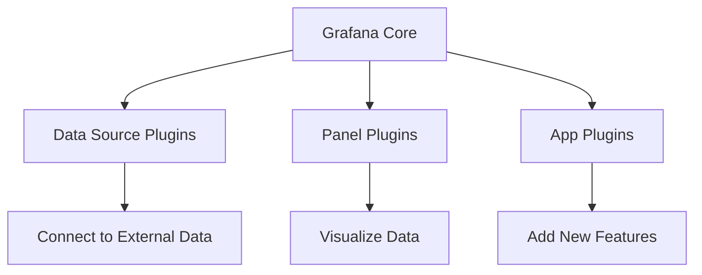
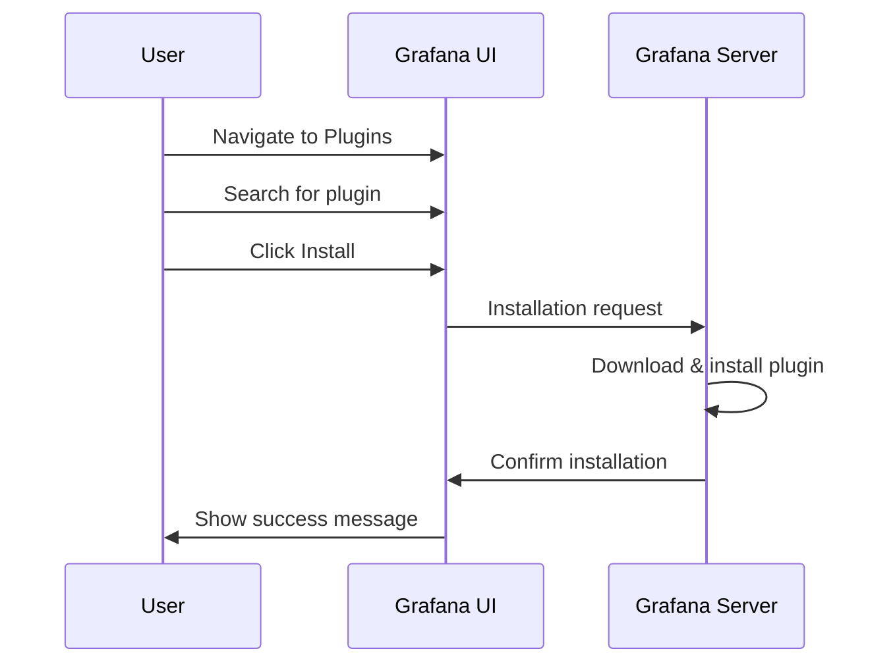

# Plugin Management in Grafana

## Introduction

Plugins are essential components that extend Grafana's core functionality, allowing you to connect to various data sources, create custom visualizations, and add new application features. This guide will walk you through the complete plugin management lifecycle in Grafana, from installation to troubleshooting.

As a beginner, understanding how to effectively manage plugins will help you customize your Grafana environment to meet your specific monitoring and visualization needs.

## Understanding Grafana Plugin Types

Before diving into plugin management, it's important to understand the three main types of Grafana plugins:

1. **Data Source Plugins**: Connect Grafana to various data sources like Prometheus, InfluxDB, Elasticsearch, etc.
2. **Panel Plugins**: Add new visualization types to your dashboards
3. **App Plugins**: Extend functionality with complete applications within Grafana

Let's visualize this relationship:



## Installing Plugins

There are several ways to install Grafana plugins:

### Method 1: Using the Grafana UI

The simplest method for beginners is using the Grafana web interface:

1. Log in to your Grafana instance
2. Navigate to **Configuration** > **Plugins**
3. Browse or search for available plugins
4. Click on a plugin and then click the **Install** button

This process looks like:



### Method 2: Using the Grafana CLI

For command-line enthusiasts or when working with servers directly:

```bash
grafana-cli plugins install <plugin-id>
```

For example, to install the popular Pie Chart panel:

```bash
grafana-cli plugins install grafana-piechart-panel
```

Output:
```
installing grafana-piechart-panel @ 1.6.2
from: https://grafana.com/api/plugins/grafana-piechart-panel/versions/1.6.2/download
into: /var/lib/grafana/plugins

✔ Installed grafana-piechart-panel successfully 

Restart Grafana after installing plugins. 
```

:::note
After installing plugins using CLI, you'll need to restart your Grafana server for the changes to take effect.
:::

### Method 3: Manual Installation

For custom or private plugins, you can install them manually:

1. Download the plugin from its source (GitHub, vendor website, etc.)
2. Extract the files to your Grafana plugins directory (typically `/var/lib/grafana/plugins` on Linux or `data/plugins` in your Grafana installation directory)
3. Restart Grafana

### Installing Enterprise Plugins

For Grafana Enterprise users, some plugins require a license. To install an enterprise plugin:

```bash
grafana-cli --pluginUrl https://plugin-enterprise.grafana.com plugins install <plugin-id>
```

## Managing Installed Plugins

### Viewing Installed Plugins

To see all installed plugins through the UI:
1. Navigate to **Configuration** > **Plugins**
2. View all installed plugins in the list

Using the CLI:
```bash
grafana-cli plugins ls
```

Output:
```
installed plugins:
grafana-clock-panel @ 1.3.1
grafana-piechart-panel @ 1.6.2
grafana-worldmap-panel @ 0.3.2
```

### Updating Plugins

To update plugins via UI:
1. Navigate to **Configuration** > **Plugins**
2. Look for plugins with an available update
3. Click on the plugin and then click the **Update** button

Using the CLI:
```bash
grafana-cli plugins update-all
```

Or update a specific plugin:
```bash
grafana-cli plugins update <plugin-id>
```

### Uninstalling Plugins

To remove a plugin through the UI:
1. Navigate to **Configuration** > **Plugins**
2. Find the plugin you want to remove
3. Click on the plugin and then click the **Uninstall** button

Using the CLI:
```bash
grafana-cli plugins uninstall <plugin-id>
```

## Configuring Plugin Settings

Many plugins offer configuration options that can be adjusted:

1. Navigate to **Configuration** > **Plugins**
2. Click on the installed plugin
3. Look for the **Settings** or **Config** tab
4. Adjust settings according to your needs
5. Save changes

Example configuration for a data source plugin:

```javascript
{
  "apiVersion": 1,
  "datasources": [
    {
      "name": "Prometheus",
      "type": "prometheus",
      "access": "proxy",
      "url": "http://prometheus:9090",
      "basicAuth": false,
      "isDefault": true
    }
  ]
}
```

## Troubleshooting Plugin Issues

### Common Issues and Solutions

#### Plugin Not Appearing After Installation

**Solution:**
1. Verify the plugin was installed in the correct directory
2. Check permissions of the plugin directory
3. Restart Grafana service
4. Check Grafana logs for errors

```bash
# Restart Grafana on Linux (systemd)
sudo systemctl restart grafana-server

# Check logs
sudo journalctl -u grafana-server -f
```

#### Plugin Compatibility Issues

**Solution:**
- Check if the plugin is compatible with your Grafana version
- Look for updated versions of the plugin
- Check the plugin's GitHub issues or forums for known problems

#### Plugin Loading Errors

If you see errors in the logs similar to:

```
Failed to load plugin: Error: Plugin using framework v1 is deprecated since Grafana v10.0.0
```

**Solution:**
- Update the plugin to a newer version
- Contact the plugin developer for updates
- Consider finding alternative plugins

## Working with Plugin Configuration Files

For advanced configuration, you can edit the Grafana configuration file:

```ini
[plugins]
# Directory where plugins are stored
plugins_dir = /var/lib/grafana/plugins

# Allow loading unsigned plugins
allow_loading_unsigned_plugins = plugin1,plugin2

# Enable or disable plugin catalog
plugin_admin_enabled = true

# Configure proxy for plugin installation
plugin_admin_external_manage_enabled = false
```

## Plugin Security Considerations

### Plugin Signatures

Grafana verifies plugin signatures to ensure they come from trusted sources. To allow unsigned plugins:

1. Edit your Grafana configuration file:

```ini
[plugins]
allow_loading_unsigned_plugins = plugin-id-1,plugin-id-2
```

2. Restart Grafana

### Plugin Permissions

Some plugins require specific permissions. When installing such plugins, you may need to approve these permissions through the UI or configure them in the Grafana configuration.

## Practical Examples

### Example 1: Setting Up a Complete Monitoring Stack

Let's walk through setting up Grafana with essential plugins for a complete monitoring stack:

1. Install the Prometheus data source plugin:
```bash
grafana-cli plugins install grafana-prometheus-datasource
```

2. Install visualization plugins:
```bash
grafana-cli plugins install grafana-piechart-panel
grafana-cli plugins install grafana-worldmap-panel
grafana-cli plugins install grafana-clock-panel
```

3. Install an app plugin for alerting:
```bash
grafana-cli plugins install grafana-webhook-notifier
```

4. Configure your data source in Grafana:
   - Go to **Configuration** > **Data Sources**
   - Add a new Prometheus data source
   - Set the URL to your Prometheus server (e.g., `http://prometheus:9090`)
   - Save & Test to verify the connection

5. Create a new dashboard using your installed visualization plugins

### Example 2: Creating a Custom Plugin Configuration

For organizations with specific requirements, you might want to create a custom plugin configuration:

```javascript
// custom-plugin-config.json
{
  "id": "my-custom-panel",
  "type": "panel",
  "name": "Custom Panel",
  "info": {
    "description": "A custom panel for our organization",
    "author": {
      "name": "Your Name"
    },
    "version": "1.0.0"
  },
  "dependencies": {
    "grafanaVersion": "8.x.x",
    "plugins": []
  }
}
```

## Summary

Plugin management is a crucial aspect of working with Grafana that allows you to extend its functionality according to your specific needs. In this guide, you've learned:

- The different types of Grafana plugins and their purposes
- Multiple methods for installing plugins (UI, CLI, manual)
- How to manage, update, and remove plugins
- Troubleshooting common plugin issues
- Working with plugin configuration files
- Security considerations when using plugins
- Practical examples of plugin usage in real-world scenarios

By mastering plugin management, you've taken a significant step toward customizing your Grafana environment to create powerful monitoring and visualization solutions.

## Additional Resources

- [Official Grafana Plugin Documentation](https://grafana.com/docs/grafana/latest/plugins/)
- [Grafana Plugin Catalog](https://grafana.com/grafana/plugins/)
- [Developing Your Own Grafana Plugins](https://grafana.com/docs/grafana/latest/developers/plugins/)

## Exercises

1. Install the Grafana WorldMap Panel plugin and create a simple dashboard that displays geographic data.
2. Compare two similar visualization plugins (e.g., Pie Chart and Discrete Panel) and document their differences in features and use cases.
3. Troubleshoot a scenario where a plugin fails to load after installation.
4. Create a backup strategy for your Grafana plugins configuration.
5. Explore the Grafana plugin marketplace and identify three plugins that might be useful for your specific use case.