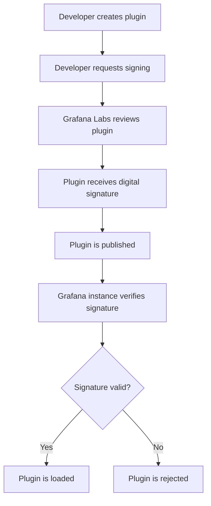

# Plugin Signing in Grafana

## Introduction

Plugin signing is a critical security feature in Grafana that verifies the authenticity and integrity of plugins before they're installed or loaded. This process helps protect Grafana installations from potentially malicious or unauthorized plugins by creating a chain of trust between plugin developers and users.

In this tutorial, you'll learn:
- What plugin signing is and why it matters
- How the Grafana plugin signing system works
- How to sign your own plugins
- How to verify signed plugins
- Best practices for managing signed plugins

## What is Plugin Signing?

Plugin signing is a security mechanism that uses cryptographic techniques to verify:

1. **Authenticity** - Confirms a plugin was created by the claimed developer
2. **Integrity** - Ensures the plugin hasn't been tampered with since it was signed

When a plugin is signed, it receives a digital signature that Grafana can verify before loading the plugin. This creates a trust system that helps prevent security risks like unauthorized code execution or data breaches.

## How Grafana's Plugin Signing System Works

Grafana uses a public key infrastructure (PKI) system for plugin signing. Here's a high-level overview of the process:



The signing process creates a `MANIFEST.txt` file containing file checksums and package metadata, which is then signed to produce a `.sig` file. These files are used during verification when the plugin is loaded.

## Plugin Signature Levels

Grafana categorizes plugins into different signature levels that determine how they're treated:

1. **Core** - Built and maintained by Grafana Labs
2. **Commercial** - Commercial plugins built by Grafana Labs
3. **Community** - Community plugins signed by Grafana Labs
4. **Private** - Privately built plugins that can be signed by Grafana Labs or self-signed
5. **Unsigned** - Plugins with no signature (require special configuration to load)

## Setting Up Your Plugin for Signing

Before requesting a signature, ensure your plugin meets these requirements:

1. Follows the [Grafana plugin development guidelines](https://grafana.com/docs/grafana/latest/developers/plugins/)
2. Contains a valid `plugin.json` file with accurate metadata
3. Passes all linting and testing requirements
4. Includes proper documentation

Here's an example of a well-formed `plugin.json` file ready for signing:

```json
{
  "id": "my-awesome-plugin",
  "type": "panel",
  "name": "Awesome Panel",
  "info": {
    "description": "An awesome Grafana panel plugin",
    "author": {
      "name": "Your Name",
      "email": "your.email@example.com",
      "url": "https://your-website.com"
    },
    "keywords": ["panel", "template"],
    "version": "1.0.0",
    "updated": "2023-01-15",
    "logos": {
      "small": "img/logo.svg",
      "large": "img/logo.svg"
    },
    "links": [
      {"name": "Website", "url": "https://github.com/yourusername/my-awesome-plugin"},
      {"name": "License", "url": "https://github.com/yourusername/my-awesome-plugin/blob/master/LICENSE"}
    ],
    "screenshots": [
      {"name": "Main View", "path": "img/screenshot.png"}
    ]
  },
  "dependencies": {
    "grafanaDependency": ">=9.0.0",
    "plugins": []
  }
}
```

## Requesting a Plugin Signature from Grafana Labs

To get your plugin signed by Grafana Labs:

1. Ensure your plugin is published to a public GitHub repository
2. Submit a signing request through the [Grafana Plugin Submission](https://grafana.com/plugins/submit/) process
3. Grafana Labs will review your plugin for quality and security
4. Upon approval, your plugin will be signed and added to the Grafana catalog

## Self-Signing Plugins for Private Use

For plugins that won't be publicly distributed, you can self-sign them. Here's how:

### Step 1: Generate a Private Key

First, generate a private key using OpenSSL:

```bash
openssl genrsa -out private.key 4096
```

### Step 2: Create a Configuration File

Create a file named `signing.json`:

```json
{
  "rootUrls": [
    "https://your-grafana-instance.com/"
  ],
  "plugins": [
    "your-plugin-id"
  ]
}
```

### Step 3: Sign Your Plugin

Use the Grafana plugin signing tool to sign your plugin:

```bash
npx @grafana/toolkit plugin:sign --rootUrls https://your-grafana-instance.com/ --key private.key
```

This creates a `MANIFEST.txt` and `.sig` file in your plugin's directory.

### Step 4: Configure Grafana to Trust Your Signature

Add your public key to your Grafana configuration:

```ini
[plugins]
allow_loading_unsigned_plugins = your-plugin-id
plugin_admin_enabled = true
plugin_admin_external_manage_enabled = true
```

## Verifying Signed Plugins

You can verify a plugin's signature using the Grafana CLI:

```bash
grafana-cli plugins verify-plugin your-plugin-id
```

The verification will show details about the signature:

```
Verifying plugin: your-plugin-id
Plugin signature verification passed
- Signed by: Your Organization
- Signed on: 2023-01-15 10:30:00
- Signature level: community
```

## Best Practices for Plugin Signing

1. **Always sign plugins for production environments** - This ensures security and integrity
2. **Keep private keys secure** - Store private keys in secure locations with restricted access
3. **Use the latest toolkit** - Always use the most recent version of `@grafana/toolkit` for signing
4. **Update signatures after changes** - Re-sign plugins after making changes to ensure integrity
5. **Document signature details** - Include information about the signature in your plugin documentation

## Troubleshooting Signature Issues

### Plugin Fails to Load Due to Signature

If a signed plugin fails to load, check:

1. The Grafana logs for specific error messages
2. That the plugin signature hasn't expired
3. That the `MANIFEST.txt` and `.sig` files are present and valid
4. That your Grafana instance is configured to trust the signature level

### Example Error Messages and Solutions

```
Plugin signature invalid: plugin has modified files
```
- **Solution**: Re-sign the plugin with the latest files

```
Plugin not loaded because it's unsigned
```
- **Solution**: Either sign the plugin or add it to the `allow_loading_unsigned_plugins` list

## Practical Example: Setting Up CI/CD for Plugin Signing

Here's how you can integrate plugin signing into a GitHub Actions workflow:

```yaml
name: Sign Plugin

on:
  release:
    types: [published]

jobs:
  sign:
    runs-on: ubuntu-latest
    steps:
      - uses: actions/checkout@v3
      
      - name: Setup Node.js
        uses: actions/setup-node@v3
        with:
          node-version: '16'
          
      - name: Install dependencies
        run: npm ci
        
      - name: Build plugin
        run: npm run build
        
      - name: Sign plugin
        run: |
          echo "${{ secrets.PRIVATE_KEY }}" > private.key
          npx @grafana/toolkit plugin:sign --rootUrls https://your-grafana-instance.com/ --key private.key
        
      - name: Package plugin
        run: npx @grafana/toolkit plugin:build
        
      - name: Upload signed plugin
        uses: actions/upload-artifact@v3
        with:
          name: signed-plugin
          path: dist/*.zip
```

## Summary

Plugin signing is an essential security feature that creates a trust mechanism between plugin developers and Grafana users. By verifying authenticity and integrity, it helps protect Grafana installations from potential security threats.

In this tutorial, you've learned:
- The fundamentals of Grafana's plugin signing system
- How to prepare your plugin for signing
- Steps to request official signatures or self-sign plugins
- How to verify plugin signatures
- Best practices for managing signed plugins

By implementing plugin signing in your development workflow, you contribute to a more secure Grafana ecosystem while building user trust in your plugins.

## Additional Resources

- [Official Grafana Plugin Signing Documentation](https://grafana.com/docs/grafana/latest/plugins/plugin-signatures/)
- [Grafana Plugin Development Guide](https://grafana.com/tutorials/build-a-panel-plugin/)
- [Grafana Plugin Security Best Practices](https://grafana.com/docs/grafana/latest/plugins/plugin-security/)

## Exercises

1. Create a simple Grafana panel plugin and go through the process of preparing it for signing.
2. Set up a local development environment with self-signed plugins to understand the verification process.
3. Implement a CI/CD pipeline that automatically signs your plugin when a new version is released.
4. Create a script that verifies all installed plugins in a Grafana instance and reports their signature status.