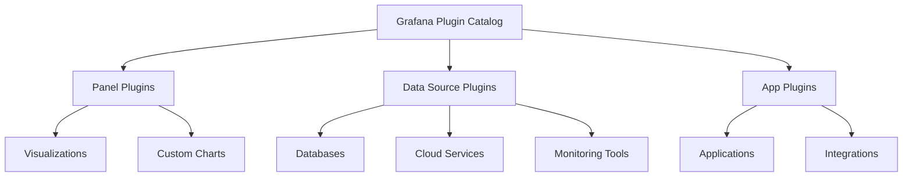

# Plugin Catalog

## Introduction

The Grafana Plugin Catalog is a centralized repository where you can discover, install, and manage extensions for your Grafana instance. Plugins expand Grafana's core capabilities by adding new visualizations, data sources, and applications, enabling you to customize your monitoring and visualization platform to fit your specific requirements.

In this guide, we'll explore how to navigate the Plugin Catalog, understand different plugin types, and learn how to find and install the right plugins for your needs.

## Understanding the Plugin Catalog

The Plugin Catalog serves as a marketplace for Grafana extensions. It contains hundreds of plugins developed by both Grafana Labs and the community, categorized by type and functionality.

### Types of Plugins

Grafana plugins fall into three main categories:

1. **Panel Plugins** - Add new visualization options to your dashboards
2. **Data Source Plugins** - Connect Grafana to specific data storage systems
3. **App Plugins** - Provide more complex functionality, often combining panels and data sources



### Plugin Signatures

Plugins in the catalog come with different signature levels that indicate their security validation:

- **Grafana Labs Plugins** - Built and maintained by Grafana Labs
- **Certified Plugins** - Built by trusted partners and verified by Grafana Labs
- **Community Plugins** - Created by the community with various levels of signatures

## Accessing the Plugin Catalog

You can access the Plugin Catalog directly from your Grafana instance:

1. Log in to your Grafana instance
2. Navigate to the Configuration menu (gear icon)
3. Select "Plugins"

Alternatively, you can browse the catalog online at [grafana.com/plugins](https://grafana.com/plugins).

## Searching for Plugins

The Plugin Catalog offers several ways to find the plugins you need:

### Using Filters

```jsx
// Filter plugins by type, category, or signature level
<FilterSection>
  <Filter name="Type" options={["Panel", "Data source", "App"]} />
  <Filter name="Category" options={["Logging", "Cloud", "IoT"]} />
  <Filter name="Signature" options={["Grafana", "Certified", "Community"]} />
</FilterSection>
```

### Search Functionality

The search bar helps you find plugins by name, description, or functionality:

```jsx
<SearchBox 
  placeholder="Search plugins..." 
  onChange={(e) => filterPlugins(e.target.value)} 
/>
```

## Installing Plugins

Installing plugins can be done through the UI or via the command line, depending on your deployment method.

### Through the Grafana UI

1. Find the plugin you want to install in the catalog
2. Click the plugin card to view details
3. Click the "Install" button
4. Restart Grafana when prompted

### Using Command Line (for server installations)

For Grafana instances deployed on servers, you can use the Grafana CLI:

```bash
grafana-cli plugins install <plugin-id>
```

For example, to install the popular Pie Chart panel:

```bash
grafana-cli plugins install grafana-piechart-panel
```

### Docker Installation

If you're running Grafana in Docker, you'll need to include the plugins in your container:

```bash
docker run -d -p 3000:3000 \
  --name=grafana \
  -e "GF_INSTALL_PLUGINS=grafana-clock-panel,grafana-simple-json-datasource" \
  grafana/grafana
```

## Managing Installed Plugins

Once installed, plugins can be managed from the Plugins section of your Grafana instance:

### Updating Plugins

You can update plugins to their latest versions:

```bash
grafana-cli plugins update-all
```

Or update a specific plugin:

```bash
grafana-cli plugins update <plugin-id>
```

### Removing Plugins

To uninstall a plugin:

```bash
grafana-cli plugins uninstall <plugin-id>
```

## Real-World Examples

Let's walk through some common scenarios where the Plugin Catalog helps extend Grafana functionality:

### Example 1: Adding AWS CloudWatch Data Source

Suppose you need to monitor your AWS infrastructure:

1. Search for "CloudWatch" in the Plugin Catalog
2. Install the AWS CloudWatch data source plugin
3. Configure it with your AWS credentials
4. Create dashboards using CloudWatch metrics

### Example 2: Creating Custom Visualizations

If standard visualizations don't meet your needs:

1. Search for alternative visualization panels like "Boom Table" or "Status Panel"
2. Install the plugin
3. Use the new visualization options when creating dashboard panels

```jsx
// Example configuration for a Status Panel plugin
const panelConfig = {
  type: "grafana-statusmap-panel",
  options: {
    showLegend: true,
    color: { mode: "spectrum" },
    displayMode: "gradient"
  },
  targets: [
    { refId: "A", datasource: "prometheus", expr: "up{job='node'}" }
  ]
};
```

### Example 3: Integrating with Incident Management

To enhance your incident response workflow:

1. Find and install the PagerDuty app plugin
2. Configure the integration with your PagerDuty account
3. Set up alerts to trigger PagerDuty incidents

## Best Practices

When working with the Plugin Catalog, consider these best practices:

1. **Check Compatibility** - Ensure plugins are compatible with your Grafana version
2. **Verify Signatures** - Prefer signed plugins for security
3. **Review Documentation** - Read plugin documentation for proper configuration
4. **Test in Non-Production** - Try plugins in a test environment first
5. **Monitor Performance** - Some plugins may impact Grafana performance

## Troubleshooting Common Issues

### Plugin Not Found

If you can't find a plugin in the catalog:
- Check that you're spelling the name correctly
- Try different search terms
- The plugin might not be compatible with your Grafana version

### Installation Failures

If plugin installation fails:
- Verify you have adequate permissions
- Check disk space
- Ensure network connectivity to the plugin repository
- Verify Grafana version compatibility

```jsx
// Common error message pattern
const errorMessage = {
  status: "error",
  message: "Failed to install plugin: Permission denied"
};
```

### Plugin Not Working After Installation

If a plugin isn't functioning properly after installation:
- Restart your Grafana instance
- Check browser console for JavaScript errors
- Verify plugin compatibility with your Grafana version
- Check plugin configuration

## Summary

The Grafana Plugin Catalog is a powerful resource that allows you to extend Grafana's functionality to meet your specific monitoring and visualization needs. By understanding how to navigate the catalog, install plugins, and manage them effectively, you can create a customized Grafana experience tailored to your use cases.

## Additional Resources

- [Grafana Plugin Development Guide](https://grafana.com/docs/grafana/latest/developers/plugins/)
- [Creating Your First Grafana Plugin](https://grafana.com/tutorials/build-a-panel-plugin/)
- [Grafana Plugin Security](https://grafana.com/docs/grafana/latest/plugins/plugin-signatures/)

## Exercises

1. Install the Worldmap Panel plugin and create a dashboard that displays metrics on a world map.
2. Add a new data source plugin for a database system you use and connect it to your Grafana instance.
3. Compare three different visualization plugins for displaying time series data and determine which works best for your specific metrics.
4. Create a dashboard using at least three different panel plugins to monitor a system of your choice.
5. Try developing a simple panel plugin following the Grafana developer documentation.