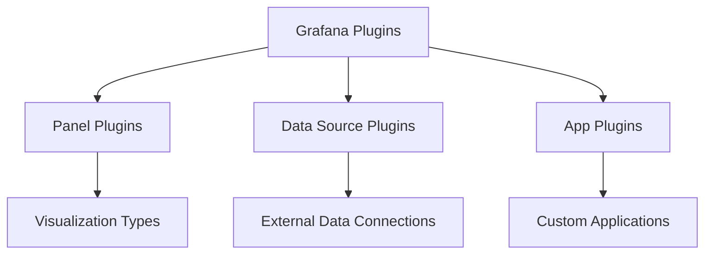

# Plugin Development Basics

## Introduction

Grafana's powerful visualization platform can be extended through custom plugins, allowing developers to create tailored visualizations, data sources, and app extensions. This guide introduces you to the fundamentals of Grafana plugin development, providing you with the knowledge to start building your own custom solutions.

Plugins are essential to Grafana's extensibility, enabling you to:
- Create custom panel visualizations beyond what's available out-of-the-box
- Connect to custom data sources not natively supported
- Build complete applications that integrate within the Grafana ecosystem

By the end of this guide, you'll understand the plugin architecture, development environment setup, and be able to create a basic panel plugin.

## Prerequisites

Before starting plugin development, ensure you have:

- Basic knowledge of web development (HTML, CSS, JavaScript/TypeScript)
- Node.js (v16+) and npm installed
- Git installed
- A local Grafana instance (v9.0.0+) for testing
- Code editor of your choice (VS Code recommended)

## Plugin Types in Grafana

Grafana supports three main plugin types:

1. **Panel Plugins**: Create custom visualizations for your dashboards
2. **Data Source Plugins**: Connect Grafana to external data sources
3. **App Plugins**: Build comprehensive applications within Grafana

Let's understand each type more deeply:



### Panel Plugins

Panel plugins render data visualizations on dashboards. They receive data from data sources and transform it into visual representations like charts, gauges, or custom displays.

### Data Source Plugins

Data source plugins connect Grafana to databases, APIs, or services that aren't natively supported. They handle querying, data formatting, and communication with external systems.

### App Plugins

App plugins are the most comprehensive, combining panel and data source functionality into full-fledged applications within Grafana.

## Setting Up Your Development Environment

Let's create a proper development environment for Grafana plugin development:

### Step 1: Install the Grafana Plugin Create Tool

Use the official scaffolding tool to generate a plugin template:

```bash
npm install -g @grafana/create-plugin
```

### Step 2: Create Your First Plugin

Generate a new panel plugin project:

```bash
npx @grafana/create-plugin@latest
```

Follow the interactive prompts:
- Select the plugin type (panel, data source, or app)
- Provide plugin name, ID, and description
- Choose whether to use TypeScript (recommended)

The tool creates a directory with a fully configured plugin project structure.

### Step 3: Navigate to the Plugin Directory

```bash
cd your-plugin-name
```

### Step 4: Install Dependencies

```bash
npm install
```

### Step 5: Build the Plugin

```bash
npm run build
```

## Grafana Plugin Architecture

Understanding the architecture helps you build better plugins:

### Plugin Structure

A typical Grafana plugin has this structure:

```
my-plugin/
├── src/                  # Source code
���   ├── module.ts         # Plugin entry point
│   ├── plugin.json       # Plugin metadata
│   ├── components/       # React components
│   └── types.ts          # TypeScript type definitions
├── img/                  # Images for plugin
├── node_modules/         # Dependencies
├── dist/                 # Compiled plugin code
├── package.json          # npm package configuration
└── README.md             # Documentation
```

### The Plugin Lifecycle

Grafana plugins follow a specific lifecycle:

1. **Registration**: Plugin registers with Grafana
2. **Initialization**: Plugin sets up internal structures
3. **Configuration**: User configures plugin settings
4. **Data Processing**: Plugin receives and processes data
5. **Rendering**: Plugin renders data to the UI
6. **Cleanup**: Plugin cleans up resources when unmounted

## Creating a Simple Panel Plugin

Let's walk through a basic panel plugin implementation:

### Step 1: Understanding the Entry Point (module.ts)

The `module.ts` file is the entry point for your plugin:

```typescript
import { PanelPlugin } from '@grafana/data';
import { SimplePanel } from './SimplePanel';
import { SimplePanelOptions, defaults } from './types';

export const plugin = new PanelPlugin<SimplePanelOptions>(SimplePanel)
  .setDefaults(defaults)
  .setPanelOptions(builder => {
    builder
      .addTextInput({
        path: 'text',
        name: 'Display Text',
        description: 'Text to display in the panel',
        defaultValue: defaults.text,
      });
  });
```

This code:
- Imports necessary components and types
- Creates a new panel plugin with default options
- Sets up panel configuration options

### Step 2: Creating the Panel Component (SimplePanel.tsx)

Create a React component to render your visualization:

```typescript
import React from 'react';
import { PanelProps } from '@grafana/data';
import { SimplePanelOptions } from './types';
import { css } from '@emotion/css';

interface Props extends PanelProps<SimplePanelOptions> {}

export const SimplePanel: React.FC<Props> = ({ options, data, width, height }) => {
  return (
    <div
      className={css`
        width: ${width}px;
        height: ${height}px;
        display: flex;
        align-items: center;
        justify-content: center;
        font-size: 24px;
      `}
    >
      {options.text || 'No text provided'}
    </div>
  );
};
```

This component:
- Receives options, data, and dimensions as props
- Renders a simple text display
- Uses Emotion CSS for styling

### Step 3: Defining Types (types.ts)

Define TypeScript interfaces for your plugin:

```typescript
export interface SimplePanelOptions {
  text: string;
}

export const defaults: SimplePanelOptions = {
  text: 'Hello, Grafana!',
};
```

### Step 4: Plugin Metadata (plugin.json)

Configure your plugin metadata:

```json
{
  "type": "panel",
  "name": "Simple Panel",
  "id": "myorg-simple-panel",
  "info": {
    "description": "A simple panel plugin for Grafana",
    "author": {
      "name": "Your Name"
    },
    "keywords": ["panel", "template"],
    "version": "1.0.0",
    "updated": "2023-01-01"
  },
  "dependencies": {
    "grafanaDependency": ">=9.0.0",
    "plugins": []
  }
}
```

## Testing Your Plugin

### Step 1: Install the Plugin in Local Grafana

Link or copy your plugin to Grafana's plugin directory:

```bash
# For Linux/Mac
ln -s /path/to/your-plugin /var/lib/grafana/plugins/your-plugin

# For Windows
# Copy the directory to Grafana's plugin folder
```

### Step 2: Configure Grafana to Allow Unsigned Plugins

Edit `grafana.ini` to allow unsigned plugins (for development only):

```ini
[plugins]
allow_loading_unsigned_plugins = myorg-simple-panel
```

### Step 3: Restart Grafana

```bash
# For systemd-based systems
sudo systemctl restart grafana-server

# For Docker
docker restart grafana
```

### Step 4: Verify the Plugin

1. Open Grafana in your browser
2. Create a new dashboard
3. Add a panel and look for your plugin in the visualization options

## Working with Data in Panel Plugins

Let's enhance our panel to visualize actual data:

```typescript
import React from 'react';
import { PanelProps } from '@grafana/data';
import { SimplePanelOptions } from './types';
import { css } from '@emotion/css';

interface Props extends PanelProps<SimplePanelOptions> {}

export const SimplePanel: React.FC<Props> = ({ options, data, width, height }) => {
  // Extract the first series from data
  const series = data.series[0];
  
  // Process data if available
  let valueToDisplay = 'No data';
  if (series && series.fields.length > 0) {
    // Get the last value of the first field
    const lastIndex = series.fields[0].values.length - 1;
    valueToDisplay = series.fields[0].values.get(lastIndex);
  }

  return (
    <div
      className={css`
        width: ${width}px;
        height: ${height}px;
        display: flex;
        flex-direction: column;
        align-items: center;
        justify-content: center;
      `}
    >
      <div className={css`font-size: 16px;`}>{options.text}</div>
      <div className={css`font-size: 24px; font-weight: bold;`}>{valueToDisplay}</div>
    </div>
  );
};
```

This updated component:
- Extracts data from the query results
- Displays both the configured text and data value
- Handles cases where no data is available

## Debugging Plugins

Effective debugging is crucial for plugin development:

### Browser Developer Tools

Use your browser's developer tools to:
- Inspect component rendering
- Check for errors in the console
- Set breakpoints in your code

### Development Server

Most plugin templates include a development server:

```bash
npm run dev
```

This enables hot reloading for faster development cycles.

### Console Logging

Add strategic console logs to track your plugin's behavior:

```typescript
console.log('Data received:', data);
console.log('Options:', options);
```

Remember to remove or disable logs before production deployment.

## Plugin Configuration Options

Enhance your plugin with various configuration options:

```typescript
export const plugin = new PanelPlugin<SimplePanelOptions>(SimplePanel)
  .setDefaults(defaults)
  .setPanelOptions(builder => {
    builder
      .addTextInput({
        path: 'text',
        name: 'Display Text',
        description: 'Text to display in the panel',
        defaultValue: defaults.text,
      })
      .addSelect({
        path: 'colorMode',
        name: 'Color Mode',
        description: 'Color scheme for the visualization',
        defaultValue: 'primary',
        options: [
          { label: 'Primary', value: 'primary' },
          { label: 'Warning', value: 'warning' },
          { label: 'Danger', value: 'danger' },
        ],
      })
      .addNumberInput({
        path: 'fontSize',
        name: 'Font Size',
        description: 'Size of the display text',
        defaultValue: 24,
        settings: {
          min: 10,
          max: 50,
        },
      });
  });
```

Options can include:
- Text inputs
- Number inputs
- Select dropdowns
- Radio buttons
- Switches
- Color pickers
- And more!

## Publishing Your Plugin

When your plugin is ready for sharing:

### Step 1: Create a GitHub Repository

Push your plugin code to a public GitHub repository.

### Step 2: Sign Your Plugin

Use the Grafana plugin signing service:
1. Create a Grafana Cloud account
2. Request a plugin signature
3. Follow the documentation to sign your plugin

### Step 3: Submit to the Grafana Plugin Catalog

1. Fork the Grafana plugin catalog repository
2. Add your plugin information
3. Create a pull request

## Best Practices for Plugin Development

Follow these guidelines for high-quality plugins:

1. **Follow TypeScript Best Practices**
   - Use proper typing for all variables and functions
   - Avoid `any` types when possible

2. **Component Structure**
   - Keep components small and focused
   - Separate logic from presentation

3. **State Management**
   - Use React hooks (useState, useEffect) appropriately
   - Consider context for complex state needs

4. **Error Handling**
   - Gracefully handle missing or malformed data
   - Provide clear error messages to users

5. **Performance**
   - Optimize render cycles
   - Use memoization for expensive calculations
   - Be mindful of large datasets

6. **Accessibility**
   - Ensure proper contrast ratios
   - Provide text alternatives for visual elements
   - Support keyboard navigation

7. **Internationalization**
   - Use Grafana's i18n system
   - Avoid hardcoded text

## Summary

In this guide, we've covered the fundamentals of Grafana plugin development, including:

- Different plugin types and their purposes
- Setting up a development environment
- Understanding plugin architecture
- Creating a basic panel plugin
- Working with data
- Configuring and customizing plugins
- Debugging techniques
- Publishing your plugin
- Best practices

With these basics, you're ready to start creating custom Grafana plugins that extend functionality and provide unique visualizations for your dashboards.

## Additional Resources

To continue your learning journey:

- [Official Grafana Plugin Development Documentation](https://grafana.com/docs/grafana/latest/developers/plugins/)
- [Grafana UI Component Library](https://developers.grafana.com/ui/latest/index.html)
- [Grafana Data Framework](https://grafana.com/docs/grafana/latest/packages_api/data/)
- [Example Plugins on GitHub](https://github.com/grafana/grafana-plugin-examples)

## Exercises

To practice your skills:

1. Modify the simple panel to display a bar chart instead of text
2. Create a plugin that changes colors based on thresholds
3. Build a panel that combines multiple data series
4. Create a plugin with interactive elements (clicks, hovers)
5. Extend your plugin to support dark and light themes