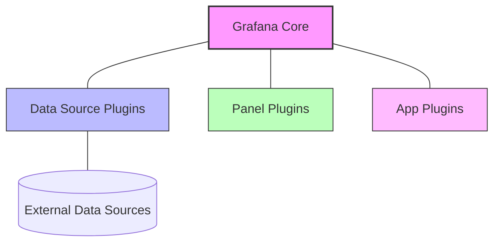

I'll create comprehensive educational content about the "Plugin Framework" for your Grafana Learning Path Structure website. This will be formatted in Docusaurus MDX format with all the requirements you specified.

---
title: Plugin Framework for Grafana
description: Learn about Grafana's plugin framework, how it enables extensibility, and how to work with different plugin types to enhance your Grafana dashboards.

---

# Plugin Framework

## Introduction

Grafana's plugin framework is a powerful system that extends Grafana's core functionality, allowing developers to create custom visualizations, data sources, and applications. This extensibility is one of Grafana's greatest strengths, enabling it to adapt to virtually any monitoring or visualization need.

In this guide, we'll explore how Grafana's plugin framework works, the different types of plugins you can create, and how to get started building your own plugins. By the end, you'll understand how plugins fit into the broader Grafana ecosystem and be ready to extend Grafana's capabilities for your specific use cases.

## Understanding Grafana's Plugin Architecture

At its core, Grafana is designed with extensibility in mind. The plugin framework follows a modular architecture that allows developers to create stand-alone components that integrate seamlessly with the main application.

### Plugin Types

Grafana supports three main types of plugins:

1. **Data Source Plugins**: Connect Grafana to external data sources like databases, APIs, or services
2. **Panel Plugins**: Create custom visualization types for your dashboards
3. **App Plugins**: Add entire applications within Grafana, often combining data sources and panels

Let's visualize how these plugin types interact with Grafana's core:



## Plugin Framework Components

The Grafana plugin framework consists of several key components that work together:

### 1. Plugin System

The plugin system handles:
- Plugin discovery and loading
- Plugin metadata validation
- Plugin lifecycle management
- Plugin runtime environment

### 2. Plugin SDK

Grafana provides a comprehensive Software Development Kit (SDK) for creating plugins. The SDK includes:

- TypeScript/React libraries
- Pre-configured build tools
- Testing frameworks
- Type definitions for Grafana's internal APIs

### 3. Plugin Registry

All official and community plugins can be published to the Grafana plugin registry, making them easily installable through the Grafana UI or CLI.

## Plugin Development Basics

Let's look at the basic structure of a Grafana plugin:

```
my-grafana-plugin/
├── src/                      # Source code
│   ├── module.ts             # Plugin entry point
│   ├── plugin.json           # Plugin metadata
│   ├── components/           # React components
│   └── types.ts              # TypeScript type definitions
├── img/                      # Images for the plugin
│   └── logo.svg              # Plugin logo
├── package.json              # NPM package definition
└── README.md                 # Plugin documentation
```

### Essential Files

Every Grafana plugin requires at least these files:

#### plugin.json

This file contains metadata about your plugin:

```json
{
  "type": "panel",
  "name": "My Custom Panel",
  "id": "my-org-custom-panel",
  "info": {
    "description": "My custom visualization panel",
    "author": {
      "name": "Your Name",
      "url": "https://yourwebsite.com"
    },
    "keywords": ["panel", "visualization"],
    "version": "1.0.0",
    "updated": "2023-04-15"
  },
  "dependencies": {
    "grafanaDependency": ">=9.0.0",
    "plugins": []
  }
}
```

#### module.ts

This is the entry point for your plugin:

```typescript
import { PanelPlugin } from '@grafana/data';
import { MyPanelOptions } from './types';
import { MyPanel } from './components/MyPanel';

export const plugin = new PanelPlugin<MyPanelOptions>(MyPanel)
  .setPanelOptions(builder => {
    builder
      .addTextInput({
        path: 'text',
        name: 'Display Text',
        description: 'Text that will be displayed in the panel',
        defaultValue: 'Hello, Grafana!',
      });
  });
```

## Creating Different Plugin Types

Let's explore how to create each plugin type in more detail.

### 1. Data Source Plugin

A data source plugin connects Grafana to external data sources. Here's a simplified example of a data source plugin:

```typescript
import {
  DataQueryRequest,
  DataQueryResponse,
  DataSourceApi,
  DataSourceInstanceSettings,
} from '@grafana/data';
import { MyDataSourceOptions, MyQuery } from './types';

export class MyDataSource extends DataSourceApi<MyQuery, MyDataSourceOptions> {
  constructor(instanceSettings: DataSourceInstanceSettings<MyDataSourceOptions>) {
    super(instanceSettings);
  }

  async query(options: DataQueryRequest<MyQuery>): Promise<DataQueryResponse> {
    // Implement data fetching logic here
    
    // Example: Transform fetched data to Grafana format
    const data = await this.fetchData(options);
    return { data };
  }

  async testDatasource() {
    // Implement connection test
    try {
      await this.makeTestRequest();
      return {
        status: 'success',
        message: 'Data source is working',
      };
    } catch (err) {
      return {
        status: 'error',
        message: `Data source error: ${err.message}`,
      };
    }
  }
}
```

### 2. Panel Plugin

Panel plugins create custom visualizations. Here's a basic example:

```typescript
import React from 'react';
import { PanelProps } from '@grafana/data';
import { MyPanelOptions } from '../types';

export const MyPanel: React.FC<PanelProps<MyPanelOptions>> = ({ options, data, width, height }) => {
  // Process data for visualization
  const processedData = data.series.map(series => ({
    name: series.name,
    values: series.fields[0].values.toArray(),
  }));

  return (
    <div style={{ width, height, padding: '10px' }}>
      <h2>{options.text}</h2>
      {/* Render your visualization here */}
      <div className="visualization">
        {processedData.map((series, i) => (
          <div key={i} className="series">
            <span>{series.name}: </span>
            <span>{series.values.join(', ')}</span>
          </div>
        ))}
      </div>
    </div>
  );
};
```

### 3. App Plugin

App plugins combine multiple functionalities. Here's a simplified example:

```typescript
import { AppPlugin } from '@grafana/data';
import { AppConfig } from './components/AppConfig';
import { MyAppPage } from './components/MyAppPage';
import { MyAppSettings } from './types';

export const plugin = new AppPlugin<MyAppSettings>()
  .setRootPage(MyAppPage)
  .addConfigPage({
    title: 'Configuration',
    icon: 'cog',
    body: AppConfig,
    id: 'configuration',
  });
```

## Plugin Development Workflow

Creating a Grafana plugin typically follows these steps:

1. **Setup**: Use the Grafana plugin template to create a new plugin
   ```bash
   npx @grafana/create-plugin@latest
   ```

2. **Development**: Write your plugin code and test locally
   ```bash
   yarn dev
   ```

3. **Build**: Compile your plugin for production
   ```bash
   yarn build
   ```

4. **Signing**: Sign your plugin for distribution (optional but recommended)
   ```bash
   npx @grafana/sign-plugin@latest
   ```

5. **Publishing**: Submit your plugin to the Grafana plugin registry

## Plugin Configuration and Options

Plugins can be configured through options editors. The Plugin SDK provides builders to create these editors:

```typescript
export const plugin = new PanelPlugin<MyPanelOptions>(MyPanel)
  .setPanelOptions(builder => {
    builder
      .addTextInput({
        path: 'title',
        name: 'Panel Title',
        description: 'The title of the panel',
        defaultValue: 'My Panel',
      })
      .addColorPicker({
        path: 'color',
        name: 'Text Color',
        description: 'Color of the text',
        defaultValue: '#5794F2',
      })
      .addNumberInput({
        path: 'fontSize',
        name: 'Font Size',
        description: 'Size of the font',
        defaultValue: 16,
      })
      .addSelect({
        path: 'displayMode',
        name: 'Display Mode',
        description: 'How to display the data',
        defaultValue: 'bars',
        options: [
          { label: 'Bars', value: 'bars' },
          { label: 'Lines', value: 'lines' },
          { label: 'Points', value: 'points' },
        ],
      });
  });
```

## Real-World Example: Custom Heatmap Panel

Let's create a simplified heatmap panel as a practical example:

```typescript
// src/HeatmapPanel.tsx
import React, { useState, useEffect } from 'react';
import { PanelProps } from '@grafana/data';
import { HeatmapOptions } from './types';

export const HeatmapPanel: React.FC<PanelProps<HeatmapOptions>> = ({ options, data, width, height }) => {
  const [heatmapData, setHeatmapData] = useState<number[][]>([]);
  
  useEffect(() => {
    // Process time series data into a heatmap format
    if (!data || !data.series || data.series.length === 0) {
      return;
    }
    
    const series = data.series[0];
    // Assume data has x, y, and value fields
    const xValues = series.fields[0].values.toArray();
    const yValues = series.fields[1].values.toArray();
    const values = series.fields[2].values.toArray();
    
    // Create a 2D grid for the heatmap
    const grid: number[][] = [];
    
    // Process values into grid...
    // (Simplified for this example)
    
    setHeatmapData(grid);
  }, [data]);
  
  // Calculate color based on value
  const getColor = (value: number) => {
    const min = options.minValue || 0;
    const max = options.maxValue || 100;
    const normalized = (value - min) / (max - min);
    
    // Simple color gradient from blue to red
    const r = Math.floor(normalized * 255);
    const b = Math.floor((1 - normalized) * 255);
    return `rgb(${r}, 0, ${b})`;
  };
  
  return (
    <div style={{ width, height }}>
      <div className="heatmap-container" style={{ width: '100%', height: '100%' }}>
        {heatmapData.map((row, y) => (
          <div key={y} className="heatmap-row" style={{ display: 'flex', height: `${100 / heatmapData.length}%` }}>
            {row.map((value, x) => (
              <div
                key={`${x}-${y}`}
                className="heatmap-cell"
                style={{
                  width: `${100 / row.length}%`,
                  height: '100%',
                  backgroundColor: getColor(value),
                }}
                title={`Value: ${value}`}
              />
            ))}
          </div>
        ))}
      </div>
    </div>
  );
};
```

And its corresponding options:

```typescript
// src/types.ts
export interface HeatmapOptions {
  minValue?: number;
  maxValue?: number;
  colorScheme: 'blue-red' | 'green-yellow' | 'purple-orange';
}

// src/module.ts
import { PanelPlugin } from '@grafana/data';
import { HeatmapPanel } from './HeatmapPanel';
import { HeatmapOptions } from './types';

export const plugin = new PanelPlugin<HeatmapOptions>(HeatmapPanel)
  .setPanelOptions(builder => {
    builder
      .addNumberInput({
        path: 'minValue',
        name: 'Minimum Value',
        description: 'Minimum value for the color scale',
        defaultValue: 0,
      })
      .addNumberInput({
        path: 'maxValue',
        name: 'Maximum Value',
        description: 'Maximum value for the color scale',
        defaultValue: 100,
      })
      .addSelect({
        path: 'colorScheme',
        name: 'Color Scheme',
        description: 'Color scheme for the heatmap',
        defaultValue: 'blue-red',
        options: [
          { label: 'Blue to Red', value: 'blue-red' },
          { label: 'Green to Yellow', value: 'green-yellow' },
          { label: 'Purple to Orange', value: 'purple-orange' },
        ],
      });
  });
```

## Best Practices for Plugin Development

When developing Grafana plugins, follow these best practices:

1. **Follow Grafana's Design System**: Use Grafana UI components for a consistent look and feel
   ```typescript
   import { Button, Select, Input } from '@grafana/ui';
   ```

2. **Handle Data Efficiently**: Process large datasets carefully to maintain performance

3. **Error Handling**: Implement robust error handling for better user experience
   ```typescript
   try {
     // Perform data operation
   } catch (error) {
     console.error("Error processing data:", error);
     // Show user-friendly error message
   }
   ```

4. **Testing**: Write unit and integration tests for your plugin
   ```typescript
   import { render, screen } from '@testing-library/react';
   import { MyPanel } from './MyPanel';

   test('renders panel correctly', () => {
     render(<MyPanel {...mockProps} />);
     expect(screen.getByText('Panel Title')).toBeInTheDocument();
   });
   ```

5. **Documentation**: Provide clear documentation for users of your plugin

## Debugging Grafana Plugins

Debugging plugins can be challenging, but these techniques will help:

1. **Console Logging**: Use `console.log()` statements to track execution flow
2. **Browser Developer Tools**: Inspect network requests and component state
3. **React DevTools**: Monitor component props and state changes
4. **Source Maps**: Enable source maps in your build for better debugging
   ```javascript
   // webpack.config.js
   module.exports = {
     // ...
     devtool: 'source-map',
     // ...
   };
   ```

## Summary

In this guide, we've explored Grafana's Plugin Framework and learned how it enables extensibility through different types of plugins:

- Data source plugins that connect to external data sources
- Panel plugins that create custom visualizations
- App plugins that add entire applications to Grafana

We've seen how to set up a development environment, structure plugin code, and build different types of plugins. We've also covered best practices for plugin development and debugging techniques.

With this knowledge, you're ready to start building your own Grafana plugins that extend its capabilities to meet your specific requirements.

## Additional Resources

Here are some resources to continue your Grafana plugin development journey:

- **Exercises**:
  1. Create a simple panel plugin that displays data in a custom format
  2. Extend an existing data source plugin to add new query capabilities
  3. Build a complete app plugin that includes both data source and panel components

- **Documentation**:
  - [Grafana Plugin Development Documentation](https://grafana.com/docs/grafana/latest/developers/plugins/)
  - [Grafana Data Source Plugin Tutorial](https://grafana.com/tutorials/build-a-data-source-plugin/)
  - [Grafana Panel Plugin Tutorial](https://grafana.com/tutorials/build-a-panel-plugin/)

- **Community**:
  - [Grafana Community Forums](https://community.grafana.com/)
  - [Grafana Plugin Repository](https://grafana.com/grafana/plugins/)