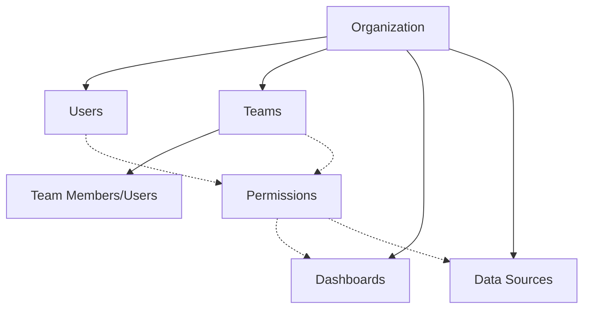

# User Management in Grafana

## Introduction

User management is a critical aspect of Grafana administration that allows you to control who has access to your Grafana instance and what they can do within it. Proper user management ensures that your data is secure, your dashboards remain organized, and your team members have the appropriate level of access to perform their duties effectively.

In this guide, we'll explore the fundamentals of user management in Grafana, including:

- Understanding users, teams, and roles
- Authentication methods
- Setting up permissions and access control
- Managing user sessions
- Best practices for secure user management

Whether you're setting up Grafana for a small team or a large organization, mastering user management is essential for maintaining a secure and well-organized monitoring environment.

## Understanding Grafana's User Management System

### Users, Teams, and Organizations

Grafana organizes access control through three main entities:

1. **Users** - Individual accounts that can log in to Grafana
2. **Teams** - Groups of users that can be assigned permissions collectively
3. **Organizations** - Isolated instances of Grafana that contain their own dashboards, data sources, and users



### User Roles

Grafana provides several built-in roles to control what users can do:

| Role | Description |
|------|-------------|
| Admin | Can do everything, including managing users and organizations |
| Editor | Can create and edit dashboards, but cannot manage users |
| Viewer | Can only view dashboards, cannot make changes |
| Grafana Admin | Server-wide admin with access across all organizations |

## Setting Up Authentication

### Authentication Methods

Grafana supports multiple authentication methods:

#### 1. Built-in Authentication

The simplest method is Grafana's built-in user authentication:

```bash
# Example configuration in grafana.ini
[auth]
disable_login_form = false
```

#### 2. LDAP/Active Directory

For organizations that use LDAP:

```bash
# Example LDAP configuration
[auth.ldap]
enabled = true
config_file = /etc/grafana/ldap.toml
```

In the `ldap.toml` file:

```toml
[[servers]]
host = "ldap.example.org"
port = 389
use_ssl = false
bind_dn = "cn=admin,dc=example,dc=org"
bind_password = "admin_password"
search_filter = "(uid=%s)"
search_base_dns = ["dc=example,dc=org"]

[servers.attributes]
name = "givenName"
surname = "sn"
username = "cn"
email = "email"
```

#### 3. OAuth Providers

Grafana supports OAuth providers like Google, GitHub, and more:

```bash
# Example GitHub OAuth configuration
[auth.github]
enabled = true
allow_sign_up = true
client_id = "your_github_client_id"
client_secret = "your_github_client_secret"
scopes = user:email,read:org
auth_url = https://github.com/login/oauth/authorize
token_url = https://github.com/login/oauth/access_token
api_url = https://api.github.com/user
```

## Managing Users

### Creating Users

To create a new user via the Grafana UI:

1. Navigate to **Configuration > Users**
2. Click **Invite User**
3. Enter the user's email address and select their role
4. Click **Submit**

Through the API:

```bash
# Create user via API
curl -X POST -H "Content-Type: application/json" -H "Authorization: Bearer your_api_key" \
  http://your-grafana-instance/api/admin/users \
  -d '{"name":"John Doe", "email":"john.doe@example.com", "login":"johndoe", "password":"secure_password"}'
```

### User Management API Examples

Here's how to get a list of users via the API:

```javascript
// JavaScript example using fetch
async function getGrafanaUsers() {
  const response = await fetch('http://your-grafana-instance/api/users', {
    method: 'GET',
    headers: {
      'Authorization': 'Bearer your_api_key',
      'Content-Type': 'application/json'
    }
  });
  
  const users = await response.json();
  console.log(users);
  return users;
}
```

Response:

```json
[
  {
    "id": 1,
    "name": "Admin User",
    "login": "admin",
    "email": "admin@example.org",
    "isAdmin": true,
    "lastSeenAt": "2023-05-15T09:21:22Z",
    "lastSeenAtAge": "2h"
  },
  {
    "id": 2,
    "name": "John Doe",
    "login": "johndoe",
    "email": "john.doe@example.com",
    "isAdmin": false,
    "lastSeenAt": "2023-05-14T16:45:09Z",
    "lastSeenAtAge": "19h"
  }
]
```

## Working with Teams

Teams allow you to manage permissions for groups of users together, making access control more manageable in larger organizations.

### Creating and Managing Teams

To create a team:

1. Navigate to **Configuration > Teams**
2. Click **New Team**
3. Enter a name and email for the team
4. Add team members by searching for existing users

### Team API Examples

Creating a team via API:

```bash
# Create a team
curl -X POST -H "Content-Type: application/json" -H "Authorization: Bearer your_api_key" \
  http://your-grafana-instance/api/teams \
  -d '{"name":"Monitoring Team", "email":"monitoring@example.com"}'
```

Adding a user to a team:

```bash
# Add user to team
curl -X POST -H "Content-Type: application/json" -H "Authorization: Bearer your_api_key" \
  http://your-grafana-instance/api/teams/1/members \
  -d '{"userId": 2}'
```

## Permission Management

### Dashboard Permissions

Control who can view and edit dashboards:

1. Navigate to the dashboard
2. Click the gear icon to open dashboard settings
3. Select **Permissions**
4. Add permissions for users or teams

```javascript
// JavaScript example for updating dashboard permissions
async function updateDashboardPermissions(dashboardId, permissions) {
  const response = await fetch(`http://your-grafana-instance/api/dashboards/id/${dashboardId}/permissions`, {
    method: 'POST',
    headers: {
      'Authorization': 'Bearer your_api_key',
      'Content-Type': 'application/json'
    },
    body: JSON.stringify({
      items: permissions
    })
  });
  
  return await response.json();
}

// Example usage
const permissions = [
  {
    role: 'Editor',
    permission: 2, // 1=View, 2=Edit, 4=Admin
    teamId: 1
  },
  {
    role: 'Viewer',
    permission: 1,
    userId: 3
  }
];

updateDashboardPermissions(5, permissions);
```

### Folder Permissions

You can also set permissions at the folder level to apply them to all dashboards within:

1. Navigate to **Dashboards > Browse**
2. Click on the folder
3. Click the gear icon
4. Select **Permissions**

### Data Source Permissions

Control which teams or users can query each data source:

1. Navigate to **Configuration > Data Sources**
2. Select a data source
3. Go to the **Permissions** tab
4. Add permission rules

## Service Accounts

Service accounts are special user accounts used by automated systems rather than humans. They're especially useful for CI/CD pipelines or external systems that need to interact with Grafana.

### Creating Service Accounts

1. Navigate to **Configuration > Service Accounts**
2. Click **Add service account**
3. Provide a name and role
4. Generate a token for the service account

Service account tokens can be used for API authentication:

```bash
# Using a service account token with the API
curl -H "Authorization: Bearer eyJrIjoiM0Z... SERVICE_ACCOUNT_TOKEN" \
  http://your-grafana-instance/api/dashboards/home
```

## User Session Management

### Session Settings

Control session duration and behavior in your configuration:

```ini
# In grafana.ini
[auth]
# Login cookie name
login_cookie_name = grafana_session

# How long should the session last (in seconds)
login_maximum_inactive_lifetime_duration = 7d
login_maximum_lifetime_duration = 30d

# Disable automatic login using the last session cookie
disable_login_persistence = false
```

### Forcing User Logout

To log out all users at once (useful when changing permission models):

```bash
# Force all users to log out
curl -X POST -H "Content-Type: application/json" -H "Authorization: Bearer your_api_key" \
  http://your-grafana-instance/api/admin/users/logout
```

## Practical Examples

### Example 1: Setting up SSO with Google OAuth

This example shows how to configure Google OAuth for single sign-on:

1. Create OAuth credentials in Google Cloud Console
2. Configure Grafana:

```ini
# In grafana.ini
[auth.google]
enabled = true
client_id = YOUR_GOOGLE_CLIENT_ID
client_secret = YOUR_GOOGLE_CLIENT_SECRET
scopes = https://www.googleapis.com/auth/userinfo.profile https://www.googleapis.com/auth/userinfo.email
auth_url = https://accounts.google.com/o/oauth2/auth
token_url = https://accounts.google.com/o/oauth2/token
allowed_domains = yourcompany.com
allow_sign_up = true
```

3. Restart Grafana service
4. Users can now log in using the "Sign in with Google" option

### Example 2: Role-Based Access Control for a Monitoring Team

Scenario: Set up a monitoring team with specific access to production dashboards.

1. Create a "Monitoring" team:

```bash
curl -X POST -H "Content-Type: application/json" -H "Authorization: Bearer your_api_key" \
  http://your-grafana-instance/api/teams \
  -d '{"name":"Monitoring", "email":"monitoring@example.com"}'
```

2. Create a "Production" folder:

```bash
curl -X POST -H "Content-Type: application/json" -H "Authorization: Bearer your_api_key" \
  http://your-grafana-instance/api/folders \
  -d '{"title":"Production"}'
```

3. Assign the team "Editor" permissions to the folder:

```bash
curl -X POST -H "Content-Type: application/json" -H "Authorization: Bearer your_api_key" \
  http://your-grafana-instance/api/folders/production/permissions \
  -d '{
    "items": [
      {
        "teamId": 1,
        "permission": 2
      }
    ]
  }'
```

4. Add users to the team:

```bash
curl -X POST -H "Content-Type: application/json" -H "Authorization: Bearer your_api_key" \
  http://your-grafana-instance/api/teams/1/members \
  -d '{"userId": 2}'
```

Now all members of the Monitoring team can edit dashboards in the Production folder.

## Security Best Practices

To maintain a secure Grafana deployment, follow these user management best practices:

1. **Use Strong Authentication**: Implement SSO or multi-factor authentication when possible
2. **Apply Least Privilege Principle**: Give users only the permissions they need
3. **Regular Access Reviews**: Periodically review users and their access levels
4. **Secure API Keys**: Rotate API keys regularly and limit their scope
5. **Use Service Accounts**: For automated systems instead of personal accounts
6. **Audit User Activity**: Monitor login attempts and dashboard changes

## Troubleshooting Common Issues

### User Cannot Log In

1. Check if the user account exists and is enabled
2. Verify authentication provider settings
3. Check for any rate limiting or IP blocking

### Permission Denied Errors

1. Review the user's role and team memberships
2. Check permissions for the specific dashboard or folder
3. Verify organization membership

### LDAP Synchronization Issues

1. Test LDAP connection: `grafana-cli admin ldap-sync`
2. Check LDAP logs for errors
3. Verify LDAP mapping configuration

## Summary

Effective user management is essential for a secure and organized Grafana deployment. In this guide, we've covered:

- User, team, and organization structure
- Authentication methods (local, LDAP, OAuth)
- Managing permissions at different levels
- Service accounts for automated systems
- Security best practices

By implementing proper user management, you can ensure that your Grafana instance remains secure while allowing team members to access the information they need.

## Further Learning

To deepen your understanding of Grafana user management:

- Explore Grafana's API for automation opportunities
- Learn about Grafana's Enterprise features for advanced authentication
- Practice creating custom access policies for your specific use cases

Try setting up different authentication methods in a test environment to get familiar with their strengths and limitations.