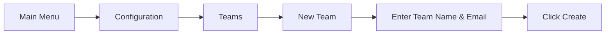

# Team Management in Grafana

## Introduction

Team management is a fundamental aspect of Grafana administration that allows you to organize users, control access to dashboards and resources, and streamline collaboration across your organization. When working with Grafana in multi-user environments, effective team management becomes crucial for maintaining security, enabling seamless cooperation, and ensuring that users have appropriate permissions to fulfill their roles.

In this guide, we'll explore how to create and manage teams in Grafana, assign members, configure team permissions, and implement best practices for team organization. By the end, you'll have a solid understanding of how to leverage Grafana's team functionality to improve your organization's monitoring and visualization workflows.

## Understanding Teams in Grafana

Teams in Grafana are groups of users who share the same dashboard and data source permissions. They provide an efficient way to manage access control and organize dashboards, especially in larger organizations where numerous users need different levels of access.

### Key Benefits of Using Teams

- **Simplified Permission Management**: Assign permissions to teams rather than individual users
- **Enhanced Collaboration**: Allow team members to share and collaborate on dashboards
- **Organizational Structure**: Mirror your company's structure within Grafana
- **Scalable Access Control**: Easily adjust permissions as your organization grows

## Creating and Managing Teams

### Creating a New Team

To create a new team in Grafana:

1. Navigate to the Grafana main menu
2. Click on **Configuration** (gear icon)
3. Select **Teams**
4. Click **New Team**
5. Enter the team name and email (used for team notifications)
6. Click **Create**



### Adding Members to a Team

Once you've created a team, you'll want to add members:

1. Navigate to the team's page
2. Click the **Add Member** button
3. Search for users by name or email
4. Select the users you want to add
5. Click **Add to team**

Here's an example of what the team member management interface looks like:

```
Team Name: Data Analytics
Email: data-analytics@example.com
Members: 5
```

### Team Member Roles

Within a team, members can have different roles:

- **Member**: Basic team membership with access to team resources
- **Admin**: Can manage team members and has advanced permissions

## Team Permissions and Access Control

### Setting Team Permissions

Teams can be granted different permission levels for various resources in Grafana:

1. **Viewers**: Can only view dashboards
2. **Editors**: Can edit dashboards but cannot manage permissions
3. **Admins**: Full control over dashboards, including permission management

To set permissions for a team:

```javascript
// API example for setting team permissions
const setTeamPermissions = async (teamId, permission, dashboardId) => {
  const response = await fetch(`/api/dashboards/id/${dashboardId}/permissions`, {
    method: 'POST',
    headers: { 'Content-Type': 'application/json' },
    body: JSON.stringify({
      items: [
        {
          teamId: teamId,
          permission: permission // 1=View, 2=Edit, 4=Admin
        }
      ]
    })
  });
  
  return response.json();
};

// Example usage
setTeamPermissions(3, 2, 17)
  .then(result => console.log('Permissions updated:', result))
  .catch(error => console.error('Error setting permissions:', error));
```

### Folder Permissions

Teams can be given access to entire folders of dashboards:

1. Navigate to the Dashboards section
2. Go to **Manage**
3. Select the folder you want to set permissions for
4. Click the **Permissions** tab
5. Add the team and set appropriate permission level

## Practical Examples

### Example 1: Setting Up Teams Based on Department Structure

Let's say your organization has the following departments:

- DevOps
- Data Analytics
- Marketing
- Executive Team

You can create teams that mirror this structure to ensure each department has access to relevant dashboards:

```javascript
// Sample structure of teams and their dashboard access
const departmentTeams = {
  devOps: {
    dashboards: ['Infrastructure', 'Kubernetes', 'Service Performance'],
    permission: 'Admin'
  },
  dataAnalytics: {
    dashboards: ['Data Processing', 'ETL Monitoring', 'Database Performance'],
    permission: 'Editor'
  },
  marketing: {
    dashboards: ['Website Analytics', 'Campaign Performance', 'User Behavior'],
    permission: 'Viewer'
  },
  executiveTeam: {
    dashboards: ['Business KPIs', 'Department Overview', 'System Health'],
    permission: 'Viewer'
  }
};
```

### Example 2: Creating a Cross-Functional Project Team

For a specific project that requires members from different departments:

1. Create a new team named "Project Falcon"
2. Add members from various departments
3. Grant access to project-specific dashboards
4. Set up targeted alerts for the team

```
Project Team: Project Falcon
Members: 8 (from DevOps, Data Analytics, and Marketing)
Dashboards: 5 project-specific dashboards
Alerts: 3 custom alerts for critical project metrics
```

## Team Synchronization with External Systems

Grafana Enterprise offers team synchronization with external authentication providers like LDAP, OAuth, or SAML:

```javascript
// Example configuration for LDAP team sync in grafana.ini
[auth.ldap]
enabled = true
config_file = /etc/grafana/ldap.toml

// Example ldap.toml team mapping
[[servers.group_mappings]]
group_dn = "cn=grafana-devops,ou=groups,dc=example,dc=com"
org_role = "Editor"
grafana_admin = false
team_ids = [1, 2]
```

This configuration maps the LDAP group "grafana-devops" to Grafana teams with IDs 1 and 2.

## Advanced Team Management

### Team Quotas

In larger organizations, you may want to set resource quotas for teams:

```
Team: Data Analytics
Quota:
  - Max Dashboards: 50
  - Max Data Sources: 10
  - API Calls/min: 100
```

### Team Preference Management

Teams can have their own preferences for:

- Default dashboard
- Home dashboard
- Theme preference
- Time zone settings

## Best Practices for Team Management

1. **Follow Organizational Structure**: Create teams that mirror your company's structure
2. **Use Descriptive Names**: Make team names clear and descriptive
3. **Document Team Purpose**: Add descriptions to teams explaining their purpose
4. **Regular Audits**: Periodically review team membership and permissions
5. **Limit Admin Access**: Restrict admin privileges to necessary personnel only
6. **Create Team Guidelines**: Establish standards for dashboard creation and naming
7. **Implement Least Privilege**: Grant only the permissions teams need to fulfill their roles

## Monitoring Team Activity

Track team activities using Grafana's audit logs:

```javascript
// Query to fetch team activity from audit logs
const teamActivity = async (teamId) => {
  const response = await fetch(`/api/audits?teamId=${teamId}`);
  return response.json();
};

// Example output
// {
//   "logs": [
//     {
//       "timestamp": "2023-10-15T09:23:15Z",
//       "action": "dashboard-created",
//       "user": "john.doe",
//       "resource": "dashboard/123"
//     },
//     {
//       "timestamp": "2023-10-15T10:45:30Z",
//       "action": "member-added",
//       "user": "admin",
//       "resource": "team/5/user/42"
//     }
//   ]
// }
```

## Summary

Team management in Grafana is a powerful feature that helps administrators organize users, control access, and enhance collaboration. By creating well-structured teams with appropriate permissions, you can ensure that users have access to the resources they need while maintaining security and organizational boundaries.

Key takeaways from this guide:
- Teams provide a scalable way to manage user permissions
- Teams can mirror your organizational structure
- Proper team management enhances collaboration and security
- Regular audits help maintain appropriate access control
- Enterprise features offer advanced team synchronization options

## Additional Resources

- Grafana Official Documentation on Teams
- Grafana API Reference for Team Management
- Access Control and Permission Best Practices

## Exercises

1. Create a team structure for a fictional company with three departments
2. Set up a folder structure with appropriate team permissions
3. Implement team-specific dashboards with relevant alerts
4. Create a team rotation schedule for monitoring responsibilities
5. Design a team synchronization strategy for an organization using LDAP