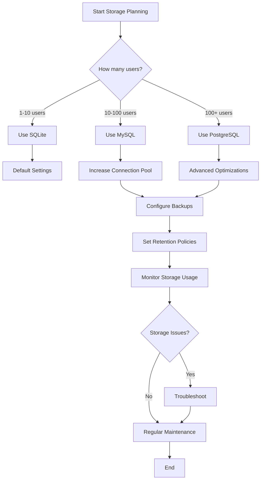

# Storage Management in Grafana

## Introduction

Storage management is a critical aspect of Grafana administration that directly impacts the performance, reliability, and scalability of your monitoring platform. As Grafana instances grow with dashboards, users, and historical data, properly managing storage becomes essential for maintaining an efficient system.

This guide will explore how Grafana handles storage, best practices for configuration, and techniques to optimize storage usage for various deployment scenarios.

## Understanding Grafana's Storage Architecture

Grafana uses several storage components to maintain its functionality:

1. **Main Database**: Stores dashboards, users, alerts, and other configuration data
2. **Query Cache**: Temporarily stores query results to improve performance
3. **Image Renderer Storage**: Stores rendered images for sharing or reporting
4. **Plugin Assets**: Stores plugin resources and configurations

### Database Options

Grafana supports multiple database backends for its main database:

- **SQLite**: Default for single-instance deployments (suitable for small installations)
- **MySQL**: For production environments requiring higher performance
- **PostgreSQL**: Enterprise-grade option with advanced features

Let's look at a basic configuration example for each option:

```ini
[database]
# SQLite configuration
type = sqlite3
path = grafana.db

# MySQL configuration
# type = mysql
# host = 127.0.0.1:3306
# name = grafana
# user = grafana
# password = password

# PostgreSQL configuration
# type = postgres
# host = localhost:5432
# name = grafana
# user = grafana
# password = password
```

## Data Retention Policies

### Query Cache Management

Grafana's query cache improves performance by storing query results temporarily. You can configure the cache in the Grafana configuration:

```ini
[query_cache]
# Cache query results for this amount of time (in seconds)
ttl = 3600
# Maximum memory size for the cache in megabytes
size_mb = 100
# Enable or disable the query cache
enabled = true
```

### Configuring Database Retention

For production environments, implementing proper data retention policies prevents database bloat:

```ini
[dashboard_history]
# Number of dashboard versions to keep
versions_to_keep = 20

[annotations]
# Delete annotations older than specified days
max_age_days = 30
```

## Optimizing Storage for Different Deployment Scales

### Small Deployments (1-10 users)

For small teams or personal use:

- SQLite is sufficient for the database
- Default cache settings work well
- Use automatic cleanup for temporary files

```ini
[temp_data]
# Path where Grafana will store temporary files, such as log file parsing results
temp_data_lifetime = 24h
```

### Medium Deployments (10-100 users)

As your Grafana instance grows:

- Switch to MySQL or PostgreSQL for better performance
- Increase cache allocation for frequently used dashboards
- Implement regular database maintenance

```ini
[database]
type = mysql
host = 127.0.0.1:3306
name = grafana
user = grafana
password = password
# Maximum database connection pool size
max_open_conn = 30
# Maximum idle connections
max_idle_conn = 10
```

### Large Deployments (100+ users)

For enterprise-scale deployments:

- Use PostgreSQL with proper indexing and optimization
- Implement database sharding if necessary
- Utilize external object storage for rendered images
- Schedule regular database maintenance

```ini
[rendering]
# Use external storage for rendered images
render_store_path = /var/lib/grafana/render
# Clean up files older than
render_cleanup_job_timeout = 24h
```

## Storage Monitoring and Maintenance

### Monitoring Grafana's Storage Usage

Monitor Grafana's own resource usage by creating a dashboard that tracks:

- Database size over time
- Query performance metrics
- Disk space utilization
- Cache hit/miss ratios

Here's an example JSON snippet you might use in a dashboard:

```json
{
  "targets": [
    {
      "expr": "sum(grafana_db_query_total)",
      "refId": "A",
      "legendFormat": "Total DB Queries"
    },
    {
      "expr": "sum(grafana_db_query_total{status=\"error\"})",
      "refId": "B",
      "legendFormat": "DB Query Errors"
    }
  ]
}
```

### Database Maintenance Tasks

Perform regular maintenance to keep your database running smoothly:

1. **Backup your database regularly**:

```bash
# For PostgreSQL
pg_dump grafana > grafana_backup.sql

# For MySQL
mysqldump -u grafana -p grafana > grafana_backup.sql
```

2. **Optimize database performance**:

```bash
# For MySQL
mysqlcheck --optimize --user=grafana --password grafana

# For PostgreSQL
VACUUM ANALYZE;
```

## Advanced Storage Configurations

### High Availability Setup

For high availability deployments, configure shared storage:

```ini
[paths]
# Path to store the grafana database (if using sqlite3)
data = /var/lib/grafana

# Directory where grafana can store temporary files
temp_data_lifetime = 24h

# Directory for logs
logs = /var/log/grafana
```

### Using Object Storage for Rendered Images

For scalable image storage:

```ini
[rendering]
# Store rendered images in S3-compatible storage
provider = s3
s3_bucket = grafana-renders
s3_region = us-east-1
s3_access_key = YOUR_ACCESS_KEY
s3_secret_key = YOUR_SECRET_KEY
```

## Troubleshooting Storage Issues

### Common Storage Problems and Solutions

Let's address some common storage-related issues:

1. **Database is growing too large**
   - Implement stricter retention policies
   - Archive old dashboards
   - Remove unused data sources

2. **Slow dashboard loading**
   - Increase query cache size
   - Optimize database queries
   - Check for slow data source queries

3. **Disk space running out**
   - Clean up temporary files
   - Rotate logs more frequently
   - Move to larger storage or implement external storage

### Diagnostic Commands

```bash
# Check database size (PostgreSQL)
SELECT pg_size_pretty(pg_database_size('grafana'));

# Check table sizes (MySQL)
SELECT table_name, table_rows, data_length, index_length,
  round(((data_length + index_length) / 1024 / 1024),2) "Size in MB"
FROM information_schema.TABLES
WHERE table_schema = "grafana"
ORDER BY (data_length + index_length) DESC;
```

## Storage Management Best Practices

Here's a flowchart showing the decision process for storage configuration:



## Summary

Effective storage management is vital for maintaining a healthy Grafana deployment. By understanding Grafana's storage architecture and implementing appropriate configurations for your scale, you can ensure optimal performance and reliability.

Key takeaways:
- Choose the appropriate database backend based on your deployment size
- Implement data retention policies to prevent database bloat
- Regularly monitor storage usage and performance
- Perform database maintenance tasks to optimize performance
- Scale your storage solution as your Grafana deployment grows

## Additional Resources

- [Grafana Database Configuration Documentation](https://grafana.com/docs/grafana/latest/administration/configuration/#database)
- [Grafana Performance Tuning](https://grafana.com/docs/grafana/latest/administration/performance-tuning/)
- [Database Backup and Recovery](https://grafana.com/docs/grafana/latest/administration/backup-and-restore/)

## Exercises

1. Configure a MySQL database for your Grafana instance and migrate data from SQLite.
2. Create a dashboard to monitor Grafana's database performance metrics.
3. Implement a backup strategy for your Grafana database and test the restore process.
4. Optimize query cache settings based on your specific usage patterns and measure the performance improvement.
5. Design a storage scaling plan for a Grafana deployment that expects to grow from 10 to 500 users over the next year.