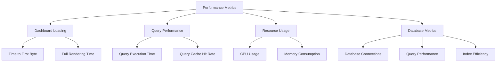
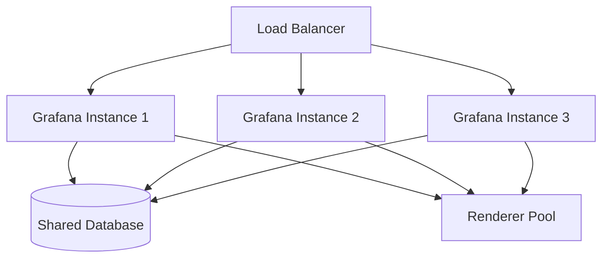

# Performance Optimization

## Introduction

Performance optimization is a critical aspect of Grafana administration that ensures your monitoring platform remains responsive, efficient, and scalable as your organization grows. This guide will walk you through various techniques and best practices to optimize Grafana's performance, covering everything from database optimization to frontend rendering improvements.

Whether you're managing a small Grafana instance or an enterprise-scale deployment, these optimization strategies will help you deliver a smooth experience to your users while minimizing resource consumption.

## Why Performance Optimization Matters

Before diving into specific techniques, let's understand why performance optimization is essential for Grafana:

- **Improved user experience**: Faster dashboard loading and query execution times lead to better user satisfaction
- **Resource efficiency**: Optimized instances require less CPU, memory, and network resources
- **Scalability**: Well-optimized Grafana deployments can handle more users and dashboards
- **Cost reduction**: Efficient resource usage translates to lower infrastructure costs
- **Reliability**: Properly tuned systems experience fewer outages and performance degradations

## Key Performance Metrics to Monitor

To effectively optimize Grafana, you need to measure its performance. Here are the key metrics to monitor:

- Dashboard loading time
- Query execution time
- CPU and memory usage
- Database performance
- Request throughput and latency
- Cache hit ratios

Let's create a monitoring dashboard for these metrics using Grafana itself:



## Database Optimization

The database is often the first bottleneck in Grafana deployments. Let's explore how to optimize it:

### 1. Database Configuration

Proper database configuration is crucial. For PostgreSQL (recommended for production), here are key parameters to tune:

```sql
-- Increase shared buffers for caching
ALTER SYSTEM SET shared_buffers = '1GB';

-- Tune work memory for complex queries
ALTER SYSTEM SET work_mem = '32MB';

-- Increase max connections for high-concurrency environments
ALTER SYSTEM SET max_connections = '200';

-- Optimize write-ahead log
ALTER SYSTEM SET wal_buffers = '16MB';

-- Apply changes
SELECT pg_reload_conf();
```

### 2. Database Maintenance

Regular maintenance prevents performance degradation over time:

```bash
# Vacuum and analyze (for PostgreSQL)
grafana-cli admin database-maintenance vacuum
grafana-cli admin database-maintenance analyze
```

### 3. Query Optimization

If you're using custom SQL queries with Grafana, ensure they're optimized:

```sql
-- Before: Inefficient query
SELECT time, value FROM metrics WHERE server = 'prod01';

-- After: Optimized with proper indexing
SELECT time, value FROM metrics 
WHERE server = 'prod01'
ORDER BY time DESC
LIMIT 1000;
```

Make sure to create appropriate indexes for commonly queried fields:

```sql
-- Create index for commonly filtered fields
CREATE INDEX idx_metrics_server ON metrics(server);
CREATE INDEX idx_metrics_time ON metrics(time);
```

## Grafana Server Configuration

Optimizing the Grafana server itself can yield significant performance improvements:

### 1. Memory and Concurrency Settings

Edit your `grafana.ini` file to adjust memory and concurrency settings:

```ini
[server]
# Increase HTTP read timeout for complex dashboards
read_timeout = 60s

# Set maximum concurrent socket connections
max_connections = 100

[dashboards]
# Reduce dashboard versions kept in the database
versions_to_keep = 10

[alerting]
# Tune alerting for performance
max_annotation_age = 1209600
max_annotations_to_keep = 5000

[unified_alerting]
# Optimize evaluation interval for alert rules
evaluation_timeout = 60s
```

### 2. Caching Configuration

Proper caching dramatically improves performance:

```ini
[caching]
# Enable in-memory caching
enabled = true

# Set cache TTL for datasource queries (in seconds)
ttl = 3600

# Memory size for caching (in bytes)
memory = 104857600

[caching.datasource]
# Enable datasource query caching
enabled = true
# TTL for datasource queries (in seconds)
ttl = 300

[caching.rendering]
# Enable rendered image caching
enabled = true
# TTL for rendered images (in seconds)
ttl = 3600
```

### 3. Rendering Optimization

If you use server-side rendering, configure it optimally:

```ini
[rendering]
# Increase rendering concurrency
concurrent_render_limit = 10

# Adjust timeout for complex visualizations
render_timeout = 60s

# Set rendering mode to clustered for horizontal scaling
mode = clustered

# Configure renderer resource limits
rendering_timezone = UTC
rendering_language = en-US
```

## Dashboard Optimization Techniques

Well-designed dashboards perform better and provide better user experience:

### 1. Query Optimization

Efficient queries are essential for dashboard performance:

```jsx
// Before: Inefficient query that retrieves all data
const query = `
  SELECT * 
  FROM metrics 
  WHERE time > now() - 24h
`;

// After: Optimized query with specific columns and aggregation
const query = `
  SELECT 
    time_bucket('5m', time) as time_interval,
    avg(value) as avg_value
  FROM metrics
  WHERE time > now() - 24h
  GROUP BY time_interval
  ORDER BY time_interval
`;
```

### 2. Time Range Handling

Adjust query resolution based on the selected time range:

```jsx
// Dynamically set interval based on time range
const getInterval = (timeRange) => {
  const hours = (timeRange.to - timeRange.from) / 3600000;
  
  if (hours <= 6) return '10s';
  if (hours <= 24) return '1m';
  if (hours <= 168) return '10m';
  return '1h';
};

const query = `
  SELECT 
    time_bucket('${getInterval(timeRange)}', time) as time_interval,
    avg(value) as avg_value
  FROM metrics
  WHERE time > $__from and time < $__to
  GROUP BY time_interval
  ORDER BY time_interval
`;
```

### 3. Panel Configuration

Optimize individual panels for performance:

- Use appropriate visualization types
- Limit the number of series per graph
- Apply data transformations on the database side when possible
- Use tooltips judiciously as they can impact performance

### 4. Dashboard Design Principles

Follow these principles for performant dashboards:

- **Minimize panels**: Each panel executes queries and consumes resources
- **Use template variables**: Allow users to filter data efficiently
- **Progressive disclosure**: Start with high-level metrics and allow drill-down
- **Avoid auto-refresh** for complex dashboards or use longer intervals
- **Implement data decimation** for time series with many data points

## Frontend Performance Optimization

Optimize frontend performance for faster dashboard loading:

### 1. Browser Rendering Optimization

Use efficient visualizations and limit DOM elements:

```jsx
// Before: Inefficient panel with too many series
<LineChart data={allSeries} />

// After: Optimized with limited series and pre-aggregation
<LineChart 
  data={topFiveSeries}
  decimationAlgorithm="lttb"
  maxDataPoints={500}
/>
```

### 2. Lazy Loading

Implement lazy loading for complex dashboards:

```jsx
// Configuration example for lazy loading panels
{
  "panels": [
    {
      "lazyLoad": true,
      "lazyLoadPriority": 2,
      "title": "Complex Metrics",
      "datasource": "prometheus"
    }
  ]
}
```

## Load Balancing and High Availability

For larger deployments, implement load balancing and high availability:



### Configuration Example:

```yaml
# docker-compose.yml for HA Grafana setup
version: '3'
services:
  grafana-1:
    image: grafana/grafana:latest
    environment:
      - GF_SERVER_ROOT_URL=https://grafana.example.com
      - GF_DATABASE_TYPE=postgres
      - GF_DATABASE_HOST=db
      - GF_DATABASE_NAME=grafana
      - GF_DATABASE_USER=grafana
      - GF_DATABASE_PASSWORD=password

  grafana-2:
    image: grafana/grafana:latest
    environment:
      - GF_SERVER_ROOT_URL=https://grafana.example.com
      - GF_DATABASE_TYPE=postgres
      - GF_DATABASE_HOST=db
      - GF_DATABASE_NAME=grafana
      - GF_DATABASE_USER=grafana
      - GF_DATABASE_PASSWORD=password

  db:
    image: postgres:13
    environment:
      - POSTGRES_USER=grafana
      - POSTGRES_PASSWORD=password
      - POSTGRES_DB=grafana
    volumes:
      - postgres-data:/var/lib/postgresql/data

  nginx:
    image: nginx:latest
    ports:
      - "80:80"
      - "443:443"
    volumes:
      - ./nginx.conf:/etc/nginx/nginx.conf
      - ./ssl:/etc/nginx/ssl

volumes:
  postgres-data:
```

## Performance Testing and Benchmarking

Regularly test Grafana performance to identify bottlenecks:

### 1. Load Testing

Use tools like k6 to simulate user load:

```javascript
// k6 script for load testing Grafana
import http from 'k6/http';
import { sleep } from 'k6';

export const options = {
  stages: [
    { duration: '1m', target: 10 },
    { duration: '3m', target: 50 },
    { duration: '1m', target: 0 },
  ],
};

export default function() {
  const response = http.get('https://grafana.example.com/d/dashboard-id/dashboard-name', {
    headers: {
      Authorization: 'Bearer YOUR_API_KEY',
    },
  });
  
  console.log(`Response time: ${response.timings.duration} ms`);
  sleep(3);
}
```

### 2. Performance Metrics Dashboard

Create a dashboard to monitor Grafana's performance metrics:

```jsx
// Dashboard JSON model structure
{
  "title": "Grafana Performance",
  "panels": [
    {
      "title": "Dashboard Loading Times",
      "type": "graph",
      "datasource": "prometheus",
      "targets": [
        {
          "expr": "grafana_api_dashboard_get_milliseconds",
          "format": "time_series"
        }
      ]
    },
    {
      "title": "Database Query Times",
      "type": "graph",
      "datasource": "prometheus",
      "targets": [
        {
          "expr": "grafana_database_query_seconds",
          "format": "time_series"
        }
      ]
    }
  ]
}
```

## Upgrading and Maintenance

### 1. Regular Upgrades

Stay current with Grafana versions for performance improvements:

```bash
# Backup before upgrading
grafana-cli admin database backup

# Update to latest version
apt-get update
apt-get install grafana

# Or with Docker
docker pull grafana/grafana:latest
docker-compose up -d
```

### 2. Scheduled Maintenance

Implement routine maintenance tasks:

```bash
#!/bin/bash
# Maintenance script

# Vacuum database
grafana-cli admin database-maintenance vacuum

# Clean up old sessions
grafana-cli admin database-maintenance cleanup-expired-sessions

# Analyze tables
grafana-cli admin database-maintenance analyze

# Restart service
systemctl restart grafana-server
```

## Troubleshooting Performance Issues

When encountering performance problems, follow this systematic approach:

1. **Identify bottlenecks**:
   - Check server metrics (CPU, memory, I/O)
   - Analyze database performance
   - Review dashboard query performance
   - Examine network latency

2. **Common problems and solutions**:

   | Problem | Symptoms | Solution |
   |---------|----------|----------|
   | Slow queries | Long dashboard load times | Optimize queries, add indexes |
   | Memory pressure | OOM errors, high swap usage | Increase memory allocation, optimize memory usage |
   | CPU bottlenecks | High CPU usage, slow response | Scale horizontally, optimize queries |
   | Network latency | Delayed data, timeouts | Check network configuration, use caching |
   | Database issues | Slow database operations | Vacuum, analyze, optimize database configuration |

3. **Using Grafana logs for troubleshooting**:

```bash
# Enable debug logging temporarily
sed -i 's/;level = info/level = debug/g' /etc/grafana/grafana.ini
systemctl restart grafana-server

# Analyze logs for performance issues
grep "slow query" /var/log/grafana/grafana.log
grep "rendering timeout" /var/log/grafana/grafana.log

# Return to normal logging after troubleshooting
sed -i 's/level = debug/;level = info/g' /etc/grafana/grafana.ini
systemctl restart grafana-server
```

## Real-world Case Study: Scaling Grafana for 1000+ Users

Let's examine a real-world case study of optimizing Grafana for an enterprise environment:

### Initial State
- Single Grafana instance
- 200+ dashboards
- PostgreSQL database
- 5-15 second dashboard load times
- Frequent timeouts during peak hours

### Optimization Steps

1. **Database Optimization**:
   - Moved to a dedicated PostgreSQL server
   - Implemented connection pooling
   - Optimized database parameters for query performance
   - Regular maintenance schedule

2. **Horizontal Scaling**:
   - Deployed 3 Grafana instances behind a load balancer
   - Implemented shared storage for plugins and provisioning

3. **Query Optimization**:
   - Audited and optimized all dashboard queries
   - Implemented caching for frequently accessed data
   - Applied appropriate time aggregations

4. **Frontend Optimization**:
   - Reduced panel count on complex dashboards
   - Implemented progressive loading
   - Used efficient visualization types

### Results
- Dashboard load times reduced to 1-3 seconds
- 99.9% availability even during peak times
- Support for 1000+ concurrent users
- Reduced infrastructure costs through efficient resource utilization

## Summary

Optimizing Grafana performance is a multi-faceted process that involves:

1. **Database optimization** - Properly configuring and maintaining your database
2. **Server configuration** - Tuning Grafana server parameters for your environment
3. **Dashboard optimization** - Creating efficient dashboards with optimized queries
4. **Frontend performance** - Improving rendering and user experience
5. **Load balancing** - Implementing HA solutions for larger deployments
6. **Regular maintenance** - Establishing routine maintenance procedures

By applying these optimization techniques, you can ensure your Grafana deployment remains performant, reliable, and scalable as your monitoring needs grow.

## Additional Resources

- [Grafana Performance Best Practices](https://grafana.com/docs/grafana/latest/setup-grafana/set-up-for-high-availability/)
- [Database Optimization Guide](https://grafana.com/docs/grafana/latest/setup-grafana/configure-grafana/database/)
- [Grafana Provisioning](https://grafana.com/docs/grafana/latest/administration/provisioning/)
- [Grafana CLI Reference](https://grafana.com/docs/grafana/latest/cli/)

## Exercises

1. **Performance Audit**: Analyze your current Grafana deployment and identify three potential performance bottlenecks.

2. **Query Optimization**: Take a slow dashboard query and optimize it to improve performance.

3. **Load Testing**: Create a basic load test to measure your Grafana instance's performance under stress.

4. **Monitoring Dashboard**: Create a dashboard to monitor the performance metrics of your Grafana instance.

5. **High Availability Setup**: Design a high-availability Grafana deployment for an organization with 500+ users.