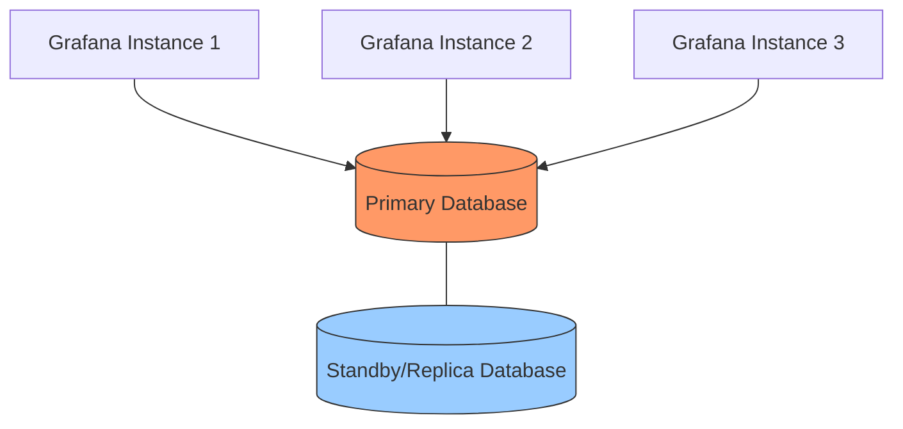
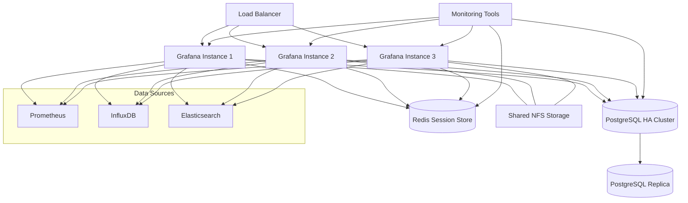

# High Availability in Grafana Administration

## Introduction

High Availability (HA) is a critical concept in modern infrastructure design that ensures your monitoring and visualization systems remain operational even when individual components fail. For Grafana administrators, implementing high availability is essential for organizations that rely on Grafana dashboards for real-time decision making and operational awareness.

In this guide, we'll explore how to design, implement, and maintain a highly available Grafana infrastructure. Whether you're running Grafana in a small team or across a large enterprise, these concepts will help you minimize downtime and ensure your visualization platform remains accessible when it matters most.

## What is High Availability?

High Availability refers to a system design approach that ensures a predefined level of operational performance, usually uptime, for a higher than normal period. The goal of high availability is to eliminate single points of failure in your infrastructure.

For Grafana, high availability typically means:

- **Continuous service operation**: Ensuring Grafana services remain available during hardware failures, network issues, or maintenance windows
- **Data redundancy**: Preventing data loss even when individual components fail
- **Load distribution**: Balancing user requests across multiple Grafana instances
- **Automatic failover**: Seamlessly transitioning to operational resources when failures occur

## Key Components of Grafana High Availability

### Database Backend

Grafana stores various configuration data, user information, and dashboard definitions in its database. For high availability, you need to configure a robust database backend:



#### PostgreSQL as HA Database

PostgreSQL is the recommended database for production Grafana deployments. Here's how to configure it for high availability:

```bash
# Edit grafana.ini on each Grafana instance
[database]
type = postgres
host = postgres.example.com:5432
name = grafana
user = grafana_user
password = your_secure_password
ssl_mode = require
```

### Stateless Grafana Instances

Configuring multiple Grafana instances that share the same database makes your setup more resilient:

```bash
# Sample configuration for Grafana instances (grafana.ini)
[paths]
data = /var/lib/grafana
logs = /var/log/grafana
plugins = /var/lib/grafana/plugins

[server]
protocol = http
http_port = 3000
domain = grafana.example.com
```

### Load Balancing

A load balancer distributes traffic across your Grafana instances:

```nginx
# Example Nginx load balancer configuration
upstream grafana {
    server grafana01:3000 max_fails=3 fail_timeout=30s;
    server grafana02:3000 max_fails=3 fail_timeout=30s;
    server grafana03:3000 max_fails=3 fail_timeout=30s;
}

server {
    listen 80;
    server_name grafana.example.com;
    
    location / {
        proxy_pass http://grafana;
        proxy_http_version 1.1;
        proxy_set_header Upgrade $http_upgrade;
        proxy_set_header Connection 'upgrade';
        proxy_set_header Host $host;
        proxy_cache_bypass $http_upgrade;
    }
}
```

## Setting Up Grafana for High Availability

Let's walk through a step-by-step process to set up a highly available Grafana infrastructure:

### Step 1: Configure Shared Storage

For plugins, provisioning files, and other shared resources:

```bash
# Install and configure NFS on your servers
sudo apt update
sudo apt install nfs-kernel-server

# On the NFS server
sudo mkdir -p /export/grafana/plugins
sudo chown -R nobody:nogroup /export/grafana/plugins
echo "/export/grafana/plugins *(rw,sync,no_subtree_check)" | sudo tee -a /etc/exports
sudo exportfs -a
sudo systemctl restart nfs-kernel-server

# On Grafana servers
sudo apt install nfs-common
sudo mkdir -p /var/lib/grafana/plugins
echo "nfs-server:/export/grafana/plugins /var/lib/grafana/plugins nfs defaults 0 0" | sudo tee -a /etc/fstab
sudo mount -a
```

### Step 2: Configure the Database

Use PostgreSQL with replication:

```bash
# On primary database server
# Enable WAL (Write-Ahead Logging) in postgresql.conf
wal_level = replica
max_wal_senders = 10
wal_keep_segments = 64

# Create replication user
CREATE ROLE replication WITH REPLICATION PASSWORD 'secure_password' LOGIN;

# Configure pg_hba.conf to allow replication connections
host replication replication 192.168.1.0/24 md5
```

### Step 3: Configure Grafana Instances

Each Grafana instance should have identical configuration:

```bash
# grafana.ini configuration for HA
[server]
protocol = http
http_port = 3000
domain = grafana.example.com
root_url = %(protocol)s://%(domain)s/

[database]
type = postgres
host = postgres-ha.example.com:5432
name = grafana
user = grafana
password = secure_password
ssl_mode = require

[auth]
# Use centralized auth for consistency across instances
login_cookie_name = grafana_session
login_maximum_inactive_lifetime_days = 7
login_maximum_lifetime_days = 30

[session]
# Use Redis for session storage
provider = redis
provider_config = addr=redis.example.com:6379,db=0,pool_size=100,password=redis_password
```

### Step 4: Set Up Load Balancing

Use a tool like HAProxy, Nginx, or a cloud load balancer:

```bash
# HAProxy configuration example
global
    log /dev/log local0
    log /dev/log local1 notice
    maxconn 4096
    user haproxy
    group haproxy
    daemon

defaults
    log global
    mode http
    option httplog
    option dontlognull
    timeout connect 5000
    timeout client 50000
    timeout server 50000

frontend http_front
    bind *:80
    stats uri /haproxy?stats
    default_backend grafana_backend

backend grafana_backend
    balance roundrobin
    option httpchk GET /api/health
    http-check expect status 200
    server grafana1 grafana1:3000 check
    server grafana2 grafana2:3000 check
    server grafana3 grafana3:3000 check
```

## Managing Plugins in a HA Environment

In a high availability setup, plugins must be consistent across all Grafana instances:

```bash
# Script to install plugins across all instances (provisioning)
#!/bin/bash
PLUGIN_LIST="grafana-piechart-panel grafana-worldmap-panel grafana-clock-panel"

# Install to shared plugin directory
for PLUGIN in $PLUGIN_LIST; do
    grafana-cli --pluginsDir "/var/lib/grafana/plugins" plugins install $PLUGIN
done

# Restart all Grafana instances
# (In production, you would do this one at a time to maintain availability)
for SERVER in grafana1 grafana2 grafana3; do
    ssh $SERVER "sudo systemctl restart grafana-server"
done
```

## Monitoring Your HA Grafana Setup

It's crucial to monitor your monitoring system! Here's how to set up basic health checks:

```bash
# Check API health endpoint
curl -s http://grafana.example.com/api/health | jq

# Expected output:
# {
#   "commit": "d99efdb",
#   "database": "ok",
#   "version": "9.3.1"
# }
```

Create a monitoring dashboard in Grafana itself to track the health of your Grafana instances:

```javascript
// Prometheus query to monitor Grafana health
// Add this to your Prometheus scrape configuration
scrape_configs:
  - job_name: 'grafana'
    metrics_path: /metrics
    static_configs:
      - targets: ['grafana1:3000', 'grafana2:3000', 'grafana3:3000']
```

## Real-World High Availability Architecture

Here's a complete high availability architecture that you might deploy in a production environment:



## Disaster Recovery Considerations

Even with high availability, you need backup and recovery procedures:

```bash
# Backup script for Grafana database and configuration
#!/bin/bash
DATE=$(date +%Y-%m-%d)
BACKUP_DIR="/backup/grafana"

# Backup PostgreSQL database
pg_dump -U grafana_user grafana > "$BACKUP_DIR/grafana-db-$DATE.sql"

# Backup configuration
tar -czf "$BACKUP_DIR/grafana-config-$DATE.tar.gz" /etc/grafana

# Backup plugins directory
tar -czf "$BACKUP_DIR/grafana-plugins-$DATE.tar.gz" /var/lib/grafana/plugins

# Rotate backups - keep last 14 days
find $BACKUP_DIR -name "grafana-*" -type f -mtime +14 -delete
```

## Troubleshooting Common HA Issues

### Inconsistent Dashboard States

If dashboards appear differently across instances:

```bash
# Check database connectivity from all instances
for SERVER in grafana1 grafana2 grafana3; do
    echo "Testing $SERVER database connection:"
    ssh $SERVER "sudo -u grafana psql -h postgres-ha.example.com -U grafana -c 'SELECT now();'"
done
```

### Session Management Problems

If users get logged out frequently:

```bash
# Test Redis connectivity
redis-cli -h redis.example.com -a redis_password ping

# Check Redis session keys
redis-cli -h redis.example.com -a redis_password keys "grafana:session:*" | wc -l
```

## Summary

Implementing high availability for Grafana ensures that your monitoring and visualization platform remains operational even during component failures. By following the principles and configurations outlined in this guide, you can create a robust Grafana infrastructure that provides continuous service to your organization.

Key takeaways:
- Use a reliable, replicated database backend like PostgreSQL
- Deploy multiple Grafana instances with identical configurations
- Implement load balancing to distribute user traffic
- Set up shared storage for plugins and other resources
- Monitor your Grafana infrastructure regularly
- Create and test backup and disaster recovery procedures

## Additional Resources and Exercises

### Exercises

1. **Basic HA Setup**: Deploy a two-node Grafana HA setup with PostgreSQL and a simple Nginx load balancer.
2. **Failover Testing**: Simulate failure of a Grafana instance and observe the behavior of your HA setup.
3. **Database Failover**: Practice a database failover scenario and ensure Grafana continues to operate.
4. **Capacity Planning**: Calculate the number of Grafana instances needed based on your organization's usage patterns and traffic.

### Further Reading

- Official Grafana documentation on high availability setups
- PostgreSQL replication strategies
- Load balancer configuration best practices
- Monitoring system architecture design patterns
- Database backup and recovery procedures