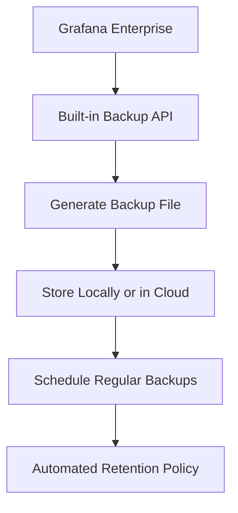

# Backup and Restore in Grafana

## Introduction

Backing up and restoring your Grafana instance is a critical administrative task that helps prevent data loss and ensures business continuity. Like any production system, Grafana contains valuable data including dashboards, data sources, users, and configurations that need to be protected. This guide will walk you through the various methods to backup and restore your Grafana deployment, ensuring you can recover quickly from any unexpected issues.

## Why Backup Grafana?

Before diving into the technical details, let's understand why backups are essential:

- **Disaster Recovery**: Recover from hardware failures, corruption, or accidental deletions
- **Migration**: Safely move your Grafana instance to a new server or environment
- **Version Upgrades**: Create safety nets before upgrading to new Grafana versions
- **Compliance**: Meet organizational data retention and protection requirements

## What Needs to Be Backed Up

A complete Grafana backup includes:

1. **Database**: Where Grafana stores dashboards, users, alerts, and configurations
2. **Configuration Files**: Your `grafana.ini` and other custom configuration files
3. **Plugins**: Any installed plugins and their configurations
4. **Data Directory**: For file-based storage of provisioning, SSL certificates, etc.

## Backup Methods

### Database Backup

The most critical component to back up is your Grafana database. Grafana supports several database backends, and the backup process differs for each.

#### SQLite (Default)

If you're using the default SQLite database, you need to back up the `grafana.db` file:

```bash
# Stop Grafana service first
sudo systemctl stop grafana-server

# Backup the database file
sudo cp /var/lib/grafana/grafana.db /backup/grafana.db.$(date +%Y%m%d)

# Restart Grafana
sudo systemctl start grafana-server
```

#### MySQL Backup

For MySQL database:

```bash
# Create a MySQL dump
mysqldump -u grafana -p grafana > grafana_db_backup_$(date +%Y%m%d).sql
```

#### PostgreSQL Backup

For PostgreSQL database:

```bash
# Create a PostgreSQL dump
pg_dump -U grafana grafana > grafana_db_backup_$(date +%Y%m%d).sql
```

### Configuration Backup

Back up your configuration files to preserve your customizations:

```bash
# Create a backup of the configuration directory
sudo cp -r /etc/grafana /backup/grafana_config_$(date +%Y%m%d)
```

### Data Directory Backup

The data directory contains provisioning configurations, plugins, and other important files:

```bash
# Backup the data directory
sudo cp -r /var/lib/grafana /backup/grafana_data_$(date +%Y%m%d)
```

## Automated Backup Script

Here's a comprehensive backup script that handles all components:

```bash
#!/bin/bash

# Set variables
BACKUP_DIR="/path/to/backup/directory"
DATE=$(date +%Y%m%d)
DB_TYPE="sqlite" # Change to "mysql" or "postgres" if needed

# Create backup directory
mkdir -p "$BACKUP_DIR/$DATE"

# Stop Grafana
systemctl stop grafana-server

# Backup configuration
cp -r /etc/grafana "$BACKUP_DIR/$DATE/config"

# Backup data directory
cp -r /var/lib/grafana "$BACKUP_DIR/$DATE/data"

# Database backup
if [ "$DB_TYPE" = "sqlite" ]; then
  # SQLite backup
  cp /var/lib/grafana/grafana.db "$BACKUP_DIR/$DATE/grafana.db"
elif [ "$DB_TYPE" = "mysql" ]; then
  # MySQL backup (adjust credentials as needed)
  mysqldump -u grafana -p grafana > "$BACKUP_DIR/$DATE/grafana.sql"
elif [ "$DB_TYPE" = "postgres" ]; then
  # PostgreSQL backup (adjust credentials as needed)
  pg_dump -U grafana grafana > "$BACKUP_DIR/$DATE/grafana.sql"
fi

# Start Grafana
systemctl start grafana-server

echo "Grafana backup completed successfully to $BACKUP_DIR/$DATE"
```

## Scheduling Regular Backups

Use cron to schedule regular backups:

```bash
# Edit crontab
crontab -e

# Add a line to run the backup script every day at 2 AM
0 2 * * * /path/to/backup_script.sh
```

## Grafana Enterprise Backup Integration

Grafana Enterprise offers built-in backup features that simplify the process:



This feature allows you to:
- Create backups through the UI or API
- Schedule automated backups
- Define retention policies
- Store backups in cloud storage

## Restoring Grafana

### Database Restore

#### SQLite Restore

```bash
# Stop Grafana service
sudo systemctl stop grafana-server

# Restore the database file
sudo cp /backup/grafana.db.20230515 /var/lib/grafana/grafana.db

# Set proper permissions
sudo chown grafana:grafana /var/lib/grafana/grafana.db

# Restart Grafana
sudo systemctl start grafana-server
```

#### MySQL Restore

```bash
# Restore from MySQL dump
mysql -u grafana -p grafana < grafana_db_backup_20230515.sql
```

#### PostgreSQL Restore

```bash
# Restore from PostgreSQL dump
psql -U grafana -d grafana -f grafana_db_backup_20230515.sql
```

### Configuration Restore

```bash
# Stop Grafana
sudo systemctl stop grafana-server

# Restore configuration files
sudo cp -r /backup/grafana_config_20230515/* /etc/grafana/

# Start Grafana
sudo systemctl start grafana-server
```

### Full System Restore

To perform a complete restore:

```bash
# Stop Grafana
sudo systemctl stop grafana-server

# Restore configuration
sudo cp -r /backup/20230515/config/* /etc/grafana/

# Restore data directory (excluding the database file if using SQLite)
sudo cp -r /backup/20230515/data/* /var/lib/grafana/
# If using SQLite, restore the database separately
sudo cp /backup/20230515/grafana.db /var/lib/grafana/

# Set proper permissions
sudo chown -R grafana:grafana /var/lib/grafana
sudo chown -R grafana:grafana /etc/grafana

# Start Grafana
sudo systemctl start grafana-server
```

## Best Practices for Grafana Backup and Restore

1. **Regular Backups**: Schedule automatic backups to run regularly
2. **Verify Backups**: Periodically verify that your backups can be successfully restored
3. **Multiple Locations**: Store backups in multiple locations (on-site and off-site)
4. **Retention Policy**: Implement a retention policy to manage backup storage
5. **Documentation**: Document your backup and restore procedures
6. **Version Control**: Keep configuration files in version control for additional safety

## Backup and Restore Considerations for Different Deployments

### Dockerized Grafana

For Grafana running in Docker, you need to back up volumes:

```bash
# Backup Docker volumes
docker run --rm -v grafana-data:/data -v $(pwd):/backup alpine tar -czf /backup/grafana-data.tar.gz -C /data ./
```

Restore Docker volumes:

```bash
# Restore Docker volumes
docker run --rm -v grafana-data:/data -v $(pwd):/backup alpine sh -c "cd /data && tar -xzf /backup/grafana-data.tar.gz"
```

### Kubernetes Deployments

For Kubernetes deployments, consider using tools like Velero or volume snapshots:

```bash
# Using Velero to backup Grafana namespace
velero backup create grafana-backup --include-namespaces grafana
```

## Grafana Cloud Considerations

If you're using Grafana Cloud, backups are handled by Grafana Labs, but you should still consider:

1. Exporting dashboards as JSON files regularly
2. Backing up data source configurations
3. Documenting alert rules and other configurations

## Disaster Recovery Testing

A crucial part of any backup strategy is testing your ability to recover:

1. Set up a test environment
2. Restore backups to this environment
3. Verify functionality and data integrity
4. Document and address any issues

## Summary

Proper backup and restore procedures are essential for maintaining a reliable Grafana deployment. By following the approaches outlined in this guide, you can ensure that your valuable dashboards, configurations, and data sources remain protected against unexpected events.

Remember that the most important aspects of a good backup strategy are:
- Regular, automated backups
- Secure storage in multiple locations
- Periodic verification of restore procedures
- Clear documentation of the entire process

## Additional Resources

- [Grafana Documentation on Backup and Restore](https://grafana.com/docs/)
- [Database-specific backup guides](https://grafana.com/docs/grafana/latest/)
- [Grafana Enterprise Backup and Restore features](https://grafana.com/docs/grafana/latest/enterprise/)

## Practice Exercises

1. Set up an automated daily backup of your Grafana installation
2. Create a test environment and practice restoring from a backup
3. Document the backup and restore procedure specific to your environment
4. Implement a retention policy for your backups
5. Create a disaster recovery plan that includes Grafana restoration steps