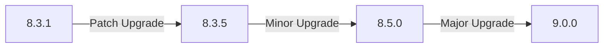
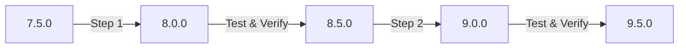

# Upgrade Procedures

## Introduction

Keeping your Grafana installation up-to-date is a critical aspect of administration that ensures you have access to the latest features, security patches, and performance improvements. However, upgrading a production system requires careful planning and execution to minimize downtime and prevent data loss.

This guide covers the fundamentals of Grafana upgrade procedures, including preparation steps, backup strategies, the actual upgrade process across different deployment methods, and post-upgrade verification. Whether you're running Grafana on a single server or managing a distributed deployment, understanding proper upgrade procedures will help ensure a smooth transition between versions.

## Understanding Grafana's Versioning System

Before diving into upgrade procedures, it's important to understand how Grafana's versioning works:

Grafana follows a **semantic versioning** scheme with version numbers formatted as **X.Y.Z**:

- **X** represents major versions with breaking changes
- **Y** represents minor versions with new features (backward compatible)
- **Z** represents patch versions with bug fixes only

For example, upgrading from Grafana 8.3.1 to 8.3.5 is a patch upgrade, while upgrading from 8.3.5 to 8.5.0 is a minor upgrade, and upgrading from 8.5.0 to 9.0.0 is a major upgrade.



## Pre-Upgrade Checklist

### 1. Read Release Notes

Before any upgrade, carefully review the release notes for all versions between your current version and the target version.

```bash
# Current version
grafana-cli -v
# Output: Grafana CLI version 8.3.1
```

Pay special attention to:
- Breaking changes
- Deprecated features
- New requirements
- Migration steps

### 2. Check System Requirements

Verify that your system meets the requirements for the new version:

```bash
# Check available memory
free -h

# Check available disk space
df -h

# Check CPU information
lscpu
```

### 3. Create a Complete Backup

Always back up your Grafana data before upgrading:

```bash
# Stop Grafana service
sudo systemctl stop grafana-server

# Back up the Grafana database
# For SQLite (default)
cp /var/lib/grafana/grafana.db /var/lib/grafana/grafana.db.backup

# For PostgreSQL
pg_dump -U grafana grafana > grafana_backup.sql

# Back up configuration files
cp /etc/grafana/grafana.ini /etc/grafana/grafana.ini.backup

# Back up custom plugins
cp -r /var/lib/grafana/plugins/ /var/lib/grafana/plugins.backup/

# Start Grafana service again
sudo systemctl start grafana-server
```

### 4. Create a Rollback Plan

Document the steps needed to revert to the previous version if issues arise:

```bash
# Example rollback steps for a package-based installation
sudo systemctl stop grafana-server
sudo apt-get install --reinstall grafana=8.3.1
cp /var/lib/grafana/grafana.db.backup /var/lib/grafana/grafana.db
cp /etc/grafana/grafana.ini.backup /etc/grafana/grafana.ini
sudo systemctl start grafana-server
```

## Upgrade Methods

### Binary Package Upgrades (Debian/Ubuntu)

```bash
# Update your package lists
sudo apt-get update

# Upgrade Grafana
sudo apt-get install grafana

# Restart Grafana
sudo systemctl restart grafana-server
```

### Binary Package Upgrades (Red Hat/CentOS)

```bash
# Upgrade Grafana
sudo yum update grafana

# Restart Grafana
sudo systemctl restart grafana-server
```

### Docker Container Upgrades

```bash
# Pull the new image
docker pull grafana/grafana:latest

# Stop the current container
docker stop grafana

# Remove the current container
docker rm grafana

# Start a new container with the same volume mounts
docker run -d -p 3000:3000 \
    --name=grafana \
    -v grafana-storage:/var/lib/grafana \
    -v grafana-config:/etc/grafana \
    grafana/grafana:latest
```

### Upgrading with Grafana CLI

For standalone binary installations:

```bash
# Update Grafana CLI
grafana-cli update-cli

# Upgrade Grafana
grafana-cli upgrade
```

### Kubernetes Deployment Upgrades

```yaml
# Update the Grafana version in your Helm values.yaml
image:
  repository: grafana/grafana
  tag: 9.0.0  # Update this to your target version
```

Then apply the update:

```bash
helm upgrade grafana grafana/grafana -f values.yaml
```

## Progressive Upgrade Strategy for Major Versions

When upgrading across multiple major versions (e.g., from 7.x to 9.x), it's safer to upgrade incrementally:



This approach helps isolate issues that might arise during the upgrade process.

## Post-Upgrade Verification

After upgrading, perform these verification steps:

### 1. Check Grafana Status

```bash
# Check service status
sudo systemctl status grafana-server

# Check logs for errors
sudo journalctl -u grafana-server -e
```

### 2. Verify Database Migration

Check the logs for any database migration errors:

```bash
grep "migrated" /var/log/grafana/grafana.log
```

### 3. Verify Dashboards and Plugins

- Log in to the Grafana UI
- Check that all dashboards load correctly
- Verify that plugins are working as expected
- Test alerts and notifications

### 4. Check API Functionality

Test the Grafana API to ensure it's functioning properly:

```bash
# Get Grafana health status
curl http://localhost:3000/api/health
# Expected output: {"commit":"...","database":"ok","version":"9.0.0"}
```

## Troubleshooting Common Upgrade Issues

### Database Migration Failures

If database migration fails:

```bash
# Check detailed error logs
grep "failed" /var/log/grafana/grafana.log

# Restore from backup
cp /var/lib/grafana/grafana.db.backup /var/lib/grafana/grafana.db
```

### Plugin Compatibility Issues

If plugins stop working after upgrade:

```bash
# Reinstall or update plugins
grafana-cli plugins update-all

# For specific plugin issues
grafana-cli plugins install <plugin-id> --pluginUrl <url>
```

### Configuration Parameter Changes

If new configuration options are needed:

```bash
# Compare with default configuration
diff /etc/grafana/grafana.ini /etc/grafana/grafana.defaults.ini

# Update specific parameters
sudo nano /etc/grafana/grafana.ini
```

## Best Practices for Upgrade Management

1. **Maintain a test environment**: Test upgrades in a non-production environment first
2. **Schedule maintenance windows**: Perform upgrades during low-traffic periods
3. **Follow the N-1 strategy**: Stay at most one major version behind the latest
4. **Document everything**: Keep detailed records of each upgrade
5. **Automate where possible**: Create scripts for consistent upgrade procedures

## Special Considerations for Enterprise Deployments

### High Availability Setups

For HA clusters, use a rolling upgrade strategy:

1. Upgrade one node at a time
2. Verify functionality before moving to the next node
3. Keep at least one node available during the upgrade

### Upgrading with External Databases

When using PostgreSQL or MySQL:

```bash
# Back up external database first
pg_dump -U grafana grafana > grafana_backup.sql

# Proceed with Grafana binary upgrade
sudo apt-get update && sudo apt-get install grafana

# Database migrations will run automatically on startup
sudo systemctl restart grafana-server
```

## Summary

Upgrading Grafana is a critical administrative task that requires careful planning and execution. By following the procedures outlined in this guide—preparing thoroughly, creating reliable backups, choosing the appropriate upgrade method, and verifying your installation afterward—you can minimize risks and ensure a smooth upgrade process.

Remember these key points:
- Always back up your data before upgrading
- Read the release notes carefully
- Take a progressive approach for major version upgrades
- Thoroughly test after each upgrade
- Maintain a rollback plan

## Additional Resources

- **Grafana Documentation**: Keep the [official upgrade guides](https://grafana.com/docs/grafana/latest/upgrade-guide/) handy for version-specific details
- **Community Forums**: The Grafana community forum is an excellent place to find solutions to common upgrade issues
- **Grafana Labs Blog**: Often contains detailed guides for major version upgrades

## Exercises

1. Set up a test Grafana environment and practice upgrading from one version to another
2. Create a comprehensive backup script that can be run before upgrades
3. Develop a checklist tailored to your specific Grafana deployment
4. Document the differences between two consecutive Grafana versions by reading the release notes
5. Practice a rollback procedure to ensure you can recover if an upgrade fails