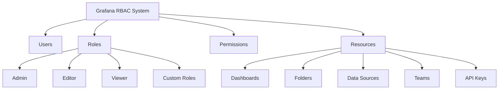

# Role-Based Access Control

## Introduction

Role-Based Access Control (RBAC) is a security approach that restricts system access based on the roles of individual users within an organization. In Grafana, RBAC provides fine-grained access management, allowing administrators to control who can view, edit, or manage dashboards, data sources, and other resources.

By implementing RBAC properly in Grafana, you can ensure that users have access only to the resources they need, following the principle of least privilege. This enhances security and prevents unauthorized access to sensitive monitoring data.

## Understanding RBAC Concepts

Before diving into implementation, let's understand the core concepts of RBAC in Grafana:

### Basic RBAC Components

- **Users**: Individual accounts that access Grafana
- **Roles**: Collections of permissions that define what actions can be performed
- **Permissions**: Specific actions that can be allowed or denied
- **Resources**: Objects in Grafana that permissions apply to (dashboards, folders, data sources, etc.)

### Built-in Roles

Grafana comes with several predefined roles:

- **Admin**: Full access to all resources
- **Editor**: Can create and modify dashboards but cannot manage users or organizations
- **Viewer**: Can only view dashboards without making changes



## Enabling RBAC in Grafana

RBAC is available in Grafana Enterprise and in open-source Grafana starting from version 9.0. To enable RBAC:

1. Edit your Grafana configuration file (`grafana.ini`):

```ini
[rbac]
enabled = true
```

2. Restart your Grafana server for changes to take effect:

```bash
sudo systemctl restart grafana-server
```

## Managing User Roles

### Assigning Roles via the UI

1. Navigate to **Configuration → Users**
2. Select a user from the list
3. Use the dropdown to change their organization role:


### Using the API to Manage Roles

You can also manage roles programmatically using the Grafana API:

```bash
# Get all users
curl -H "Authorization: Bearer YOUR_API_KEY" http://your-grafana-instance/api/users

# Update user role
curl -X PATCH \
  -H "Authorization: Bearer YOUR_API_KEY" \
  -H "Content-Type: application/json" \
  -d '{"role": "Editor"}' \
  http://your-grafana-instance/api/org/users/1
```

## Implementing Fine-Grained Permissions

### Folder Permissions

Folders allow you to organize dashboards and apply permissions to groups of dashboards at once:

1. Create a new folder in Grafana
2. Go to the folder settings
3. Click on "Permissions"
4. Add permissions for users or teams:

```javascript
// Example permission structure
{
  "items": [
    {
      "role": "Viewer",
      "permission": 1
    },
    {
      "teamId": 1,
      "permission": 2
    },
    {
      "userId": 2,
      "permission": 4
    }
  ]
}
```

Permission levels:
- **1**: View
- **2**: Edit
- **4**: Admin

### Dashboard Permissions

Individual dashboards can have specific permissions:

1. Go to dashboard settings
2. Select "Permissions"
3. Add role-based permissions for the dashboard

### Data Source Permissions

Restricting access to data sources:

1. Navigate to **Configuration → Data Sources**
2. Select a data source
3. Go to "Permissions" tab
4. Configure which users or teams can query the data source

## Creating Custom Roles (Enterprise Feature)

Grafana Enterprise allows creating custom roles with specific permission sets:

1. Navigate to **Configuration → Role Management**
2. Click "New role"
3. Define the role name and description
4. Assign specific permissions to the role
5. Assign the role to users or teams

```javascript
// Example custom role definition
{
  "name": "DashboardPublisher",
  "description": "Can publish dashboards but cannot modify data sources",
  "permissions": [
    {
      "action": "dashboards:create",
      "scope": "dashboards:*"
    },
    {
      "action": "dashboards:write",
      "scope": "dashboards:*"
    },
    {
      "action": "dashboards:read",
      "scope": "dashboards:*"
    }
  ]
}
```

## Practical RBAC Scenarios

### Scenario 1: Development Team Access

Let's implement RBAC for a development team that needs to:
- View all dashboards
- Edit dashboards in their development folder
- Not access production dashboards

Steps:
1. Create a "Development" team and add team members
2. Create a "Development" folder for dashboards
3. Set folder permissions:
   - Grant "Editor" role to the Development team for the Development folder
   - Grant "Viewer" role to the Development team for all other folders

### Scenario 2: External Consultant Access

For an external consultant who needs limited, temporary access:

1. Create a user account for the consultant
2. Assign "Viewer" role at the organization level
3. Create a specific folder with relevant dashboards
4. Grant the consultant "Viewer" permissions only to that folder
5. Set an expiration date for the user account or API key

### Scenario 3: Multi-Team Monitoring

For multiple teams monitoring different services:

1. Create a folder structure that mirrors your service architecture
2. Create teams corresponding to your organizational structure
3. Assign appropriate permissions to each team for their service folders
4. Create shared folders for cross-team resources with appropriate permissions

## RBAC Best Practices

1. **Follow the principle of least privilege**: Give users only the permissions they need
2. **Use teams**: Manage permissions through teams rather than individual users
3. **Document your permission model**: Maintain documentation of who has access to what
4. **Regular audits**: Periodically review user permissions and remove unnecessary access
5. **Use service accounts**: For automated systems, create dedicated service accounts with minimal permissions
6. **Implement change management**: Define a process for requesting and approving permission changes

## Troubleshooting RBAC Issues

### Common Problems and Solutions

1. **User can't access a dashboard**
   - Check organization role
   - Check folder and dashboard permissions
   - Ensure the user is a member of relevant teams

2. **Permission changes not taking effect**
   - Clear browser cache
   - Ensure the user has logged out and back in
   - Check for permission inheritance from folders

3. **API access issues**
   - Verify API key has appropriate permissions
   - Check for API key expiration
   - Ensure the correct authentication headers are used

## Summary

Role-Based Access Control in Grafana provides a powerful way to secure your monitoring environment while ensuring users have the access they need. By understanding RBAC concepts, implementing appropriate roles, and following best practices, you can build a secure and well-organized Grafana deployment that scales with your organization.

Key takeaways:
- RBAC restricts access based on user roles
- Grafana provides built-in roles and the ability to create custom roles in Enterprise
- Permissions can be applied at the organization, folder, dashboard, and data source levels
- Following best practices like least privilege helps maintain security

## Additional Resources

- [Grafana RBAC Documentation](https://grafana.com/docs/grafana/latest/administration/roles-and-permissions/)
- [Grafana Enterprise Role-Based Access Control](https://grafana.com/docs/grafana/latest/enterprise/access-control/)
- [API Authentication for Grafana](https://grafana.com/docs/grafana/latest/http_api/auth/)

## Exercises

1. Set up a Grafana instance and create three users with different roles (Admin, Editor, Viewer). Compare their access levels.

2. Create a folder structure with different permission levels and test access with various user roles.

3. Use the Grafana API to programmatically add a new user and assign them to a specific role.

4. Design an RBAC model for a hypothetical company with multiple departments requiring different levels of access to monitoring data.

5. Implement a custom role (if using Enterprise) that allows users to create and edit dashboards but not alter data sources or other system settings.