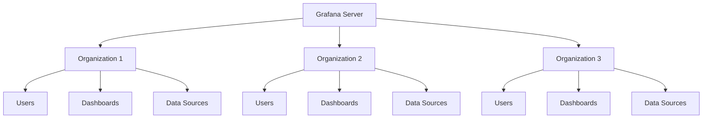
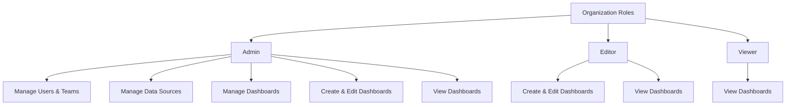

# Organization Management in Grafana

## Introduction

Organizations in Grafana provide a powerful multi-tenancy feature that allows you to separate users, dashboards, data sources, and other resources into isolated environments. This isolation is essential in enterprise environments where different teams, departments, or even external clients need their own dedicated Grafana space without affecting others.

In this guide, you'll learn how to create and manage organizations, add users to organizations, switch between them, and understand key administrative tasks related to organization management in Grafana.

## What are Organizations in Grafana?

An organization in Grafana is a tenant that provides a logical separation of resources. Each organization has:

- Its own users and teams
- Its own data sources
- Its own dashboards
- Its own alerts and notification channels
- Its own configuration settings

This multi-tenancy architecture allows a single Grafana instance to serve multiple departments, teams, or clients with complete isolation between their resources.



## Creating and Managing Organizations

### Creating a New Organization

You can create a new organization through the Grafana UI or using the HTTP API.

#### Using the Grafana UI

1. Log in as a Grafana admin user
2. Go to **Configuration** > **Organizations**
3. Click the **+ New Organization** button
4. Enter a name for the organization
5. Click **Create**

#### Using the API

You can also create an organization programmatically using the Grafana HTTP API:

```bash
curl -X POST -H "Content-Type: application/json" -H "Authorization: Bearer your-api-key" \
  http://your-grafana-instance/api/orgs \
  -d '{"name":"New Organization Name"}'
```

The response will include the ID of the newly created organization:

```json
{
  "orgId": 3,
  "message": "Organization created"
}
```

### Viewing Organizations

To view all organizations in your Grafana instance:

1. Log in as a Grafana admin user
2. Go to **Configuration** > **Organizations**

You'll see a list of all organizations along with their IDs and names.

### Updating an Organization

To update an organization's name:

#### Using the Grafana UI

1. Log in as a Grafana admin user
2. Go to **Configuration** > **Organizations**
3. Click the organization you want to edit
4. Update the name
5. Click **Update**

#### Using the API

```bash
curl -X PUT -H "Content-Type: application/json" -H "Authorization: Bearer your-api-key" \
  http://your-grafana-instance/api/orgs/3 \
  -d '{"name":"Updated Organization Name"}'
```

### Deleting an Organization

To delete an organization:

#### Using the Grafana UI

1. Log in as a Grafana admin user
2. Go to **Configuration** > **Organizations**
3. Click the red X icon next to the organization you want to delete
4. Confirm the deletion

#### Using the API

```bash
curl -X DELETE -H "Authorization: Bearer your-api-key" \
  http://your-grafana-instance/api/orgs/3
```

## User Management in Organizations

### Adding Users to an Organization

You can add users to an organization with specific roles:

#### Using the Grafana UI

1. Log in as a Grafana admin user
2. Go to **Configuration** > **Organizations**
3. Click on the organization you want to add users to
4. Go to the **Users** tab
5. Click **Add User**
6. Enter the user's email or username
7. Select a role (Admin, Editor, or Viewer)
8. Click **Add**

#### Using the API

```bash
curl -X POST -H "Content-Type: application/json" -H "Authorization: Bearer your-api-key" \
  http://your-grafana-instance/api/orgs/3/users \
  -d '{"loginOrEmail":"user@example.com","role":"Editor"}'
```

### User Roles in Organizations

Grafana has three main user roles within organizations:

1. **Organization Admin**: Can manage organization resources including users, teams, data sources, and dashboards
2. **Editor**: Can create and edit dashboards and alerts but cannot manage organization resources
3. **Viewer**: Can only view dashboards (read-only access)



### Changing User Roles

To change a user's role within an organization:

1. Log in as an organization admin
2. Go to **Configuration** > **Users**
3. Find the user in the list
4. Change their role using the dropdown menu
5. Click **Update**

### Removing Users from an Organization

To remove a user from an organization:

1. Log in as an organization admin
2. Go to **Configuration** > **Users**
3. Find the user in the list
4. Click the red X icon to remove them
5. Confirm the removal

## Switching Between Organizations

Users can belong to multiple organizations and switch between them.

### Switching Organizations in the UI

1. Click on your profile icon in the bottom-left corner
2. Select **Switch organization**
3. Choose the organization you want to switch to

### Using the API to Switch Organizations

```bash
curl -X POST -H "Content-Type: application/json" -H "Authorization: Bearer your-api-key" \
  http://your-grafana-instance/api/user/using/3
```

The response will confirm the switch:

```json
{
  "message": "Active organization changed"
}
```

## Current Organization Settings

Each organization can have its own settings for preferences like home dashboard, theme, timezone, etc.

To access organization settings:

1. Log in as an organization admin
2. Go to **Configuration** > **Preferences**
3. Adjust settings as needed
4. Click **Save**

Common organization preferences include:

- Home Dashboard
- Default timezone
- UI Theme
- Week start day

## Best Practices for Organization Management

### When to Use Multiple Organizations

Consider using multiple organizations when:

1. **Strict Isolation is Required**: Different departments need complete separation of dashboards and data sources
2. **Different Authentication Methods**: Groups need different authentication providers
3. **Client Separation**: You're providing Grafana as a service to different clients

### When to Use Teams Instead

For less strict separation within the same organization, consider using teams:

1. **Shared Data Sources**: When teams need to access the same data sources
2. **Collaborative Dashboards**: When some dashboards should be shared across teams
3. **Simplified User Management**: When users need to access resources across multiple groups

### Organization Naming Conventions

Establish a clear naming convention for organizations:

```
[Environment]-[Department/Client]-[Purpose]
```

Examples:
- `prod-marketing-analytics`
- `dev-engineering-monitoring`
- `client-acmecorp-dashboards`

### Regular Organization Audits

Perform regular audits of your organizations:

1. Review user access and roles
2. Remove unused organizations
3. Check for orphaned resources
4. Ensure proper documentation of organization purposes

## Troubleshooting Organization Issues

### Common Issues and Solutions

#### Users Can't See Their Dashboards After Switching Organizations

Solution: Ensure the user is looking at the correct organization. Check they have proper permissions in that organization.

#### Organization Admin Cannot Create Data Source

Solution: Check if the Grafana instance has disabled data source creation at the server level. Check configuration files for restrictions.

#### Organization Deletion Fails

Solution: Ensure all dashboards, data sources, and users are removed from the organization first.

## Practical Example: Setting Up Organizations for a Company

Let's walk through a practical example of setting up organizations for a medium-sized company with multiple departments.

### Scenario

You need to set up Grafana for a company with three departments:
- IT Operations
- Development
- Marketing

Each department needs its own dashboards and data sources.

### Step 1: Create Organizations

Create three organizations:

```bash
# Create IT Operations organization
curl -X POST -H "Content-Type: application/json" -H "Authorization: Bearer admin-key" \
  http://grafana.example.com/api/orgs -d '{"name":"IT Operations"}'

# Create Development organization
curl -X POST -H "Content-Type: application/json" -H "Authorization: Bearer admin-key" \
  http://grafana.example.com/api/orgs -d '{"name":"Development"}'

# Create Marketing organization
curl -X POST -H "Content-Type: application/json" -H "Authorization: Bearer admin-key" \
  http://grafana.example.com/api/orgs -d '{"name":"Marketing"}'
```

### Step 2: Add Users to Organizations

Add users to their respective organizations:

```bash
# Add users to IT Operations
curl -X POST -H "Content-Type: application/json" -H "Authorization: Bearer admin-key" \
  http://grafana.example.com/api/orgs/1/users \
  -d '{"loginOrEmail":"it.admin@example.com","role":"Admin"}'
curl -X POST -H "Content-Type: application/json" -H "Authorization: Bearer admin-key" \
  http://grafana.example.com/api/orgs/1/users \
  -d '{"loginOrEmail":"it.user@example.com","role":"Editor"}'

# Add users to Development
curl -X POST -H "Content-Type: application/json" -H "Authorization: Bearer admin-key" \
  http://grafana.example.com/api/orgs/2/users \
  -d '{"loginOrEmail":"dev.admin@example.com","role":"Admin"}'
curl -X POST -H "Content-Type: application/json" -H "Authorization: Bearer admin-key" \
  http://grafana.example.com/api/orgs/2/users \
  -d '{"loginOrEmail":"dev.user@example.com","role":"Editor"}'

# Add users to Marketing
curl -X POST -H "Content-Type: application/json" -H "Authorization: Bearer admin-key" \
  http://grafana.example.com/api/orgs/3/users \
  -d '{"loginOrEmail":"marketing.admin@example.com","role":"Admin"}'
curl -X POST -H "Content-Type: application/json" -H "Authorization: Bearer admin-key" \
  http://grafana.example.com/api/orgs/3/users \
  -d '{"loginOrEmail":"marketing.user@example.com","role":"Editor"}'
```

### Step 3: Configure Data Sources for Each Organization

Switch to each organization and configure appropriate data sources:

```bash
# Switch to IT Operations organization
curl -X POST -H "Authorization: Bearer admin-key" \
  http://grafana.example.com/api/user/using/1

# Add Prometheus data source
curl -X POST -H "Content-Type: application/json" -H "Authorization: Bearer admin-key" \
  http://grafana.example.com/api/datasources \
  -d '{
    "name": "Production Prometheus",
    "type": "prometheus",
    "url": "http://prometheus.example.com",
    "access": "proxy"
  }'
```

Repeat for each organization with appropriate data sources.

## Summary

Organization management in Grafana provides powerful multi-tenancy capabilities, allowing you to segregate users, dashboards, and data sources into isolated environments. This segregation is essential for enterprise environments with multiple teams or when offering Grafana as a service to multiple clients.

Key points to remember:
- Organizations provide complete isolation of resources
- Users can belong to multiple organizations with different roles
- Organization admins can manage users, data sources, and organization preferences
- Consider your organizational structure carefully when deciding between multiple organizations vs. teams

## Additional Resources

- [Grafana Official Documentation on Organizations](https://grafana.com/docs/grafana/latest/administration/organization-management/)
- [Grafana HTTP API Documentation](https://grafana.com/docs/grafana/latest/http_api/org/)
- [User Management Best Practices](https://grafana.com/docs/grafana/latest/administration/user-management/)

## Exercises

1. Create a new organization in your Grafana instance and add yourself as an Admin.
2. Create a second organization and add yourself as a Viewer. Practice switching between organizations.
3. Use the API to add a new user to one of your organizations.
4. Design an organization structure for a company with four departments, considering when to use separate organizations versus teams.
5. Create a script that would automatically set up three organizations with specific users and roles.