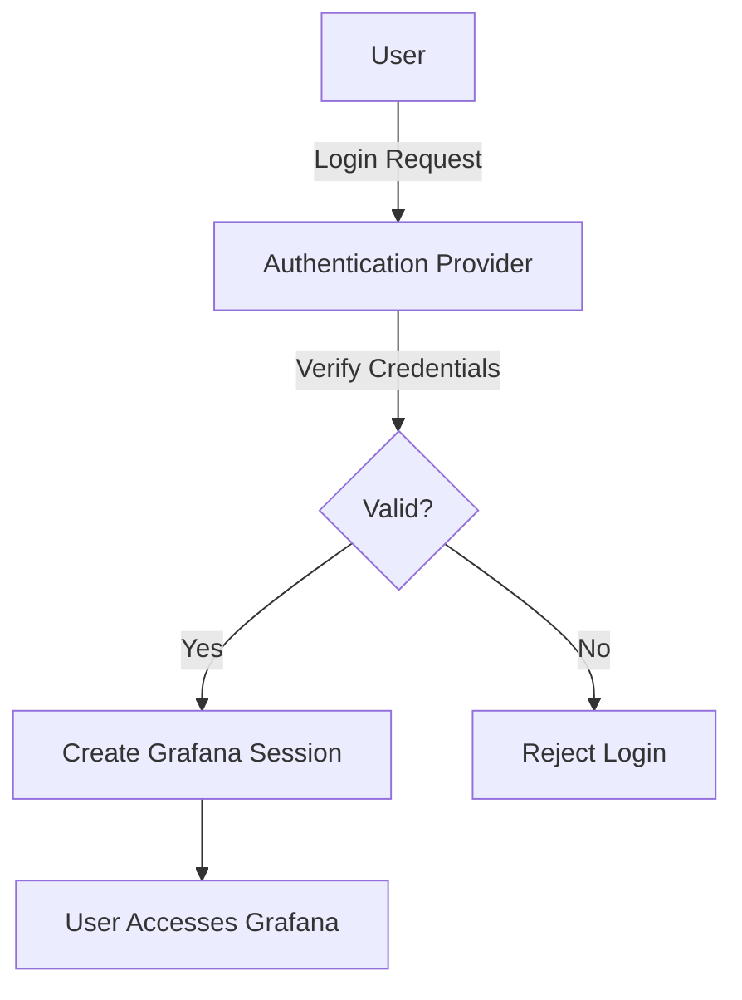

# Authentication Setup in Grafana

## Introduction

Authentication is a critical component of any application's security infrastructure, and Grafana is no exception. Proper authentication ensures that only authorized users can access your Grafana instance and its valuable dashboards and data sources. In this guide, we'll explore how to set up and configure different authentication methods in Grafana, providing you with the knowledge to implement a secure authentication system tailored to your organization's needs.

## Understanding Grafana Authentication

Before diving into specific authentication methods, it's important to understand the core concepts of Grafana's authentication system.

### Authentication vs. Authorization

- **Authentication**: Verifies the identity of a user (who you are)
- **Authorization**: Determines what a user can access (what you can do)

This guide focuses primarily on authentication, though we'll touch on how it relates to Grafana's authorization system.

### Authentication Flow



## Built-in Authentication Methods

### 1. Grafana's Internal User Database

By default, Grafana uses its own built-in user database for authentication.

#### Configuration

The default authentication is configured in the `[auth]` section of the Grafana configuration file (`grafana.ini`):

```ini
[auth]
# disable login form
disable_login_form = false

# Set to true to disable the signout link in the side menu. Useful if you use auth.proxy
disable_signout_menu = false

# URL to redirect the user to after sign out
signout_redirect_url =
```

#### User Management

To create a new user with the built-in authentication:

```bash
grafana-cli admin create-user --login=admin --password=admin --email=admin@example.com
```

### 2. Anonymous Authentication

For public dashboards, you can enable anonymous access:

```ini
[auth.anonymous]
# enable anonymous access
enabled = true

# specify organization name that should be used for anonymous user
org_name = Main Org.

# specify role for anonymous users
org_role = Viewer
```

## External Authentication Methods

### 1. LDAP/Active Directory

LDAP is commonly used in enterprise environments for centralized authentication.

#### Configuration Example

First, enable LDAP in `grafana.ini`:

```ini
[auth.ldap]
enabled = true
config_file = /etc/grafana/ldap.toml
allow_sign_up = true
```

Then, configure the LDAP settings in `ldap.toml`:

```toml
[[servers]]
host = "ldap.example.com"
port = 389
use_ssl = false
bind_dn = "cn=admin,dc=example,dc=com"
bind_password = "admin_password"
search_filter = "(cn=%s)"
search_base_dns = ["dc=example,dc=com"]

[servers.attributes]
name = "givenName"
surname = "sn"
username = "cn"
member_of = "memberOf"
email = "email"

[[servers.group_mappings]]
group_dn = "cn=grafana_admins,dc=example,dc=com"
org_role = "Admin"

[[servers.group_mappings]]
group_dn = "cn=grafana_editors,dc=example,dc=com"
org_role = "Editor"
```

### 2. OAuth Integration

Grafana supports various OAuth providers like Google, GitHub, and custom OAuth2 servers.

#### Google OAuth Example

In `grafana.ini`:

```ini
[auth.google]
enabled = true
client_id = YOUR_GOOGLE_CLIENT_ID
client_secret = YOUR_GOOGLE_CLIENT_SECRET
scopes = https://www.googleapis.com/auth/userinfo.profile https://www.googleapis.com/auth/userinfo.email
auth_url = https://accounts.google.com/o/oauth2/auth
token_url = https://accounts.google.com/o/oauth2/token
allowed_domains = example.com
allow_sign_up = true
```

#### GitHub OAuth Example

```ini
[auth.github]
enabled = true
allow_sign_up = true
client_id = YOUR_GITHUB_CLIENT_ID
client_secret = YOUR_GITHUB_CLIENT_SECRET
scopes = user:email,read:org
auth_url = https://github.com/login/oauth/authorize
token_url = https://github.com/login/oauth/access_token
api_url = https://api.github.com/user
team_ids =
allowed_organizations =
```

### 3. Auth Proxy

Auth Proxy allows you to integrate Grafana with existing authentication solutions:

```ini
[auth.proxy]
enabled = true
header_name = X-WEBAUTH-USER
header_property = username
auto_sign_up = true
ldap_sync_ttl = 60
whitelist = 192.168.1.1, 192.168.2.1
headers = Email:X-WEBAUTH-EMAIL, Name:X-WEBAUTH-NAME
```

## Multi-factor Authentication (MFA)

Grafana supports multi-factor authentication for enhanced security.

### Enabling MFA

In `grafana.ini`:

```ini
[auth]
# Set to true to enable multi-factor authentication
multi_factor.enabled = true

# Required number of factors
multi_factor.required = 1

# Path to a template file for the MFA portal
multi_factor.portal_template = public/views/mfa.html
```

### Configuring TOTP (Time-based One-Time Password)

```ini
[auth.mfa.totp]
# Set to true to enable TOTP authentication
enabled = true

# The issuer name displayed in the TOTP authenticator app
issuer_name = Grafana
```

## Practical Implementation Examples

### Example 1: Setting Up LDAP Authentication

Let's walk through a complete real-world example of setting up LDAP authentication:

1. First, update your `grafana.ini`:

```ini
[auth.ldap]
enabled = true
config_file = /etc/grafana/ldap.toml
allow_sign_up = true
```

2. Create or update `/etc/grafana/ldap.toml`:

```toml
# Set to true to log user information returned from LDAP
verbose_logging = true

[[servers]]
host = "ldap.acme.org"
port = 389
use_ssl = false
bind_dn = "cn=grafana,dc=acme,dc=org"
bind_password = 'grafana_password'
search_filter = "(sAMAccountName=%s)"
search_base_dns = ["dc=acme,dc=org"]

[servers.attributes]
name = "givenName"
surname = "sn"
username = "sAMAccountName"
member_of = "memberOf"
email = "mail"

# Map ldap groups to grafana org roles
[[servers.group_mappings]]
group_dn = "CN=Grafana Admins,OU=Groups,DC=acme,DC=org"
org_role = "Admin"

[[servers.group_mappings]]
group_dn = "CN=Grafana Editors,OU=Groups,DC=acme,DC=org"
org_role = "Editor"

[[servers.group_mappings]]
# If you want to match all (or no LDAP groups) then you can use wildcard
group_dn = "*"
org_role = "Viewer"
```

3. Restart Grafana:

```bash
sudo systemctl restart grafana-server
```

4. Test the configuration:

```bash
curl -X POST -H "Content-Type: application/json" -d '{"username":"your_ldap_username","password":"your_password"}' http://localhost:3000/login
```

### Example 2: Implementing OAuth with Role Mapping

Let's set up GitHub OAuth with role mapping:

1. Register a new OAuth application in GitHub
2. Configure Grafana:

```ini
[auth.github]
enabled = true
allow_sign_up = true
client_id = YOUR_GITHUB_CLIENT_ID
client_secret = YOUR_GITHUB_CLIENT_SECRET
scopes = user:email,read:org
auth_url = https://github.com/login/oauth/authorize
token_url = https://github.com/login/oauth/access_token
api_url = https://api.github.com/user
allowed_organizations = MyOrganization

[auth.github.role_attribute_path]
# Map GitHub organization roles to Grafana roles
admin_role = contains(organizations[*], 'MyOrganization') && contains(organizations[].role[*], 'admin')
editor_role = contains(organizations[*], 'MyOrganization')
```

## Troubleshooting Authentication Issues

### Common Issues and Solutions

1. **Failed LDAP Authentication**
   - Check LDAP server connectivity: `ldapsearch -x -H ldap://your-ldap-server -D "your-bind-dn" -w "your-password" -b "your-search-base"`
   - Verify bind credentials
   - Check search filter

2. **OAuth Configuration Issues**
   - Verify client ID and secret
   - Check redirect URI configuration 
   - Examine Grafana logs: `grep "oauth" /var/log/grafana/grafana.log`

3. **Session Problems**
   - Check cookie settings:
     ```ini
     [security]
     cookie_secure = true
     cookie_samesite = lax
     ```

## Best Practices for Authentication Security

1. **Use HTTPS** - Always secure your Grafana instance with HTTPS:
   ```ini
   [server]
   protocol = https
   cert_file = /path/to/cert.pem
   cert_key = /path/to/cert.key
   ```

2. **Implement Strong Password Policies**:
   ```ini
   [auth]
   disable_login_form = false
   
   [security]
   disable_gravatar = true
   disable_brute_force_login_protection = false
   login_maximum_inactive_lifetime_days = 7
   login_maximum_lifetime_days = 30
   ```

3. **Regular Audit of User Accounts**:
   - Use Grafana API to list users: 
     ```bash
     curl -H "Authorization: Bearer YOUR_API_KEY" http://your-grafana-url/api/users
     ```
   - Review user activity in logs

4. **Limit Authentication Attempts**:
   ```ini
   [security]
   login_maximum_inactive_lifetime_days = 7
   login_maximum_lifetime_days = 30
   ```

## Summary

In this guide, we've covered:

- Grafana's built-in authentication system
- Configuring external authentication providers (LDAP, OAuth)
- Implementing multi-factor authentication
- Practical real-world examples
- Troubleshooting common authentication issues
- Security best practices

By properly configuring authentication in Grafana, you'll ensure that your dashboards and data sources remain secure while providing convenient access to authorized users.

## Additional Resources

- [Grafana Authentication Documentation](https://grafana.com/docs/grafana/latest/auth/)
- [LDAP Authentication Guide](https://grafana.com/docs/grafana/latest/auth/ldap/)
- [OAuth Integration Guide](https://grafana.com/docs/grafana/latest/auth/generic-oauth/)

## Exercises

1. Set up Grafana's internal authentication and create three users with different roles (Admin, Editor, Viewer).
2. Configure and test anonymous authentication for a public dashboard.
3. Implement OAuth authentication using Google or GitHub as the provider.
4. Set up LDAP authentication with at least two different group mappings.
5. Enable and configure multi-factor authentication for your Grafana instance.