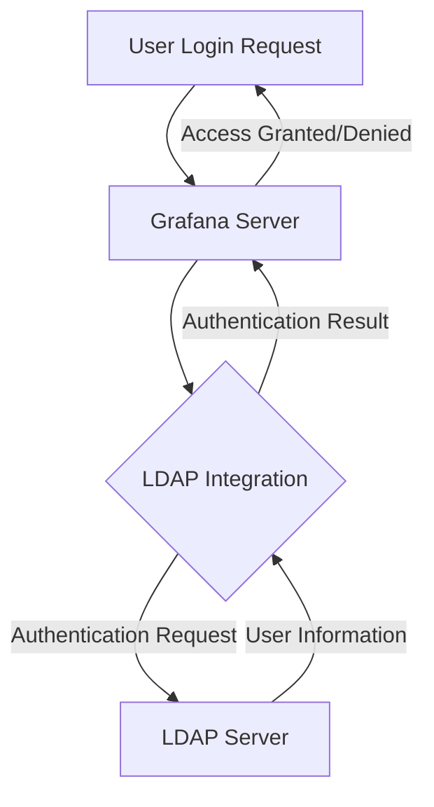

# LDAP Integration

## Introduction

Lightweight Directory Access Protocol (LDAP) integration is a powerful authentication method that allows Grafana administrators to connect their Grafana instance with an organization's existing user directory. This integration streamlines user management by enabling centralized authentication, automatic user provisioning, and role-based access control through your existing LDAP server.

In this guide, you'll learn what LDAP is, why it's beneficial for Grafana deployments, and how to configure LDAP authentication for your Grafana instance. We'll walk through practical examples and configuration steps to help you implement this important enterprise feature.

## What is LDAP?

LDAP (Lightweight Directory Access Protocol) is an open, vendor-neutral protocol used to access and maintain distributed directory information services over an IP network. In simpler terms, it's a standardized way to organize and access information about users and resources within an organization.

LDAP directories typically store information such as:
- User credentials and contact information
- Organizational structure (departments, teams)
- Group memberships
- Access permissions



## Benefits of LDAP Integration in Grafana

Integrating Grafana with your organization's LDAP directory provides several key advantages:

1. **Centralized Authentication**: Users can log in with their existing organizational credentials.
2. **Automatic User Provisioning**: New users are automatically created in Grafana when they first log in.
3. **Synchronized User Information**: User attributes like name and email are kept in sync.
4. **Role Mapping**: LDAP groups can be mapped to Grafana organization roles.
5. **Enhanced Security**: Leverage your organization's password policies and access controls.
6. **Reduced Administrative Overhead**: Avoid manual user management in Grafana.

## Prerequisites

Before configuring LDAP integration, ensure you have:

- Administrative access to your Grafana instance
- Access to an LDAP server (like Active Directory, OpenLDAP, or FreeIPA)
- Basic understanding of your LDAP structure (base DNs, user and group attributes)
- Grafana Enterprise or OSS version (LDAP is available in both)

## Configuring LDAP in Grafana

Grafana's LDAP integration is configured through the `ldap.toml` file. Let's walk through the configuration process step by step.

### Step 1: Enable LDAP Authentication

First, you need to enable LDAP authentication in your Grafana configuration file (`grafana.ini`):

```ini
[auth.ldap]
enabled = true
config_file = /etc/grafana/ldap.toml
allow_sign_up = true
```

### Step 2: Configure the LDAP Connection

Next, set up the basic LDAP server connection in your `ldap.toml` file:

```toml
# General LDAP configuration
[[servers]]
host = "ldap.example.org"
port = 389
use_ssl = false
start_tls = true
ssl_skip_verify = false
bind_dn = "cn=grafana,dc=example,dc=org"
bind_password = "grafana-password"
search_filter = "(sAMAccountName=%s)"
search_base_dns = ["dc=example,dc=org"]
```

Let's break down these settings:

- `host`: Your LDAP server address
- `port`: LDAP server port (typically 389 for standard or 636 for LDAPS)
- `use_ssl`: Whether to use LDAP over SSL (LDAPS)
- `start_tls`: Whether to use STARTTLS to upgrade the connection
- `ssl_skip_verify`: Skip SSL certificate verification (not recommended for production)
- `bind_dn`: The distinguished name used to bind to the LDAP server
- `bind_password`: Password for the bind user
- `search_filter`: Filter to find the user (the `%s` is replaced with the username)
- `search_base_dns`: Base DNs to search for users

### Step 3: Configure User Attributes

Configure how Grafana maps LDAP attributes to Grafana user properties:

```toml
[servers.attributes]
name = "givenName"
surname = "sn"
username = "sAMAccountName"
member_of = "memberOf"
email = "mail"
```

These mappings tell Grafana which LDAP attributes to use for user information.

### Step 4: Configure Group Mappings

Map LDAP groups to Grafana organization roles:

```toml
[[servers.group_mappings]]
group_dn = "cn=grafana-admins,ou=groups,dc=example,dc=org"
org_role = "Admin"
org_id = 1

[[servers.group_mappings]]
group_dn = "cn=grafana-editors,ou=groups,dc=example,dc=org"
org_role = "Editor"
org_id = 1

[[servers.group_mappings]]
group_dn = "cn=grafana-viewers,ou=groups,dc=example,dc=org"
org_role = "Viewer"
org_id = 1

# This group mapping matches any group
[[servers.group_mappings]]
group_dn = "*"
org_role = "Viewer"
org_id = 1
```

This configuration maps LDAP groups to Grafana roles. Any user in the "grafana-admins" group will get Admin privileges, and so on.

### Step 5: Restart Grafana

After configuring LDAP, restart your Grafana server to apply the changes:

```bash
sudo systemctl restart grafana-server
```

## Testing LDAP Authentication

After configuration, test the LDAP integration:

1. Navigate to your Grafana login page
2. Enter LDAP credentials for a user in your directory
3. Verify successful login and appropriate permissions

For troubleshooting, enable debug logging in your `grafana.ini`:

```ini
[log]
filters = ldap:debug
```

## Advanced LDAP Configuration

### Multiple LDAP Servers

You can configure multiple LDAP servers by adding additional `[[servers]]` sections in your `ldap.toml` file:

```toml
[[servers]]
host = "ldap1.example.org"
# ... first server config ...

[[servers]]
host = "ldap2.example.org"
# ... second server config ...
```

Grafana will try each server in order until authentication succeeds.

### Active Directory Specific Configuration

For Active Directory, you might need a slightly different configuration:

```toml
[[servers]]
host = "ad.example.org"
port = 389
search_filter = "(sAMAccountName=%s)"
search_base_dns = ["dc=example,dc=org"]

[servers.attributes]
name = "givenName"
surname = "sn"
username = "sAMAccountName"
member_of = "memberOf"
email = "mail"
```

### Using LDAPS (LDAP over SSL)

For secure LDAP communication:

```toml
[[servers]]
host = "ldaps.example.org"
port = 636
use_ssl = true
ssl_skip_verify = false
root_ca_cert = "/path/to/certificate.crt"
```

## Real-World Scenario: Enterprise Implementation

Let's walk through a complete enterprise scenario where we integrate Grafana with Active Directory.

### Scenario: Multi-team Enterprise Monitoring

Imagine a company with the following requirements:

- IT Operations team needs Admin access to Grafana
- Development teams need Editor access
- Management needs Viewer access
- All users should authenticate with their AD credentials

### Solution Configuration

```toml
[[servers]]
host = "ad.company.com"
port = 389
start_tls = true
bind_dn = "cn=grafana-service,ou=service-accounts,dc=company,dc=com"
bind_password = "secure-password"
search_filter = "(sAMAccountName=%s)"
search_base_dns = ["dc=company,dc=com"]

[servers.attributes]
name = "givenName"
surname = "sn"
username = "sAMAccountName"
member_of = "memberOf"
email = "mail"

# IT Operations Team
[[servers.group_mappings]]
group_dn = "cn=IT-Operations,ou=groups,dc=company,dc=com"
org_role = "Admin"
org_id = 1

# Development Teams
[[servers.group_mappings]]
group_dn = "cn=Developers,ou=groups,dc=company,dc=com"
org_role = "Editor"
org_id = 1

# Management
[[servers.group_mappings]]
group_dn = "cn=Management,ou=groups,dc=company,dc=com"
org_role = "Viewer"
org_id = 1

# Default fallback
[[servers.group_mappings]]
group_dn = "*"
org_role = "Viewer"
org_id = 1
```

With this configuration:
- IT Operations staff will automatically receive Admin privileges
- Developers will receive Editor privileges
- Management will receive Viewer privileges
- Anyone else in the company can log in as a Viewer

## Troubleshooting LDAP Integration

Common issues and their solutions:

### Connection Problems

**Issue**: Grafana cannot connect to the LDAP server.

**Solution**: 
- Verify server hostname and port
- Check network connectivity and firewall rules
- Ensure bind_dn and bind_password are correct

```bash
# Test LDAP connectivity from the Grafana server
ldapsearch -H ldap://ldap.example.org -D "cn=grafana,dc=example,dc=org" -w "grafana-password" -b "dc=example,dc=org"
```

### Authentication Failures

**Issue**: Users cannot log in with their LDAP credentials.

**Solution**:
- Verify the search_filter matches how users are stored
- Check that search_base_dns includes all necessary organizational units
- Enable debug logging and check logs

### Group Mapping Issues

**Issue**: Users log in but have incorrect permissions.

**Solution**:
- Verify group_mappings match the actual group DNs in your LDAP directory
- Check the member_of attribute is correctly mapped
- Test with a sample user account to verify group membership

## Summary

LDAP integration in Grafana provides a robust solution for enterprise authentication and user management. By connecting Grafana to your organization's directory service, you can:

- Simplify user management with centralized authentication
- Ensure proper access control through group mapping
- Maintain consistency with your organization's user directory
- Scale user management as your organization grows

The configuration process involves enabling LDAP authentication, configuring server connections, mapping user attributes, and establishing group-to-role mappings. While the initial setup requires careful planning, the long-term benefits in security and administrative efficiency make LDAP integration a valuable component of any enterprise Grafana deployment.

## Additional Resources

To further enhance your understanding of LDAP integration in Grafana:

- Review the [official Grafana LDAP documentation](https://grafana.com/docs/grafana/latest/auth/ldap/)
- Explore LDAP concepts and structures in the [OpenLDAP documentation](https://www.openldap.org/doc/)
- Learn about Active Directory integration specifics if using AD

## Exercises

1. Set up a test LDAP server using OpenLDAP or FreeIPA in a development environment
2. Configure Grafana to authenticate against your test LDAP server
3. Create three LDAP groups and map them to different Grafana roles
4. Test logging in with users from each group and verify they have the correct permissions
5. Modify your configuration to implement a more complex group mapping scenario