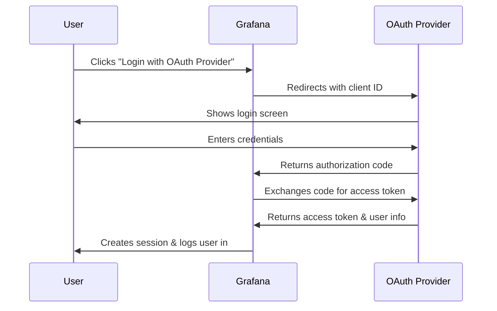

# OAuth Integration in Grafana

## Introduction

OAuth is an open standard authentication protocol that allows secure authorization without sharing password credentials. For Grafana administrators, integrating OAuth provides several advantages:

- **Simplified login experience** for users who can authenticate with existing accounts
- **Enhanced security** through delegated authentication
- **Centralized user management** when connecting to identity providers
- **Seamless Single Sign-On (SSO)** across multiple applications

This guide will walk you through understanding OAuth concepts, configuring various OAuth providers in Grafana, and implementing best practices for a secure authentication system.

## Understanding OAuth Basics

Before diving into configuration, let's understand the core OAuth concepts as they apply to Grafana.

### What is OAuth?

OAuth (Open Authorization) is a token-based authentication protocol that allows third-party services to access resources on behalf of users without exposing their credentials.

### The OAuth Flow in Grafana



### Key OAuth Terminology

- **Client ID**: Unique identifier for your Grafana instance
- **Client Secret**: Secret key known only to Grafana and the OAuth provider
- **Authorization Endpoint**: URL where users are redirected for authentication
- **Token Endpoint**: URL where Grafana exchanges the authorization code for tokens
- **Scopes**: Permissions requested from the OAuth provider

## Configuring OAuth in Grafana

Grafana supports various OAuth providers. Let's look at how to configure some of the most common ones.

### General Configuration Steps

1. Register Grafana as an application with your OAuth provider
2. Obtain Client ID and Client Secret
3. Configure Grafana's configuration file or environment variables
4. Set up role mapping and team synchronization

### Modifying Grafana Configuration

OAuth settings are configured in Grafana's main configuration file (`grafana.ini`) or using environment variables.

```ini
[auth.generic_oauth]
enabled = true
name = OAuth Provider
client_id = YOUR_CLIENT_ID
client_secret = YOUR_CLIENT_SECRET
auth_url = https://your-oauth-provider.com/oauth/authorize
token_url = https://your-oauth-provider.com/oauth/token
api_url = https://your-oauth-provider.com/api/user
scopes = user:email profile
allow_sign_up = true
```

## Popular OAuth Provider Integrations

Let's explore how to set up Grafana with some commonly used OAuth providers.

### Google OAuth Integration

```ini
[auth.google]
enabled = true
client_id = YOUR_GOOGLE_CLIENT_ID
client_secret = YOUR_GOOGLE_CLIENT_SECRET
scopes = https://www.googleapis.com/auth/userinfo.profile https://www.googleapis.com/auth/userinfo.email
auth_url = https://accounts.google.com/o/oauth2/auth
token_url = https://accounts.google.com/o/oauth2/token
api_url = https://www.googleapis.com/oauth2/v1/userinfo
allowed_domains = yourdomain.com
allow_sign_up = true
```

For Google OAuth setup:

1. Go to Google Cloud Console
2. Create a new project
3. Enable the Google+ API
4. Configure the OAuth consent screen
5. Create OAuth credentials (Web application type)
6. Add your Grafana URL as an authorized redirect URI: `https://your-grafana-url/login/google`

### GitHub OAuth Integration

```ini
[auth.github]
enabled = true
allow_sign_up = true
client_id = YOUR_GITHUB_CLIENT_ID
client_secret = YOUR_GITHUB_CLIENT_SECRET
scopes = user:email,read:org
auth_url = https://github.com/login/oauth/authorize
token_url = https://github.com/login/oauth/access_token
api_url = https://api.github.com/user
team_ids = 
allowed_organizations = your-github-org
```

For GitHub OAuth setup:

1. Go to GitHub Developer Settings
2. Create a new OAuth App
3. Set the Authorization callback URL to `https://your-grafana-url/login/github`
4. Register the application to get Client ID and Client Secret

### Okta OAuth Integration

```ini
[auth.generic_oauth]
name = Okta
enabled = true
allow_sign_up = true
client_id = YOUR_OKTA_CLIENT_ID
client_secret = YOUR_OKTA_CLIENT_SECRET
scopes = openid profile email
auth_url = https://your-domain.okta.com/oauth2/v1/authorize
token_url = https://your-domain.okta.com/oauth2/v1/token
api_url = https://your-domain.okta.com/oauth2/v1/userinfo
```

For Okta OAuth setup:

1. Log in to your Okta admin console
2. Go to Applications > Add Application
3. Select Web platform
4. Set Login redirect URIs to `https://your-grafana-url/login/generic_oauth`
5. Grant the necessary scopes (openid, profile, email)

## Role Mapping and Team Synchronization

One powerful feature of OAuth integration is the ability to map OAuth roles to Grafana roles and synchronize teams.

### Role Mapping Configuration

```ini
[auth.generic_oauth]
# Other OAuth settings...
role_attribute_path = contains(groups[*], 'admin') && 'Admin' || contains(groups[*], 'editor') && 'Editor' || 'Viewer'
```

This example uses JMESPath syntax to map roles based on group membership.

### Team Synchronization

Grafana can automatically synchronize team memberships based on OAuth groups:

```ini
[auth.generic_oauth]
# Other OAuth settings...
team_ids_attribute_path = groups
```

## Troubleshooting OAuth Integration

When implementing OAuth, you might encounter these common issues:

### Common Problems and Solutions

1. **Redirect URI Mismatch**
   - Ensure the redirect URI registered with the OAuth provider exactly matches your Grafana URI
   - Check for trailing slashes or HTTP vs HTTPS mismatches

2. **Scope Issues**
   - Verify that you've requested all required scopes
   - Some providers need specific scopes for email or profile information

3. **User Not Created**
   - Check that `allow_sign_up` is set to `true`
   - Verify that the user's email domain is in `allowed_domains` if configured

4. **Debug Logging**

Enable debug logging to get more information:

```ini
[log]
level = debug
filters = auth.generic_oauth:debug
```

## OAuth Security Best Practices

When implementing OAuth in Grafana, follow these security practices:

1. **Use HTTPS** for all communication
2. **Rotate client secrets** periodically
3. **Limit redirect URIs** to only trusted domains
4. **Implement proper role mapping** to avoid privilege escalation
5. **Audit authentication logs** regularly
6. **Use state parameters** to prevent CSRF attacks

## Implementing a Complete OAuth Solution

Let's walk through a complete example of setting up Grafana with Azure AD OAuth.

### Step 1: Register Grafana in Azure AD

1. Log in to the Azure portal
2. Navigate to Azure Active Directory > App registrations
3. Create a new registration for Grafana
4. Set the redirect URI: `https://your-grafana-url/login/azuread`
5. Note the Application (client) ID and create a client secret

### Step 2: Configure Grafana

```ini
[auth.azuread]
name = Azure AD
enabled = true
allow_sign_up = true
client_id = YOUR_AZURE_CLIENT_ID
client_secret = YOUR_AZURE_CLIENT_SECRET
scopes = openid email profile
auth_url = https://login.microsoftonline.com/TENANT_ID/oauth2/v2.0/authorize
token_url = https://login.microsoftonline.com/TENANT_ID/oauth2/v2.0/token
api_url = https://graph.microsoft.com/v1.0/me
allowed_domains = yourdomain.com
allowed_groups = GRAPH_GROUP_ID_1 GRAPH_GROUP_ID_2
role_attribute_path = contains(groups[*], 'ADMIN_GROUP_ID') && 'Admin' || contains(groups[*], 'EDITOR_GROUP_ID') && 'Editor' || 'Viewer'
```

### Step 3: Test and Verify

1. Restart Grafana to apply the changes
2. Visit your Grafana login page
3. Click on "Sign in with Azure AD"
4. Complete the authentication flow
5. Verify that the user is created with the correct permissions

## Summary

OAuth integration in Grafana enhances your authentication system by leveraging existing identity providers, reducing password fatigue, and centralizing user management. Key takeaways include:

- OAuth provides a secure, token-based authentication mechanism
- Grafana supports multiple OAuth providers including Google, GitHub, Okta, and Azure AD
- Role mapping and team synchronization enable automated access control
- Proper configuration requires attention to redirect URIs, scopes, and security best practices

By implementing OAuth, you can create a more secure and user-friendly authentication experience while simplifying administration tasks.

## Additional Resources

- [Official Grafana OAuth Documentation](https://grafana.com/docs/grafana/latest/setup-grafana/configure-security/configure-authentication/generic-oauth/)
- [JMESPath Documentation](https://jmespath.org/) for role mapping expressions
- [OAuth 2.0 Specification](https://oauth.net/2/)

## Practice Exercises

1. Configure Google OAuth for your Grafana instance
2. Set up role mapping to assign Admin roles to members of a specific group
3. Implement team synchronization based on OAuth groups
4. Enable debug logging and analyze the authentication flow
5. Audit your OAuth configuration for security best practices