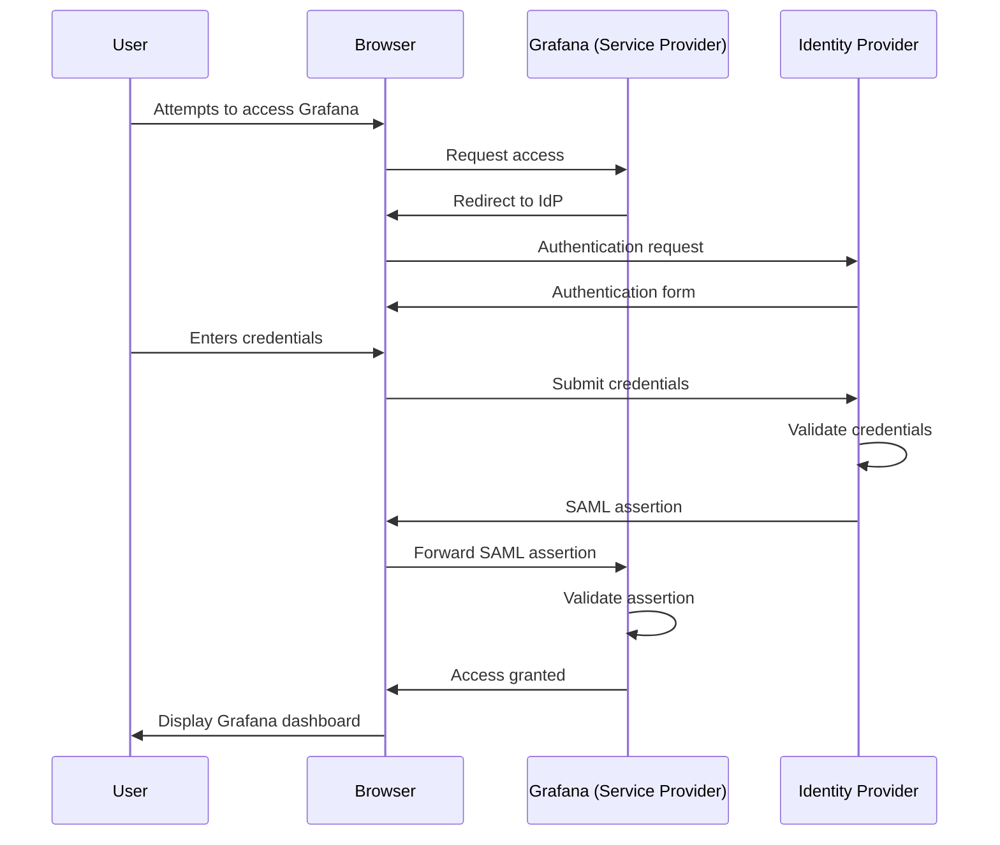

# SAML Integration with Grafana

## Introduction

Security Assertion Markup Language (SAML) is an open standard for exchanging authentication and authorization data between parties, specifically between an identity provider (IdP) and a service provider (SP). In the context of Grafana administration, SAML integration enables Single Sign-On (SSO) capabilities, allowing users to access Grafana using their existing organizational credentials.

This guide will walk you through the process of configuring SAML integration for your Grafana instance, explain the underlying concepts, and provide practical examples for implementation.

## What is SAML?

SAML works by transferring user authentication data in the form of "assertions" from an identity provider to a service provider:



### Key Components in SAML

1. **Identity Provider (IdP)**: The system that performs user authentication and issues SAML assertions (e.g., Okta, Azure AD, OneLogin)
2. **Service Provider (SP)**: The application requesting authentication (Grafana in our case)
3. **SAML Assertion**: XML-based security token that contains authentication information
4. **Metadata**: XML documents that describe the configuration details for both IdP and SP

## Prerequisites for Grafana SAML Integration

Before configuring SAML, ensure you have:

1. Admin access to your Grafana instance
2. Access to configure your Identity Provider (IdP)
3. Grafana Enterprise license (SAML is an Enterprise feature)
4. Grafana v7.0 or later

## Configuring SAML in Grafana

### Step 1: Enable SAML Authentication

Edit your Grafana configuration file (`grafana.ini` or environment variables) to enable SAML:

```ini
[auth.saml]
enabled = true
certificate_path = /path/to/certificate.cert
private_key_path = /path/to/private_key.key
idp_metadata_path = /path/to/idp_metadata.xml
max_issue_delay = 90s
metadata_valid_duration = 48h
assertion_attribute_name = displayName
assertion_attribute_login = mail
assertion_attribute_email = mail
assertion_attribute_groups = groups
assertion_attribute_role = role
assertion_attribute_org = org
allowed_organizations = MyOrganization
```

### Step 2: Configure Grafana as a Service Provider in your IdP

Each IdP has a different interface, but generally you'll need to:

1. Create a new SAML application in your IdP
2. Set the Assertion Consumer Service (ACS) URL to: `https://your-grafana-domain/saml/acs`
3. Set the Entity ID to: `https://your-grafana-domain/saml/metadata`
4. Configure attribute mappings

### Step 3: Generate SP Metadata for Your IdP

You can access Grafana's SP metadata at:

```
https://your-grafana-domain/saml/metadata
```

Download this file and upload it to your IdP to establish trust.

### Step 4: Configure Attribute Mapping

Map IdP attributes to Grafana user properties:

```ini
# Map IdP attributes to Grafana user
assertion_attribute_name = displayName
assertion_attribute_login = mail
assertion_attribute_email = mail
```

### Step 5: Test the Integration

1. Log out of Grafana
2. Visit your Grafana login page
3. Click on the SAML login option
4. You should be redirected to your IdP for authentication
5. After successful authentication, you'll be redirected back to Grafana

## Real-World Configuration Examples

### Example: Okta Integration

1. In Okta Developer Console, create a new SAML 2.0 application
2. Configure the following settings:
   - Single Sign-On URL: `https://your-grafana-domain/saml/acs`
   - Audience URI (SP Entity ID): `https://your-grafana-domain/saml/metadata`
   - Name ID format: Email Address
   - Application username: Email

3. In Grafana configuration:

```ini
[auth.saml]
enabled = true
certificate_path = /etc/grafana/okta.cert
private_key_path = /etc/grafana/okta.key
idp_metadata_path = /etc/grafana/okta_metadata.xml
assertion_attribute_name = displayName
assertion_attribute_login = email
assertion_attribute_email = email
assertion_attribute_groups = groups
```

### Example: Azure AD Integration

1. In Azure Portal, register a new application
2. Set up enterprise application settings for SAML
3. Configure the following:
   - Identifier (Entity ID): `https://your-grafana-domain/saml/metadata`
   - Reply URL: `https://your-grafana-domain/saml/acs`
   - Sign on URL: `https://your-grafana-domain/login/saml`

4. In Grafana configuration:

```ini
[auth.saml]
enabled = true
certificate_path = /etc/grafana/azuread.cert
private_key_path = /etc/grafana/azuread.key
idp_metadata_url = https://login.microsoftonline.com/your-tenant-id/federationmetadata/2007-06/federationmetadata.xml
assertion_attribute_name = http://schemas.microsoft.com/identity/claims/displayname
assertion_attribute_login = http://schemas.xmlsoap.org/ws/2005/05/identity/claims/emailaddress
assertion_attribute_email = http://schemas.xmlsoap.org/ws/2005/05/identity/claims/emailaddress
assertion_attribute_groups = http://schemas.microsoft.com/ws/2008/06/identity/claims/groups
```

## Troubleshooting SAML Integration

### Common Issues and Solutions

1. **Invalid Certificate or Key**
   - Ensure certificate and key files are in the correct format (PEM)
   - Check file permissions

2. **Clock Synchronization Issues**
   - SAML is time-sensitive; ensure your servers have synchronized time
   - Adjust `max_issue_delay` if needed

3. **Attribute Mapping Problems**
   - Enable debug logging to see attribute values:
     ```ini
     [auth.saml]
     log_level = debug
     ```
   - Check IdP logs for the actual attribute names being sent

4. **Redirect Loop**
   - Clear browser cookies
   - Check entity ID configuration

5. **"User not found" Error**
   - Ensure auto_login is enabled if you want new users created automatically
   - Verify email attribute mapping

## Advanced Configuration Options

### Role Mapping

Map SAML group attributes to Grafana roles:

```ini
[auth.saml]
role_values_editor = admin, editor
role_values_admin = admin, grafana-admin
```

### Just-in-Time User Provisioning

Automatically create users on first login:

```ini
[auth.saml]
allow_sign_up = true
```

### Organization Mapping

Assign users to specific organizations:

```ini
[auth.saml]
assertion_attribute_org = organization
allowed_organizations = Org1, Org2
```

## Security Best Practices

1. **Use HTTPS** - Always use TLS/SSL for SAML communications
2. **Limit Token Validity** - Set appropriate timeout values
3. **Implement Role-Based Access Control** - Use SAML attributes to assign appropriate Grafana roles
4. **Regular Certificate Rotation** - Update certificates before expiration
5. **Audit Authentication Logs** - Regularly review logs for unusual patterns

## Summary

SAML integration provides a secure and standardized way to implement Single Sign-On for your Grafana instance. By leveraging your organization's existing identity provider, you can streamline user access while maintaining security policies.

Key benefits include:
- Centralized user management
- Enhanced security through federated authentication
- Simplified user experience with SSO
- Enterprise-grade access control

## Additional Resources

- [Grafana SAML Documentation](https://grafana.com/docs/grafana/latest/auth/saml/)
- [SAML 2.0 Technical Overview](https://docs.oasis-open.org/security/saml/Post2.0/sstc-saml-tech-overview-2.0.html)
- [Configure SAML Authentication](https://grafana.com/docs/grafana/latest/setup-grafana/configure-security/configure-authentication/saml/)

## Practice Exercises

1. Set up a test SAML integration using a free tier of an identity provider like Okta Developer Edition
2. Configure attribute mapping to include user groups and roles
3. Test different SAML assertion signing options (signed vs. unsigned)
4. Implement a custom login button for your SAML IdP
5. Configure multiple SAML identity providers for a single Grafana instance