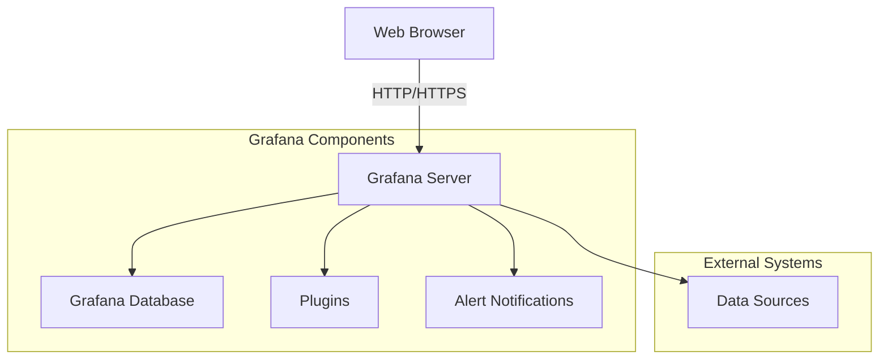
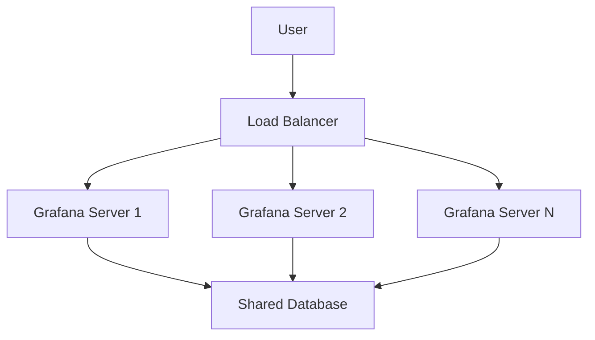

# Server Administration in Grafana

## Introduction

Server administration is a critical aspect of maintaining a healthy, secure, and efficient Grafana deployment. As a Grafana administrator, you'll need to understand how to configure server settings, manage users and permissions, monitor server performance, and ensure your instance remains reliable and secure. This guide will walk you through the essential aspects of Grafana server administration, providing practical examples and best practices to help you become an effective Grafana administrator.

## Understanding the Grafana Server Architecture

Before diving into administration tasks, it's important to understand Grafana's architecture:



Grafana operates as a web application with:
- A frontend served to browsers
- A backend server that connects to a database
- Connections to various data sources
- Plugin support for extensibility
- Alerting capabilities

## Server Configuration Basics

### Configuration File

Grafana's main configuration is handled through the `grafana.ini` file. This file contains sections for different aspects of server configuration.

Location of the configuration file depends on your installation method:
- Debian/Ubuntu: `/etc/grafana/grafana.ini`
- RPM-based Linux: `/etc/grafana/grafana.ini`
- Docker: Custom path mounted to the container
- Binary: `$WORKING_DIR/conf/grafana.ini`

Here's an example of key sections in the configuration file:

```ini
[server]
protocol = http
http_port = 3000
domain = localhost
root_url = %(protocol)s://%(domain)s:%(http_port)s/

[database]
type = sqlite3
path = grafana.db

[security]
admin_user = admin
admin_password = admin
```

### Environment Variables

You can override any configuration setting using environment variables with the format:

```
GF_<SECTION_NAME>_<OPTION_NAME>
```

For example, to change the HTTP port:

```bash
export GF_SERVER_HTTP_PORT=8080
```

### Command-Line Arguments

When starting Grafana, you can use command-line arguments to override configuration settings:

```bash
grafana-server --config=/custom/path/grafana.ini
```

## Managing Server Instances

### Starting and Stopping the Server

Depending on your installation method, you'll manage the Grafana service differently:

**Systemd (Debian/Ubuntu/RHEL/CentOS)**:
```bash
# Start the service
sudo systemctl start grafana-server

# Stop the service
sudo systemctl stop grafana-server

# Restart the service
sudo systemctl restart grafana-server

# Check service status
sudo systemctl status grafana-server
```

**Docker**:
```bash
# Start a Grafana container
docker run -d --name=grafana -p 3000:3000 grafana/grafana

# Stop the container
docker stop grafana

# Restart the container
docker restart grafana
```

### Backups and Restoration

Regular backups of your Grafana installation are crucial:

1. **Database Backup**:
   - For SQLite:
     ```bash
     # Create a backup
     sqlite3 /var/lib/grafana/grafana.db .dump > grafana_backup.sql
     
     # Restore from backup
     cat grafana_backup.sql | sqlite3 /var/lib/grafana/grafana.db
     ```
   
   - For MySQL:
     ```bash
     # Create a backup
     mysqldump -u root -p grafana > grafana_backup.sql
     
     # Restore from backup
     mysql -u root -p grafana < grafana_backup.sql
     ```
   
   - For PostgreSQL:
     ```bash
     # Create a backup
     pg_dump -U grafana -W -F c -b -v -f grafana_backup.backup grafana
     
     # Restore from backup
     pg_restore -U grafana -d grafana -v grafana_backup.backup
     ```

2. **Configuration Backup**:
   ```bash
   # Back up configuration files
   cp -r /etc/grafana /etc/grafana.backup
   
   # Restore configuration files
   cp -r /etc/grafana.backup /etc/grafana
   ```

## User and Organization Management

### Creating and Managing Users

Grafana supports multiple authentication methods, but you can manage users directly through the API or UI.

Using the API (requires an admin API key):

```bash
# Create a new user
curl -X POST -H "Content-Type: application/json" -H "Authorization: Bearer your-api-key" \
  -d '{"name":"John Doe", "email":"john@example.com", "login":"john", "password":"password123"}' \
  http://localhost:3000/api/admin/users
```

### Managing Organizations

Grafana supports multiple organizations, each with their own dashboards, data sources, and users:

```bash
# Create a new organization
curl -X POST -H "Content-Type: application/json" -H "Authorization: Bearer your-api-key" \
  -d '{"name":"New Organization"}' \
  http://localhost:3000/api/orgs
```

### Role-Based Access Control (RBAC)

Grafana uses role-based access control to determine what users can do:

- **Admin**: Can manage users, organizations, and all settings
- **Editor**: Can create and edit dashboards
- **Viewer**: Can only view dashboards

You can assign roles at the organization level or for specific dashboards and folders.

## Monitoring Server Health

### Internal Metrics

Grafana exposes internal metrics that you can use to monitor its health:

1. Enable metrics in your configuration:
   ```ini
   [metrics]
   enabled = true
   ```

2. Access metrics at `http://your-grafana-server:3000/metrics`

3. Use Prometheus to scrape these metrics and visualize them in Grafana itself:
   ```yaml
   # Prometheus configuration
   scrape_configs:
     - job_name: 'grafana'
       static_configs:
         - targets: ['localhost:3000']
   ```

### Server Logs

Monitor Grafana logs to troubleshoot issues:

- Default log location: `/var/log/grafana/grafana.log`
- Configure logging in the `grafana.ini` file:
  ```ini
  [log]
  mode = console file
  level = info
  ```

### Alert Notifications for Server Issues

Set up alerts to monitor your Grafana instance:

1. Create a dashboard to monitor key metrics like:
   - Memory usage
   - CPU usage
   - HTTP response times
   - Error rates

2. Configure alerts to notify you when issues arise:
   ```javascript
   // Alert condition example (in Grafana alert rule)
   return data.A.reduce((acc, val) => acc + val, 0) / data.A.length > 90; // Alert if CPU > 90%
   ```

## Scaling Grafana for High Availability

### Load Balancing

For high availability, set up multiple Grafana instances behind a load balancer:



1. Configure each instance with the same database
2. Use a shared file system or S3-compatible storage for images
3. Ensure session consistency using Redis or Memcached

Example NGINX load balancer configuration:

```nginx
upstream grafana {
    server grafana1:3000;
    server grafana2:3000;
    server grafana3:3000;
}

server {
    listen 80;
    server_name grafana.example.com;

    location / {
        proxy_pass http://grafana;
        proxy_set_header Host $host;
        proxy_set_header X-Real-IP $remote_addr;
    }
}
```

## Security Best Practices

### Authentication and Authorization

1. **Use HTTPS**:
   ```ini
   [server]
   protocol = https
   cert_file = /path/to/cert.pem
   cert_key = /path/to/key.pem
   ```

2. **Configure authentication**:
   - LDAP/Active Directory:
     ```ini
     [auth.ldap]
     enabled = true
     config_file = /etc/grafana/ldap.toml
     ```
   
   - OAuth (e.g., Google):
     ```ini
     [auth.google]
     enabled = true
     client_id = YOUR_CLIENT_ID
     client_secret = YOUR_CLIENT_SECRET
     ```

3. **Set up IP whitelist**:
   ```ini
   [auth]
   ; space-separated list of IP patterns
   ip_whitelist = 192.168.1.0/24 10.0.0.0/8
   ```

### Update and Patch Management

Regularly update your Grafana instance to ensure you have the latest security patches:

```bash
# Debian/Ubuntu
apt-get update
apt-get upgrade grafana

# RPM-based
yum update grafana

# Docker
docker pull grafana/grafana:latest
```

## Troubleshooting Common Issues

### Connection Problems

If users can't connect to Grafana:

1. Check if the server is running:
   ```bash
   sudo systemctl status grafana-server
   ```

2. Verify network configuration:
   ```bash
   netstat -tulpn | grep 3000
   ```

3. Check firewall settings:
   ```bash
   sudo ufw status
   ```

### Database Issues

If you experience database errors:

1. Check database connection:
   ```bash
   # For PostgreSQL
   psql -h localhost -U grafana -d grafana -c "SELECT 1"
   ```

2. Verify database permissions:
   ```bash
   # For MySQL
   mysql -u root -p -e "SHOW GRANTS FOR 'grafana'@'localhost'"
   ```

### Performance Problems

If Grafana is slow:

1. Check system resources:
   ```bash
   top
   df -h
   free -m
   ```

2. Optimize database queries:
   ```ini
   [database]
   log_queries = true
   ```

3. Enable caching:
   ```ini
   [panels]
   enable_alpha = true
   
   [caching]
   enabled = true
   ```

## Practical Example: Setting Up a Production-Ready Grafana Server

Let's walk through setting up a production-ready Grafana server with:
- HTTPS
- PostgreSQL database
- LDAP authentication
- Prometheus monitoring

### Step 1: Install Grafana

```bash
# Add GPG key
wget -q -O - https://packages.grafana.com/gpg.key | sudo apt-key add -

# Add repository
echo "deb https://packages.grafana.com/oss/deb stable main" | sudo tee -a /etc/apt/sources.list.d/grafana.list

# Update and install
sudo apt-get update
sudo apt-get install grafana
```

### Step 2: Configure PostgreSQL

```bash
# Install PostgreSQL
sudo apt-get install postgresql

# Create database and user
sudo -u postgres psql
postgres=# CREATE USER grafana WITH PASSWORD 'secure_password';
postgres=# CREATE DATABASE grafana;
postgres=# GRANT ALL PRIVILEGES ON DATABASE grafana TO grafana;
postgres=# \q
```

Update Grafana configuration:
```ini
[database]
type = postgres
host = localhost:5432
name = grafana
user = grafana
password = secure_password
```

### Step 3: Configure HTTPS

Generate self-signed certificate (for testing):
```bash
sudo openssl req -x509 -nodes -days 365 -newkey rsa:2048 \
  -keyout /etc/grafana/cert.key -out /etc/grafana/cert.pem
```

Update configuration:
```ini
[server]
protocol = https
http_port = 3000
domain = grafana.example.com
cert_file = /etc/grafana/cert.pem
cert_key = /etc/grafana/cert.key
```

### Step 4: Set Up LDAP Authentication

Install LDAP:
```bash
sudo apt-get install ldap-utils
```

Configure LDAP in `/etc/grafana/ldap.toml`:
```toml
[[servers]]
host = "ldap.example.com"
port = 389
use_ssl = false
start_tls = false
bind_dn = "cn=admin,dc=example,dc=com"
bind_password = "admin_password"
search_filter = "(uid=%s)"
search_base_dns = ["ou=users,dc=example,dc=com"]

[servers.attributes]
name = "givenName"
surname = "sn"
username = "uid"
member_of = "memberOf"
email = "mail"

[[servers.group_mappings]]
group_dn = "cn=admins,ou=groups,dc=example,dc=com"
org_role = "Admin"

[[servers.group_mappings]]
group_dn = "cn=editors,ou=groups,dc=example,dc=com"
org_role = "Editor"

[[servers.group_mappings]]
group_dn = "*"
org_role = "Viewer"
```

Update Grafana configuration:
```ini
[auth.ldap]
enabled = true
config_file = /etc/grafana/ldap.toml
allow_sign_up = true
```

### Step 5: Set Up Monitoring

Create a dashboard to monitor Grafana itself:

1. Add Prometheus data source
2. Import dashboard ID 3590 (Grafana metrics)
3. Create alerts for key metrics:
   - Server uptime
   - Response time
   - Error rate
   - Memory usage

## Summary

Effective server administration is crucial for maintaining a stable and secure Grafana environment. We've covered:

- Basic server configuration including the configuration file and environment variables
- User and organization management
- Monitoring server health using internal metrics and logs
- High availability and scaling strategies
- Security best practices including authentication and authorization
- Troubleshooting common issues
- A practical example of setting up a production-ready Grafana server

By understanding these concepts and implementing the best practices outlined in this guide, you'll be well-equipped to administer your Grafana server effectively, ensuring it remains reliable, secure, and performant.

## Additional Resources

- [Official Grafana Documentation](https://grafana.com/docs/)
- [Grafana GitHub Repository](https://github.com/grafana/grafana)
- [Grafana Community Forums](https://community.grafana.com/)

## Practice Exercises

1. Set up a Grafana server with PostgreSQL as the database backend
2. Configure OAuth authentication with Google or GitHub
3. Create a monitoring dashboard for your Grafana instance
4. Implement a backup strategy for your Grafana deployment
5. Create a high-availability setup with multiple Grafana instances