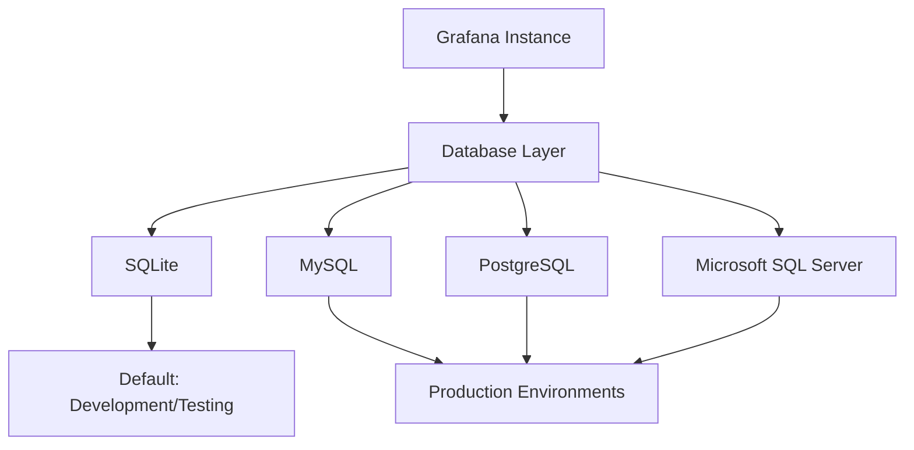

# Database Management

## Introduction

Database management is a critical aspect of Grafana administration that directly impacts the performance, reliability, and scalability of your monitoring platform. Grafana relies on databases to store various types of information including user data, dashboard configurations, data source connections, and historical metrics. Proper database management ensures that your Grafana instance remains responsive, data remains secure, and system resources are utilized efficiently.

In this guide, we'll explore the fundamentals of database management in Grafana, covering everything from understanding the default database configuration to implementing advanced optimization strategies.

## Understanding Grafana's Database Architecture

Grafana uses a relational database to store its configuration and user data. By default, Grafana comes configured with SQLite, but for production environments, it's recommended to use more robust database systems like MySQL, PostgreSQL, or Microsoft SQL Server.



### Default Database Configuration

When you install Grafana, it uses an embedded SQLite database by default. This configuration is suitable for testing and small deployments but has limitations for production use:

```ini
[database]
# Database type: mysql, postgres, sqlite3
type = sqlite3

# For sqlite3 only, path relative to data_path setting
path = grafana.db

# For other database types:
# host =
# name =
# user =
# password =
```

SQLite is file-based and doesn't require a separate database server, making it easy to set up. However, it lacks features like high concurrency support and robust backup mechanisms needed for production environments.

## Configuring Production Databases

For production environments, it's highly recommended to use MySQL or PostgreSQL. Let's look at configuring these more robust databases for Grafana.

### MySQL Configuration

To configure Grafana to use MySQL:

1. Create a MySQL database and user for Grafana:

```sql
CREATE DATABASE grafana;
CREATE USER 'grafana'@'localhost' IDENTIFIED BY 'password';
GRANT ALL PRIVILEGES ON grafana.* TO 'grafana'@'localhost';
FLUSH PRIVILEGES;
```

2. Update the Grafana configuration file (`grafana.ini`):

```ini
[database]
type = mysql
host = 127.0.0.1:3306
name = grafana
user = grafana
password = password
```

### PostgreSQL Configuration

To configure Grafana to use PostgreSQL:

1. Create a PostgreSQL database and user for Grafana:

```sql
CREATE USER grafana WITH PASSWORD 'password';
CREATE DATABASE grafana WITH OWNER grafana;
```

2. Update the Grafana configuration file:

```ini
[database]
type = postgres
host = localhost:5432
name = grafana
user = grafana
password = password
```

## Database Performance Optimization

Optimizing your database configuration can significantly improve Grafana's performance, especially in larger deployments.

### Connection Pooling

Connection pooling allows Grafana to maintain a set of database connections that can be reused, reducing the overhead of establishing new connections for each request:

```ini
[database]
max_open_conn = 300
max_idle_conn = 100
conn_max_lifetime = 14400
```

- `max_open_conn`: Maximum number of open connections to the database
- `max_idle_conn`: Maximum number of connections in the idle connection pool
- `conn_max_lifetime`: Maximum amount of time (in seconds) a connection may be reused

### Query Optimization

For large Grafana deployments, database queries can become a bottleneck. Some strategies to optimize query performance include:

1. **Indexing**: Ensure that frequently queried columns have proper indexes
2. **Session cleanup**: Regularly clean up expired sessions from the database
3. **Dashboard pruning**: Remove unused dashboards and versions to keep database size manageable

Here's an example query to identify dashboards that haven't been viewed recently:

```sql
SELECT dashboard.id, dashboard.slug, dashboard.title, MAX(dashboard_acl.updated) as last_updated
FROM dashboard
LEFT JOIN dashboard_acl ON dashboard.id = dashboard_acl.dashboard_id
GROUP BY dashboard.id
ORDER BY last_updated ASC
LIMIT 20;
```

## Database Backup and Recovery

A robust backup strategy is essential for preventing data loss and ensuring business continuity.

### Backup Strategies

#### Method 1: Database Dumps

For MySQL:

```bash
mysqldump -u grafana -p grafana > grafana_backup.sql
```

For PostgreSQL:

```bash
pg_dump -U grafana grafana > grafana_backup.sql
```

#### Method 2: File-Based Backup (SQLite)

For SQLite databases, you can simply copy the database file:

```bash
cp /var/lib/grafana/grafana.db /backup/grafana.db
```

#### Method 3: Grafana CLI Backup (Configuration Only)

```bash
grafana-cli admin export-dashboards --output /backup/dashboards/
```

### Automating Backups

Create a cron job to automate your backup process:

```bash
# Add to crontab
# Run backup every day at 2 AM
0 2 * * * /path/to/backup/script.sh
```

A simple backup script:

```bash
#!/bin/bash
# Grafana database backup script
TIMESTAMP=$(date +%Y%m%d_%H%M%S)
BACKUP_DIR="/path/to/backups"

# Stop or pause Grafana service
systemctl stop grafana-server

# Perform database backup
mysqldump -u grafana -p'password' grafana > $BACKUP_DIR/grafana_$TIMESTAMP.sql

# Start Grafana service
systemctl start grafana-server

# Keep only last 7 backups
find $BACKUP_DIR -name "grafana_*.sql" -type f -mtime +7 -delete
```

## Database Migration

As your Grafana deployment grows, you might need to migrate from one database type to another or upgrade your database to a newer version.

### Migrating Between Database Types

To migrate from SQLite to MySQL or PostgreSQL:

1. Back up your current SQLite database
2. Configure Grafana to use the new database
3. Use the Grafana CLI to migrate:

```bash
grafana-cli admin db-commands migrate
```

This command takes care of creating the proper schema in your new database and migrating the data from the old one.

### Upgrading Database Versions

When upgrading your database server (e.g., from MySQL 5.7 to MySQL 8.0), follow these steps:

1. Back up your current database
2. Create a migration plan with specific downtime windows
3. Test the migration process in a non-production environment
4. Perform the actual migration during your maintenance window
5. Validate data integrity and application functionality

## Monitoring Database Health

Monitoring your database's health is crucial for maintaining optimal Grafana performance.

### Key Metrics to Monitor

1. **Connection Pool Utilization**: Monitor the number of active connections versus the maximum allowed
2. **Query Execution Time**: Track slow queries that may indicate performance issues
3. **Database Size**: Monitor the growth of your database over time
4. **Lock Contention**: Identify tables or rows with high lock contention that may cause bottlenecks

### Setting Up Database Monitoring

You can use Grafana itself to monitor your Grafana database:

1. Add your database as a data source in Grafana
2. Create dashboards to visualize key metrics
3. Set up alerts for critical thresholds

An example MySQL query for monitoring slow queries:

```sql
SELECT event_name, count_star, sum_timer_wait/1000000000 as latency_ms
FROM performance_schema.events_statements_summary_by_digest
ORDER BY sum_timer_wait DESC
LIMIT 10;
```

## Common Database Issues and Solutions

### Issue 1: Slow Dashboard Loading

**Potential Causes:**
- Inefficient database queries
- Database connection pool exhaustion
- Excessive dashboard versions

**Solutions:**
- Optimize database queries with proper indexing
- Increase connection pool limits
- Clean up old dashboard versions

```sql
-- Clean up old dashboard versions (keep last 5)
DELETE FROM dashboard_version 
WHERE dashboard_id IN (
  SELECT dashboard_id FROM (
    SELECT dashboard_id, version, 
    ROW_NUMBER() OVER (PARTITION BY dashboard_id ORDER BY version DESC) as rn
    FROM dashboard_version
  ) AS subquery
  WHERE rn > 5
);
```

### Issue 2: Database Lock Contention

**Potential Causes:**
- Multiple concurrent write operations
- Long-running transactions

**Solutions:**
- Optimize database access patterns to reduce concurrent writes
- Ensure transactions are kept as short as possible
- Consider using a more robust database like PostgreSQL for better concurrency

### Issue 3: Database Size Growth

**Potential Causes:**
- Accumulation of dashboard versions
- Unused dashboards and data sources
- Large annotation tables

**Solutions:**
- Implement regular cleanup of old dashboard versions
- Remove unused dashboards and data sources
- Set up retention policies for annotations

## Best Practices for Grafana Database Management

1. **Use a Production-Grade Database**: For any production environment, use MySQL or PostgreSQL instead of SQLite
2. **Regular Backup Schedule**: Implement automated, tested backup procedures
3. **Monitoring and Alerting**: Set up monitoring for database performance and health
4. **Connection Pooling**: Configure appropriate connection pool settings based on your deployment size
5. **Database Maintenance**: Schedule regular maintenance tasks like vacuum (PostgreSQL) or optimize table (MySQL)
6. **Version Control**: Keep track of Grafana configuration changes that affect the database
7. **Security**: Secure database access with strong passwords and limit network access

## Summary

Effective database management is essential for maintaining a healthy, performant Grafana environment. By choosing the right database system for your needs, configuring it properly, implementing regular backups, and following best practices for optimization and maintenance, you can ensure that your Grafana instance remains reliable and responsive as it scales.

Remember that database requirements will evolve as your Grafana deployment grows, so regularly reviewing and adjusting your database strategy is important for long-term success.

## Additional Resources

- [Grafana Official Documentation on Databases](https://grafana.com/docs/grafana/latest/administration/configuration/#database)
- [MySQL Performance Tuning for Grafana](https://percona.com/blog/2018/10/04/mysql-performance-tuning-for-grafana/)
- [PostgreSQL Configuration for Grafana](https://postgresql.org/docs/current/runtime-config.html)

## Exercises

1. Set up Grafana with PostgreSQL and implement a daily backup strategy.
2. Create a dashboard to monitor the health of your Grafana database.
3. Write a script to identify and clean up unused dashboards in your Grafana instance.
4. Benchmark Grafana performance with different database connection pool settings.
5. Perform a database migration from SQLite to PostgreSQL and document the process.