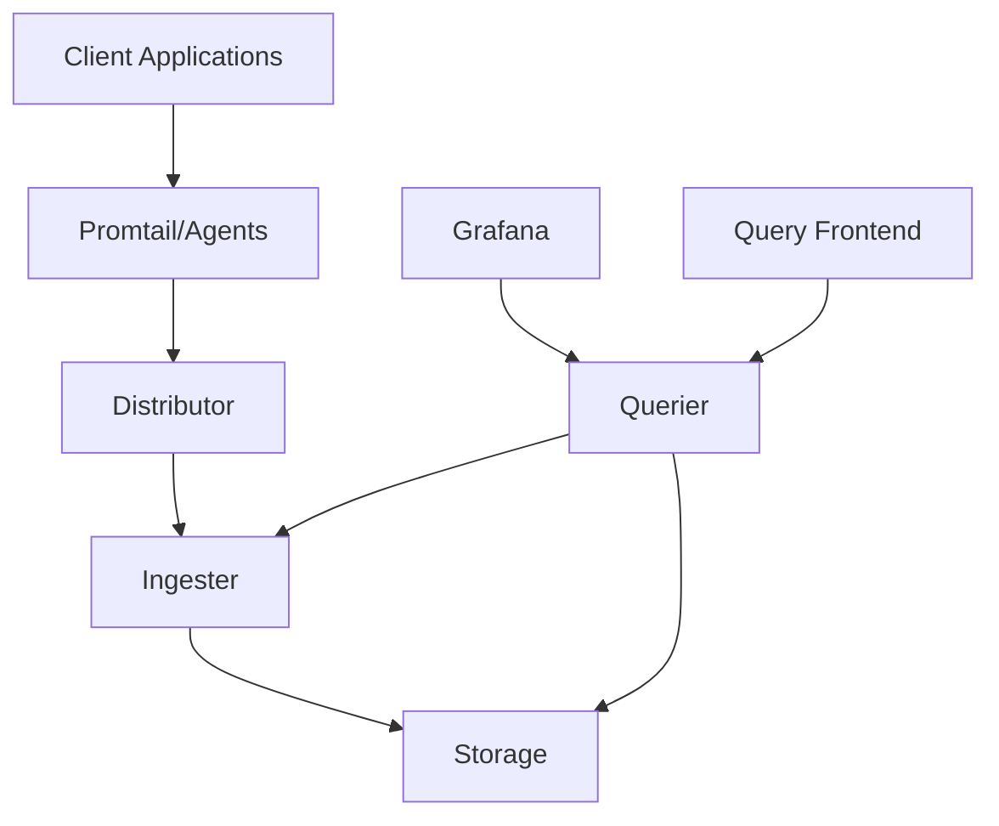

# Loki Introduction

## What is Grafana Loki?

Grafana Loki is a horizontally-scalable, highly-available log aggregation system inspired by Prometheus. It's designed to be cost-effective and easy to operate, as it doesn't index the contents of the logs but rather a set of labels for each log stream.

Loki was created by Grafana Labs in 2018 and has quickly gained popularity due to its simple architecture and tight integration with Grafana, making it an excellent choice for organizations looking to implement a modern logging solution without extensive infrastructure requirements.

## Key Features of Loki

Loki distinguishes itself from other logging systems with several key features:

- **Label-based indexing**: Rather than indexing the full text of logs, Loki indexes metadata labels, making it more efficient and cost-effective.
- **Integration with Grafana**: Seamless visualization of logs alongside metrics and traces.
- **Multi-tenancy**: Built-in support for multiple users or teams.
- **LogQL**: A powerful query language similar to Prometheus's PromQL.
- **Low resource requirements**: Designed to be lightweight and efficient.
- **Cloud-native design**: Works well in containerized environments like Kubernetes.

## Loki Architecture

Loki follows a microservices architecture that consists of several components working together:



Let's break down each component:

1. **Promtail/Agents**: Log collectors that gather logs and forward them to Loki.
2. **Distributor**: Receives logs and distributes them to ingesters.
3. **Ingester**: Writes log data to long-term storage.
4. **Storage**: Where logs are stored (object storage like S3, GCS, or local filesystem).
5. **Querier**: Handles queries from Grafana or API clients.
6. **Query Frontend**: Optional component that optimizes queries.

## Getting Started with Loki

### Prerequisites

Before diving into Loki, make sure you have:

- Basic understanding of logs and monitoring
- Docker or Kubernetes environment (recommended)
- Grafana installed (for visualization)

### Installation Methods

There are several ways to install Loki:

#### 1. Using Docker

The simplest way to try Loki is with Docker:

```bash
docker run -d --name loki -p 3100:3100 grafana/loki:latest
```

#### 2. Using Docker Compose

For a more complete setup including Grafana and Promtail:

```yaml
version: "3"
services:
  loki:
    image: grafana/loki:latest
    ports:
      - "3100:3100"
    volumes:
      - ./loki-config.yaml:/etc/loki/local-config.yaml
    command: -config.file=/etc/loki/local-config.yaml

  promtail:
    image: grafana/promtail:latest
    volumes:
      - ./promtail-config.yaml:/etc/promtail/config.yaml
      - /var/log:/var/log
    command: -config.file=/etc/promtail/config.yaml

  grafana:
    image: grafana/grafana:latest
    ports:
      - "3000:3000"
    environment:
      - GF_PATHS_PROVISIONING=/etc/grafana/provisioning
    volumes:
      - ./grafana-datasources.yaml:/etc/grafana/provisioning/datasources/datasources.yaml
```

#### 3. Using Helm for Kubernetes

If you're using Kubernetes, Helm provides an easy way to deploy Loki:

```bash
helm repo add grafana https://grafana.github.io/helm-charts
helm repo update
helm install loki grafana/loki-stack
```

## Basic Configuration

### Loki Configuration File

Loki uses a YAML configuration file. Here's a minimal example:

```yaml
auth_enabled: false

server:
  http_listen_port: 3100

ingester:
  lifecycler:
    address: 127.0.0.1
    ring:
      kvstore:
        store: inmemory
      replication_factor: 1
    final_sleep: 0s
  chunk_idle_period: 5m
  chunk_retain_period: 30s

schema_config:
  configs:
    - from: 2020-10-24
      store: boltdb-shipper
      object_store: filesystem
      schema: v11
      index:
        prefix: index_
        period: 24h

storage_config:
  boltdb_shipper:
    active_index_directory: /tmp/loki/boltdb-shipper-active
    cache_location: /tmp/loki/boltdb-shipper-cache
    cache_ttl: 24h
    shared_store: filesystem
  filesystem:
    directory: /tmp/loki/chunks

limits_config:
  enforce_metric_name: false
  reject_old_samples: true
  reject_old_samples_max_age: 168h

chunk_store_config:
  max_look_back_period: 0s

table_manager:
  retention_deletes_enabled: false
  retention_period: 0s
```

### Promtail Configuration File

Promtail is the agent that ships logs to Loki. Here's a basic configuration:

```yaml
server:
  http_listen_port: 9080
  grpc_listen_port: 0

positions:
  filename: /tmp/positions.yaml

clients:
  - url: http://loki:3100/loki/api/v1/push

scrape_configs:
  - job_name: system
    static_configs:
      - targets:
          - localhost
        labels:
          job: varlogs
          __path__: /var/log/*log
```

## Your First Logs with Loki

Once you have Loki and Promtail running, logs will start flowing into the system. Let's examine how to query and visualize them.

### Connecting Grafana to Loki

1. Open Grafana (default: http://localhost:3000)
2. Navigate to Configuration > Data Sources
3. Click "Add data source"
4. Select "Loki" from the list
5. Set the URL to http://loki:3100 (or appropriate URL)
6. Click "Save & Test"

### Basic LogQL Queries

LogQL is Loki's query language. Here are some examples:

1. **View all logs from a specific system**:
   ```
   {job="varlogs"}
   ```

2. **Filter logs containing a specific text**:
   ```
   {job="varlogs"} |= "error"
   ```

3. **Filter logs and extract specific patterns**:
   ```
   {job="varlogs"} |= "error" | pattern `<_> error: <message>`
   ```

4. **Count log occurrences over time**:
   ```
   count_over_time({job="varlogs"} |= "error"[5m])
   ```

### Example: Monitoring Application Errors

Let's imagine we have a web application that logs to `/var/log/webapp.log`. We want to monitor error rates:

1. Configure Promtail to collect these logs:
   ```yaml
   scrape_configs:
     - job_name: webapp
       static_configs:
         - targets:
             - localhost
           labels:
             job: webapp
             environment: production
             app: myapp
             __path__: /var/log/webapp.log
   ```

2. In Grafana, create a dashboard with:
   - A log panel showing real-time errors:
     ```
     {job="webapp", environment="production"} |= "ERROR"
     ```
   
   - A time series panel showing error rates:
     ```
     rate({job="webapp", environment="production"} |= "ERROR"[5m])
     ```

## Best Practices

### Effective Labeling

Labels are crucial in Loki. Follow these guidelines:

1. **Use relevant labels**: Add labels that help you filter and group logs effectively.
2. **Avoid high cardinality**: Avoid using labels with too many possible values like user IDs or IP addresses.
3. **Be consistent**: Use the same label names across different applications.

### Query Optimization

1. **Filter by labels first**: Always narrow down by labels before filtering by content.
2. **Use appropriate time ranges**: Avoid querying very large time ranges.
3. **Limit log volume**: Configure retention and apply rate limits.

### Resource Planning

1. **Storage estimation**: Plan based on log volume and retention period.
2. **Horizontal scaling**: Scale components as your log volume grows.
3. **Consider microservices mode**: Split Loki into separate components for large deployments.

## Summary

Grafana Loki provides a powerful yet resource-efficient approach to log management. By indexing metadata rather than log content, it offers a cost-effective solution that integrates seamlessly with Grafana and other observability tools.

Key takeaways:
- Loki uses label-based indexing to efficiently store and query logs
- It follows a microservices architecture with components that can be scaled independently
- LogQL provides a powerful way to filter and analyze logs
- Proper labeling strategy is crucial for effective log management with Loki

## Additional Resources

### Exercises

1. **Install Loki locally** using Docker Compose and send logs from a sample application.
2. **Create a Grafana dashboard** that shows error rates and response times from your application logs.
3. **Experiment with LogQL** by writing queries that extract specific patterns from your logs.

### Further Learning

- Explore more advanced LogQL queries
- Learn about Loki's high availability setup
- Understand how to integrate Loki with other observability tools like Prometheus and Tempo