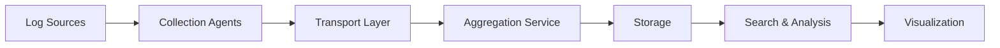

# What is Log Aggregation

## Introduction

In modern software environments, applications generate vast amounts of logs across distributed systems. A single application might run across dozens of containers, microservices, or servers, each producing their own log data. This creates a significant challenge: how do you effectively collect, process, and analyze logs from all these sources?

This is where **log aggregation** comes in. Log aggregation is the process of collecting logs from multiple sources and centralizing them in a single location for easier management, searching, and analysis.

## Why Log Aggregation Matters

Before diving deeper into log aggregation concepts, let's understand why it's so important:

- **Troubleshooting**: When an issue occurs, you need to quickly identify the root cause. Without log aggregation, you'd need to log into multiple servers and sift through different log files.
- **Observability**: Aggregated logs provide insights into application behavior, performance patterns, and user activities.
- **Security**: Centralized logs make it easier to detect security incidents and conduct forensic investigations.
- **Compliance**: Many industries require maintaining logs for audit purposes and regulatory compliance.

## Log Aggregation Architecture

A typical log aggregation system consists of several components:



Let's break down each component:

1. **Log Sources**: Applications, servers, containers, network devices, or any system that generates logs.
2. **Collection Agents**: Lightweight software that reads logs from sources and forwards them.
3. **Transport Layer**: The medium through which logs are transmitted (HTTP, TCP, message queues).
4. **Aggregation Service**: Processes incoming logs, often parsing and transforming them.
5. **Storage**: Where logs are persistently stored for retention and retrieval.
6. **Search & Analysis**: Tools to query and analyze the stored logs.
7. **Visualization**: Dashboards and interfaces to view log data.

## Log Aggregation in Grafana Loki

Grafana Loki is designed as a highly efficient log aggregation system. Unlike traditional systems that index the full content of logs, Loki only indexes metadata labels associated with each log stream, making it more cost-effective and resource-efficient.

Here's how Loki implements the log aggregation architecture:

- **Log Sources**: Any application or system generating logs.
- **Collection Agents**: Promtail, Fluentd, Logstash, or Vector can collect and forward logs to Loki.
- **Transport Layer**: HTTP API for receiving logs.
- **Aggregation Service**: Loki Distributor receives logs and handles initial processing.
- **Storage**: Loki stores log data in chunks in object storage (like S3) and indexes in a database.
- **Search & Analysis**: LogQL (Loki's query language) enables powerful searching.
- **Visualization**: Grafana provides rich visualization capabilities for logs.

## Practical Example: Setting Up Basic Log Aggregation

Let's look at a simple example of setting up log aggregation using Promtail and Loki:

### 1. Configure Promtail to collect logs

Create a `promtail-config.yaml` file:

```yaml
server:
  http_listen_port: 9080
  grpc_listen_port: 0

positions:
  filename: /tmp/positions.yaml

clients:
  - url: http://loki:3100/loki/api/v1/push

scrape_configs:
  - job_name: system
    static_configs:
      - targets:
          - localhost
        labels:
          job: varlogs
          __path__: /var/log/*log
```

### 2. Run Loki

You can run Loki with Docker:

```bash
docker run -d --name loki -p 3100:3100 grafana/loki:2.8.0
```

### 3. Run Promtail

```bash
docker run -d --name promtail -v /var/log:/var/log -v $(pwd)/promtail-config.yaml:/etc/promtail/config.yaml grafana/promtail:2.8.0 -config.file=/etc/promtail/config.yaml
```

### 4. Query logs

You can now query your logs using Grafana or the Loki API:

```
{job="varlogs"}
```

This will return all logs collected from `/var/log/*log`.

## Common Log Aggregation Challenges

Log aggregation isn't without its challenges:

1. **Volume**: Modern systems can generate terabytes of logs, creating storage and processing challenges.
2. **Parsing Complexity**: Different log formats require different parsing strategies.
3. **Real-time Processing**: Some use cases need near real-time log analysis.
4. **Cost**: Traditional log solutions can become expensive at scale.

Loki addresses many of these challenges with its unique approach to log storage and indexing.

## Best Practices for Log Aggregation

1. **Define what to log**: Not everything needs to be logged. Focus on important events.
2. **Structured logging**: Use structured formats like JSON to make parsing easier.
3. **Consistent timestamps**: Use a standardized time format, preferably UTC.
4. **Add context**: Include relevant metadata like service names, environments, and request IDs.
5. **Log levels**: Use appropriate log levels (DEBUG, INFO, WARN, ERROR) to filter logs effectively.

Here's an example of structured logging in a Node.js application:

```javascript
const logger = require('pino')();

function processOrder(order) {
  logger.info({
    event: 'order_processed',
    orderId: order.id,
    customerEmail: order.email,
    amount: order.total,
    items: order.items.length
  });
  
  // Process the order...
}
```

## How Loki Differs from Traditional Log Aggregation

Traditional log aggregation systems like Elasticsearch index the full content of logs, which provides fast searches but comes at a high resource cost. Loki takes a different approach:

1. **Label-based indexing**: Loki only indexes the metadata labels.
2. **Log streams**: Logs with the same label set are grouped into streams.
3. **Compressed storage**: Log content is compressed and stored in chunks.
4. **Query time processing**: Filtering by log content happens at query time rather than index time.

This approach makes Loki more cost-effective and easier to operate, especially at scale.

## Summary

Log aggregation is a critical component of modern application monitoring and troubleshooting. It brings together logs from multiple sources into a centralized system, making it easier to search, analyze, and visualize log data.

Grafana Loki implements log aggregation with a unique approach that focuses on efficiency and cost-effectiveness. By indexing only metadata labels and not the full log content, Loki provides a powerful yet resource-efficient solution for log aggregation.

As you continue your journey with Grafana Loki, you'll learn more about how to effectively collect, query, and analyze logs using this powerful platform.

## Exercises

1. Set up a local Loki instance and configure Promtail to collect logs from your system.
2. Write a simple application that generates structured logs and send them to Loki.
3. Create a Grafana dashboard to visualize your application logs.
4. Practice writing LogQL queries to filter logs based on different criteria.
5. Compare the resource usage of Loki with another log aggregation system like Elasticsearch.

## Further Reading

- LogQL query language
- Configuring Promtail for efficient log collection
- Setting up alerts based on log patterns
- Implementing log aggregation in Kubernetes environments