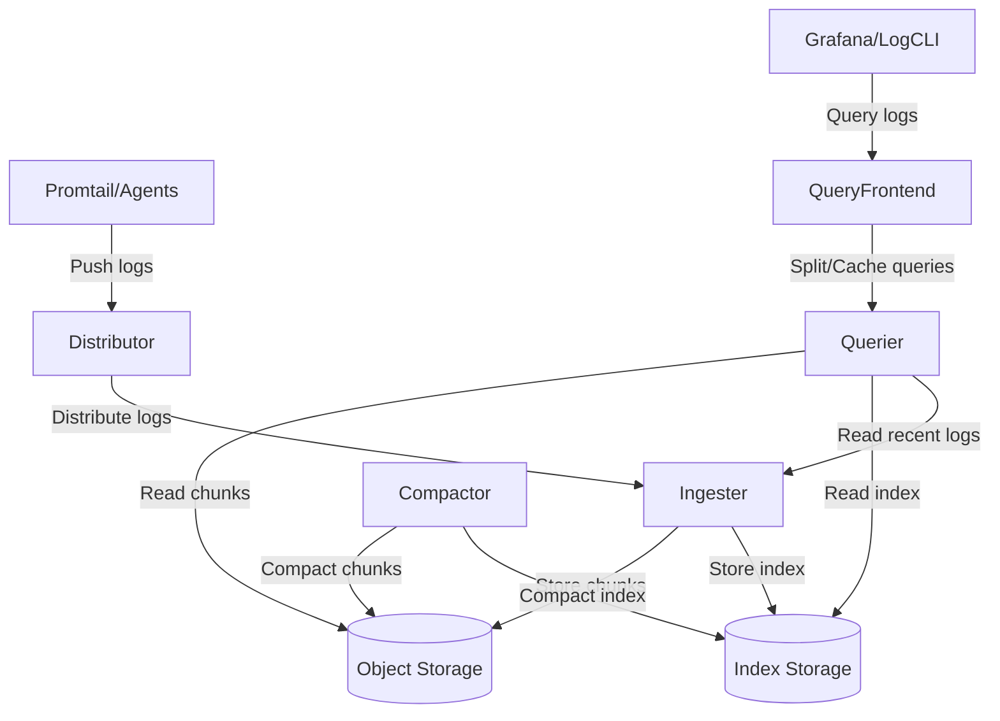
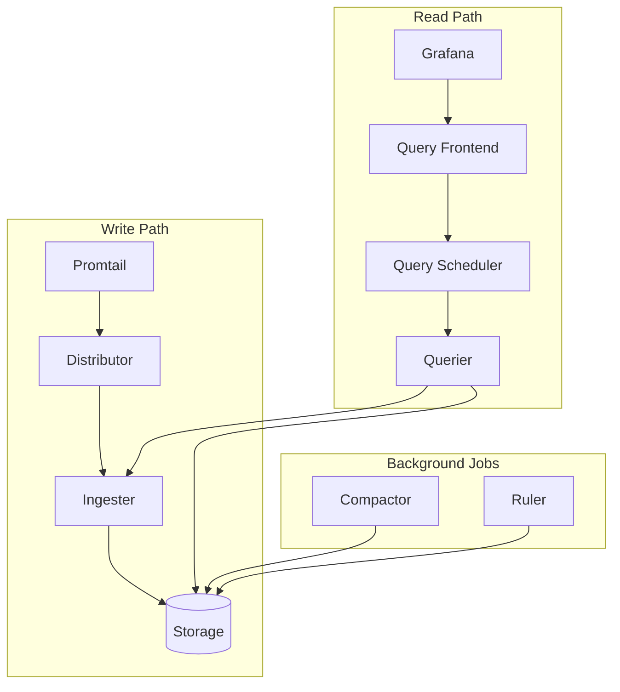

# Loki Architecture Overview

## Introduction

Grafana Loki is a horizontally scalable, highly available log aggregation system inspired by Prometheus. Unlike other logging systems that index the contents of your logs, Loki indexes only metadata about your logs (like labels), making it cost-effective and operationally simple.

In this guide, we'll explore Loki's architecture, its core components, and how they work together to provide a powerful logging solution. Understanding Loki's architecture is essential for proper deployment, scaling, and troubleshooting.

## Core Components

Loki's architecture consists of several microservices that can be deployed individually or combined, depending on your scaling needs:

1. **Distributor**
2. **Ingester**
3. **Querier**
4. **Query Frontend**
5. **Compactor**
6. **Ruler**
7. **Table Manager** (deprecated in newer versions)

Let's explore each component in detail.

## Loki's Data Flow

Before diving into each component, let's understand how data flows through Loki:



Now, let's examine each component and its responsibilities.

## Distributor

The Distributor is the entry point for logs in Loki's architecture.

### Responsibilities:

- Receives log data from clients (Promtail, Fluentd, etc.)
- Validates data structure and labels
- Applies tenant rate limiting
- Distributes log streams to ingesters using consistent hashing

### Example Configuration:

```yaml
distributor:
  ring:
    kvstore:
      store: memberlist
  receivers:
    http:
      http_listen_port: 3100
```

When a log entry arrives, the Distributor validates it and forwards it to multiple Ingesters for redundancy.

## Ingester

Ingesters write log data to long-term storage.

### Responsibilities:

- Receives log streams from Distributors
- Builds chunks of data in memory
- Compresses and writes chunks to object storage
- Maintains an in-memory index of logs for recent queries
- Participates in a hash ring for distributed coordination

### Example Configuration:

```yaml
ingester:
  lifecycler:
    ring:
      kvstore:
        store: memberlist
      replication_factor: 3
  chunk_idle_period: 30m
  chunk_target_size: 1048576
  max_chunk_age: 1h
```

Ingesters maintain log data in memory for a configurable period before flushing to storage, enabling fast queries for recent logs.

## Querier

The Querier handles log queries from clients.

### Responsibilities:

- Receives LogQL queries from clients or Query Frontend
- Determines which chunks to load based on label selectors
- Queries Ingesters for recent, non-flushed data
- Fetches and processes chunks from object storage
- Merges and filters results before returning to client

### Example:

Let's say you execute this LogQL query:

```
{app="frontend"} |= "error" | json | response_time > 100
```

The Querier:
1. Identifies chunks with the label `app="frontend"`
2. Filters log lines containing "error"
3. Parses JSON in the log lines
4. Filters for `response_time > 100`
5. Returns the matching results

## Query Frontend

The Query Frontend improves query performance and user experience.

### Responsibilities:

- Queues incoming queries to prevent overwhelming the system
- Splits large time-range queries into smaller, parallel queries
- Caches query results
- Handles retries automatically

### Example Configuration:

```yaml
query_frontend:
  compress_responses: true
  log_queries_longer_than: 10s
  query_sharding_enabled: true
  
query_scheduler:
  max_outstanding_requests_per_tenant: 100
```

With this configuration, queries longer than 10 seconds are logged, responses are compressed, and queries are sharded for parallel processing.

## Compactor

The Compactor optimizes storage for better query performance.

### Responsibilities:

- Merges small chunks into larger chunks
- Deduplicates index entries
- Reorders data for faster query access
- Enforces retention policies

### Example Configuration:

```yaml
compactor:
  working_directory: /loki/compactor
  compaction_interval: 10m
  retention_enabled: true
  retention_delete_delay: 2h
  retention_delete_worker_count: 150
```

With this configuration, the Compactor runs every 10 minutes and enforces retention policies with a 2-hour delay.

## Ruler

The Ruler evaluates recording and alerting rules.

### Responsibilities:

- Periodically evaluates LogQL queries
- Writes results to storage (for recording rules)
- Sends alerts to Alertmanager (for alerting rules)

### Example Rule Configuration:

```yaml
ruler:
  storage:
    type: local
    local:
      directory: /loki/rules
  rule_path: /loki/rules-temp
  alertmanager_url: http://alertmanager:9093
```

Example rule file:

```yaml
groups:
  - name: error_alerts
    rules:
      - alert: HighErrorRate
        expr: sum(rate({app="frontend"} |= "error" [5m])) > 10
        for: 10m
        labels:
          severity: critical
        annotations:
          summary: High error rate in frontend application
          description: Frontend application is experiencing high error rate (> 10 errors/s)
```

## Deployment Modes

Loki can be deployed in different modes depending on your scaling needs:

### 1. Monolithic Mode

All components run in a single binary - perfect for small deployments and testing.

```yaml
# Simple configuration for monolithic mode
auth_enabled: false

server:
  http_listen_port: 3100

common:
  path_prefix: /loki
  storage:
    filesystem:
      chunks_directory: /loki/chunks
      rules_directory: /loki/rules
  replication_factor: 1
```

### 2. Microservices Mode

Components run as separate services - ideal for large-scale production environments.



## Storage Options

Loki supports various storage backends:

### Index Storage
- BoltDB
- Cassandra
- BigTable
- DynamoDB

### Chunk Storage
- Local filesystem
- S3 (or S3-compatible storage)
- Google Cloud Storage
- Azure Blob Storage

### Example S3 Configuration:

```yaml
storage_config:
  aws:
    s3: s3://access_key:secret_access_key@region/bucket_name
  boltdb_shipper:
    active_index_directory: /loki/index
    cache_location: /loki/index_cache
    shared_store: s3
```

## Practical Examples

### Example 1: Setting Up a Simple Loki System

Here's how to set up a basic Loki system with Docker Compose:

```yaml
version: '3'
services:
  loki:
    image: grafana/loki:latest
    ports:
      - "3100:3100"
    volumes:
      - ./loki-config.yaml:/etc/loki/local-config.yaml
    command: -config.file=/etc/loki/local-config.yaml

  promtail:
    image: grafana/promtail:latest
    volumes:
      - ./promtail-config.yaml:/etc/promtail/config.yaml
      - /var/log:/var/log
    command: -config.file=/etc/promtail/config.yaml

  grafana:
    image: grafana/grafana:latest
    ports:
      - "3000:3000"
    environment:
      - GF_AUTH_ANONYMOUS_ENABLED=true
      - GF_AUTH_ANONYMOUS_ORG_ROLE=Admin
```

### Example 2: Scaling Loki in a Kubernetes Environment

In a production Kubernetes environment, you might deploy Loki's components separately:

```yaml
# Distributor deployment snippet
apiVersion: apps/v1
kind: Deployment
metadata:
  name: loki-distributor
spec:
  replicas: 3
  selector:
    matchLabels:
      app: loki
      component: distributor
  template:
    metadata:
      labels:
        app: loki
        component: distributor
    spec:
      containers:
        - name: distributor
          image: grafana/loki:latest
          args:
            - -target=distributor
            - -config.file=/etc/loki/config.yaml
          ports:
            - containerPort: 3100
              name: http
          volumeMounts:
            - name: config
              mountPath: /etc/loki
```

### Example 3: Using LogQL to Query Logs

LogQL is Loki's query language. Here are some examples:

1. Basic label filter:
   ```
   {app="frontend", environment="production"}
   ```

2. Filter by log content:
   ```
   {app="frontend"} |= "error" != "timeout"
   ```

3. Parse JSON and filter:
   ```
   {app="payment-service"} | json | response_time > 500
   ```

4. Rate of errors over time:
   ```
   rate({app="frontend"} |= "error" [5m])
   ```

## Performance Considerations

When operating Loki at scale, consider these performance optimizations:

1. **Chunk Size**: Balance between too many small chunks and too few large chunks
   ```yaml
   ingester:
     chunk_target_size: 1.5MB
     chunk_idle_period: 30m
   ```

2. **Caching**: Implement caching to improve query performance
   ```yaml
   chunk_store_config:
     max_look_back_period: 168h
   
   cache_config:
     enable_fifocache: true
     fifocache:
       max_size_bytes: 500MB
   ```

3. **Query Parallelism**: Control the number of concurrent queries
   ```yaml
   query_frontend:
     max_outstanding_per_tenant: 2048
     query_sharding_enabled: true
   ```

## Summary

Loki's architecture provides a scalable and efficient way to store and query logs:

- **Distributor** receives and validates logs
- **Ingester** builds chunks and stores them
- **Querier** retrieves and processes log data
- **Query Frontend** optimizes query performance
- **Compactor** optimizes storage
- **Ruler** evaluates rules for recording metrics and alerting

This architecture allows Loki to scale horizontally while keeping costs low by indexing metadata rather than log content. Its flexible deployment options mean it can run anywhere from a small laptop to a large distributed system handling terabytes of logs daily.

## Exercises

1. Set up a local Loki instance using Docker Compose
2. Configure Promtail to ship logs from a sample application
3. Write LogQL queries to filter logs based on different criteria
4. Create a recording rule that counts error rates over time
5. Configure Loki to use an S3-compatible storage backend