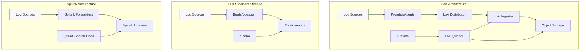
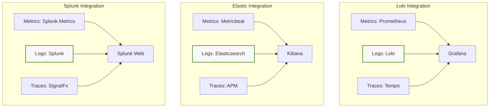

# Loki vs Other Logging Solutions

## Introduction

When it comes to managing logs in modern applications and infrastructure, there are numerous tools available, each with different approaches, capabilities, and trade-offs. Grafana Loki, often described as "Prometheus but for logs," has gained significant popularity due to its cost-efficient and straightforward approach to log aggregation and analysis.

In this guide, we'll explore how Loki compares to other popular logging solutions such as Elasticsearch, Splunk, Fluentd/Fluentbit, and traditional syslog systems. Understanding these differences will help you make informed decisions about which logging solution best fits your specific needs.

## Understanding Loki's Core Philosophy

Before diving into comparisons, it's essential to understand Loki's fundamental design philosophy:

1. **Index Labels, Not Content**: Loki indexes only metadata (labels) rather than the full content of logs.
2. **Inspired by Prometheus**: Loki uses the same label-based model as Prometheus, making it familiar to those using Prometheus for metrics.
3. **Cost-Efficiency**: By not indexing the full content, Loki reduces storage and computational requirements.
4. **Simple Operation**: Loki is designed to be easy to operate and maintain.

## Loki vs Elasticsearch

Elasticsearch is perhaps the most common comparison point for Loki, as both serve as log aggregation and search systems.

### Key Differences

| Feature | Loki | Elasticsearch |
|---------|------|---------------|
| Indexing | Only labels/metadata | Full-text indexing |
| Resource Requirements | Lower | Higher |
| Query Language | LogQL (similar to PromQL) | Elasticsearch Query DSL |
| Scaling | Horizontally scalable, but with different components | Highly scalable cluster architecture |
| Use Cases | Operational logs, metrics correlation | Full-text search, complex analytics, diverse data types |
| Storage Efficiency | Very efficient | Less efficient, but more flexible |

### Code Example: Querying Logs

In Loki (using LogQL):

```logql
{app="myapp", environment="production"} |= "error" | json | status_code >= 500
```

In Elasticsearch:

```json
{
  "query": {
    "bool": {
      "must": [
        { "match": { "message": "error" } },
        { "range": { "status_code": { "gte": 500 } } }
      ],
      "filter": [
        { "term": { "app": "myapp" } },
        { "term": { "environment": "production" } }
      ]
    }
  }
}
```

### When to Choose Loki Over Elasticsearch

- When you have budget constraints (both for infrastructure and licenses)
- When your primary use case is operational logging rather than complex analytics
- When you're already using Prometheus and want similar semantics
- When your log volumes are high but search needs are straightforward
- When you want simpler operations and maintenance

### When to Choose Elasticsearch Over Loki

- When you need powerful full-text search capabilities
- When your use cases extend beyond logs (documents, metrics, traces)
- When you need advanced analytics on log content
- When you require complex aggregations and visualizations
- When you need mature ecosystem tools and integrations

## Loki vs Splunk

Splunk is an enterprise-grade solution for searching, monitoring, and analyzing machine-generated data.

### Key Differences

| Feature | Loki | Splunk |
|---------|------|--------|
| Licensing | Open Source | Commercial, expensive licensing |
| Deployment | Self-hosted or Grafana Cloud | Self-hosted or Splunk Cloud |
| Search Capabilities | Good, but limited to LogQL | Extremely powerful SPL language |
| Enterprise Features | Growing, but limited | Comprehensive |
| Integration Ecosystem | Grafana ecosystem | Vast ecosystem of apps and integrations |
| Learning Curve | Moderate | Steep |

### Example: Monitoring Application Errors

In Loki:

```logql
sum(count_over_time({app="payment-service"} |= "error" [1h])) by (environment)
```

In Splunk (using SPL):

```splunk
index=production sourcetype=payment-service "error" 
| timechart count by environment span=1h
```

### When to Choose Loki Over Splunk

- When cost is a primary concern
- When you need open-source solutions
- When you're already using Prometheus and Grafana
- When your team is familiar with PromQL-like query languages
- When you need lightweight deployment

### When to Choose Splunk Over Loki

- When you need enterprise-grade support and features
- When regulatory compliance is a major concern
- When you need the most powerful search and analytics capabilities
- When you require pre-built solutions for specific use cases
- When budget is less of a concern

## Loki vs Fluentd/Fluent Bit

This comparison is a bit different because Fluentd and Fluent Bit are primarily log collectors and processors rather than complete logging solutions.

### Key Differences

| Feature | Loki | Fluentd/Fluent Bit |
|---------|------|-------------------|
| Primary Function | Log storage and querying | Log collection and processing |
| Architecture Role | Backend storage | Collection agent |
| Query Capabilities | Yes, via LogQL | No (requires backend) |
| Visualization | Via Grafana | No (requires backend) |

### Complementary Use

In practice, Fluentd/Fluent Bit and Loki are often used together, with Fluentd or Fluent Bit collecting and forwarding logs to Loki.


### Example: Fluent Bit Configuration to Send Logs to Loki

```ini
[INPUT]
    Name tail
    Path /var/log/containers/*.log
    Parser docker
    Tag kube.*

[OUTPUT]
    Name loki
    Match kube.*
    Host loki
    Port 3100
    Labels job=fluentbit
    Label_keys $kubernetes['namespace_name'],$kubernetes['pod_name'],$kubernetes['container_name']
```

## Loki vs Traditional Syslog Systems

Syslog is one of the oldest logging standards used in computer messaging systems.

### Key Differences

| Feature | Loki | Traditional Syslog |
|---------|------|-------------------|
| Age | Modern (2018+) | Traditional (decades old) |
| Scalability | Designed for cloud-native environments | Limited, though some modern implementations scale better |
| Query Capabilities | Powerful with LogQL | Limited or none (depends on implementation) |
| Structured Logging | First-class support | Limited support |
| Cloud-Native Integration | Excellent | Limited |

### Example: Monitoring System Authentication Failures

In Loki:

```logql
{job="syslog"} |= "authentication failure" | pattern "<_> <_> <_> <_> <user=\\w+>" | count_over_time([1h]) by (user)
```

In Traditional Syslog (using grep):

```bash
grep "authentication failure" /var/log/auth.log | awk '{print $9}' | sort | uniq -c
```

### When to Choose Loki Over Traditional Syslog

- For modern, cloud-native environments
- When you need horizontal scalability
- When you need integration with Grafana and Prometheus
- When you require structured logging support
- When you need advanced querying capabilities

### When to Choose Traditional Syslog Over Loki

- For very simple deployments
- In environments where simplicity is valued over features
- When compliance requirements mandate specific syslog implementations
- When you have existing syslog infrastructure that meets your needs

## Architectural Comparison

Let's examine how Loki's architecture differs from other logging solutions:



## Performance Comparison

One of Loki's key selling points is its resource efficiency. Let's look at approximate resource requirements for comparable setups:

| Metric | Loki | Elasticsearch | Splunk |
|--------|------|--------------|--------|
| Storage for 1TB Logs | ~1TB | ~2-3TB | ~1.5-2TB |
| Memory Requirements | Lower | Higher | Higher |
| CPU Usage | Lower | Higher | Higher |
| Query Performance | Fast for label queries, slower for content | Fast for indexed fields | Fast for indexed fields |
| Scaling Complexity | Moderate | Moderate to High | Moderate to High |

## Cost Comparison

The cost difference between these solutions can be substantial:

| Cost Factor | Loki | Elasticsearch | Splunk |
|-------------|------|--------------|--------|
| License | Open Source (Free) | Basic features free, X-Pack features paid | Commercial (expensive) |
| Infrastructure | Lower | Higher | Higher |
| Operational Complexity | Lower | Higher | Higher |
| Cloud-Managed Options | Grafana Cloud | Elastic Cloud, AWS, etc. | Splunk Cloud |

## Integration with the Observability Stack

A key consideration is how well each solution integrates with your broader observability strategy:



### Practical Example: Full-Stack Monitoring

Let's look at how to set up basic monitoring for a web application across these platforms:

**With Loki:**

1. Deploy Promtail on your application servers
2. Configure Promtail to collect logs with appropriate labels:

```yaml
scrape_configs:
  - job_name: application_logs
    static_configs:
      - targets:
          - localhost
        labels:
          job: webapp
          environment: production
          component: api
    pipeline_stages:
      - json:
          expressions:
            level: level
            user: user
            status_code: status_code
```

3. Query in Grafana using LogQL:

```logql
{job="webapp", component="api"} 
| json 
| status_code>=500 and level="error" 
| line_format "{{.level}} - User {{.user}} experienced error: {{.message}}"
```

**With Elasticsearch:**

1. Deploy Filebeat on your application servers
2. Configure Filebeat with appropriate processors:

```yaml
filebeat.inputs:
- type: log
  enabled: true
  paths:
    - /var/log/webapp/*.log
  json.keys_under_root: true
  fields:
    component: api
    environment: production
  fields_under_root: true
processors:
  - add_host_metadata: ~
```

3. Query in Kibana:

```elasticsearch
component:api AND environment:production AND status_code:>=500 AND level:error
```

## Summary: When to Choose Loki

After comparing Loki with various logging solutions, here's a summary of when Loki might be the right choice:

1. **Cost Sensitivity**: When operating under tight budgets, Loki offers significant cost advantages.
2. **Prometheus Integration**: When you're already using Prometheus for metrics and want consistency.
3. **Operational Simplicity**: When you value easier operations and maintenance.
4. **Cloud-Native Environments**: When working with Kubernetes and containerized applications.
5. **Specific Use Cases**: For operational logging rather than complex analytics.

### When Other Solutions Might Be Better:

1. **Full-Text Search Requirements**: When you need powerful search across all log content.
2. **Complex Analytics**: When your primary goal is deep analytical capabilities.
3. **Enterprise Support**: When you require comprehensive enterprise support and features.
4. **Regulatory Compliance**: When specific compliance requirements demand particular features.
5. **Legacy System Integration**: When you need extensive integration with legacy systems.

## Practical Exercise: Setting Up Loki and Comparing with Other Solutions

As a hands-on exercise, try setting up Loki alongside another logging solution in your environment:

1. Deploy Loki using Docker Compose or Kubernetes
2. Set up Promtail to collect logs
3. Configure Grafana to query Loki
4. Compare the setup complexity, resource usage, and query capabilities with your existing solution

## Additional Resources

To learn more about Loki and other logging solutions:

- [Grafana Loki Documentation](https://grafana.com/docs/loki/latest/)
- [LogQL Query Language Guide](https://grafana.com/docs/loki/latest/logql/)
- [Elasticsearch Documentation](https://www.elastic.co/guide/index.html)
- [Splunk Documentation](https://docs.splunk.com/)
- [Fluent Bit Documentation](https://docs.fluentbit.io/)

## Conclusion

Choosing the right logging solution depends on your specific requirements, existing infrastructure, budget constraints, and technical expertise. Loki offers a compelling option for organizations looking for a cost-efficient, scalable logging solution that integrates well with the Prometheus and Grafana ecosystem. However, it's important to understand its limitations compared to more established solutions like Elasticsearch and Splunk.

By understanding the strengths and weaknesses of each solution, you can make an informed decision that best meets your organization's needs and constraints.