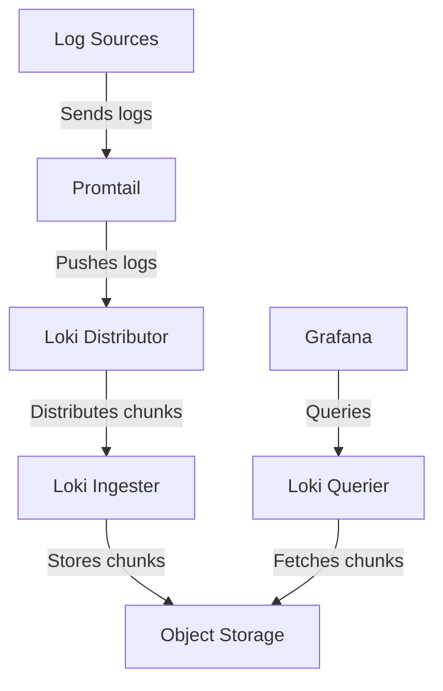

# Loki Environment Setup

## Introduction

Grafana Loki is a horizontally scalable, highly available log aggregation system designed to be cost-effective and easy to operate. It's often referred to as "Prometheus, but for logs," as it uses the same service discovery and label-based approach that made Prometheus popular for metrics.

In this tutorial, we'll walk through the process of setting up a Loki environment for local development and testing. By the end, you'll have a functional Loki setup that can collect, query, and visualize logs.

## Prerequisites

Before proceeding, ensure you have the following installed:
- Docker and Docker Compose
- Git
- A terminal or command-line interface
- Basic knowledge of containerization concepts

## Setting Up Loki: Options Overview

There are several ways to set up Loki:

1. **Docker**: The simplest approach for local development
2. **Kubernetes with Helm**: For production environments
3. **Binary installation**: For custom deployments
4. **Grafana Cloud**: Managed service option

We'll focus primarily on the Docker approach, which is ideal for beginners and local development.

## Local Loki Setup Using Docker Compose

Let's set up a complete logging stack with Docker Compose, including:
- Loki (log aggregation)
- Promtail (log collector)
- Grafana (visualization)

### Step 1: Create a Project Directory

First, create a directory for your Loki project:

```bash
mkdir loki-setup
cd loki-setup
```

### Step 2: Create a Docker Compose Configuration

Create a file named `docker-compose.yml` with the following content:

```yaml
version: "3"

services:
  loki:
    image: grafana/loki:2.9.0
    ports:
      - "3100:3100"
    volumes:
      - ./loki-config.yaml:/etc/loki/local-config.yaml
    command: -config.file=/etc/loki/local-config.yaml

  promtail:
    image: grafana/promtail:2.9.0
    volumes:
      - ./promtail-config.yaml:/etc/promtail/config.yaml
      - /var/log:/var/log
    command: -config.file=/etc/promtail/config.yaml

  grafana:
    image: grafana/grafana:10.0.0
    ports:
      - "3000:3000"
    environment:
      - GF_AUTH_ANONYMOUS_ENABLED=true
      - GF_AUTH_ANONYMOUS_ORG_ROLE=Admin
    volumes:
      - ./grafana-datasources.yaml:/etc/grafana/provisioning/datasources/datasources.yaml
```

### Step 3: Configure Loki

Create a file named `loki-config.yaml` with the following content:

```yaml
auth_enabled: false

server:
  http_listen_port: 3100
  grpc_listen_port: 9096

common:
  path_prefix: /tmp/loki
  storage:
    filesystem:
      chunks_directory: /tmp/loki/chunks
      rules_directory: /tmp/loki/rules
  replication_factor: 1
  ring:
    instance_addr: 127.0.0.1
    kvstore:
      store: inmemory

schema_config:
  configs:
    - from: 2020-10-24
      store: boltdb-shipper
      object_store: filesystem
      schema: v11
      index:
        prefix: index_
        period: 24h

ruler:
  alertmanager_url: http://localhost:9093

limits_config:
  enforce_metric_name: false
  reject_old_samples: true
  reject_old_samples_max_age: 168h
```

### Step 4: Configure Promtail

Create a file named `promtail-config.yaml`:

```yaml
server:
  http_listen_port: 9080
  grpc_listen_port: 0

positions:
  filename: /tmp/positions.yaml

clients:
  - url: http://loki:3100/loki/api/v1/push

scrape_configs:
  - job_name: system
    static_configs:
      - targets:
          - localhost
        labels:
          job: varlogs
          __path__: /var/log/*log

  - job_name: docker
    static_configs:
      - targets:
          - localhost
        labels:
          job: docker
          __path__: /var/lib/docker/containers/*/*log
```

### Step 5: Configure Grafana Data Source

Create a file named `grafana-datasources.yaml`:

```yaml
apiVersion: 1

datasources:
  - name: Loki
    type: loki
    access: proxy
    url: http://loki:3100
    isDefault: true
```

### Step 6: Start the Stack

Launch the entire logging stack with:

```bash
docker-compose up -d
```

You should see the containers starting:

```
Creating loki-setup_loki_1      ... done
Creating loki-setup_promtail_1  ... done
Creating loki-setup_grafana_1   ... done
```

### Step 7: Access Grafana

Open your browser and navigate to:

```
http://localhost:3000
```

You'll be automatically logged in as an admin (based on our configuration).

## Verifying Your Loki Setup

Let's verify that everything is working correctly:

1. In Grafana, go to "Explore" (compass icon in the left sidebar)
2. Ensure "Loki" is selected as the data source
3. Enter a simple LogQL query: `{job="varlogs"}`
4. Click "Run Query"

You should see logs from your system appearing in the results panel.

## Alternative Setup: Using Tanka and Jsonnet

For more advanced users or production deployments, Grafana Labs recommends using Tanka and Jsonnet. Here's a brief overview:

1. Install Tanka and Jsonnet:

```bash
go install github.com/grafana/tanka/cmd/tk@latest
go install github.com/jsonnet-bundler/jsonnet-bundler/cmd/jb@latest
```

2. Create a new project:

```bash
mkdir loki-production && cd loki-production
tk init
```

3. Install Loki Jsonnet libraries:

```bash
jb install github.com/grafana/loki/production/ksonnet/loki
```

4. Create environments and configure as needed.

This approach offers more flexibility but is more complex for beginners.

## Loki Architecture Overview

<div>

</div>

Understanding Loki's architecture helps visualize how logs flow through the system:

1. **Log Sources**: Your applications, services, and system logs
2. **Promtail**: Collects and labels logs before sending to Loki
3. **Loki Distributor**: Receives and validates incoming logs
4. **Loki Ingester**: Compresses logs into chunks and stores them
5. **Object Storage**: Where log data is persisted (local filesystem in our setup)
6. **Loki Querier**: Processes log queries from Grafana
7. **Grafana**: Visualizes and explores logs

## Basic Loki Configuration

Understanding the key components of Loki's configuration file helps with customization:

| Component | Description |
|-----------|-------------|
| `auth_enabled` | Toggle authentication |
| `server` | HTTP and gRPC API settings |
| `common` | Shared settings across components |
| `schema_config` | How logs are stored and indexed |
| `limits_config` | Resource usage limitations |
| `ruler` | Alert and rule management |

## Troubleshooting Common Issues

### Loki Container Not Starting

Check if port 3100 is already in use:

```bash
lsof -i :3100
```

If it shows existing processes, kill them or change Loki's port in the docker-compose.yml.

### No Logs Appearing in Grafana

1. Check if Promtail is running:

```bash
docker-compose ps promtail
```

2. Verify Promtail's configuration targets valid log paths
3. Check Loki logs for errors:

```bash
docker-compose logs loki
```

### High Memory Usage

Loki can be memory-intensive. Adjust the `limits_config` in your Loki configuration:

```yaml
limits_config:
  ingestion_rate_mb: 4
  ingestion_burst_size_mb: 6
  max_global_streams_per_user: 5000
```

## Best Practices for Development

1. **Label Efficiently**: Too many label values can degrade performance
2. **Use Dynamic Labels**: Label with service names, not unique identifiers
3. **Structured Logging**: Use JSON logging in applications for better querying
4. **Regular Pruning**: Configure retention periods for logs
5. **Monitor Loki Itself**: Set up metrics to watch Loki's performance

## Summary

In this tutorial, you've learned how to:
- Set up Loki, Promtail, and Grafana using Docker Compose
- Configure each component of the logging stack
- Verify the setup is working
- Understand Loki's architecture
- Troubleshoot common issues

With this foundation, you're ready to start collecting and analyzing logs from your applications and systems.

## Next Steps

- Explore LogQL, Loki's query language
- Configure Promtail to scrape logs from your applications
- Set up alerts for specific log patterns
- Integrate Loki with other observability tools

## Additional Resources

- [Official Loki Documentation](https://grafana.com/docs/loki/latest/)
- [LogQL Query Language Guide](https://grafana.com/docs/loki/latest/logql/)
- [Grafana Community Forums](https://community.grafana.com/)
- [Promtail Configuration Reference](https://grafana.com/docs/loki/latest/clients/promtail/configuration/)