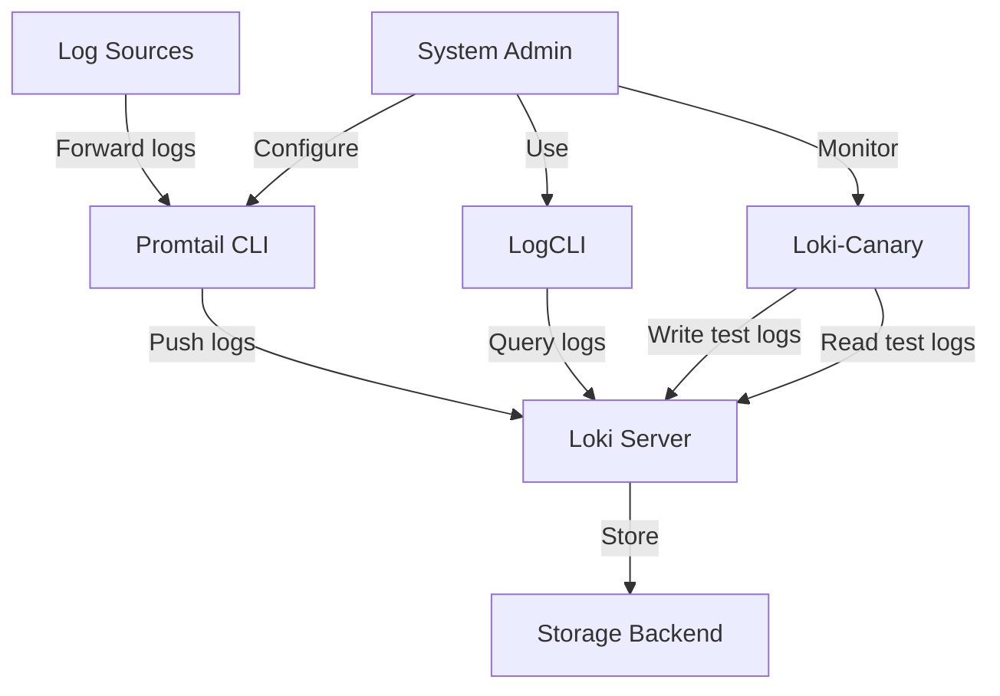

# Loki Command Line Tools

## Introduction

Grafana Loki provides powerful command line tools that allow you to interact with your logs directly from your terminal. These tools are essential for developers and system administrators who need to troubleshoot issues, analyze log data, or manage Loki configurations without relying on the Grafana UI.

In this guide, we'll explore the various command line utilities that come with Loki, their use cases, and how they can be integrated into your workflow. By the end of this guide, you'll be comfortable using these tools to streamline your log management processes.

## Prerequisites

Before diving into Loki's command line tools, make sure you have:

- Basic familiarity with command line interfaces
- Loki server installed and running
- Proper access permissions to your Loki instance

## Loki CLI Overview

Loki offers several command-line utilities, each designed for specific tasks:

1. **logcli** - The primary CLI tool for querying logs
2. **loki-canary** - A monitoring tool to verify Loki's functionality
3. **promtail** - A log shipping agent (with its own CLI options)

Let's explore each of these tools in detail.

## LogCLI

LogCLI is the main command line interface for querying and analyzing logs stored in Loki. It allows you to run LogQL queries directly from your terminal.

### Installation

To install LogCLI:

```bash
go get github.com/grafana/loki/cmd/logcli
```

Or download pre-built binaries from the [Loki releases page](https://github.com/grafana/loki/releases).

### Configuration

Before using LogCLI, you need to configure it to connect to your Loki instance. You can do this through environment variables:

```bash
export LOKI_ADDR=https://loki.example.com
# If authentication is required
export LOKI_USERNAME=your_username
export LOKI_PASSWORD=your_password
```

Alternatively, you can create a configuration file at `~/.lokiconfig.yaml`:

```yaml
default:
  addr: https://loki.example.com
  username: your_username
  password: your_password
```

### Basic Usage

The basic syntax for LogCLI is:

```bash
logcli query [options] "<LogQL query>"
```

Let's explore some examples:

#### Example 1: Simple Query

To retrieve logs from a specific application:

```bash
logcli query '{app="myapp"}'
```

Output:
```
2023-03-15T12:34:56Z {app="myapp"} Application started successfully
2023-03-15T12:35:12Z {app="myapp"} Connected to database
2023-03-15T12:35:18Z {app="myapp"} Processing user request id=12345
```

#### Example 2: Using Time Ranges

Query logs from the last 30 minutes:

```bash
logcli query --since=30m '{app="myapp"}'
```

#### Example 3: Filtering with LogQL

Find all error logs in your application:

```bash
logcli query '{app="myapp"} |~ "error|exception|fail" | json'
```

Output:
```
2023-03-15T13:05:23Z {app="myapp"} {"level":"error","msg":"Failed to connect to database","error":"connection timeout"}
2023-03-15T13:12:45Z {app="myapp"} {"level":"error","msg":"Exception while processing request","requestId":"54321"}
```

### Advanced LogCLI Features

#### Labels and Metadata

View available labels in your logs:

```bash
logcli labels
```

Output:
```
app
environment
host
instance
job
```

View values for a specific label:

```bash
logcli labels app
```

Output:
```
myapp
auth-service
api-gateway
```

#### Output Formatting

LogCLI offers various output formats:

```bash
# Default format with timestamp and labels
logcli query '{app="myapp"}' 

# Raw log lines only
logcli query '{app="myapp"}' --output=raw

# JSON format
logcli query '{app="myapp"}' --output=jsonl
```

#### Analyzing Metrics with LogCLI

LogCLI can also execute metric queries using LogQL:

```bash
logcli series --analyze-labels '{app="myapp"}'
```

Output:
```
Label: app
Value: myapp
Count: 1532

Label: environment
Value: production
Count: 1423
Value: staging
Count: 109
```

## Loki-Canary

Loki-canary is a monitoring tool that helps verify that Loki is functioning correctly. It writes and queries log entries to ensure the logging pipeline is working properly.

### Installation

```bash
go get github.com/grafana/loki/cmd/loki-canary
```

### Basic Usage

Running loki-canary with default settings:

```bash
loki-canary -addr=https://loki.example.com
```

Output:
```
level=info ts=2023-03-15T14:00:00Z caller=main.go:58 msg="Starting Loki Canary"
level=info ts=2023-03-15T14:00:01Z caller=canary.go:123 msg="Sent log entry" entry="log entry 2023-03-15 14:00:01.123"
level=info ts=2023-03-15T14:00:02Z caller=canary.go:165 msg="Found log entry" entry="log entry 2023-03-15 14:00:01.123" latency=980ms
```

### Configuration Options

Key configuration options for loki-canary:

```bash
loki-canary \
  -addr=https://loki.example.com \
  -tls-skip-verify \
  -interval=10s \
  -size=100 \
  -tenant-id=team-a
```

These options define:
- The Loki server address
- Whether to skip TLS verification
- The interval between log entries
- The size of log entries
- The tenant ID when using multi-tenancy

## Promtail CLI

Promtail is Loki's log shipping agent, responsible for gathering logs and sending them to Loki. While primarily used as a service, it offers some useful command line capabilities.

### Basic Commands

Check Promtail version:

```bash
promtail --version
```

Output:
```
promtail, version 2.8.0 (branch: main, revision: a5e7408cd)
```

Validate a configuration file:

```bash
promtail --dry-run --config.file=promtail-config.yaml
```

Output:
```
level=info ts=2023-03-15T15:30:00Z caller=main.go:118 msg="Starting Promtail" version="(version=2.8.0, branch=main, revision=a5e7408cd)"
level=info ts=2023-03-15T15:30:00Z caller=main.go:119 msg="Build context" go="go1.19.5" user="user-name" date="2023-01-15T12:00:00Z"
level=info ts=2023-03-15T15:30:00Z caller=main.go:146 msg="Dry run successful"
```

### Debugging with Promtail

Run Promtail with enhanced logging:

```bash
promtail --config.file=promtail-config.yaml --log.level=debug
```

## Integrating CLI Tools into Your Workflow

Let's look at some practical examples of how to integrate these tools into your daily workflow.

### Example: Creating a Monitoring Script

This Bash script uses loki-canary to monitor Loki and alert if issues are detected:

```bash
#!/bin/bash

loki-canary -addr=https://loki.example.com -interval=30s | while read line; do
  if echo "$line" | grep -q "failed to write"; then
    echo "ALERT: Loki write failure detected at $(date)"
    # Send notification (e.g., via email, Slack)
  fi
  
  if echo "$line" | grep -q "exceeded max wait"; then
    echo "ALERT: Loki query latency issue detected at $(date)"
    # Send notification
  fi
done
```

### Example: Automated Log Analysis

This script uses LogCLI to extract error patterns and generate a report:

```bash
#!/bin/bash

# Set time range
START_TIME=$(date -d "1 hour ago" -u +"%Y-%m-%dT%H:%M:%SZ")
END_TIME=$(date -u +"%Y-%m-%dT%H:%M:%SZ")

# Run query and save results
logcli query --from=$START_TIME --to=$END_TIME '{app="myapp"} |~ "error|exception|fail"' --output=jsonl > errors.json

# Generate summary report
echo "Error Report $(date)" > report.txt
echo "====================" >> report.txt
echo "" >> report.txt
echo "Total errors: $(cat errors.json | wc -l)" >> report.txt
echo "" >> report.txt
echo "Top error types:" >> report.txt
cat errors.json | grep -o '"error":"[^"]*"' | sort | uniq -c | sort -nr | head -5 >> report.txt
```

## LogCLI and LogQL Integration

LogCLI's power is amplified when combined with LogQL, Loki's query language. Here's how to leverage this combination:

### Working with JSON Logs

Parse and filter JSON logs:

```bash
logcli query '{app="myapp"} | json | level="error" | line_format "{{.timestamp}} {{.level}}: {{.message}}"'
```

Output:
```
2023-03-15T16:12:34Z error: Database connection failed
2023-03-15T16:18:56Z error: API request timeout
```

### Aggregating Log Data

Count errors by type:

```bash
logcli query 'count_over_time({app="myapp"} |~ "error" [1h]) by (error_type)'
```

## System Administration with CLI Tools

These tools are valuable for system administrators managing Loki deployments.

### Monitoring Loki's Health

Check Loki's ingestion rate:

```bash
logcli series --analyze-labels '{job="loki"}' | grep -A 5 "bytes_processed"
```

### Backing Up Labels

Export all label information:

```bash
mkdir -p loki-backup
logcli labels > loki-backup/all-labels.txt

# For each label, get all values
for label in $(cat loki-backup/all-labels.txt); do
  logcli labels $label > "loki-backup/label-${label}.txt"
done
```

## Understanding Loki's Architecture Through the CLI

Using Loki's CLI tools helps understand its architecture. Here's a diagram showing how these components interact:



## Troubleshooting Common Issues

### Connection Problems

If LogCLI fails to connect:

```bash
logcli query '{app="myapp"}' --addr=https://loki.example.com --username=user --password=pass
```

### Debugging Query Performance

For slow queries, analyze execution:

```bash
logcli query '{app="myapp"}' --stats
```

Output:
```
Query statistics:
Querier query time: 1.5s
Store query time: 1.2s
Ingester query time: 0.3s
```

### Rate Limiting Issues

If hitting rate limits:

```bash
logcli query '{app="myapp"}' --limit-bytes=10485760
```

## Summary

Loki's command line tools provide powerful capabilities for interacting with your logs directly from the terminal. By mastering LogCLI, loki-canary, and Promtail's CLI options, you can:

- Query and analyze logs without using the Grafana UI
- Monitor your Loki deployment's health
- Troubleshoot issues more efficiently
- Automate log management tasks
- Integrate log analysis into your existing workflows

These tools are essential components of the Loki ecosystem, enabling more flexible and efficient log management.

## Additional Resources

- [Official Loki Documentation](https://grafana.com/docs/loki/latest/)
- [LogQL Query Language Reference](https://grafana.com/docs/loki/latest/logql/)
- [Grafana Loki GitHub Repository](https://github.com/grafana/loki)

## Exercises

1. Set up LogCLI to connect to your Loki instance and run a basic query to retrieve the last 10 log entries.
2. Create a shell script that uses LogCLI to generate a daily report of error logs.
3. Configure loki-canary to monitor your Loki deployment and send an alert if logs take more than 5 seconds to become queryable.
4. Use LogCLI to find all logs containing a specific error message across multiple applications.
5. Create a custom LogQL query using LogCLI that extracts and aggregates specific fields from your JSON logs.