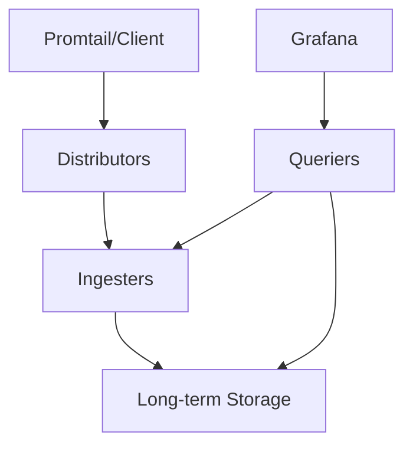

# Loki Configuration Basics

## Introduction

Grafana Loki is a horizontally scalable, highly available log aggregation system inspired by Prometheus. Unlike other logging systems that index the contents of logs, Loki indexes only metadata about your logs (labels), making it cost-effective and efficient. This guide covers the essential configuration aspects you need to understand to get started with Loki.

Before diving into configurations, it's important to understand that Loki operates with three primary components:
- **Distributor**: Receives and processes incoming logs
- **Ingester**: Writes log data to long-term storage
- **Querier**: Handles search queries from Grafana or LogCLI

Let's explore how to configure these components and more.

## Basic Configuration Structure

Loki uses YAML for its configuration files. A typical Loki configuration has several main sections:

- `server`: Defines the HTTP and gRPC server settings
- `distributor`: Configures how logs are received and distributed
- `ingester`: Manages how logs are processed and stored
- `storage_config`: Defines where and how logs are stored
- `schema_config`: Controls the schema for storing logs
- `limits_config`: Sets various system limits
- `chunk_store_config`: Configures chunk management
- `table_manager`: Manages database tables for indexes
- `ruler`: Configures the Loki ruler for log-based alerting
- `frontend`: Defines frontend-related settings

## Creating Your First Loki Configuration

Let's start with a minimal `loki-config.yaml` file that will work for local testing:

```yaml
auth_enabled: false

server:
  http_listen_port: 3100

ingester:
  lifecycler:
    address: 127.0.0.1
    ring:
      kvstore:
        store: inmemory
      replication_factor: 1
    final_sleep: 0s
  chunk_idle_period: 5m
  chunk_retain_period: 30s

schema_config:
  configs:
    - from: 2020-10-24
      store: boltdb-shipper
      object_store: filesystem
      schema: v11
      index:
        prefix: index_
        period: 24h

storage_config:
  boltdb_shipper:
    active_index_directory: /tmp/loki/boltdb-shipper-active
    cache_location: /tmp/loki/boltdb-shipper-cache
    cache_ttl: 24h
    shared_store: filesystem
  filesystem:
    directory: /tmp/loki/chunks

limits_config:
  enforce_metric_name: false
  reject_old_samples: true
  reject_old_samples_max_age: 168h

compactor:
  working_directory: /tmp/loki/compactor
  shared_store: filesystem
```

## Understanding Key Configuration Sections

### Server Configuration

The `server` section defines how Loki exposes its HTTP and gRPC endpoints:

```yaml
server:
  http_listen_port: 3100
  grpc_listen_port: 9096
  http_server_read_timeout: 30s
  http_server_write_timeout: 30s
  http_server_idle_timeout: 120s
  grpc_server_max_recv_msg_size: 4194304
  grpc_server_max_send_msg_size: 4194304
```

- `http_listen_port`: The port for the HTTP server (default is 3100)
- `grpc_listen_port`: The port for the gRPC server
- Various timeout settings for connection management

### Storage Configuration

The `storage_config` section is crucial as it defines where and how Loki stores its data:

```yaml
storage_config:
  boltdb_shipper:
    active_index_directory: /tmp/loki/boltdb-shipper-active
    cache_location: /tmp/loki/boltdb-shipper-cache
    cache_ttl: 24h
    shared_store: filesystem
  filesystem:
    directory: /tmp/loki/chunks
```

Loki supports multiple backends for storage:
- Local filesystem (as shown above)
- AWS S3
- Google Cloud Storage
- Azure Blob Storage
- Swift
- MinIO

For production, you might use a configuration like this for S3:

```yaml
storage_config:
  aws:
    s3: s3://access_key:secret_key@region/bucket_name
    s3forcepathstyle: true
```

### Schema Configuration

The `schema_config` defines how Loki structures and stores its data:

```yaml
schema_config:
  configs:
    - from: 2020-10-24
      store: boltdb-shipper
      object_store: filesystem
      schema: v11
      index:
        prefix: index_
        period: 24h
```

- `from`: The date from which this schema configuration is valid
- `store`: The type of index store (boltdb-shipper is recommended)
- `object_store`: Where the chunks are stored
- `schema`: The schema version to use
- `index`: Configuration for the index itself

### Limits Configuration

The `limits_config` section allows you to set various constraints on Loki's operation:

```yaml
limits_config:
  ingestion_rate_mb: 4
  ingestion_burst_size_mb: 6
  max_query_parallelism: 32
  max_query_series: 500
  retention_period: 744h
```

These settings help protect your Loki installation from excessive resource usage:
- `ingestion_rate_mb`: Maximum ingestion rate in MB per second
- `ingestion_burst_size_mb`: Maximum ingestion burst size in MB
- `max_query_parallelism`: Maximum number of queries that can run in parallel
- `max_query_series`: Maximum number of series a query can return
- `retention_period`: How long to retain logs (e.g., 744h = 31 days)

## Running Loki with Your Configuration

Once you have your configuration file, you can run Loki with:

```bash
loki -config.file=/path/to/loki-config.yaml
```

You can verify it's running by accessing:
```
http://localhost:3100/ready
```

Which should return `ready` if Loki is properly initialized.

## Multi-tenancy Configuration

Loki supports multi-tenancy, allowing multiple users or teams to share a Loki instance while keeping their logs separate:

```yaml
auth_enabled: true

server:
  http_listen_port: 3100

distributor:
  ring:
    kvstore:
      store: inmemory

ingester:
  lifecycler:
    ring:
      kvstore:
        store: inmemory
      replication_factor: 1

# ... rest of config ...

# Add multi-tenant authentication
frontend:
  compress_responses: true
  tenant_id_header: X-Scope-OrgID
```

With this configuration, each request needs to include an `X-Scope-OrgID` header to identify the tenant.

## Distributed Deployment Configuration

For production environments, you'll typically run Loki in a distributed fashion. Here's a simplified example of configuring Loki components to run separately:



Each component would have its own configuration file. For example, a distributor configuration might look like:

```yaml
target: distributor

server:
  http_listen_port: 3100

distributor:
  ring:
    kvstore:
      store: consul
      prefix: loki/
      consul:
        host: consul:8500

ingester_client:
  pool_config:
    health_check_ingesters: true
  remote_timeout: 1s

frontend_worker:
  frontend_address: query-frontend:9095

common:
  path_prefix: /loki
  storage:
    s3:
      endpoint: minio:9000
      insecure: true
      bucketnames: loki-data
      access_key_id: loki
      secret_access_key: supersecret
      s3forcepathstyle: true
```

## Practical Example: Configuring Log Retention

Let's look at a common real-world requirement: configuring how long logs are kept.

```yaml
# Set global retention to 30 days
limits_config:
  retention_period: 720h

# Override retention for specific tenants
tenant_retention:
  development_team: 168h  # 7 days for dev logs
  critical_services: 2160h  # 90 days for critical services

compactor:
  working_directory: /tmp/loki/compactor
  shared_store: filesystem
  compaction_interval: 10m
```

This configuration sets different retention periods based on the importance of the logs, balancing cost and data availability.

## Optimization Techniques

As your log volume grows, you'll need to optimize your configuration. Here are some recommendations:

### Chunk Caching

```yaml
chunk_store_config:
  chunk_cache_config:
    enable_fifocache: true
    fifo_cache:
      max_size_bytes: 1073741824  # 1GB
      validity: 24h
```

### Query Optimization

```yaml
frontend:
  compress_responses: true
  max_outstanding_per_tenant: 2048
  log_queries_longer_than: 10s
  split_queries_by_interval: 30m
```

### Resource Allocation for Ingesters

```yaml
ingester:
  chunk_block_size: 262144
  chunk_idle_period: 30m
  chunk_target_size: 1572864
  max_chunk_age: 1h
  max_transfer_retries: 0
```

## Common Configuration Mistakes and How to Avoid Them

1. **Insufficient Storage Planning**:
   Always calculate your expected log volume and set appropriate retention periods.

2. **Missing Authentication in Production**:
   Always enable authentication for production deployments:
   ```yaml
   auth_enabled: true
   ```

3. **Inadequate Query Limits**:
   Set reasonable query limits to prevent resource exhaustion:
   ```yaml
   limits_config:
     max_query_length: 721h  # Max query window of 30 days
     max_query_parallelism: 14
     max_query_series: 500
   ```

4. **Forgetting to Separate Read/Write Paths**:
   In large deployments, separate these for better performance.

## Summary

This guide has introduced you to the basics of Loki configuration:

- Basic configuration structure and key components
- Storage and schema configuration options
- Multi-tenancy and scaling considerations
- Practical examples for common scenarios
- Optimization techniques

By understanding these fundamental concepts, you'll be well-equipped to start using Loki for efficient log management in your environment.

## Additional Resources

- Practice configuring Loki for different storage backends
- Experiment with different schema configurations to understand their impact
- Try setting up a distributed Loki deployment with separate components
- Explore Loki's integration with other observability tools like Prometheus and Tempo

## Exercises

1. Create a Loki configuration that uses S3-compatible storage.
2. Modify the basic configuration to support multiple tenants.
3. Configure Loki with different retention periods for different types of logs.
4. Set up a configuration for a high-availability Loki deployment.