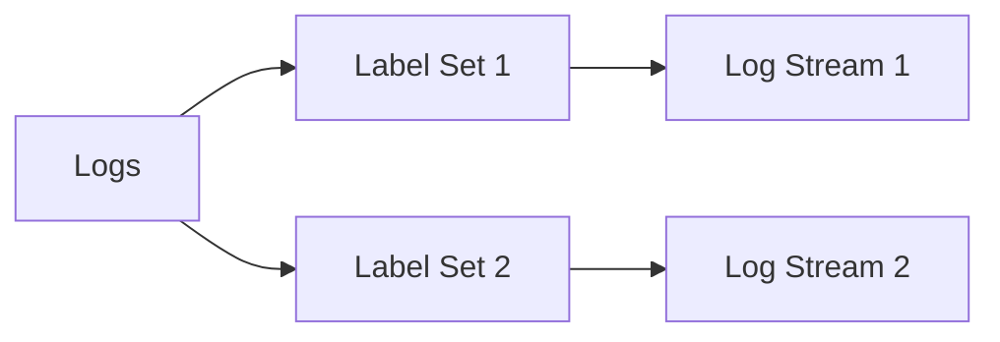
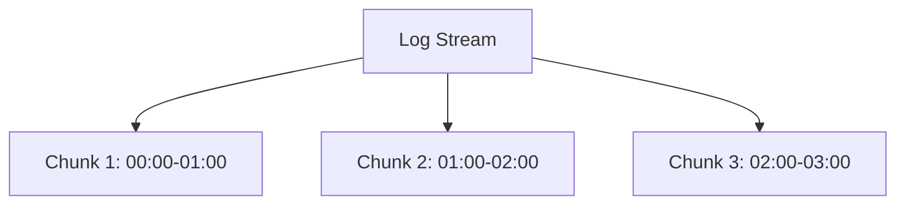
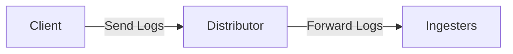
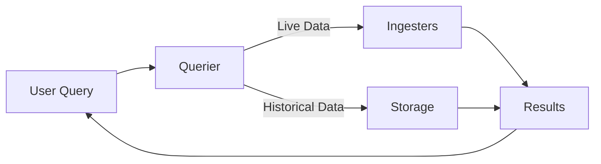
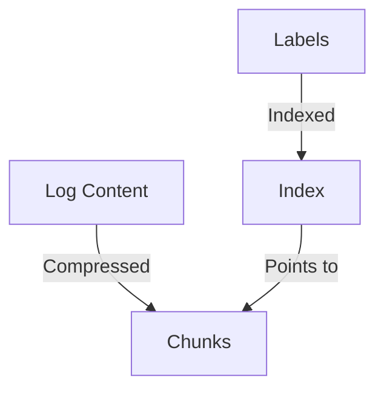

# Loki Terminology

## Introduction

Grafana Loki is a horizontally scalable, highly available log aggregation system designed to be cost-effective and easy to operate. Before diving deep into Loki's functionality, it's essential to understand its core terminology. This guide covers the fundamental terms and concepts you'll encounter when working with Loki, providing you with the vocabulary needed to navigate the Loki ecosystem confidently.

## Core Concepts

### Logs

Logs are timestamped text records generated by applications or services that document events, errors, or other significant occurrences within a system. In Loki, logs serve as the primary data type being stored and queried.

```
2023-05-15T14:22:17Z INFO Server started successfully on port 8080
2023-05-15T14:23:42Z ERROR Connection to database failed: timeout
```

### Label

Labels are key-value pairs that describe the source of logs. They work similarly to labels in Prometheus and are used to identify and query log streams efficiently.

```yaml
{app="frontend", environment="production", server="us-west-1"}
```

Labels are central to Loki's design philosophy of "Log everything, label it, query it later."

### Log Stream

A log stream is a sequence of log entries that share the same set of labels. Loki organizes logs into streams based on their label sets, which enables efficient storage and querying.



### Log Line

A log line represents a single entry in a log stream, consisting of a timestamp and the actual log content.

```
<timestamp> <log content>
```

### Chunk

A chunk is Loki's internal storage unit for log data. Loki compresses and stores logs in chunks, typically containing logs from a single stream over a specific time range.



### Index

The index maps label sets to the chunks containing their logs. Loki's index enables quick location of relevant chunks during queries without scanning all log data.

## Components

### Distributor

The distributor is the entry point for logs in Loki. It validates incoming logs, applies tenant ID labels, and forwards them to ingesters.



### Ingester

Ingesters receive logs from distributors, build them into chunks, and eventually store those chunks in the backend storage system.

### Querier

The querier handles log query requests, retrieving and merging data from ingesters and the backend storage.



### Query Frontend

The query frontend sits between clients and queriers, handling query scheduling, retries, and splitting complex queries to improve performance.

### Compactor

The compactor optimizes storage by combining smaller chunks into larger ones and deleting data that exceeds retention periods.

## Query Languages

### LogQL

LogQL is Loki's query language, inspired by PromQL (Prometheus Query Language). It allows for powerful filtering and extraction of log data.

Basic LogQL query structure:
```
{<label_matcher>} [| <line_filter>] [| <parser_expression>] [| <label_filter>] [| <line_format_expression>]
```

Example of a simple LogQL query:
```
{app="frontend", environment="production"} |= "error"
```

This query selects logs from the frontend application in the production environment containing the word "error".

### Line Filters

Line filters help narrow down log results by filtering for specific text patterns.

Common line filters include:
- `|=` Contains
- `!=` Does not contain
- `|~` Regular expression match
- `!~` Regular expression does not match

Example:
```
{app="frontend"} |= "error" != "timeout"
```

This selects logs from the frontend app containing "error" but not "timeout".

### Label Filters

Label filters operate on extracted labels to further refine query results.

Example:
```
{app="frontend"} | json | status_code=500
```

This filters logs from the frontend app, parses them as JSON, and shows only those with a status_code of 500.

## Practical Examples

### Basic Log Querying

Let's see how to query logs from a web application:

```
{app="web-app", environment="production"} |= "error"
```

This will return all logs from the web-app in production that contain the word "error".

### Extracting Structured Data

For logs in JSON format:

```
{app="payment-service"} | json | transaction_id != "" | status="failed"
```

This query:
1. Selects logs from the payment-service
2. Parses them as JSON
3. Filters for logs with a non-empty transaction_id
4. Shows only failed transactions

### Analyzing HTTP Status Codes

```
{app="api-gateway"} 
| json 
| status_code > 499 
| line_format "{{.timestamp}} {{.method}} {{.path}} {{.status_code}}"
```

This extracts and formats information about 5XX errors from API gateway logs.

### Rate of Error Logs

```
sum(rate({app="web-app"} |= "ERROR" [5m])) by (service)
```

This calculates the rate of error logs per service over a 5-minute window.

## Loki's Data Model

Loki's data model is designed around these key principles:

1. **Label-based indexing**: Only labels are indexed, not the full log content
2. **Stream-based organization**: Logs with the same label set form a stream
3. **Time-ordered storage**: Logs within a stream are stored chronologically

This model offers several advantages:
- Lower storage costs compared to full-text indexing systems
- Faster queries when well-labeled
- Efficient compression of log content



## Best Practices

### Labeling

Effective labeling is crucial for Loki performance:

- Use labels for high-cardinality dimensions (app, environment, instance)
- Avoid using labels for high-cardinality values (user IDs, request IDs)
- Keep the total number of unique label combinations reasonable

Good label structure:
```yaml
{app="payment-service", environment="production", component="processor"}
```

### Query Optimization

To optimize query performance:
- Start queries with label matchers to narrow the search space
- Use line filters to further reduce the dataset
- Apply label extraction and filtering last

Efficient query pattern:
```
{app="web-app"} |= "error" | json | status_code=500
```

## Summary

Understanding Loki's terminology is fundamental to effectively utilizing its log aggregation capabilities. From the basic concepts of logs, labels, and streams to the component architecture and query language features, this knowledge forms the foundation for successfully implementing and operating Loki in your observability stack.

The key points to remember:
- Loki organizes logs into streams based on label sets
- Only labels are indexed, making Loki efficient and cost-effective
- LogQL provides powerful querying capabilities for filtering and analyzing logs
- Effective labeling is critical for optimal performance

## Additional Resources

- [Official Grafana Loki Documentation](https://grafana.com/docs/loki/latest/)
- [LogQL Query Language Reference](https://grafana.com/docs/loki/latest/logql/)
- [Loki Best Practices Guide](https://grafana.com/docs/loki/latest/best-practices/)

## Exercises

1. **Basic Querying**: Write a LogQL query to find all error logs from a service named "inventory" in the "staging" environment.

2. **Pattern Extraction**: Create a query that extracts and displays the HTTP method, path, and response time from the following log format:
   ```
   2023-05-15T12:34:56Z INFO HTTP Request - Method: GET, Path: /api/users, Response Time: 123ms
   ```

3. **Label Practice**: Identify which of the following would be good candidates for labels in Loki:
   - Application name
   - User ID
   - HTTP request ID
   - Deployment region
   - Log level

4. **Query Optimization**: Rewrite the following query to be more efficient:
   ```
   {} | json | app="payment" | environment="production" | level="error"
   ```