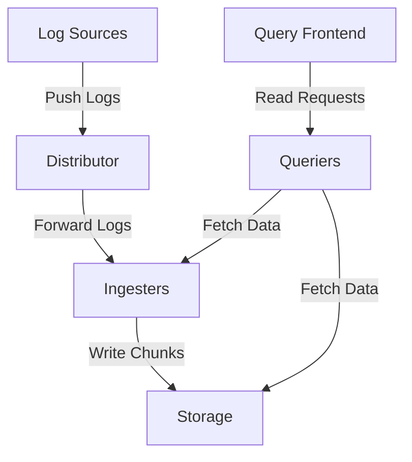

# Distributor Component

## Introduction

The Distributor is one of the critical frontend components in Grafana Loki's architecture. It serves as the gateway for all incoming log data, acting as the first point of contact when logs enter the Loki system. Think of the Distributor as a traffic controller that receives logs from various sources, validates them, prepares them for storage, and ensures they're sent to the right destinations within the Loki system.

In this guide, we'll explore how the Distributor works, its responsibilities, configuration options, and how it fits into the broader Loki architecture.

## What is the Distributor?

The Distributor component:

1. **Receives logs** from clients like Promtail, Fluentd, or other log agents
2. **Validates** incoming log data 
3. **Preprocesses** log entries
4. **Distributes** logs to Ingesters for further processing and storage

As a stateless component, the Distributor can be scaled horizontally to handle increased log volume, making it a crucial part of Loki's scalability story.

## How the Distributor Works

Let's break down the workflow of the Distributor component step by step:

### 1. Receiving Logs

The Distributor exposes HTTP endpoints that accept log data in different formats:

- `/loki/api/v1/push` - The primary endpoint for receiving logs
- `/loki/api/v1/push_stream` - Used for WebSocket-based streaming logs (available in newer versions)

Logs are typically sent in batches, with each batch containing one or more streams, and each stream having a set of labels and a series of log entries with timestamps.

### 2. Authentication and Rate Limiting

When logs arrive, the Distributor:

- Authenticates the request if authentication is enabled
- Applies rate limiting based on tenant ID (in multi-tenant setups)
- Controls the maximum batch size and frequency of push requests

### 3. Validation

The Distributor performs several validation checks on incoming logs:

- Verifies that log entries have valid timestamps
- Checks that label sets are valid and conform to Loki's requirements
- Ensures log lines don't exceed the configured maximum length
- Validates that the number of unique label sets doesn't exceed limits

### 4. Preprocessing

Before forwarding logs, the Distributor:

- Adds any tenant-specific labels if configured
- Normalizes labels (sorts them in a consistent order)
- Computes a hash of the label set, which determines which Ingester will receive the data

### 5. Distribution to Ingesters

Finally, the Distributor forwards the validated logs to Ingesters:

- Uses consistent hashing to determine which Ingesters should receive the data
- Implements replication by sending each log stream to multiple Ingesters (based on replication factor)
- Requires quorum writes (a majority of Ingesters must acknowledge receipt)

## Distributor in the Loki Architecture

To understand the Distributor's role, let's see how it fits into the overall Loki architecture:



As you can see, the Distributor is the entry point for the write path in Loki. All logs must pass through the Distributor before being processed by other components.

## Configuring the Distributor

Here's a simple example of how to configure the Distributor in a Loki configuration file:

```yaml
distributor:
  ring:
    kvstore:
      store: memberlist
  receivers:
    http:
      http_listen_address: 0.0.0.0
      http_listen_port: 3100

limits_config:
  ingestion_rate_mb: 4
  ingestion_burst_size_mb: 6
  max_label_name_length: 1024
  max_label_value_length: 2048
  max_label_names_per_series: 30
  max_line_size: 256000
```

This configuration:
- Sets up the Distributor to use a memberlist-based ring (for service discovery)
- Configures HTTP receivers to listen on all interfaces on port 3100
- Sets various limits for ingestion rates and label sizes

## Common Issues and Troubleshooting

When working with the Distributor, you might encounter these common issues:

### 1. Rate Limiting Errors

If you see errors like `429 Too Many Requests` or `ingestion rate limit exceeded`, it means you're sending logs faster than the configured limits allow.

Solution:
- Increase the `ingestion_rate_mb` and `ingestion_burst_size_mb` values
- Implement log filtering or sampling at the client side

### 2. Label Validation Errors

Errors like `max label names per series exceeded` indicate issues with your label configuration.

Solution:
- Review your label strategy
- Remove unnecessary labels
- Adjust the label limits in the configuration

### 3. High Latency

If log ingestion is showing high latency:

Solution:
- Scale the Distributor horizontally by adding more instances
- Check network connectivity between clients and the Distributor
- Review resource allocation (CPU/memory)

## Practical Example: Setting Up a Basic Loki Stack with Distributor

Let's see how to set up a simple Loki deployment with a focus on the Distributor component using Docker Compose:

```yaml
version: '3'

services:
  loki:
    image: grafana/loki:latest
    ports:
      - "3100:3100"
    command: -config.file=/etc/loki/config.yaml
    volumes:
      - ./loki-config.yaml:/etc/loki/config.yaml
    networks:
      - loki

  promtail:
    image: grafana/promtail:latest
    volumes:
      - ./promtail-config.yaml:/etc/promtail/config.yaml
      - /var/log:/var/log
    command: -config.file=/etc/promtail/config.yaml
    networks:
      - loki

  grafana:
    image: grafana/grafana:latest
    ports:
      - "3000:3000"
    networks:
      - loki

networks:
  loki:
```

And here's a basic Loki configuration that highlights the Distributor settings:

```yaml
auth_enabled: false

server:
  http_listen_port: 3100

distributor:
  ring:
    kvstore:
      store: inmemory

ingester:
  lifecycler:
    ring:
      kvstore:
        store: inmemory
      replication_factor: 1
    final_sleep: 0s
  chunk_idle_period: 5m
  chunk_retain_period: 30s

schema_config:
  configs:
    - from: 2020-05-15
      store: boltdb-shipper
      object_store: filesystem
      schema: v11
      index:
        prefix: index_
        period: 24h

storage_config:
  boltdb_shipper:
    active_index_directory: /tmp/loki/boltdb-shipper-active
    cache_location: /tmp/loki/boltdb-shipper-cache
    cache_ttl: 24h
    shared_store: filesystem
  filesystem:
    directory: /tmp/loki/chunks

limits_config:
  ingestion_rate_mb: 10
  ingestion_burst_size_mb: 20
  max_line_size: 512000
```

## Testing the Distributor

To test if your Distributor is working correctly, you can send a simple log push request:

```bash
curl -X POST -H "Content-Type: application/json" -d '{
  "streams": [
    {
      "stream": {
        "job": "test_job",
        "instance": "test_instance"
      },
      "values": [
        ["1624371380000000000", "This is a test log line"]
      ]
    }
  ]
}' http://localhost:3100/loki/api/v1/push
```

If configured correctly, the Distributor will accept this log entry, process it, and forward it to the Ingesters with no error response.

## Monitoring the Distributor

To ensure your Distributor is healthy, monitor these key metrics:

1. **distributor_received_requests_total** - Count of logs received
2. **distributor_forward_requests_total** - Count of logs forwarded to Ingesters
3. **distributor_request_duration_seconds** - Request processing time
4. **distributor_ingester_append_failures_total** - Count of failed forwards to Ingesters

These metrics can be collected by Prometheus and visualized in Grafana dashboards.

## Summary

The Distributor component in Grafana Loki is the gateway for all incoming log data. It handles the critical tasks of receiving, validating, and distributing logs to the appropriate Ingesters. Key points to remember:

- The Distributor is stateless and can be horizontally scaled
- It performs validation and preprocessing of logs before forwarding
- It uses consistent hashing to distribute logs evenly across Ingesters
- Proper configuration of rate limits and validation parameters is essential for production deployments

By understanding how the Distributor works, you gain insight into Loki's ingestion path and can better troubleshoot issues related to log ingestion.

## Additional Resources

- [Official Loki Architecture Documentation](https://grafana.com/docs/loki/latest/fundamentals/architecture/)
- [Loki Configuration Reference](https://grafana.com/docs/loki/latest/configuration/)
- [Scaling Loki: Best Practices](https://grafana.com/blog/2020/04/21/loki-scaling-up/)

## Exercises

1. Set up a local Loki instance with an explicitly configured Distributor component using Docker.
2. Experiment with different rate limiting settings and observe their impact on log ingestion.
3. Use the Loki API to push logs with different label sets and observe how the Distributor handles them.
4. Set up Prometheus to scrape Distributor metrics and create a simple Grafana dashboard to monitor its performance.