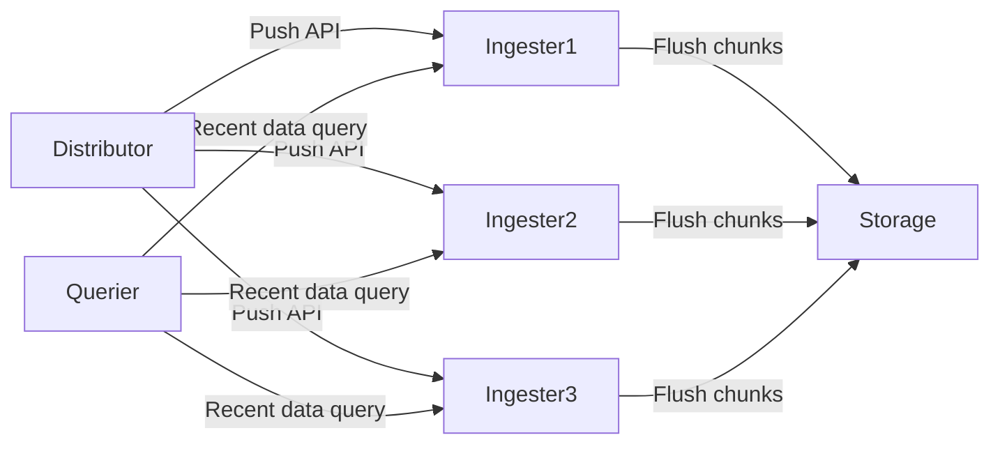
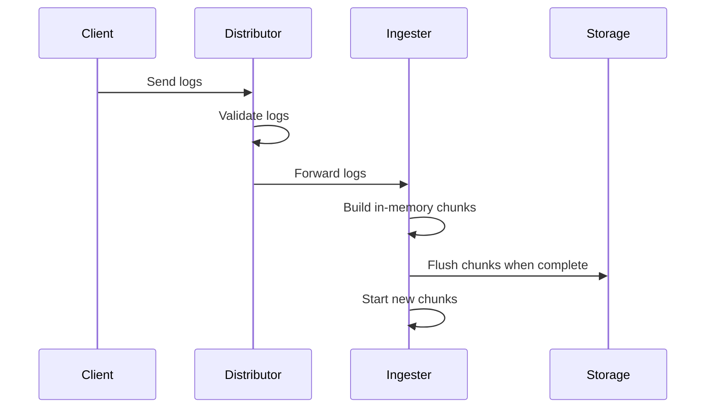
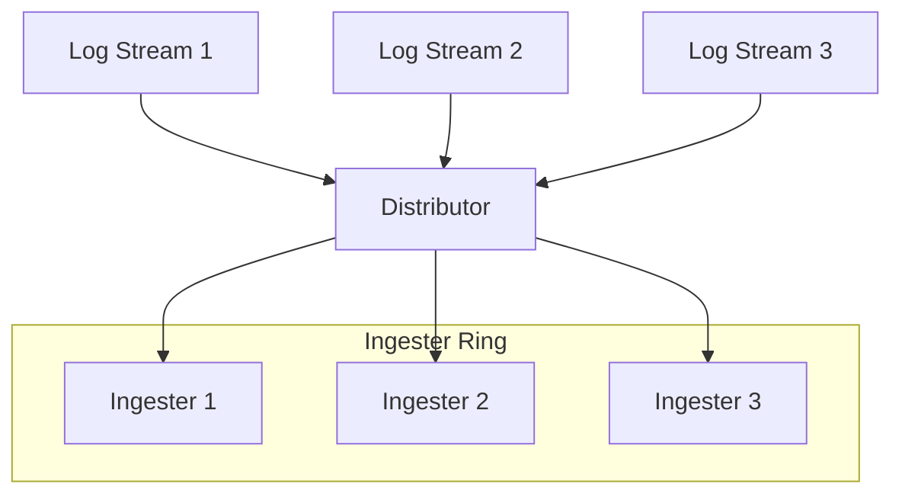
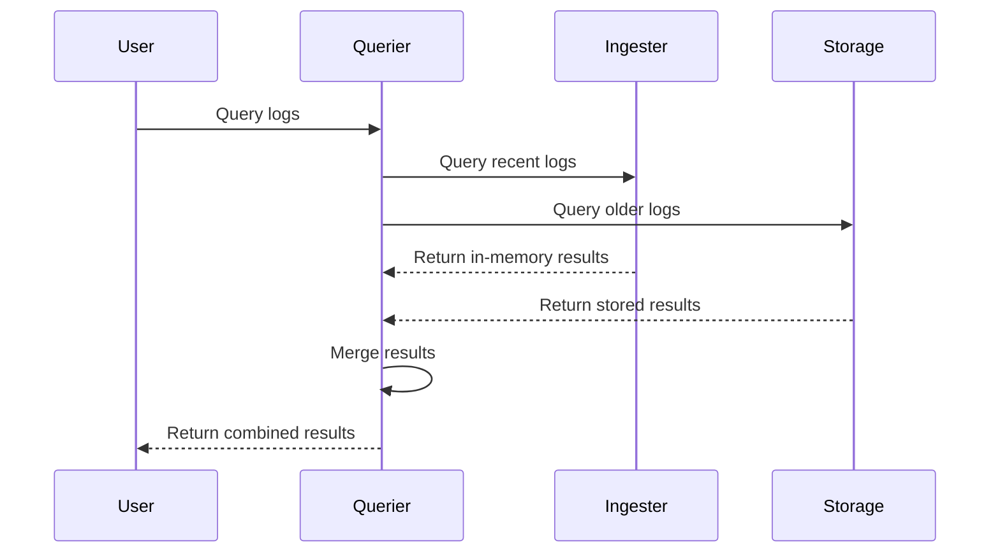
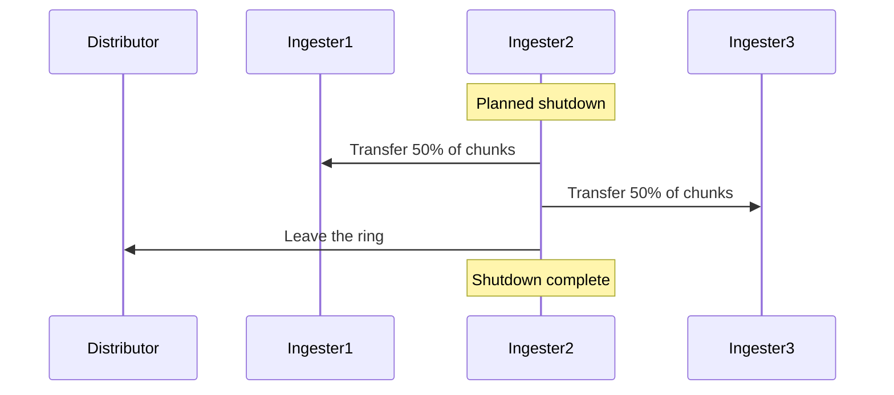

# Ingester Component

## Introduction

The Ingester is one of the most critical components in Grafana Loki's architecture. It acts as the middle layer between the Distributor (which receives and validates logs) and the long-term storage. Think of the Ingester as Loki's short-term memory and writing hand - it temporarily holds recent log data in memory, compresses it, and eventually writes it to long-term storage.

In this guide, we'll explore how the Ingester works, its responsibilities, and how it interacts with other Loki components to provide efficient log storage and retrieval.

## What is the Ingester Component?

The Ingester component is responsible for:

1. Receiving log streams from Distributors
2. Building in-memory data structures for logs
3. Compressing and organizing log data
4. Flushing data to long-term storage
5. Handling queries for recent log data

Let's dive into each of these responsibilities to understand how the Ingester functions.

## Ingester Architecture

The Ingester operates as a stateful component within Loki's architecture. Multiple Ingester instances typically run in a cluster for high availability and scalability.



Each Ingester maintains a set of in-memory data structures representing the log streams it's responsible for handling.

## How the Ingester Processes Log Data

### 1. Receiving Log Streams

When logs are sent to Loki, they first pass through the Distributor component, which validates and prepares them. The Distributor then forwards these logs to the appropriate Ingesters.

Here's how logs flow from a client to the Ingester:



### 2. Building In-Memory Data Structures

Once the Ingester receives log entries, it organizes them into "chunks." A chunk is a collection of compressed log entries for a specific log stream (identified by a set of labels).

```javascript
// Conceptual representation of an Ingester's in-memory structure
inMemoryChunks = {
  "{app=\"frontend\",env=\"production\"}": [
    // Chunk 1 (0-4h time window)
    {
      entries: [
        { timestamp: "2023-05-10T00:01:32Z", line: "GET /api/users 200" },
        { timestamp: "2023-05-10T00:02:45Z", line: "GET /api/products 404" },
        // More log entries...
      ],
      startTime: "2023-05-10T00:00:00Z",
      endTime: "2023-05-10T04:00:00Z",
      size: 2048, // bytes
      complete: false
    },
    // More chunks for this stream...
  ],
  
  "{app=\"backend\",env=\"production\"}": [
    // Chunks for another stream...
  ]
}
```

### 3. Compressing and Organizing Log Data

The Ingester applies compression to log data, which significantly reduces storage requirements. Loki uses various compression techniques to make log storage efficient:

- Logs are grouped by their label sets
- Timestamps are delta-encoded
- Log content is compressed using algorithms like Gzip or Snappy

This compression happens incrementally as logs arrive at the Ingester.

### 4. Flushing Data to Long-term Storage

Chunks are flushed to the storage backend when any of these conditions are met:

- The chunk reaches a configured maximum size
- The chunk reaches a configured maximum age
- The chunk has been idle for a configured period
- The Ingester is shutting down gracefully

Here's a simplified example of the flushing process in Go pseudocode:

```go
func (i *Ingester) flushChunks(ctx context.Context) error {
    // For each tenant
    for userID, userStreams := range i.userStates {
        // For each stream
        for _, stream := range userStreams.streams {
            // For each chunk
            for _, chunk := range stream.chunks {
                // Check if chunk should be flushed
                if chunk.shouldFlush() {
                    // Encode and compress chunk data
                    encodedChunk := chunk.encode()
                    
                    // Write to storage backend
                    err := i.store.Put(ctx, encodedChunk)
                    if err != nil {
                        return err
                    }
                    
                    // Mark chunk as flushed
                    chunk.flushed = true
                }
            }
        }
    }
    return nil
}
```

## Ingester Ring

Loki uses a technique called "consistent hashing" implemented via a "ring" to distribute logs among Ingesters. This ensures logs with the same labels are sent to the same Ingester, which improves compression efficiency.



The ring is a distributed system that:
- Tracks which Ingesters are healthy
- Manages the distribution of log streams
- Handles Ingester failures and rebalancing

## Querying Recent Data from Ingesters

The Ingester doesn't just write data; it also serves queries for recent log data that hasn't yet been written to long-term storage. This provides a unified query experience where users don't need to know whether the data they're querying is in memory or in storage.



## Real-World Example: Configuring the Ingester

Let's look at a practical example of configuring the Ingester component in a Loki configuration file:

```yaml
ingester:
  lifecycler:
    ring:
      kvstore:
        store: memberlist
      replication_factor: 3
    final_sleep: 0s
  chunk_idle_period: 1h
  chunk_target_size: 1048576
  max_chunk_age: 4h
  wal:
    enabled: true
    dir: /loki/wal
  chunk_encoding: snappy
```

Let's break down what these configuration parameters mean:

- `replication_factor: 3`: Each log stream is sent to 3 different Ingesters for redundancy
- `chunk_idle_period: 1h`: Chunks that haven't received new logs for 1 hour are flushed
- `chunk_target_size: 1048576`: Target size of 1MB for chunks before flushing
- `max_chunk_age: 4h`: Chunks older than 4 hours are flushed regardless of size
- `wal: enabled: true`: Write-Ahead Log is enabled to prevent data loss during crashes
- `chunk_encoding: snappy`: Using Snappy compression algorithm for chunks

## Ingester Failure Handling

What happens when an Ingester fails? Loki has several mechanisms to handle this:

1. **Write-Ahead Log (WAL)**: Ingesters can recover their state after a restart by replaying the WAL
2. **Replication Factor**: Log data is typically sent to multiple Ingesters, providing redundancy
3. **Handoff**: When an Ingester is shutting down gracefully, it can transfer its data to other Ingesters



## Performance Considerations

The Ingester's performance is critical to Loki's overall performance. Here are some key considerations:

1. **Memory Usage**: Ingesters store log data in memory, so they need sufficient RAM
2. **CPU Usage**: Compression and handling queries can be CPU-intensive
3. **Disk I/O**: The WAL writes to disk, so fast disks improve performance
4. **Network**: Ingesters communicate with other components, so network bandwidth matters

## Common Issues and Troubleshooting

### Issue: Ingesters Running Out of Memory

**Symptoms:**
- Ingesters crashing with OOM (Out of Memory) errors
- High memory usage metrics

**Solutions:**
- Increase memory limits for Ingester pods
- Decrease `max_chunk_age` to flush chunks more frequently
- Add more Ingester replicas to distribute memory usage

### Issue: Slow Flushing to Storage

**Symptoms:**
- Growing backlog of unflushed chunks
- High disk usage from WAL

**Solutions:**
- Check storage backend performance
- Increase chunk flushing parallelism
- Scale up Ingester resources

## Monitoring the Ingester

Monitoring is crucial for maintaining a healthy Loki system. Here are important metrics to watch for Ingesters:

- `loki_ingester_memory_chunks`: Number of chunks in memory
- `loki_ingester_chunk_age_seconds`: Age of chunks in memory
- `loki_ingester_chunk_utilization`: How full the chunks are
- `loki_ingester_chunk_entries`: Number of log entries in chunks
- `loki_ingester_chunk_store_bytes`: Size of chunks in bytes
- `loki_ingester_wal_disk_usage_bytes`: Size of the WAL on disk

## Summary

The Ingester component is a critical part of Loki's architecture that:

- Receives log data from Distributors
- Builds and compresses in-memory chunks of log data
- Flushes completed chunks to long-term storage
- Serves queries for recent log data
- Handles failures gracefully through WAL and replication

Understanding how the Ingester works helps when scaling Loki, troubleshooting issues, and optimizing performance. The Ingester's efficiency directly impacts Loki's ability to handle high log volumes while maintaining query performance.

## Exercises

1. Set up a local Loki instance and configure the Ingester with different chunk sizes and flush periods. Observe how these changes affect memory usage and storage patterns.

2. Use Grafana to create a dashboard that monitors key Ingester metrics like memory usage, chunk counts, and flush operations.

3. Simulate an Ingester failure in a test environment and observe how the system recovers using the WAL.

## Additional Resources

- [Grafana Loki Documentation](https://grafana.com/docs/loki/latest/)
- [Loki Architecture Overview](https://grafana.com/docs/loki/latest/fundamentals/architecture/)
- [Loki Configuration Reference](https://grafana.com/docs/loki/latest/configuration/)
- [Scaling Loki: Best Practices](https://grafana.com/blog/2020/04/01/how-to-configure-grafana-loki-to-maximize-performance/)