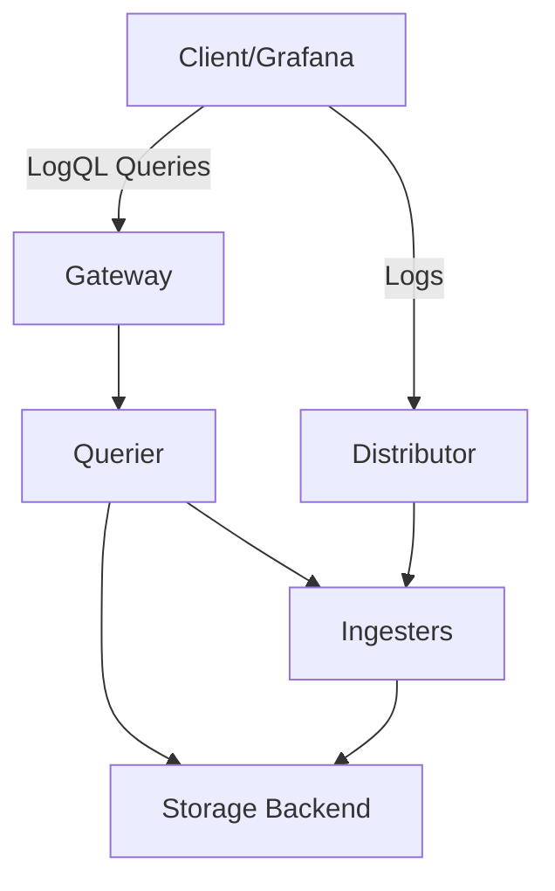
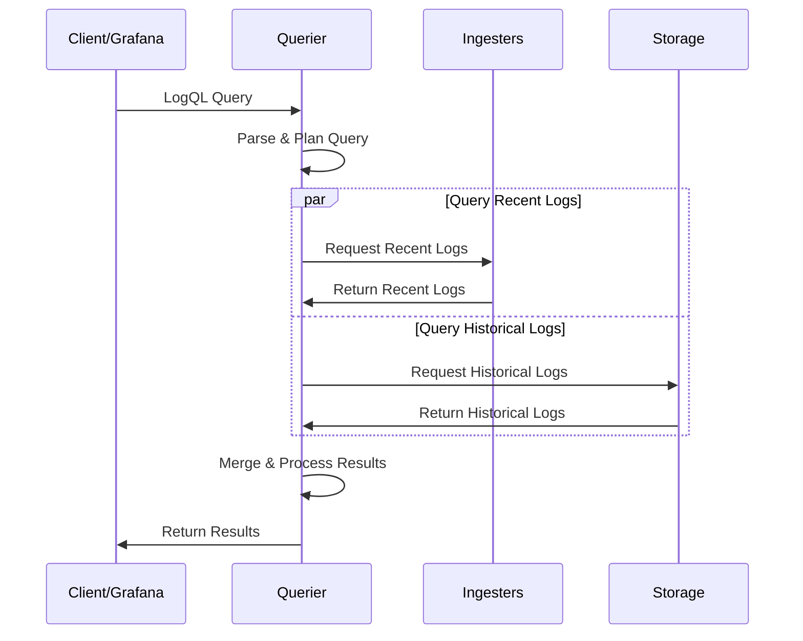

# Querier Component

## Introduction

The Querier is a core component in Grafana Loki's architecture that handles the retrieval and processing of log data. It acts as the gateway for all query operations, translating LogQL queries (Loki's query language) into a series of operations that fetch and process log data from storage. Think of the Querier as the "librarian" of Loki's log system - it knows where logs are stored, how to retrieve them efficiently, and how to present them in a format that makes sense to users.

In this guide, we'll explore how the Querier works, its role in the Loki architecture, and how it processes queries to help you find the exact log data you need.

## Where Querier Fits in Loki's Architecture

Before diving into the Querier itself, let's understand where it fits in Loki's architecture:



As shown in the diagram:

1. The Querier receives queries from clients (typically Grafana or direct API calls)
2. It parses and plans the execution of these queries
3. It fetches data from both:
   - **Ingesters**: For recent, in-memory logs
   - **Storage**: For older, persisted logs
4. It merges, filters, and processes the results before returning them to the client

## Core Responsibilities of the Querier

The Querier has several important responsibilities:

1. **Query Planning**: Breaking down complex LogQL queries into optimized execution plans
2. **Data Retrieval**: Fetching log data from both ingesters (recent data) and storage (historical data)
3. **Result Processing**: Filtering, transforming, and aggregating log data
4. **Response Formatting**: Preparing the results in the format requested by the client
5. **Query Federation**: Coordinating queries across multiple Loki components

## How the Querier Works

### Query Processing Flow

Let's walk through how the Querier processes a typical query:



1. **Query Reception**: The Querier receives a LogQL query from the client.
2. **Query Parsing**: The query is parsed into an abstract syntax tree (AST).
3. **Query Planning**: The Querier determines the most efficient way to execute the query.
4. **Parallel Execution**: The Querier simultaneously queries:
   - **Ingesters** for recent logs still in memory
   - **Storage** for older logs that have been persisted
5. **Result Merging**: Results from both sources are combined.
6. **Post-Processing**: The merged results are filtered, transformed, or aggregated according to the query.
7. **Response**: The final results are returned to the client.

### Understanding Query Types

The Querier handles two main types of queries:

1. **Log Queries**: Return raw log lines (possibly filtered and limited)
2. **Metric Queries**: Transform logs into time-series metrics

Let's look at how the Querier processes each type:

#### Log Query Example

```
{app="frontend", env="production"} |= "error" | json | line_format "{{.message}}"
```

For this query, the Querier:

1. Identifies the label matchers `{app="frontend", env="production"}`
2. Applies the filter operation `|= "error"` to keep only logs containing "error"
3. Applies the parser `json` to extract structured data from each log line
4. Formats the output with only the `message` field using `line_format`

#### Metric Query Example

```
sum(rate({app="frontend"}[5m])) by (status_code)
```

For this query, the Querier:

1. Fetches logs matching `{app="frontend"}` over the time range
2. Calculates the rate of logs over 5-minute windows
3. Groups the results by the `status_code` label
4. Sums the rates within each group

## Configuring the Querier

Here's a basic example of Querier configuration in a Loki setup:

```yaml
querier:
  max_concurrent: 10
  query_timeout: 1m
  query_ingesters_within: 3h
  engine:
    timeout: 3m
    max_look_back_period: 12h
```

Key configuration parameters include:

- **max_concurrent**: Maximum number of concurrent queries
- **query_timeout**: Default timeout for queries
- **query_ingesters_within**: How far back to query ingesters (vs. storage)
- **engine.timeout**: Timeout for the query engine
- **engine.max_look_back_period**: Maximum time range for a single query

## Practical Example: Troubleshooting with the Querier

Let's walk through a practical example of how the Querier helps in troubleshooting:

Scenario: You're investigating a spike in error rates in your application.

1. First, you query for all error logs in the time range:

```
{app="myapp"} |= "error" | json
```

2. You notice a pattern of database timeout errors, so you refine your query:

```
{app="myapp"} |= "database timeout" | json | line_format "{{.user_id}} - {{.query}}"
```

3. You want to see the error rate by database host:

```
sum(rate({app="myapp"} |= "database timeout" [5m])) by (db_host)
```

In each step, the Querier:
1. Parses your LogQL query
2. Determines which chunks of log data need to be retrieved
3. Fetches the data from ingesters and/or storage
4. Processes the results according to your filters and transformations
5. Returns the formatted results

## Performance Considerations

The Querier's performance can significantly impact your experience with Loki. Here are some key considerations:

1. **Query Parallelism**: The Querier can execute parts of queries in parallel, but is limited by the `max_concurrent` setting.

2. **Label Cardinality**: Queries with high cardinality labels can cause the Querier to process more chunks, slowing down query execution.

3. **Time Range**: Larger time ranges require more chunks to be processed, increasing load on the Querier.

4. **Ingester vs. Storage Queries**: Queries to ingesters (recent data) are typically faster than storage queries.

Example of a query that might stress the Querier:

```
{app=~".+"} |= "error" | json
```

This query:
- Selects logs from all applications (`app=~".+"`)
- Filters for the term "error"
- Parses all matching logs as JSON

A more optimized version would be:

```
{app="frontend", env="production"} |= "error" | json
```

By restricting to specific label values, the Querier can process fewer chunks.

## Debugging Querier Issues

When troubleshooting Querier problems, look for:

1. **Query Timeouts**: Check if queries are timing out before completion

   ```yaml
   # Increase timeout in configuration
   querier:
     query_timeout: 2m
   ```

2. **High Concurrency**: If too many queries run simultaneously, increase resources or limit concurrency

   ```yaml
   querier:
     max_concurrent: 20
   ```

3. **Memory Pressure**: If the Querier runs out of memory, you might need to:
   - Increase memory allocation
   - Add more Querier instances
   - Optimize queries to process less data

## Summary

The Querier is a critical component in Loki's architecture that:

1. Receives and parses LogQL queries
2. Plans efficient query execution
3. Retrieves data from both ingesters and storage
4. Processes and transforms results
5. Returns formatted responses to clients

Understanding how the Querier works helps you write more efficient queries and troubleshoot issues when they arise. By optimizing your queries and properly configuring the Querier, you can ensure fast and reliable access to your log data.

## Additional Resources

To deepen your understanding of the Querier component:

- Practice writing efficient LogQL queries
- Experiment with different query types (log queries vs. metric queries)
- Try running queries with different time ranges to understand performance implications
- Learn about Loki's other components to see how they interact with the Querier

## Exercises

1. Write a LogQL query that finds all 4xx HTTP errors in a web application's logs.
2. Modify the query to group error rates by endpoint path.
3. Extend your query to extract and format specific fields from JSON-formatted logs.
4. Create a query that compares error rates across different application versions.
5. Design a dashboard in Grafana that uses these queries to monitor application health.