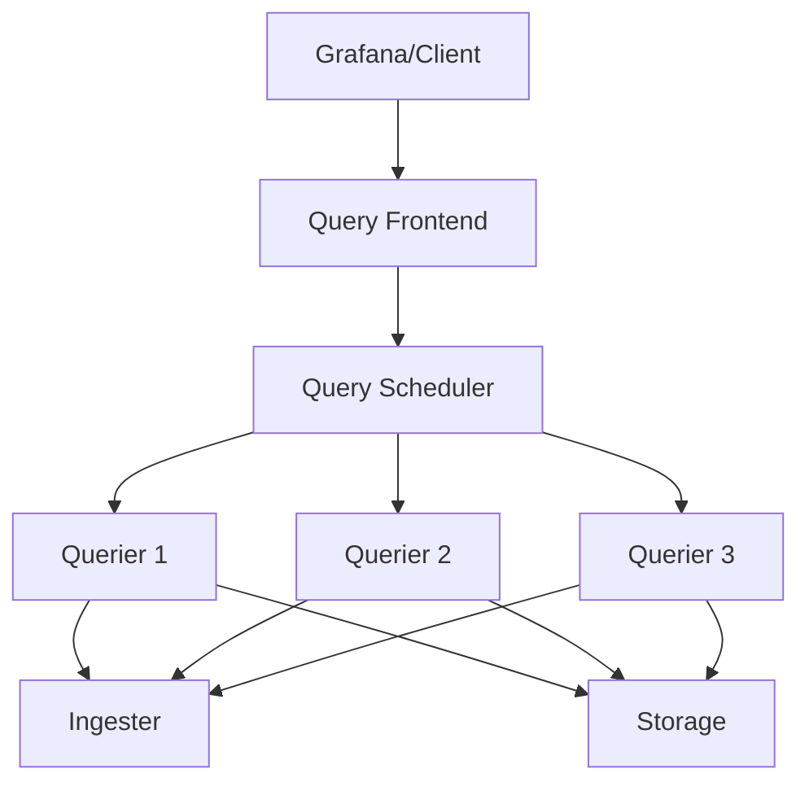
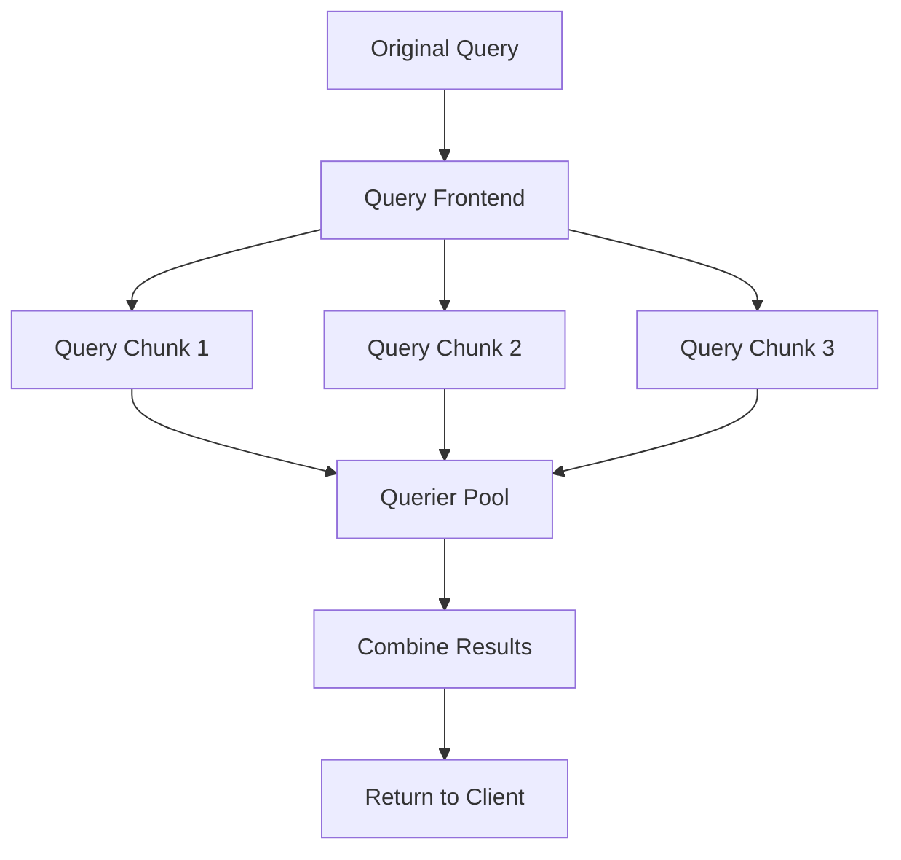

# Query Frontend Component

## Introduction

The Query Frontend is a critical component in Grafana Loki's architecture that serves as an intelligent proxy between client requests and query processing. It's designed to optimize query performance, manage resource utilization, and provide a seamless experience for users interacting with Loki's distributed log storage system.

In this guide, we'll explore the Query Frontend component in depth, understanding its role, functionality, and how it contributes to making Loki a powerful and efficient log aggregation system.

## What is the Query Frontend?

The Query Frontend acts as a middleware layer that sits between clients (like Grafana dashboards) and Loki's querier components. Its primary purpose is to:

1. **Intercept and optimize queries** before they reach the queriers
2. **Split complex queries** into smaller, more manageable chunks
3. **Cache query results** to improve performance for repeated queries
4. **Handle query retries** and ensure fault tolerance
5. **Manage query scheduling** to prevent overloading backend components

## Query Frontend Architecture

The Query Frontend is designed to be stateless, making it easy to scale horizontally as query load increases. Let's explore how it fits into Loki's overall architecture:



In this architecture:

1. Clients send LogQL queries to the Query Frontend
2. The Query Frontend processes and optimizes these queries
3. Queries are then passed to the Query Scheduler for distribution
4. Queriers execute the optimized queries against ingesters and storage
5. Results flow back through the same path to the client

## Key Features of the Query Frontend

### Query Splitting

One of the most important functions of the Query Frontend is query splitting. When a query spans a large time range, the Query Frontend breaks it down into smaller, more manageable chunks.

For example, a query spanning 7 days might be split into 7 one-day queries:

```javascript
// Original query
{query: 'error', start: '2023-01-01T00:00:00Z', end: '2023-01-08T00:00:00Z'}

// After splitting by Query Frontend
[
  {query: 'error', start: '2023-01-01T00:00:00Z', end: '2023-01-02T00:00:00Z'},
  {query: 'error', start: '2023-01-02T00:00:00Z', end: '2023-01-03T00:00:00Z'},
  // ... and so on for each day
  {query: 'error', start: '2023-01-07T00:00:00Z', end: '2023-01-08T00:00:00Z'}
]
```

This approach provides several benefits:
- Prevents memory exhaustion in queriers
- Allows for parallel processing of query chunks
- Makes queries more resilient to failures

### Query Caching

The Query Frontend implements a caching layer that stores results of previously executed queries:

```yaml
frontend:
  cache_results: true
  results_cache:
    cache:
      enable_fifocache: true
      fifocache:
        max_size_items: 1024
        validity: 24h
```

When a query is received, the Query Frontend first checks if its results are already in the cache. If they are (and haven't expired), it returns those results immediately without executing the query again.

### Parallelization

For complex queries, the Query Frontend can execute multiple query steps in parallel:



This parallelization significantly improves query performance, especially for large time ranges or complex query patterns.

### Query Scheduling

The Query Frontend also includes a query scheduler that manages the queue of incoming queries and distributes them fairly across available querier instances.

```yaml
query_scheduler:
  max_outstanding_requests_per_tenant: 100
  scheduler_address: query-scheduler.loki:9095
```

This prevents any single tenant from monopolizing system resources and ensures a fair distribution of query processing capacity.

## Implementation Details

### Configuration Options

Here's an example configuration for the Query Frontend component in Loki:

```yaml
frontend:
  compress_responses: true
  log_queries_longer_than: 10s
  query_stats_enabled: true
  
  # Query splitting settings
  split_queries_by_interval: 24h
  align_queries_with_step: true
  
  # Caching settings
  cache_results: true
  results_cache:
    cache:
      enable_fifocache: true
      fifocache:
        max_size_items: 1024
        validity: 24h
  
  # Query middleware settings
  downstream_url: http://query-scheduler:9095
```

### Starting the Query Frontend

Here's how to launch the Query Frontend as a standalone component:

```bash
loki -config.file=loki-config.yaml -target=frontend
```

Or using Docker:

```bash
docker run -p 3100:3100 -v $(pwd)/loki-config.yaml:/etc/loki/config.yaml grafana/loki:latest -config.file=/etc/loki/config.yaml -target=frontend
```

## Query Frontend in Action: A Practical Example

Let's walk through a practical example of how the Query Frontend processes a query:

1. A user issues a LogQL query from Grafana:
   ```logql
   {app="frontend"} |= "error" | rate[5m]
   ```
   This query is looking for error logs from the "frontend" app and calculating their rate over 5-minute windows.

2. The query spans a 7-day period (a large time range).

3. The Query Frontend receives this query and:
   - Validates the query syntax
   - Determines it can be split into smaller chunks
   - Splits it into 7 one-day queries
   - Checks its cache for any previously computed results

4. For results not in the cache, the Query Frontend forwards sub-queries to the queriers via the scheduler.

5. As results come back from the queriers, the Query Frontend:
   - Caches each result set
   - Merges the results in the correct order
   - Applies any final aggregations needed

6. The final merged result is returned to the user's Grafana dashboard.

## Performance Considerations

The Query Frontend significantly improves Loki's query performance:

- **Reduced memory consumption**: By splitting large queries, memory usage is more predictable
- **Improved cache hit rates**: Smaller query chunks are more likely to be reused
- **Better fault tolerance**: If one query chunk fails, only that chunk needs to be retried
- **Horizontal scalability**: You can add more Query Frontend instances as query volume grows

## Common Issues and Troubleshooting

### High Query Latency

If you're experiencing high query latency:

1. Check if query splitting is configured properly:
   ```yaml
   frontend:
     split_queries_by_interval: 24h
   ```

2. Ensure caching is enabled and sized appropriately:
   ```yaml
   frontend:
     cache_results: true
     results_cache:
       cache:
         enable_fifocache: true
         fifocache:
           max_size_items: 2048  # Increase if cache eviction is high
   ```

3. Monitor querier resource utilization to ensure they're not overloaded.

### Error: "Query timed out"

If queries are timing out:

1. Increase the query timeout setting:
   ```yaml
   querier:
     query_timeout: 2m  # Increase from default
   ```

2. Consider reducing the time range or adding more specific label matchers to your queries.

## Query Frontend vs. Direct Querier Access

Here's a comparison of using Loki with and without the Query Frontend:

| Aspect | Without Query Frontend | With Query Frontend |
|--------|------------------------|---------------------|
| Memory Usage | High for large queries | Controlled and predictable |
| Query Reliability | Prone to failures with large queries | More resilient due to retry logic |
| Caching | No built-in caching | Automatic result caching |
| Performance | Variable, especially for large time ranges | More consistent, parallelized execution |
| Scalability | Limited by single querier capacity | Horizontally scalable |

## Summary

The Query Frontend is a crucial component in Grafana Loki's architecture that:

1. Optimizes query performance through splitting, parallelization, and caching
2. Enhances system reliability with retry mechanisms
3. Improves resource utilization across the Loki cluster
4. Provides a more consistent user experience

Understanding the Query Frontend helps you configure Loki optimally for your environment and troubleshoot issues when they arise.

## Exercises

1. Configure a basic Loki deployment with Query Frontend and test its performance with and without query splitting enabled.

2. Experiment with different cache sizes and measure cache hit rates using Loki's metrics:
   ```promql
   sum(rate(loki_query_frontend_results_cache_hits_total[5m])) 
   / 
   sum(rate(loki_query_frontend_results_cache_requests_total[5m]))
   ```

3. Create a simple dashboard in Grafana to monitor Query Frontend performance metrics.

## Additional Resources

- [Grafana Loki Documentation](https://grafana.com/docs/loki/latest/)
- [Understanding Loki's Query Performance](https://grafana.com/blog/2020/08/27/the-concise-guide-to-understanding-lokis-query-performance/)
- [Horizontally Scaling Loki](https://grafana.com/docs/loki/latest/operations/scalability/)

Remember that as your log volume grows, properly configuring the Query Frontend becomes increasingly important for maintaining system performance and reliability.