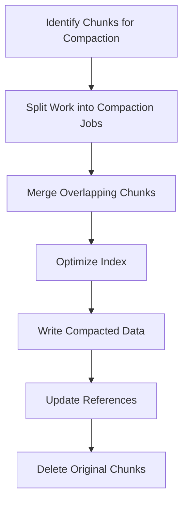

# Compactor Component

## Introduction

The Compactor is a critical component in Grafana Loki's architecture that focuses on optimizing storage efficiency and query performance. As Loki ingests and stores log data, it creates numerous small chunks of data over time. Without optimization, these chunks can lead to inefficient storage use and slower query performance. The Compactor addresses this by periodically merging and compacting these chunks into larger, more efficient objects.

In this guide, we'll explore how the Compactor works, why it's important, and how to configure it effectively in your Loki deployment.

## Why Compaction Matters

Before diving into the technical details, let's understand why compaction is essential:

1. **Improved Query Performance**: Fewer, larger objects mean less overhead when querying data.
2. **Reduced Storage Costs**: Compacted data typically requires less storage space.
3. **Better Resource Utilization**: Less fragmented data means more efficient use of system resources.
4. **Retention Management**: Helps enforce retention policies by organizing data for easier deletion.

## How the Compactor Works

The Compactor in Loki follows a process of identifying, merging, and optimizing stored chunks:



### Key Compaction Processes

1. **Table Manager**: The Compactor works alongside the Table Manager to maintain data according to your retention policies.

2. **Split & Merge**: The process involves:
   - Identifying chunks that can be compacted
   - Creating compaction plans
   - Merging overlapping time-series data
   - Rewriting indexes for efficiency

3. **Deduplication**: During compaction, the Compactor can optionally deduplicate log entries with identical content and timestamps.

## Configuring the Compactor

The Compactor can be configured through Loki's configuration file. Here's a basic example:

```yaml
compactor:
  working_directory: /loki/compactor
  shared_store: filesystem
  compaction_interval: 10m
  retention_enabled: true
  retention_delete_delay: 2h
  retention_delete_worker_count: 150
```

Let's break down these configuration options:

- `working_directory`: Temporary location where the Compactor processes data
- `shared_store`: Backend storage system (e.g., filesystem, S3, GCS)
- `compaction_interval`: How frequently the Compactor runs
- `retention_enabled`: Enables deletion of data based on retention policies
- `retention_delete_delay`: Grace period before deleting data marked for removal
- `retention_delete_worker_count`: Number of concurrent deletion workers

## Running the Compactor

In a production environment, the Compactor is typically run as a dedicated service. Here's an example of running the Compactor component:

```bash
loki -target=compactor -config.file=/etc/loki/config.yaml
```

In a Kubernetes environment, you might define it in a deployment like this:

```yaml
apiVersion: apps/v1
kind: Deployment
metadata:
  name: loki-compactor
spec:
  replicas: 1  # Only one compactor should run at a time
  template:
    spec:
      containers:
        - name: loki
          args:
            - "-target=compactor"
            - "-config.file=/etc/loki/config.yaml"
```

## Real-World Example: Optimizing Storage Costs

Let's walk through a practical example of how the Compactor can help reduce storage costs:

### Scenario

A mid-sized organization generates about 100GB of log data daily. Without compaction:

- After 30 days: ~3TB of raw log data
- Storage is fragmented across thousands of small chunks
- Query performance degrades over time

### With Compactor Enabled

```yaml
compactor:
  compaction_interval: 2h
  retention_enabled: true
  retention_period: 720h  # 30 days
  
  # Compaction configuration
  working_directory: /loki/compactor
  shared_store: s3
  compactor_grpc_address: 0.0.0.0:9095
```

### Results

After implementing the Compactor:

- Storage reduced by ~40% (from 3TB to ~1.8TB)
- Query performance improved by 50-60% for common queries
- System resource utilization decreased during query operations

## Troubleshooting the Compactor

Common issues and their solutions:

1. **High Memory Usage**
   - Symptom: The Compactor consumes excessive memory
   - Solution: Adjust `compaction_batch_size` to process smaller batches

2. **Slow Compaction Process**
   - Symptom: Compaction takes too long to complete
   - Solution: Increase resources allocated to the Compactor or adjust `compaction_window`

3. **Compaction Not Running**
   - Symptom: No compaction jobs appear to be running
   - Solution: Check logs for errors and verify the Compactor service is running

## Monitoring the Compactor

To ensure your Compactor is functioning correctly, monitor these key metrics:

1. `loki_compactor_runs_total`: Counter of compaction runs
2. `loki_compactor_chunks_combined_total`: Number of chunks successfully compacted
3. `loki_compactor_processing_duration_seconds`: Time taken for compaction operations

Example Prometheus query to alert on compactor issues:

```
rate(loki_compactor_runs_failed_total[5m]) > 0
```

## Best Practices

1. **Run a Single Instance**: Only one Compactor should run at a time to prevent conflicts.

2. **Resource Allocation**: The Compactor can be resource-intensive. Allocate sufficient CPU and memory:
   - CPU: 2-4 cores recommended
   - Memory: 4-8GB minimum, more for larger deployments

3. **Scheduling**: Run the Compactor during off-peak hours if possible.

4. **Regular Monitoring**: Keep an eye on compaction metrics to ensure it's functioning properly.

5. **Storage Backend**: Use a storage backend that supports efficient object deletion and creation.

## Summary

The Compactor component is essential for maintaining optimal performance and efficiency in Grafana Loki deployments. It works by consolidating smaller chunks of data into larger ones, improving query performance and reducing storage costs.

Key takeaways:

- The Compactor optimizes storage and query performance by merging data chunks
- It should be configured based on your data volume and retention needs
- Only one Compactor instance should run at a time
- Regular monitoring ensures the compaction process is working correctly

By properly configuring and maintaining the Compactor, you can significantly improve your Loki deployment's efficiency and reduce operational costs.

## Additional Resources

- Review the [official Loki documentation](https://grafana.com/docs/loki/latest/) for the most up-to-date information
- Explore the `compactor` section in the Loki configuration reference
- Practice exercises:
  1. Set up a test Loki environment and experiment with different compaction intervals
  2. Monitor the impact of compaction on storage usage and query performance
  3. Create a dashboard to visualize compaction metrics

## Next Steps

Now that you understand the Compactor component, you might want to explore other Loki components like the Distributor or Querier to get a complete picture of the Loki architecture.