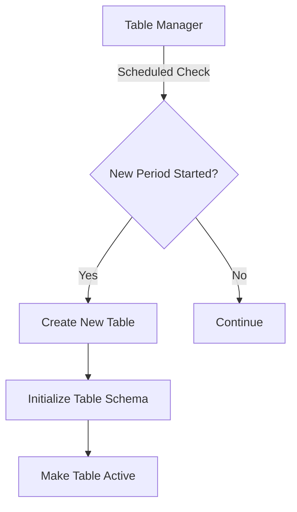
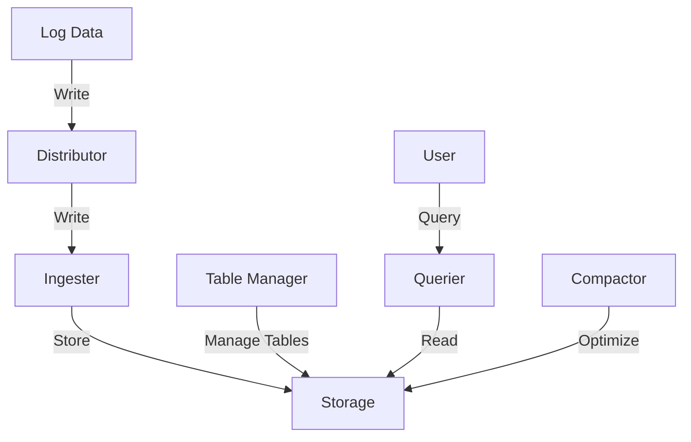

# Table Manager Component

## Introduction

The Table Manager is a critical component in Grafana Loki's architecture that handles the lifecycle management of database tables that store your logs. It primarily works with Loki's index storage (particularly when using a schema that requires tables like BoltDB Shipper or cloud storage solutions).

The Table Manager is responsible for:

- Creating new tables based on time periods
- Enforcing data retention policies
- Deleting expired data
- Managing table capacity and performance

As your logging system scales, proper configuration of the Table Manager becomes essential for maintaining performance and controlling storage costs.

## How the Table Manager Works

The Table Manager operates on a scheduled basis, performing maintenance tasks to ensure your Loki deployment functions efficiently. Let's break down its primary responsibilities:

### 1. Table Creation

The Table Manager creates tables in the index store according to your configured schema. For example, if you're using a periodic schema that rotates tables daily, the Table Manager will automatically create new tables for each day.



### 2. Retention Management

One of the most important functions of the Table Manager is enforcing data retention policies. It tracks table age and removes data that exceeds your configured retention period.

```javascript
// Example retention configuration in loki-config.yaml
table_manager:
  retention_deletes_enabled: true
  retention_period: 744h  // 31 days
```

When `retention_deletes_enabled` is set to `true`, the Table Manager will delete tables older than the specified `retention_period`.

### 3. Table Capacity Management

For deployments using cloud database providers like DynamoDB or Bigtable, the Table Manager can also adjust provisioned throughput based on usage patterns.

## Configuration Options

Let's explore the key configuration options for the Table Manager:

```yaml
table_manager:
  # Enable deletion of tables
  retention_deletes_enabled: true
  
  # How long to keep data
  retention_period: 744h
  
  # How frequently to check for tables to delete
  retention_delete_check_interval: 30m
  
  # Enable creating new tables periodically
  creation_enabled: true
  
  # For DynamoDB - manage read/write capacity
  index_tables_provisioning:
    enable_ondemand_throughput_mode: true
    # OR use provisioned capacity:
    # provisioned_write_throughput: 10
    # provisioned_read_throughput: 20
    
  # Optional: adjust throughput based on usage
  # scale_up_throughput: 0.7
  # scale_down_throughput: 0.3
```

## Practical Example: Configuring Table Manager for a Production Environment

Let's walk through a real-world scenario of configuring the Table Manager for a medium-sized production environment.

### Scenario:
- ~100GB of logs ingested daily
- 30-day retention requirement
- Using BoltDB Shipper for index storage
- Daily table rotation

### Step 1: Configure the Schema

First, we need to set up the schema configuration that the Table Manager will use to create and manage tables:

```yaml
schema_config:
  configs:
    - from: 2020-07-01
      store: boltdb-shipper
      object_store: s3
      schema: v11
      index:
        prefix: loki_index_
        period: 24h  # Creates daily tables
```

### Step 2: Configure the Table Manager

Now we can configure the Table Manager to enforce our retention policy:

```yaml
table_manager:
  retention_deletes_enabled: true
  retention_period: 720h  # 30 days
  creation_enabled: true
  poll_interval: 15m  # Check every 15 minutes
```

### Step 3: Monitoring the Table Manager

To ensure the Table Manager is functioning correctly, you can monitor these metrics:

- `cortex_table_manager_create_tables_total`: Number of tables created
- `cortex_table_manager_delete_tables_total`: Number of tables deleted
- `cortex_table_manager_sync_duration_seconds`: Time taken to perform table maintenance

You can create a Grafana dashboard to visualize these metrics:

```javascript
// Prometheus query example for table creation rate
rate(cortex_table_manager_create_tables_total[5m])
```

## Common Issues and Troubleshooting

### Issue: Tables Not Being Created

If new tables aren't being created as expected:

1. Check that `creation_enabled` is set to `true`
2. Verify the `poll_interval` isn't too long
3. Check logs for permission errors if using cloud storage

### Issue: Old Data Not Being Deleted

If data retention isn't working:

1. Confirm `retention_deletes_enabled` is set to `true`
2. Check that `retention_period` is set correctly
3. Verify the Table Manager has proper permissions to delete tables

### Issue: High Resource Usage

If the Table Manager is consuming excessive resources:

1. Increase the `poll_interval` to reduce check frequency
2. If using provisioned capacity, adjust scaling thresholds
3. Consider using on-demand throughput for variable workloads

## Integration with Other Loki Components

The Table Manager works closely with:

- **Ingester**: As the Ingester writes log data, it relies on tables being available
- **Querier**: Queries access tables managed by the Table Manager
- **Compactor**: Works alongside the Table Manager for storage optimization



## Best Practices for Table Manager Configuration

1. **Align Retention with Business Needs**: Set retention based on compliance requirements and use cases.

2. **Consider Cost vs. Performance**: Longer retention increases storage costs. Balance with query performance needs.

3. **Monitoring**: Set up alerts for table creation/deletion failures.

4. **Regular Testing**: Validate that retention is working as expected by checking oldest available logs.

5. **Gradual Changes**: When adjusting retention policies, make changes gradually and monitor system behavior.

## Summary

The Table Manager component plays a vital role in Loki's architecture by:

- Creating new tables as needed based on your configured schema
- Enforcing data retention policies
- Managing table performance and capacity
- Optimizing storage costs and query performance

Proper configuration of the Table Manager ensures your Loki deployment maintains performance while controlling storage costs. By understanding how to configure retention periods, table creation, and capacity management, you can fine-tune your Loki deployment for your specific requirements.

## Additional Resources

- Review the [Loki configuration documentation](https://grafana.com/docs/loki/latest/configuration/) for the latest Table Manager options
- Explore how the Table Manager integrates with different storage backends
- Practice creating different retention policies for different types of logs

## Exercises

1. Configure Table Manager for a scenario with 7-day retention and hourly table rotation
2. Set up a monitoring dashboard to track Table Manager operations
3. Create a configuration that uses different retention periods for different log streams using multiple schema configs