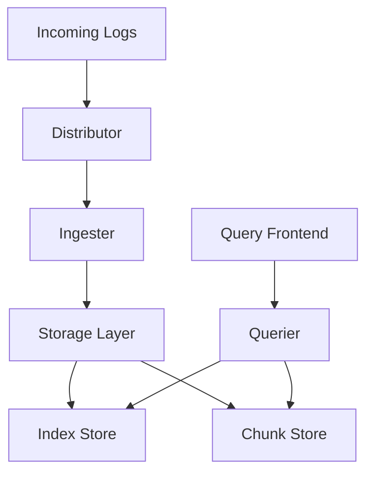

# Storage Components

## Introduction

Grafana Loki's storage architecture is a critical part of its design that allows it to be cost-effective while maintaining high performance. Unlike traditional logging systems that index the full content of logs, Loki only indexes metadata about your logs, keeping storage requirements minimal while still enabling powerful queries.

In this guide, we'll explore the key storage components in Loki, how they work together, and the options available for configuring your own Loki deployment. Understanding these components is essential for anyone looking to optimize their Loki installation or troubleshoot storage-related issues.

## Core Storage Concepts

Loki's storage architecture is divided into two primary types of data:

1. **Index** - Contains metadata about your logs (labels and their values)
2. **Chunks** - Contains the actual compressed log content

This separation is fundamental to Loki's design and allows for efficient storage and querying of log data.



## Index and Chunks

### Index Store

The index store contains metadata about where to find your log data. It maps label sets (like `{app="api", environment="production"}`) to the chunks that contain logs matching those labels.

Key characteristics of the index:
- Much smaller than the actual log data
- Frequently accessed during queries
- Requires faster storage for optimal performance
- Supports several backend implementations (BoltDB, Cassandra, BigTable, DynamoDB)

### Chunk Store

The chunk store holds the actual log data, compressed and encoded for efficient storage:

- Logs are batched, compressed, and stored in "chunks"
- Chunks are immutable once written
- Typically stored in object storage (like S3, GCS, Azure Blob)
- Optimized for cost-effective long-term storage

## Storage Backends

Loki supports different storage backends for both index and chunks:

### Index Store Options

1. **BoltDB Shipper** (recommended for small to medium deployments)
   - Stores indexes locally as BoltDB files
   - Periodically uploads to object storage
   - Simple and cost-effective

2. **Cloud-native databases**:
   - **AWS DynamoDB**
   - **Google Bigtable**
   - **Cassandra**
   - **BoltDB**

### Chunk Store Options

1. **Object Storage** (recommended):
   - **AWS S3**
   - **Google Cloud Storage**
   - **Azure Blob Storage**
   - **Swift**
   - **MinIO** (for on-premises)
   - **Local filesystem** (for testing)

## Storage Configuration Example

Here's a basic example of configuring storage in Loki using BoltDB Shipper for the index and S3 for chunks:

```yaml
schema_config:
  configs:
    - from: 2020-07-01
      store: boltdb-shipper
      object_store: s3
      schema: v11
      index:
        prefix: index_
        period: 24h

storage_config:
  boltdb_shipper:
    active_index_directory: /loki/boltdb-shipper-active
    cache_location: /loki/boltdb-shipper-cache
    cache_ttl: 24h
    shared_store: s3
  
  aws:
    s3: s3://access_key:secret_access_key@region/bucket_name
    s3forcepathstyle: true
```

## Working with Loki Storage Components

### Storage Workflow

Let's look at how Loki uses these storage components in practice:

1. **Ingestion Path**:
   - Logs are received by the Distributor
   - Forwarded to Ingesters where they're batched into chunks
   - Once chunks reach their target size or age, they're flushed to storage
   - Index entries are written to the index store
   - Compressed log chunks are written to the chunk store

2. **Query Path**:
   - Queries first consult the index store to find relevant chunks
   - Only the necessary chunks are retrieved from the chunk store
   - This two-step process minimizes data transfer and processing

## Storage Periods and Retention

Loki uses configuration periods to manage how data is stored and retained:

```yaml
schema_config:
  configs:
    - from: 2020-10-01
      store: boltdb-shipper
      object_store: s3
      schema: v11
      index:
        prefix: index_
        period: 24h

table_manager:
  retention_deletes_enabled: true
  retention_period: 744h  # 31 days
```

- **Period**: Defines how index files are split (typically 24h)
- **Retention**: How long logs are kept before deletion

## The Compactor Component

The Compactor is a crucial storage-related component that:

1. Optimizes storage by merging and compacting index files
2. Improves query performance
3. Enforces retention policies
4. Reduces storage costs

A basic compactor configuration:

```yaml
compactor:
  working_directory: /loki/compactor
  shared_store: s3
  compaction_interval: 10m
  retention_enabled: true
  retention_delete_delay: 2h
  retention_delete_worker_count: 150
```

### Benefits of Compaction

- Reduces the number of index files to scan during queries
- Decreases storage costs
- Removes deleted or expired data
- Improves overall query performance

## Practical Examples

### Example 1: Setting Up Local Storage for Development

For local development, you can use the filesystem for both index and chunks:

```yaml
schema_config:
  configs:
    - from: 2020-07-01
      store: boltdb-shipper
      object_store: filesystem
      schema: v11
      index:
        prefix: index_
        period: 24h

storage_config:
  boltdb_shipper:
    active_index_directory: /loki/index
    cache_location: /loki/index_cache
    cache_ttl: 24h
    shared_store: filesystem
  filesystem:
    directory: /loki/chunks
```

### Example 2: Monitoring Storage Performance

You can use Grafana to monitor Loki's storage performance:

1. Create a dashboard that tracks:
   - Chunk storage operations (reads/writes)
   - Index queries per second
   - Storage operation latencies
   - Chunk size distributions

2. Set up alerts for storage operation failures or unusual latencies

## Troubleshooting Storage Issues

Common storage-related issues and solutions:

| Issue | Possible Causes | Solutions |
|-------|----------------|-----------|
| Slow queries | Inefficient index | Optimize index period, Enable compactor |
| High storage costs | Inefficient chunk compression | Adjust chunk size, Review retention |
| Failed writes | Insufficient permissions | Check storage permissions, Review credentials |
| Missing data | Retention policies | Check retention settings, Verify chunk uploads |

## Summary

Loki's storage architecture is designed to be efficient, scalable, and cost-effective:

- The separation of index and chunks helps minimize storage costs
- Multiple storage backend options provide flexibility for different deployment scenarios
- The compactor helps optimize storage usage and query performance
- Proper configuration of storage components is essential for a well-functioning Loki deployment

Understanding these components and how they interact is crucial for getting the most out of Grafana Loki while keeping costs under control.

## Additional Resources

- [Official Loki Storage Documentation](https://grafana.com/docs/loki/latest/operations/storage/)
- [Loki Storage Schema Configuration](https://grafana.com/docs/loki/latest/configuration/)
- [BoltDB Shipper Documentation](https://grafana.com/docs/loki/latest/operations/storage/boltdb-shipper/)

## Exercises

1. Set up a local Loki instance using filesystem storage for both index and chunks.
2. Modify a Loki configuration to use S3 for chunk storage and BoltDB Shipper for the index.
3. Configure a compactor for your Loki deployment and observe the effects on storage size.
4. Create a Grafana dashboard to monitor the performance of your Loki storage components.