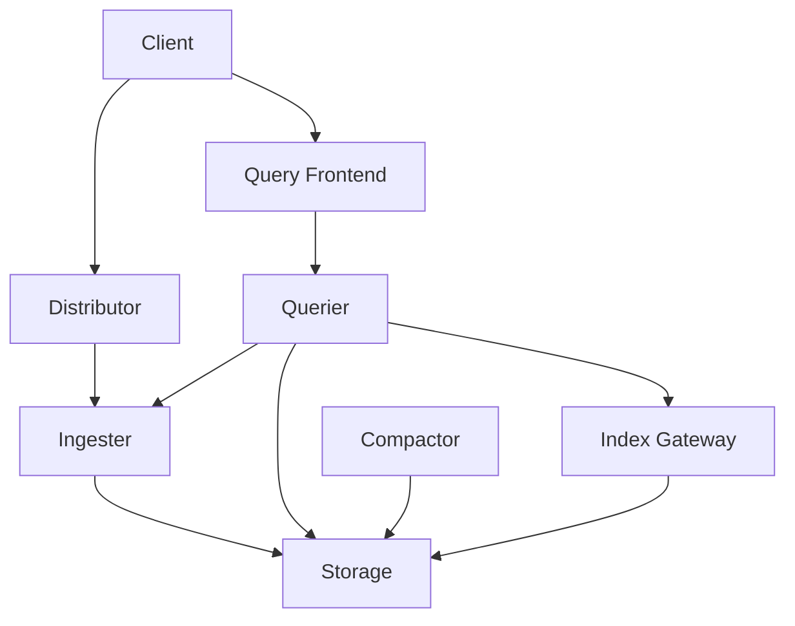
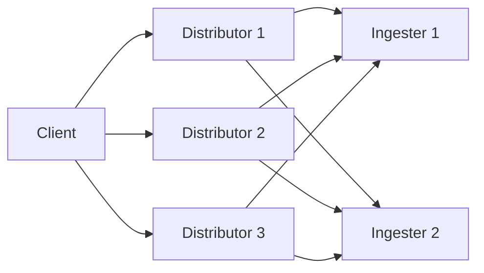

# Component Scaling Strategies

## Introduction

As your logging requirements grow, effectively scaling Loki becomes essential to maintain performance and reliability. Grafana Loki is designed with a microservices architecture that allows you to scale individual components independently based on your specific workload characteristics. This flexible approach enables efficient resource utilization and cost optimization while ensuring your logging system can handle increasing demands.

In this guide, we'll explore different strategies for scaling each Loki component, helping you make informed decisions about how to grow your Loki deployment.

## Understanding Loki's Components

Before diving into scaling strategies, let's briefly review Loki's core components:



- **Distributor**: Receives incoming logs and distributes them to ingesters
- **Ingester**: Temporarily stores log data and writes to long-term storage
- **Querier**: Handles queries by retrieving data from ingesters and storage
- **Query Frontend**: Manages queries, performs caching and query scheduling
- **Compactor**: Optimizes storage by compacting and deduplicating data
- **Index Gateway**: Provides a caching layer for index lookups

## Scaling Approaches

Loki's components can be scaled using different approaches:

### 1. Horizontal Scaling (Scaling Out)

Horizontal scaling involves adding more instances of a component to distribute the workload across multiple machines.



**Pros**:
- Better fault tolerance through redundancy
- Can handle more concurrent operations
- Linear scaling for most components

**Cons**:
- Requires coordination between instances
- May increase complexity of deployment

### 2. Vertical Scaling (Scaling Up)

Vertical scaling involves increasing the resources (CPU, memory) allocated to a single instance.

**Pros**:
- Simpler to implement
- Reduces networking overhead
- Better for components with state

**Cons**:
- Limited by hardware capacity
- Single point of failure risk
- Sometimes more expensive

### 3. Mixed Approach

Most Loki deployments benefit from a combination of horizontal and vertical scaling, optimized for each component's characteristics.

## Component-Specific Scaling Strategies

### Scaling Distributors

Distributors are stateless and can be scaled horizontally with very little coordination overhead.

```yaml
apiVersion: apps/v1
kind: Deployment
metadata:
  name: loki-distributor
spec:
  replicas: 3  # Increase this number to scale horizontally
  template:
    spec:
      containers:
      - name: loki
        image: grafana/loki:latest
        args:
        - -target=distributor
        resources:
          requests:
            cpu: 1
            memory: 1Gi
          limits:
            cpu: 2
            memory: 2Gi
```

**Best Practices**:
- Start with 2-3 distributors for redundancy
- Add more instances as ingest volume increases
- Monitor request latency and error rates to determine when to scale
- Use a load balancer to distribute traffic evenly

### Scaling Ingesters

Ingesters maintain in-memory state, making scaling more complex. Use the ring-based approach for coordinated scaling.

```yaml
apiVersion: apps/v1
kind: StatefulSet
metadata:
  name: loki-ingester
spec:
  replicas: 3  # Scale carefully with proper ring configuration
  template:
    spec:
      containers:
      - name: loki
        image: grafana/loki:latest
        args:
        - -target=ingester
        - -ingester.ring.replication-factor=3
        resources:
          requests:
            cpu: 2
            memory: 8Gi
          limits:
            cpu: 4
            memory: 16Gi
```

**Best Practices**:
- Scale vertically first for better memory utilization
- When scaling horizontally, allow time for ring rebalancing
- Ensure replication factor is appropriate for your reliability needs
- Configure proper lifecycler settings for graceful scaling

### Scaling Queriers

Queriers are mostly stateless and can be scaled horizontally based on query load.

```yaml
apiVersion: apps/v1
kind: Deployment
metadata:
  name: loki-querier
spec:
  replicas: 2  # Increase based on query volume
  template:
    spec:
      containers:
      - name: loki
        image: grafana/loki:latest
        args:
        - -target=querier
        resources:
          requests:
            cpu: 1
            memory: 2Gi
          limits:
            cpu: 2
            memory: 4Gi
```

**Best Practices**:
- Scale based on query volume and complexity
- Monitor query latency as the primary scaling indicator
- Consider query caching to reduce scaling requirements
- Implement query limits to prevent resource exhaustion

### Scaling Query Frontend

The query frontend can be scaled horizontally to handle more concurrent queries and provide better caching.

```yaml
apiVersion: apps/v1
kind: Deployment
metadata:
  name: loki-query-frontend
spec:
  replicas: 2
  template:
    spec:
      containers:
      - name: loki
        image: grafana/loki:latest
        args:
        - -target=query-frontend
        - -query-frontend.max-outstanding-per-tenant=1024
        resources:
          requests:
            cpu: 1
            memory: 1Gi
          limits:
            cpu: 2
            memory: 2Gi
```

**Best Practices**:
- Adjust queue size based on query patterns
- Enable query sharding for parallel processing
- Configure appropriate caching for your workload
- Monitor query queue size to determine when to scale

### Scaling Compactor

The compactor is typically deployed as a singleton but can benefit from vertical scaling.

```yaml
apiVersion: apps/v1
kind: Deployment
metadata:
  name: loki-compactor
spec:
  replicas: 1  # Usually run as a singleton
  template:
    spec:
      containers:
      - name: loki
        image: grafana/loki:latest
        args:
        - -target=compactor
        resources:
          requests:
            cpu: 1
            memory: 4Gi
          limits:
            cpu: 2
            memory: 8Gi
```

**Best Practices**:
- Focus on vertical scaling to provide more resources
- Ensure adequate storage performance
- Adjust compaction interval based on data volume
- Monitor compaction jobs for performance issues

## Monitoring Scaling Needs

To effectively scale Loki components, monitor these key metrics:

1. **Ingest Rate**: Logs per second being processed
2. **Query Rate**: Queries per second being handled
3. **Query Latency**: Time taken to fulfill queries
4. **Memory Usage**: Particularly important for ingesters
5. **CPU Usage**: Important for all components
6. **Storage IOPS**: Critical for read/write performance
7. **Error Rates**: Indication of system under stress

```js
// Example Prometheus query to monitor ingestion rate
sum(rate(loki_distributor_lines_received_total[5m]))

// Example query to monitor query latency
histogram_quantile(0.99, sum(rate(loki_request_duration_seconds_bucket{route=~"/loki/api/v1/query.*"}[5m])) by (le))
```

## Real-World Scaling Scenario

Let's examine a practical example of scaling Loki from a small to medium deployment:

### Initial Setup (Small)
- 2 distributors (1 CPU, 1GB memory each)
- 3 ingesters (2 CPU, 8GB memory each)
- 2 queriers (1 CPU, 2GB memory each)
- 1 query frontend (1 CPU, 1GB memory)
- 1 compactor (1 CPU, 4GB memory)

### Scaled Setup (Medium)
- 4 distributors (2 CPU, 2GB memory each)
- 6 ingesters (4 CPU, 16GB memory each)
- 4 queriers (2 CPU, 4GB memory each)
- 2 query frontends (2 CPU, 2GB memory each)
- 1 compactor (2 CPU, 8GB memory)

### Scaling Process

1. First, vertically scale ingesters to handle more data per instance
2. Add more ingesters to increase storage capacity and query performance
3. Scale distributors to match ingester capacity
4. Add queriers to maintain query performance
5. Duplicate query frontend for redundancy and better query scheduling
6. Vertically scale the compactor to handle increased compaction load

## Common Scaling Challenges

### Challenge 1: Ingester Memory Pressure

**Symptoms**: OOM kills, high memory usage alerts

**Solutions**:
- Decrease chunk size or retention period in memory
- Increase memory resources
- Add more ingester replicas
- Adjust stream hash settings to better distribute data

```yaml
# Configuration to help with memory pressure
limits_config:
  ingestion_rate_mb: 10
  ingestion_burst_size_mb: 20
  per_stream_rate_limit: 10MB
  per_stream_rate_limit_burst: 15MB
  max_entries_limit_per_query: 10000
```

### Challenge 2: Query Performance Degradation

**Symptoms**: Increasing query latencies, timeouts

**Solutions**:
- Implement query splitting and parallelism
- Add query caching
- Scale queriers horizontally
- Optimize queries by reducing time ranges or label selectors

```yaml
# Configuration for better query performance
query_range:
  split_queries_by_interval: 24h
  cache_results: true
  results_cache:
    cache:
      memcached:
        batch_size: 100
        parallelism: 100
```

### Challenge 3: Storage I/O Bottlenecks

**Symptoms**: Slow writes, delayed query responses

**Solutions**:
- Use SSD storage for better I/O performance
- Implement index caching
- Configure appropriate storage class
- Consider using object storage with local caching

## Summary

Effectively scaling Loki components requires understanding the role and characteristics of each component and applying the appropriate scaling strategy. Key points to remember:

- **Distributors and Queriers**: Scale horizontally for increased throughput
- **Ingesters**: Scale vertically first, then horizontally with careful coordination
- **Query Frontend**: Scale horizontally to improve query management
- **Compactor**: Primarily scale vertically to improve compaction performance
- **Monitor your deployment**: Use metrics to guide scaling decisions
- **Test changes**: Validate scaling changes in a testing environment before production

By following these scaling strategies, you can build a Loki deployment that efficiently handles your logging needs while optimizing resource usage.

## Additional Resources

- [Loki Architecture Documentation](https://grafana.com/docs/loki/latest/fundamentals/architecture/)
- [Loki Configuration Reference](https://grafana.com/docs/loki/latest/configuration/)
- [Kubernetes Pod Autoscaling](https://kubernetes.io/docs/tasks/run-application/horizontal-pod-autoscale/)

## Practice Exercises

1. Set up a test Loki environment and monitor how increasing log volume affects CPU and memory usage of different components.
2. Create a Kubernetes deployment configuration for Loki with appropriate resource requests and limits for each component.
3. Implement a monitoring dashboard that tracks key metrics for Loki scaling decisions.
4. Design a scaling plan for a Loki deployment that needs to handle 100GB of logs per day with peaks of 5GB per hour.