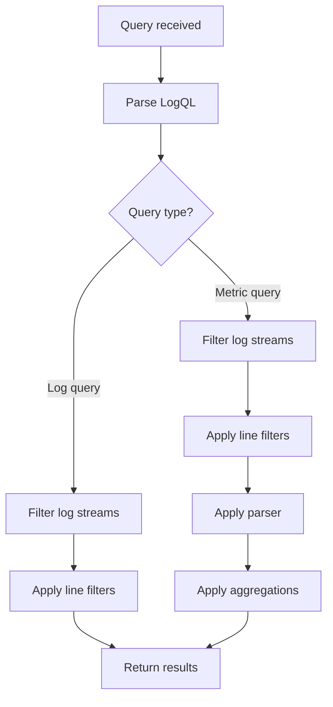

# Query Performance

## Introduction

Query performance is a critical aspect of working with Grafana Loki. As your logging system scales and the volume of log data grows, ensuring that your queries execute efficiently becomes increasingly important. Poorly optimized queries can lead to slow dashboards, timeout errors, and an overall degraded user experience.

In this guide, we'll explore the factors that affect query performance in Loki, techniques for writing efficient queries, troubleshooting performance issues, and best practices for maintaining a performant logging system.

## Understanding Loki's Query Processing

Before diving into optimization techniques, it's essential to understand how Loki processes queries.



Loki's query processing follows these general steps:

1. **Parse the LogQL query**: Loki converts your query string into an execution plan.
2. **Identify log streams**: Loki uses label selectors to identify which log streams to process.
3. **Filter log lines**: Apply line filters to keep only relevant entries.
4. **Apply parsers and aggregations**: For metric queries, extract data and perform calculations.
5. **Return results**: Format and return the final results.

Understanding this flow helps identify potential bottlenecks in your queries.

## Factors Affecting Query Performance

Several key factors influence how quickly your Loki queries execute:

### 1. Time Range

The time range of your query directly impacts the amount of data Loki needs to process.

```logql
{app="frontend"} |= "error" [24h]
```

The above query searches for the term "error" in logs from the "frontend" app over the last 24 hours. If you expand this to `[7d]` (7 days), Loki will need to process significantly more data.

### 2. Label Cardinality

Label cardinality refers to the number of unique combinations of label values in your log data. High cardinality can severely impact query performance.

For example, adding a unique user ID as a label would create a separate stream for each user:

```
{app="frontend", user_id="123"} # Bad practice
```

Instead, keep user IDs in the log content:

```
{app="frontend"} |= "user_id=123" # Better practice
```

### 3. Query Complexity

Complex queries with multiple filters, regular expressions, and aggregations require more processing time:

```logql
sum by (status_code) (
  rate({app="nginx"} |~ "HTTP/1.[01]\" (?P<status_code>\d{3})" [5m])
)
```

This query extracts HTTP status codes using a regex, calculates the rate over 5 minutes, and sums by status code—requiring significant processing.

## Optimizing Query Performance

Let's explore specific techniques to improve your Loki queries.

### Use Label Selectors Effectively

Label selectors are the most efficient way to filter data in Loki. They should be your first line of optimization.

```logql
# Less efficient
{app="frontend"} |= "error" |= "authentication"

# More efficient (if you have appropriate labels)
{app="frontend", component="auth"} |= "error"
```

### Limit Time Ranges

Always use the smallest time range necessary for your analysis:

```logql
# Query over the last 15 minutes instead of hours
{app="payment-service"} |= "transaction" [15m]
```

### Avoid High-Cardinality Labels

Design your logging strategy to avoid high-cardinality labels:

```logql
# Bad: High cardinality
{app="api", request_id="a1b2c3d4"}

# Good: Keep high-cardinality data in log content
{app="api"} |= "request_id=a1b2c3d4"
```

### Use Line Filters Strategically

Apply line filters in order of selectivity (most selective first):

```logql
# Less efficient
{app="frontend"} |= "user" |= "error"

# More efficient (assuming "error" is less common)
{app="frontend"} |= "error" |= "user"
```

### Leverage Parser Optimization

For metric queries, choose the most efficient parser for your log format:

```logql
# Less efficient - regex parsing is CPU intensive
{app="payment"} | regexp `amount=(?P<amount>\d+\.\d+)`

# More efficient - json parser is optimized
{app="payment"} | json amount="amount"
```

## Practical Examples

Let's look at some real-world examples of optimizing Loki queries.

### Example 1: Finding Error Rates by Service

**Initial Query:**

```logql
sum(count_over_time({env="production"} |= "level=error" [1h])) by (app)
```

**Optimized Query:**

```logql
sum(count_over_time({env="production", level="error"} [1h])) by (app)
```

The optimized query uses a label selector for the error level rather than a line filter, which can be substantially faster if you're extracting the log level as a label during ingestion.

### Example 2: Analyzing Slow API Requests

**Initial Query:**

```logql
{app="api-gateway"} 
| json
| duration > 1000 
| line_format "{{.path}} took {{.duration}}ms"
```

**Optimized Query:**

```logql
{app="api-gateway"} |= "duration" |= "]" 
| json
| duration > 1000 
| line_format "{{.path}} took {{.duration}}ms"
```

The optimized query adds line filters to quickly exclude logs that don't contain duration information before applying the more expensive JSON parsing operation.

## Troubleshooting Query Performance Issues

When you encounter slow queries, follow these troubleshooting steps:

### 1. Check Query Statistics

Loki provides statistics for executed queries. Look for:

- **Total bytes processed**: The amount of data scanned
- **Total entries examined**: The number of log lines processed
- **Total batches**: The number of chunks processed
- **Execution time**: How long the query took to execute

### 2. Use the Explain Feature

Loki's explain feature helps understand how a query will be executed:

```logql
loki_api/v1/explain?query={app="frontend"} |= "error"
```

This provides insights into the execution plan and potential optimizations.

### 3. Examine Metrics

Monitor Loki's internal metrics to identify performance bottlenecks:

- `loki_distributor_bytes_received_total`
- `loki_ingester_streams_created_total`
- `loki_query_frontend_queries_total`

### 4. Iteratively Simplify

When troubleshooting a slow query, simplify it step by step to identify the problematic part:

1. Reduce the time range
2. Remove filters one by one
3. Simplify label selectors
4. Remove aggregations or complex operations

## Best Practices for Sustained Performance

To maintain good query performance over time, follow these best practices:

### 1. Design a Thoughtful Labeling Strategy

Labels should be:
- Low cardinality
- Meaningful for querying
- Consistent across services

Good label candidates include:
- `app`
- `environment`
- `component`
- `level`

### 2. Configure Appropriate Retention and Caching

Set retention periods based on actual usage patterns:

```yaml
limits_config:
  retention_period: 744h  # 31 days
  
query_range:
  cache_results: true
  results_cache:
    cache:
      embedded_cache:
        enabled: true
        max_size_mb: 100
```

### 3. Use Query Federation for Large-Scale Deployments

For large deployments, split queries across multiple Loki instances:

```logql
{env="prod", region=~"us.*"} |= "error"
```

This can be executed across region-specific Loki instances.

### 4. Monitor and Alert on Query Performance

Set up alerts for slow-performing queries:

```logql
histogram_quantile(0.95, sum(rate(loki_query_duration_seconds_bucket{job="loki"}[5m])) by (le))
```

Alert when the 95th percentile query time exceeds your SLOs.

## Summary

Optimizing query performance in Grafana Loki requires understanding how Loki processes queries and applying best practices:

1. Use label selectors efficiently
2. Minimize time ranges
3. Avoid high-cardinality labels
4. Apply line filters strategically
5. Choose appropriate parsers
6. Monitor and troubleshoot performance issues

By following these principles, you can ensure that your Loki deployment provides fast query results even as your log volume grows.

## Additional Resources

- Explore the [LogQL query language documentation](https://grafana.com/docs/loki/latest/logql/) for advanced query techniques
- Review the [best practices for Loki](https://grafana.com/docs/loki/latest/best-practices/) in the official documentation
- Practice query optimization using the [Loki query playground](https://play.grafana.org/)

## Exercises

1. Analyze a slow-performing query from your environment and optimize it using the techniques discussed.
2. Compare the performance of using a line filter versus a label selector for the same data.
3. Create a dashboard panel that monitors the performance of your most frequently used queries.
4. Implement alerting for queries that exceed your performance thresholds.