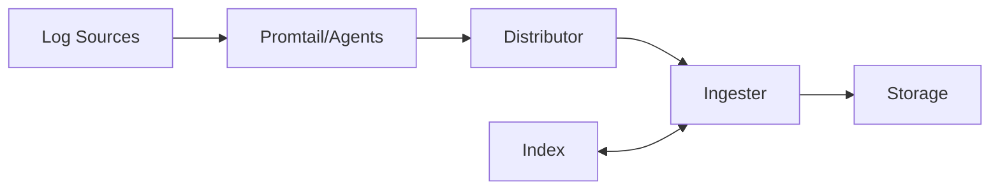

# Ingestion Performance

## Introduction

Ingestion performance is a critical aspect of Grafana Loki that directly impacts how efficiently your logging system operates at scale. When we talk about "ingestion performance," we're referring to how quickly and reliably Loki can receive, process, and store incoming log data from various sources.

As your logging needs grow, understanding and optimizing ingestion performance becomes increasingly important. Poor ingestion performance can lead to log backpressure, dropped logs, increased latency, and even system instability.

In this guide, we'll explore the factors that affect Loki's ingestion performance, common bottlenecks, and practical techniques to optimize and monitor your ingestion pipeline.

## Understanding the Loki Ingestion Pipeline

Before diving into optimization, let's understand how logs flow through Loki's ingestion pipeline:



1. **Log Sources**: Applications, servers, and services generate logs
2. **Log Agents**: Tools like Promtail collect and forward logs to Loki
3. **Distributor**: Receives logs, validates them, and distributes them to ingesters
4. **Ingester**: Compresses logs, builds indexes, and writes to storage
5. **Storage**: The final destination for log data and indexes

Each component in this pipeline can affect ingestion performance, so optimizing requires a holistic approach.

## Key Factors Affecting Ingestion Performance

### 1. Label Cardinality

One of the most significant factors affecting Loki's ingestion performance is label cardinality.

#### What is Label Cardinality?

Label cardinality refers to the number of unique combinations of label values in your log streams. High cardinality occurs when you have labels with many possible values, creating numerous unique label combinations.

For example, using labels like:
- `user_id`
- `request_id` 
- `pod_id`

These can each have thousands or millions of unique values, causing high cardinality.

#### Impact on Performance

High cardinality directly impacts Loki's performance by:
- Increasing memory usage in ingesters
- Slowing down index lookups
- Growing index size exponentially
- Reducing query performance

#### Example of High vs. Low Cardinality

❌ **High Cardinality (Avoid)**:

```yaml
scrape_configs:
  - job_name: app_logs
    static_configs:
      - targets:
          - localhost
        labels:
          app: frontend
          user_id: "{{.user_id}}"  # Unique per user!
          request_id: "{{.request_id}}"  # Unique per request!
```

✅ **Lower Cardinality (Better)**:

```yaml
scrape_configs:
  - job_name: app_logs
    static_configs:
      - targets:
          - localhost
        labels:
          app: frontend
          component: auth
          environment: production
```

### 2. Chunk Size and Retention

Loki stores logs in "chunks," which impact both ingestion and query performance.

#### Chunk Settings

The key configurations that affect chunk behavior are:
- `chunk_target_size`: Target size of each chunk
- `chunk_idle_period`: How long to wait before closing a chunk if no new logs arrive
- `max_chunk_age`: Maximum duration to keep a chunk open

```yaml
limits_config:
  ingestion_rate_mb: 10
  ingestion_burst_size_mb: 20
  
chunk_store_config:
  max_look_back_period: 720h  # 30 days

schema_config:
  configs:
    - from: 2020-07-01
      store: boltdb-shipper
      object_store: filesystem
      schema: v11
      index:
        prefix: index_
        period: 24h
```

#### Finding the Right Balance

- **Too small chunks**: More chunks to manage, higher overhead
- **Too large chunks**: More memory usage, potential ingestion delays
- **Too short chunk periods**: More chunks, higher storage overhead
- **Too long chunk periods**: Higher memory pressure on ingesters

A good starting point for most setups:
- `chunk_target_size: 1MB`
- `chunk_idle_period: 30m`
- `max_chunk_age: 1h`

### 3. Ingestion Rate Limits

Loki includes configurable rate limits to protect your system from being overwhelmed:

```yaml
limits_config:
  ingestion_rate_mb: 4
  ingestion_burst_size_mb: 6
  per_tenant_override_config: /etc/loki/overrides.yaml
```

These settings control:
- `ingestion_rate_mb`: Maximum sustained ingestion rate in MB per second
- `ingestion_burst_size_mb`: Maximum allowed burst size in MB

You can also configure per-tenant rate limits using override files.

#### Monitoring and Adjusting Rate Limits

When setting rate limits, start conservative and adjust based on:
- Monitoring metrics like `loki_distributor_bytes_received_total`
- Watching for `rate_limited` errors in logs
- Analyzing usage patterns over time

## Optimizing Ingestion Performance

### 1. Hardware Resources

Ensure your Loki deployment has adequate resources:

#### Resource Requirements

| Component | CPU | Memory | Disk I/O |
|-----------|-----|--------|----------|
| Distributor | Medium | Low | Low |
| Ingester | High | High | Medium |
| Query Frontend | Medium | Medium | Low |
| Storage | Low | Low | High |

**Tips:**
- Scale ingesters horizontally as they handle most of the ingestion workload
- Provide ingesters with ample memory, as they buffer data in memory
- Use high-performance storage for the index

### 2. Efficient Label Usage

Optimizing your labels is one of the most effective ways to improve ingestion performance:

#### Best Practices:

1. **Keep labels to a minimum**: Only use labels needed for querying
2. **Avoid high-cardinality labels**: Don't use unique IDs as labels
3. **Use structured logging**: Keep detailed information in the log message, not labels
4. **Standardize labels**: Use consistent naming across applications

#### Example: Efficient Label Strategy

```yaml
scrape_configs:
  - job_name: app_logs
    static_configs:
      - targets:
          - localhost
        labels:
          env: "production"
          app: "payment-service"
          component: "api"  # Limited set of values: api, worker, cron, etc.
```

### 3. Batch Processing

Configure your log agents to send logs in batches rather than individually:

#### Promtail Batch Configuration

```yaml
clients:
  - url: http://loki:3100/loki/api/v1/push
    batchwait: 1s  # Wait up to 1s to batch logs
    batchsize: 1024KB  # Send batches up to 1MB
```

This significantly reduces network overhead and Loki processing costs.

### 4. Horizontally Scale Components

For high-volume environments, scale out your Loki components:

```yaml
# Example Kubernetes configuration
apiVersion: apps/v1
kind: Deployment
metadata:
  name: loki-distributor
spec:
  replicas: 3  # Scale based on load
  template:
    spec:
      containers:
        - name: loki
          args:
            - -target=distributor
```

Scale components based on their specific bottlenecks:
- **Distributors**: Scale based on incoming request rate
- **Ingesters**: Scale based on memory pressure and storage throughput
- **Query Frontend**: Scale based on query load

## Monitoring Ingestion Performance

To effectively optimize, you need to monitor key metrics:

### Essential Metrics to Watch

1. **Ingestion Rates**:
   - `loki_distributor_bytes_received_total`
   - `loki_distributor_lines_received_total`

2. **Ingestion Latency**:
   - `loki_distributor_request_duration_seconds`

3. **Resources**:
   - `container_memory_usage_bytes` (for Loki components)
   - `container_cpu_usage_seconds_total`

4. **Errors and Drops**:
   - `loki_distributor_client_request_errors_total`
   - `loki_ingester_chunk_age_seconds` (to detect stuck chunks)

### Creating a Monitoring Dashboard

Set up a Grafana dashboard specifically for ingestion performance:

```
// Example PromQL queries for your dashboard
// Ingestion rate by tenant
sum by(tenant) (rate(loki_distributor_bytes_received_total[5m]))

// Ingestion latency 99th percentile
histogram_quantile(0.99, sum by (le) (rate(loki_distributor_request_duration_seconds_bucket[5m])))

// Error rate
sum(rate(loki_distributor_client_request_errors_total[5m])) by (tenant, status_code)
```

## Troubleshooting Common Ingestion Issues

### 1. High Latency or Timeouts

**Symptoms**:
- Slow log ingestion
- Timeout errors from clients

**Potential Fixes**:
- Increase resources for distributors and ingesters
- Review label cardinality and reduce if necessary
- Check network connectivity between components
- Increase timeout settings in client configurations

### 2. Rate Limiting Errors

**Symptoms**:
- Errors containing `rate limit exceeded`
- Logs being dropped

**Potential Fixes**:
- Increase rate limits if resources allow
- Add more ingesters to handle the load
- Implement log sampling for high-volume, low-importance logs
- Spread log transmission over time when possible

### 3. Memory Pressure on Ingesters

**Symptoms**:
- OOM errors
- High memory usage on ingesters

**Potential Fixes**:
- Reduce chunk target size or max age
- Scale out ingesters horizontally
- Reduce label cardinality
- Increase memory limits for ingester pods

## Real-World Example: Scaling Loki for High-Volume Production

Let's look at a case study of optimizing Loki for a system handling 100GB of logs per day:

### Initial Setup

```yaml
# Before optimization
limits_config:
  ingestion_rate_mb: 4
  ingestion_burst_size_mb: 6

schema_config:
  configs:
    - from: 2020-07-01
      store: boltdb-shipper
      object_store: s3
      schema: v11
      index:
        prefix: index_
        period: 24h
```

**Issues Encountered**:
- Frequent rate limiting errors
- High memory usage on ingesters
- Slow query performance

### Optimized Configuration

```yaml
# After optimization
limits_config:
  ingestion_rate_mb: 10
  ingestion_burst_size_mb: 15
  per_tenant_override_config: /etc/loki/overrides.yaml

chunk_store_config:
  max_look_back_period: 720h

schema_config:
  configs:
    - from: 2020-07-01
      store: boltdb-shipper
      object_store: s3
      schema: v11
      index:
        prefix: index_
        period: 24h

ingester:
  chunk_idle_period: 30m
  chunk_target_size: 1.5MB
  max_chunk_age: 1h
```

**Infrastructure Changes**:
- Scaled from 3 to 5 ingesters
- Increased memory allocation for ingesters
- Implemented a log pre-processor to standardize labels
- Set up tenant-specific rate limits

**Result**:
- 3x improvement in ingestion throughput
- 40% reduction in storage requirements
- 60% faster query performance
- Zero log drops during normal operation

## Summary

Optimizing Loki's ingestion performance requires a systematic approach focused on:

1. **Managing label cardinality** - The most important factor for Loki performance
2. **Tuning chunk settings** - Finding the right balance for your workload
3. **Setting appropriate rate limits** - Protecting your system while allowing needed throughput
4. **Efficient resource allocation** - Giving components the resources they need
5. **Monitoring and iterative improvement** - Continuously tracking metrics and refining

By applying these principles, you can build a Loki deployment that efficiently handles your log volume while maintaining reliability and query performance.

## Additional Resources

- Practice implementing the configuration changes described in this guide
- Set up a test environment and experiment with different label strategies
- Create a monitoring dashboard with the metrics mentioned in this guide
- Try simulating high load to see how your Loki deployment responds

## Exercise: Audit Your Labels

Review your current Loki labels and identify opportunities for optimization by answering these questions:

1. How many unique label combinations do you have?
2. Which labels have the highest cardinality?
3. Are all your labels necessary for querying?
4. Could any high-cardinality labels be moved into the log content instead?

Document your findings and create an optimization plan for your labels.