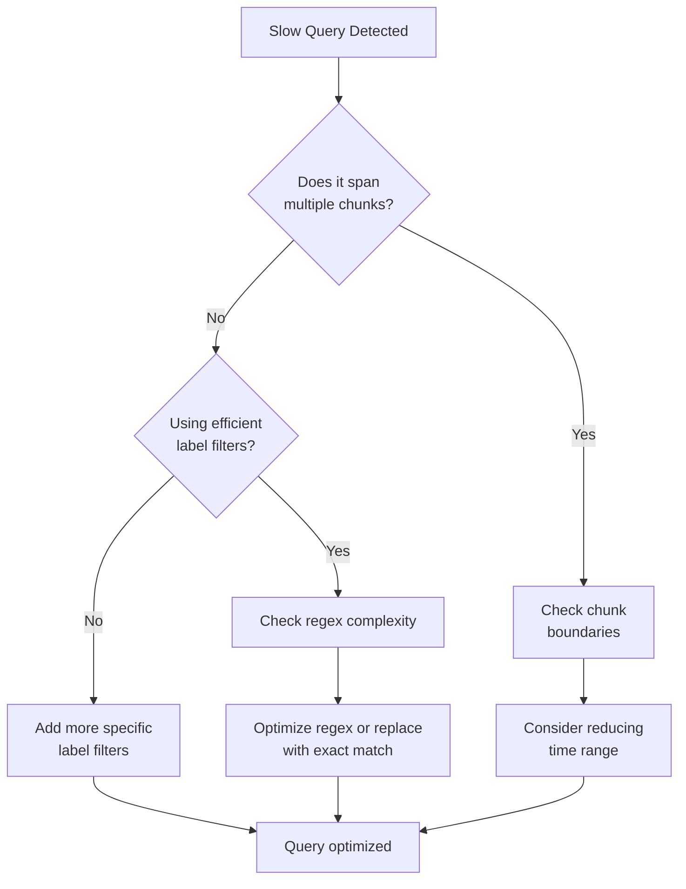

# Performance Troubleshooting

## Introduction

Performance troubleshooting is a critical skill when working with Grafana Loki in production environments. As log volumes grow and query patterns become more complex, you may encounter performance bottlenecks that need to be diagnosed and resolved. This guide will walk you through a systematic approach to identify, analyze, and fix common performance issues in Loki deployments.

## Understanding Loki Performance Metrics

Before diving into troubleshooting, it's important to understand the key metrics that indicate Loki's performance health.

### Core Metrics to Monitor

- **Query performance**: Latency of queries across different time ranges
- **Ingestion rate**: Logs ingested per second
- **Storage utilization**: Disk space usage and growth rate
- **Component resource usage**: CPU, memory, and network utilization of each Loki component
- **Error rates**: Frequency of errors in ingestion and query paths

## Common Performance Issues and Solutions

### 1. Slow Query Performance

#### Symptoms
- Queries taking longer than expected to complete
- Timeouts during query execution
- High resource utilization during queries

#### Diagnostic Steps

First, identify if the query is inefficient:

```logql
{app="myapp"} |= "error"
```

If this simple query performs well but complex ones don't, focus on query optimization.

For systematically diagnosing query performance:



#### Solutions

1. **Optimize label selectors**:
   - Add more specific label filters to reduce the amount of data scanned
   - Example: Change from `{app="frontend"}` to `{app="frontend", env="prod", component="api"}`

2. **Avoid expensive regex operations**:
   - Replace `|~ "error.*timeout"` with `|= "error" |= "timeout"` when possible

3. **Adjust query time range**:
   - Break large time range queries into smaller chunks

4. **Implement query-time caching**:
   ```yaml
   query_range:
     cache_results: true
     results_cache:
       cache:
         enable_fifocache: true
         fifocache:
           max_size_bytes: 500MB
   ```

### 2. High Ingestion Bottlenecks

#### Symptoms
- Logs appearing with significant delay
- Increasing lag in real-time log views
- High memory usage in distributor components

#### Diagnostic Steps

Check ingestion metrics with Prometheus:

```promql
rate(loki_distributor_bytes_received_total[5m])
```

Monitor for rate limiting or throttling:

```promql
sum(rate(loki_distributor_ingestion_rate_limited_total[5m])) by (tenant)
```

#### Solutions

1. **Scale distributor components**:
   ```yaml
   distributor:
     replicas: 3
   ```

2. **Adjust resource limits**:
   ```yaml
   limits_config:
     ingestion_rate_mb: 10
     ingestion_burst_size_mb: 20
   ```

3. **Optimize label cardinality**:
   - Review and reduce high-cardinality labels
   - Consider preprocessing logs to remove unnecessary labels

4. **Implement tenant-based sharding**:
   ```yaml
   ingester:
     lifecycler:
       ring:
         replication_factor: 3
   ```

### 3. Storage Bottlenecks

#### Symptoms
- Increasing disk usage beyond expected rates
- Slow chunk retrieval times
- High I/O wait times on storage nodes

#### Diagnostic Steps

Monitor chunk operations:

```promql
rate(loki_ingester_chunks_stored_total[5m])
```

Check storage performance:

```promql
rate(loki_chunk_store_operation_duration_seconds_sum[5m]) / 
rate(loki_chunk_store_operation_duration_seconds_count[5m])
```

#### Solutions

1. **Implement a more aggressive retention policy**:
   ```yaml
   schema_config:
     configs:
       - from: 2023-01-01
         store: boltdb-shipper
         object_store: filesystem
         schema: v12
         index:
           prefix: index_
           period: 24h
   limits_config:
     retention_period: 720h  # 30 days
   ```

2. **Optimize compaction settings**:
   ```yaml
   compactor:
     working_directory: /loki/compactor
     shared_store: s3
     retention_enabled: true
     retention_delete_delay: 2h
     compaction_interval: 10m
   ```

3. **Configure tiered storage**:
   - Move older chunks to cheaper, slower storage
   - Keep recent chunks on faster storage

## Performance Troubleshooting Tools

### Built-in Diagnostic Tools

Loki provides several endpoints to help with troubleshooting:

1. **Pprof endpoints**: Access runtime profiling data
   ```bash
   curl http://loki:3100/debug/pprof/heap > heap.out
   go tool pprof -http=:8080 heap.out
   ```

2. **Runtime configuration**: Check current configuration
   ```bash
   curl http://loki:3100/config
   ```

3. **Metrics endpoint**: Expose detailed performance metrics
   ```bash
   curl http://loki:3100/metrics
   ```

### External Tools

1. **Grafana dashboards**: Use pre-built Loki operational dashboards
2. **Distributed tracing**: Implement with Tempo or Jaeger
3. **Log analysis**: Use Loki itself to analyze its own logs

## Real-world Troubleshooting Scenario

### Scenario: High-Cardinality Label Causing Performance Issues

Consider a scenario where developers added a `user_id` label to all logs, causing a cardinality explosion.

#### Detecting the problem:

```promql
topk(10, count by (label_name) (count by (label_name, label_value) (loki_ingester_memory_chunks{namespace="loki"})))
```

This query shows the top 10 labels by cardinality.

#### Resolution steps:

1. Identify the source of high-cardinality labels:
   ```bash
   logcli query '{namespace="production"}' --analyze-labels
   ```

2. Modify log collection to drop problematic labels:
   ```yaml
   relabel_configs:
     - action: labelmap
       regex: __meta_kubernetes_pod_label_(.+)
     - action: labeldrop
       regex: user_id
   ```

3. Implement a new logging policy with development teams to prevent similar issues

## Best Practices for Ongoing Performance Management

1. **Establish performance baselines**
   - Document normal query latencies
   - Set up alerts for deviations

2. **Implement regular monitoring**
   - CPU, memory, and disk usage
   - Query latency percentiles (p50, p95, p99)
   - Error rates and log throughput

3. **Practice proactive capacity planning**
   - Forecast log volume growth
   - Set up autoscaling where appropriate
   - Plan storage needs in advance

4. **Document troubleshooting procedures**
   - Create runbooks for common issues
   - Maintain a knowledge base of past incidents

## Summary

Performance troubleshooting in Grafana Loki requires a methodical approach to identify and resolve issues. By understanding the core components, monitoring key metrics, and following structured diagnostic procedures, you can maintain a high-performing log aggregation system even as your environment scales.

The most common performance issues typically stem from:
- Inefficient queries and high cardinality
- Resource constraints in specific components
- Storage bottlenecks
- Configuration misalignments

Remember that performance tuning is an ongoing process that requires continuous monitoring and adjustment as your logging needs evolve.

## Additional Resources

- Practice analyzing query performance with the LogCLI tool
- Set up a test environment to simulate common performance issues
- Explore Loki's advanced performance tuning options in the official documentation
- Join the Grafana community forums to discuss performance challenges with other users

## Exercises

1. Design a monitoring dashboard specifically for tracking Loki performance metrics
2. Create a troubleshooting decision tree for common query performance issues
3. Develop a retention policy that balances performance with compliance requirements
4. Implement and test different caching strategies to improve query performance